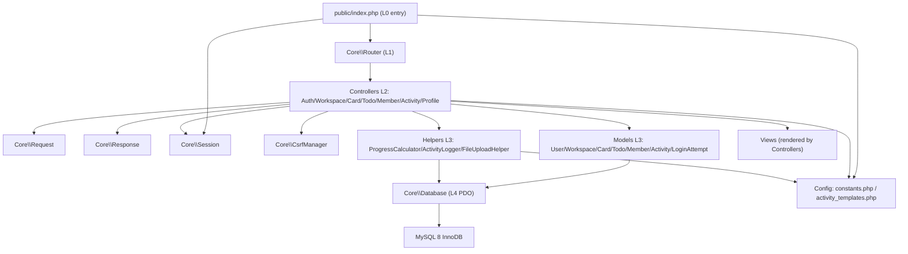

# TraceOn — Detailed Execution Blueprint (`detail-plan.md`)

> **Document type:** Single Source of Truth — Architecture & Execution Blueprint
> **Project:** TraceOn — web-based workspace & task monitoring system
> **Stack (FIXED):** PHP 8.3 native OOP MVC (no framework) · MySQL 8.0+ InnoDB · PDO prepared statements only · Vanilla JS ES Modules · CSS Custom Properties · SSR for initial loads + Fetch API for mutations
> **Only Composer runtime dependency allowed:** `vlucas/phpdotenv`. (`phpunit/phpunit` permitted as a dev-only dependency — see Section 15.)
> **Authoritative source spec:** `prompt-traceOn.md` (V8). This blueprint *plans and decides*; the spec *specifies*. Where they ever appear to conflict, the spec's hard facts (schema, routes, tokens) win; this document's job is to make every architectural decision explicit so they never need re-deciding.
> **User-facing language:** Bahasa Indonesia (all messages, toasts, activity log strings).

---

## How To Use This Document (READ FIRST)

This blueprint is written **for implementers with limited reasoning capacity**. Every major decision has already been made. Your job is to execute, not to redesign.

1. **Never invent an architecture decision.** If something seems undecided, search this document by ID (ADR-###, RULE-##, INV-##) before doing anything. The answer is almost certainly here.
2. **Read Section 20 (Execution Handbook) before writing any code.** It contains the Non-Negotiable Rules, Architectural Invariants, Implementation Constraints, Common Failure Modes, and the Validation Checklist. Section 20 overrides any looser reading of other sections.
3. **Implement strictly in the order given by Section 14 (Implementation Order).** Do not jump ahead. Each step lists prerequisites that MUST already exist.
4. **Every change must pass the Validation Checklist in Section 20** before it is considered done.
5. **When genuinely blocked or ambiguous:** pick the option that (a) does not violate any INV-## invariant, (b) does not violate any RULE-## rule, (c) matches the closest existing pattern in this document, then leave a `// TODO(blueprint): <question>` comment. Never silently invent a new pattern, new table, new dependency, or new framework.

---

## Reference ID Schemes (used throughout)

| Prefix | Meaning | Defined in |
|---|---|---|
| `ADR-###` | Architecture Decision Record | Section 3 |
| `FR-##` | Functional Requirement (numbers reused from source spec) | Section 5 |
| `INV-##` | Architectural Invariant (must never be violated) | Section 20 |
| `RULE-##` | Non-Negotiable Rule | Section 20 |
| `RISK-{T\|A\|S\|P\|M}-##` | Risk (Technical/Architecture/Security/Performance/Maintainability) | Section 16 |
| `PHASE-#` | Development phase (0–5) | Section 13 |
| `STEP-##` | Ordered implementation step | Section 14 |

---

## Global Canon (binding on every section and every implementer)

**Layering & dependency direction (strictly one-way, top calls down only):**

```
public/index.php (entry + bootstrap)
        │
        ▼
App\Core\Router  ──uses──►  App\Core\Request, Response, Session, CsrfManager   (cross-cutting Core services)
        │
        ▼
App\Controllers\*Controller   (orchestrate: authz → validate → call models/helpers → render/respond)
        │
        ├──────────────► App\Helpers\*  (ProgressCalculator, ActivityLogger, FileUploadHelper)
        ▼
App\Models\*Model   (ALL SQL lives here, via PDO prepared statements)
        │
        ▼
App\Core\Database  (PDO singleton)  ──►  MySQL 8 (InnoDB)

App\Views\*  are rendered BY controllers. Views read pre-fetched data only. Views NEVER query the database.
```

**Forbidden dependencies (hard rule — see INV list in Section 20):**
- Models MUST NOT reference Controllers.
- Views MUST NOT query the database, open PDO, or call Models directly for fetching; controllers pass data in.
- Helpers MUST NOT depend on Controllers.
- SQL MUST NOT exist outside Models/Helpers, and MUST always use PDO prepared statements (zero string concatenation of user input into SQL).
- No new framework, no new runtime library beyond `vlucas/phpdotenv`.

**Authorization canon (applies to every protected request):**
- Membership and role are **always fetched live from the database per request**, **never cached in the session**. (Catches kicked/role-changed users immediately.)
- `workspace_members.status = 'Approved'` is required for any workspace access.
- Todo CRUD requires: requester is **Owner** OR **Admin** OR has a `card_access` row for that card.
- **Cross-workspace check on every card/todo operation:** the target card's `workspace_id` must equal the workspace the requester is authorized for.
- CSRF token is **session-scoped**, rotated **only** on login and logout. All mutations carry `csrf_token`.
- HTTP method override: mutations are `POST` with a `_method` field of `PATCH` or `DELETE` where indicated.

**Canonical vocabulary:**
- Roles (descending privilege): **Owner** > **Admin** > **Member**.
- Membership status: **Pending** | **Approved** | **Rejected**.
- Todo status: **pending** | **in_progress** | **done**.
- Tables: `users`, `workspaces`, `workspace_members`, `cards`, `card_access`, `todos`, `activities`, `login_attempts`.

---

## Glossary

| Term | Definition |
|---|---|
| **Workspace** | Top-level collaboration container owned by exactly one Owner; holds members, cards, activities. |
| **Member (entity)** | A `workspace_members` row binding a user to a workspace with a role and status. |
| **Card** | A unit of work inside a workspace; holds todos; has an access-control list (`card_access`). |
| **Card access** | An explicit grant letting a Member (not Owner/Admin) perform todo CRUD on one card. |
| **Todo** | A checklist item under a card; hard-deleted (no soft delete); drives progress. |
| **Progress** | Derived metric: per-card = done/total×100; per-workspace = average of card progress. |
| **Activity** | Immutable audit record of a domain operation, rendered from a fixed template. |
| **Invite code** | Unique 8-char uppercase hex string used to request joining a workspace. |
| **SSR** | Server-Side Rendering — PHP renders the full HTML for initial page loads. |
| **Method override** | Sending `POST` + `_method=PATCH\|DELETE` because HTML forms only support GET/POST. |
| **Read-only transparency** | Members without `card_access` can *see* a card but cannot mutate it (UI hidden + backend blocked). |

---

## Table of Contents

1. Executive Summary
2. System Understanding
3. Architecture Decisions
4. Domain Modeling
5. Functional Breakdown
6. Technical Architecture
7. Data Flow Architecture
8. Security Planning
9. Database Planning
10. Frontend Planning
11. API Planning
12. Module Dependency Map
13. Development Phases
14. Implementation Order
15. Testing Strategy
16. Risk Register
17. Performance Planning
18. Operational Planning
19. Future Evolution
20. Execution Handbook For Smaller Models

---


---

# 1. Executive Summary

## System Purpose

TraceOn is a web-based team workspace and task-monitoring system. It lets people organize work into shared workspaces, break work down into cards (work units) and todos (checklist items), control exactly who may modify each card, and observe an immutable audit trail of every meaningful action. The core problem it solves: small teams need a single place where (a) work progress is visible at a glance, (b) access to changing each work unit is explicitly granted rather than open to everyone, and (c) every change is attributable to a named user at a known time. TraceOn answers three questions continuously — "what is the team working on", "how far along is it", and "who changed what, and when" — without relying on a heavyweight framework, a build step, or external services.

The system is built on the FIXED stack defined in GLOBAL CANON: PHP 8.3 native OOP MVC (no framework), MySQL 8 InnoDB accessed only via PDO prepared statements, Vanilla JS ES Modules, CSS custom properties, SSR for initial page loads plus Fetch API for mutations. The eight canonical tables (`users`, `workspaces`, `workspace_members`, `cards`, `card_access`, `todos`, `activities`, `login_attempts`) hold all state. Authorization (membership + role) is always fetched live from the database per request and never cached in session (see AUTHORIZATION CANON; enforced by INV-... rules in later sections).

## Business Objectives

The following are the measurable business goals TraceOn must satisfy. Each is stated so success can be checked objectively.

| ID | Objective | Measurable Target |
|---|---|---|
| BO-1 | Enable team collaboration in shared workspaces | A user can create a workspace and a second user can join it via invite code and become Approved with zero manual database edits; a workspace supports unlimited Approved members. |
| BO-2 | Provide full accountability and auditability | 100% of the 16 logged action types (defined in `activity_templates.php`) write an `activities` row attributing the action to a user (or NULL if user deleted) with a timestamp; logs survive card hard-delete. |
| BO-3 | Enforce controlled, least-privilege access | Modifying a card's todos requires Owner, Admin, or an explicit `card_access` grant; Members without access get read-only visibility only. Verified by the access matrix in later sections (see RULE-... authorization rules). |
| BO-4 | Deliver low-friction onboarding via invite codes | A new user goes from registration to viewing a joined workspace in at most 4 screens (register → login → join via code → workspace), with no email step. |
| BO-5 | Keep work progress continuously visible | Every card shows a 0–100% progress bar derived from its todos; every workspace shows an aggregate progress figure. Both update without a full page reload after any todo mutation. |
| BO-6 | Preserve audit integrity across destructive actions | Rejection, kick, and card deletion never erase historical attribution: rejected memberships are retained, and `activities.card_id` has no foreign key so deleted cards leave their history intact. |

## Technical Objectives

| ID | Objective | What It Means Concretely |
|---|---|---|
| TO-1 | Framework-free, maintainable MVC | One-way layering only (`public/index.php` -> `Router` -> `Controllers` -> `Models`/`Helpers` -> `Database` -> MySQL). No framework, no runtime Composer dependency other than `vlucas/phpdotenv`. FORBIDDEN dependencies (Models referencing Controllers, Views querying the DB, SQL outside Models/Helpers) never occur. |
| TO-2 | Security by design | PDO prepared statements only (zero string-concatenated SQL); CSRF on 100% of mutations; bcrypt cost 12; session regeneration on login; IP rate limiting; security headers on every response; avatar MIME double-check. All 25 PART 12 pre-deploy items pass. |
| TO-3 | Deterministic SSR + Fetch UX | Initial page state is rendered server-side by controllers from pre-fetched data; mutations go through the Fetch API and return the canonical JSON envelope (`{success, data, message}` or `{success:false, error, message}`). No client-side framework state machine; the server is the source of truth. |
| TO-4 | Zero-build frontend | JavaScript ships as native ES Modules loaded with `<script type="module">`; CSS uses custom properties in static files. No bundler, transpiler, npm build, or minification pipeline is required to run the app. |
| TO-5 | Single-server simplicity | The app runs on one Apache/Nginx server with file-based PHP sessions, document root at `/public`, and a single MySQL instance. No multi-server session store, message broker, or background worker is required (see OUT-of-scope, Section 2). |
| TO-6 | Strict cross-cutting correctness | Authorization is re-evaluated from the database on every protected request; cross-workspace checks run on every card/todo operation; transactions wrap all multi-step mutations. These invariants are non-negotiable and are owned by later sections via INV-/RULE- IDs. |

## Success Criteria

Each criterion below is objectively verifiable. A criterion passes only when its verification method returns the stated result.

| ID | Criterion | Verification Method | Pass Condition |
|---|---|---|---|
| SC-01 | All 25 pre-deploy security items pass | Walk the PART 12 checklist item by item against the running build | 25/25 items confirmed |
| SC-02 | Every FR is implemented | Trace each spec FR ID (FR-01..FR-46) to a controller action and route | 100% of FRs mapped and functional |
| SC-03 | No SQL outside Models/Helpers | Static search for SQL keywords in `Controllers/`, `Views/`, `Core/` (except `Database`) | Zero raw SQL found outside `Models`/`Helpers` |
| SC-04 | No string-concatenated SQL anywhere | Search all SQL for variable interpolation/concatenation into query strings | Zero occurrences; all queries use bound parameters |
| SC-05 | 100% of mutations are CSRF-protected | Inspect every POST/PATCH/DELETE handler for `CsrfManager::validate` before any write | Every mutation validates a session-scoped token |
| SC-06 | Membership/role never cached in session | Search for membership/role writes into `$_SESSION`; confirm `requireWorkspaceMember` reads live from DB | Zero cached membership; live DB fetch per request |
| SC-07 | Cross-workspace isolation holds | Attempt a card/todo op using a valid ID from another workspace | Request rejected with 403; `card.workspace_id` mismatch blocked |
| SC-08 | One-way layering is intact | Verify no Model references a Controller and no View calls a Model for fetching | Zero forbidden dependencies |
| SC-09 | p95 SSR page render target met | Measure server render time for `/dashboard` and `/workspace/{id}` under nominal data | p95 server render < 300 ms [DECISION] — chosen as a strict, easily-measurable single-server target; rationale: SSR pages do a bounded number of indexed queries. |
| SC-10 | Progress never divides by zero | Call card/workspace progress with zero todos/cards | Returns 0 (card) / 0.0 (workspace), no error |
| SC-11 | Audit trail survives deletion | Hard-delete a card that has activity rows | Activity rows remain readable; `card_id` retained, no FK error |
| SC-12 | Rate limiting blocks brute force | Submit 5 failed logins from one IP | 6th attempt returns 429 with Bahasa Indonesia message |
| SC-13 | Avatar upload rejects non-images | Upload a renamed non-image file | Rejected by MIME + `getimagesize()` double-check (422) |
| SC-14 | Only `vlucas/phpdotenv` at runtime | Inspect `composer.json` require block | Single runtime dependency (phpunit dev-only allowed) |
| SC-15 | User-facing strings are Bahasa Indonesia | Sample success/error/activity strings | All match the spec's Indonesian templates/messages |

# 2. System Understanding

## System Overview

TraceOn is a multi-tenant-by-workspace task tracker in which authenticated users create or join workspaces, are governed by a per-workspace role (Owner, Admin, or Member) and membership status (Pending, Approved, Rejected), and collaborate on cards that each contain a list of todos. Owners and Admins manage the workspace, its members, and its cards; fine-grained edit rights on an individual card are extended to ordinary Members through explicit `card_access` grants. Every meaningful change writes a human-readable, attributable entry to the workspace activity log, which members can render, paginate, full-text search, filter, and (for the Owner) clear. The application is server-rendered for initial loads and uses the Fetch API for all subsequent mutations, with authorization re-checked against the database on every request.

Core capabilities:

- Account lifecycle: register (with honeypot + server-side validation), log in (rate-limited), log out (session destroyed, CSRF rotated), and manage profile name and avatar.
- Workspace lifecycle: create (Owner auto-assigned), share and regenerate invite codes, rename, set deadline, and permanently delete (with server-side name confirmation).
- Membership: request to join by invite code, approve/reject requests, change roles within allowed bounds, and kick members.
- Cards: create, edit, delete, and grant/revoke per-user edit access, all with cross-workspace validation.
- Todos: create, edit title, change status (pending/in_progress/done), and hard-delete, with progress recalculated after each change.
- Progress: per-card percentage and per-workspace aggregate, computed by `ProgressCalculator` with a division-by-zero guard.
- Activity log: SSR initial render, "Load More" pagination, debounced full-text search, multi-criteria filtering, relative timestamps, and Owner-only clear.

## System Actors

| Actor | Capabilities | Trust Level |
|---|---|---|
| Guest (unauthenticated) | View login and register pages; submit login and registration requests. No access to any workspace, card, todo, or activity data. | Untrusted |
| Authenticated User | Everything a Guest cannot do that requires only a valid session: view dashboard, create a workspace, submit a join request, manage own profile (name/avatar), log out. Holds no workspace-scoped rights until membership is established. | Low — identity verified, but no resource authority by default |
| Workspace Member (Approved, role=Member) | Read-only visibility of all cards in the workspace (title, progress, deadline, member avatars) and the activity log; full todo CRUD only on cards where a `card_access` row exists for this user. Cannot manage members, roles, cards, or workspace settings. | Scoped — trusted only within one workspace, and only for granted cards |
| Workspace Admin (Approved, role=Admin) | All Member capabilities plus: create/edit/delete cards, grant/revoke card access, todo CRUD on any card in the workspace, approve/reject join requests, kick Members and Admins, change roles between Member and Admin, view (not regenerate) the invite code. Cannot change the Owner's role, promote anyone to Owner, kick the Owner, rename/delete the workspace, set deadline, regenerate the invite code, or clear the activity log. | Elevated within one workspace |
| Workspace Owner (Approved, role=Owner) | All Admin capabilities plus exclusive rights: rename workspace, set/update deadline, regenerate invite code, delete the workspace (with name confirmation), and clear the activity log. Exactly one Owner per workspace; the Owner cannot be kicked and cannot change their own role. | Highest within one workspace |
| System (automated) | Non-interactive logic the server performs on behalf of no specific user: lazy cleanup of expired `login_attempts` rows, IP rate-limit/cooldown enforcement, invite-code collision retry, progress recalculation, and writing `activities` rows via `ActivityLogger`. Acts only within request handling; has no UI. | Trusted (server-internal) |

Note: roles and status are always read live from the database per request (AUTHORIZATION CANON). A kicked or rejected user's existing session does not grant access — the next protected request fails the live membership check.

## Primary Use Cases

Numbered use cases, each mapped to the spec's FR IDs.

1. Register a new account — FR-04. Server-side validation of name/email/password/confirm, honeypot rejection, bcrypt hash, redirect to login.
2. Log in — FR-01 (flow in spec Section 4.2). IP rate limiting, credential verification, session regeneration, CSRF rotation.
3. Log out — FR-02. Destroy session, clear cookie, rotate CSRF, redirect to login; back-button to protected pages redirects to login.
4. Maintain an active session — FR-03. Two-hour inactivity timeout; protected pages verify session on every load.
5. Manage profile (name + avatar) — FR-46. Avatar validated via MIME + `getimagesize()`, old avatar deleted, record updated.
6. Create a workspace — FR-07. Transaction: insert workspace with unique invite code + insert Owner membership (Approved).
7. Share / regenerate invite code — FR-08. View requires Owner/Admin; regenerate is Owner-only and auto-rejects all Pending requests.
8. Request to join a workspace — FR-09. Normalize code, dedupe by current status, IP cooldown after repeated failures, insert Pending Member.
9. Approve or reject a join request — FR-10. Approve sets Approved + `approved_at` and logs; reject sets Rejected (record retained for audit).
10. Manage roles — FR-12 / FR-13. Owner/Admin promote/demote between Member and Admin; Owner role is immutable; no self-role change.
11. Kick a member — FR-14a. Transaction: delete membership + delete that user's `card_access` in the workspace + log; Owner cannot be kicked.
12. Rename workspace / update deadline — FR-44 / FR-45 (Owner only), with format/length validation and logging.
13. Delete a workspace — FR-45 (Owner only). Server-side name-confirmation check, transaction, FK cascade handles relations, redirect to dashboard.
14. Create a card — FR-15 (Owner/Admin). Validate title/deadline, record creator, log `card_create`.
15. Edit / delete a card — FR-19 / FR-20 (Owner/Admin). Validate, update or cascade-delete, log.
16. Grant / revoke card access — FR-17 (Owner/Admin). Unique-checked grant, transactional revoke with logging, cross-workspace validation.
17. View read-only card transparency — FR-18. Members without access see the card but no CRUD controls; backend blocks unauthorized todo CRUD.
18. Create / edit a todo — FR-21 / FR-22 (Owner/Admin/Member-with-access). Recalculate progress, log create/edit/status.
19. Change todo status — FR-25 / FR-26. Status dropdown drives a PATCH-equivalent update; client-side filter buttons re-show subsets.
20. Delete a todo (hard delete) — FR-23. Inline (non-native) confirmation, hard delete, progress recalculation, log.
21. View card progress — FR-27. `ProgressCalculator::forCard`, single atomic query, color/animation rules.
22. View workspace progress — FR-29 / FR-30. `ProgressCalculator::forWorkspace`, average of card progresses, "N% (x/y card selesai)" format.
23. Record activity — FR-31. Every listed operation logs via `ActivityLogger` using templates from `activity_templates.php`.
24. Render and paginate activity log — FR-32 / FR-33 / FR-40. SSR last 50 DESC, "Load More" via `/api/activity/fetch` with `has_more` meta.
25. Search the activity log — FR-36 / FR-37. 500 ms debounce, MySQL FULLTEXT `MATCH...AGAINST` on `activities.action`, results replace SSR content.
26. Filter the activity log — FR-38 / FR-39. By activity type (multi-select), date range, and user; defaults to last 7 days/all types/all users; state held in JS only.
27. Read relative timestamps — FR-41. "Baru saja" / "N menit lalu" / "N jam lalu" / "N hari lalu" / absolute after 7 days.
28. Clear the activity log — Owner only (`/api/activity/clear`, `_method=DELETE`). [DECISION] Mapped to the Owner-only clear endpoint and the `log_clear` template; rationale: spec defines the endpoint, the Owner auth level, and the `log_clear` activity string even though no distinct FR number is assigned.

## System Boundaries

| Capability | In Scope | Out of Scope |
|---|---|---|
| Authentication | Email + password, bcrypt, session-based login/logout, IP rate limiting | OAuth / SSO / social login (spec PART 13.2; `SameSite=Strict` would break OAuth redirects) |
| Account management | Register, profile name/avatar update | Account deletion / self-service account removal (spec PART 13.1) |
| Workspaces & cards & todos | Full CRUD, roles, access grants, progress, audit log | — |
| Updates delivery | SSR initial load + Fetch mutations; sidebar refreshes on navigation | Real-time / live updates / websockets / push; sidebar does not auto-update mid-session (spec PART 13.3) |
| Notifications | In-app toasts for the acting user's own requests | Email, SMS, or push notifications to other users (spec PART 13 — no email/notifications) |
| Sessions | File-based PHP sessions on a single server | Multi-server / distributed sessions (Redis/DB session store) (spec PART 13.4) |
| API surface | Single unversioned JSON API under `/api/...` | API versioning / `/api/v2/...` paths (spec PART 13.6) |
| Activity storage | Single `activities` table with indexes + FULLTEXT | Table partitioning / sharding for very high log volume (spec PART 13.5) |
| Deployment | Single Apache/Nginx server, one MySQL instance | Horizontal scaling, load balancing, background workers/queues [DECISION] — excluded; rationale: TO-5 fixes single-server simplicity and no broker/worker is specified anywhere. |

## Assumptions

The implementation may rely on all of the following. Each is stated as a fact the build assumes to be true.

1. The application is deployed on a single Apache or Nginx server (no load balancer, no horizontal scaling).
2. The web server document root is the project's `/public` directory only; all other directories (including `.env`, `/app`, `/config`, `vendor`) sit above the document root and are not web-accessible.
3. HTTPS is enabled in production, so `session.cookie_secure=1` and `SameSite=Strict` cookies function as intended; development may run over plain HTTP under `APP_ENV=development`.
4. Clients are modern evergreen browsers that natively support ES Modules (`<script type="module">`), the Fetch API, `history.pushState`, and CSS custom properties. No transpilation or polyfills are provided. [DECISION] Legacy/IE support is excluded; rationale: TO-4 mandates a zero-build, native-ES-module frontend.
5. The user base is trusted-internal-ish (teams who know each other and onboard via shared invite codes), so the model prioritizes auditability and least-privilege within a workspace over hostile-internet hardening beyond the defined controls.
6. `REMOTE_ADDR` is the real client IP. `X-Forwarded-For` is NOT trusted unless a reverse proxy is explicitly configured; rate limiting and join cooldown key on `REMOTE_ADDR` (spec Section 4.2 step 2).
7. A single MySQL 8 InnoDB database holds all state via the eight canonical tables; FK constraints with `ON DELETE CASCADE` (except where the schema specifies `RESTRICT` or `SET NULL`) are enforced by the engine.
8. PHP 8.3.0 or higher is installed; `index.php` aborts on older versions. The GD/`getimagesize` capability and `mime_content_type` are available for avatar validation.
9. The server clock is accurate and in a single, consistent timezone, so timestamps and relative-time rendering ("N menit lalu", etc.) are correct. [DECISION] Server-local time is authoritative for all `created_at`/`*_at` values; rationale: the schema uses MySQL `CURRENT_TIMESTAMP` defaults and the spec defines no per-user timezone handling.
10. Composer dependencies are installed (`composer install`) before first run; the only runtime dependency present is `vlucas/phpdotenv` (phpunit is dev-only).


---

# 3. Architecture Decisions

This section is the authoritative Architecture Decision Record (ADR) catalog for TraceOn. Every decision below is **Accepted** and **final**. Implementers must NEVER re-litigate these decisions; they are referenced by ID throughout the rest of the document and from Section 20 (Non-Negotiable Rules and Invariants). Where an ADR is contradicted by an apparent gap elsewhere, the ADR wins.

## 3.1 ADR Index

| ID | Title | Status | Section Touched |
|---|---|---|---|
| ADR-001 | Native PHP 8.3 OOP MVC, no framework | Accepted | All backend |
| ADR-002 | PDO singleton with `ATTR_PERSISTENT=true` | Accepted | Core, Models |
| ADR-003 | PDO prepared statements only; `EMULATE_PREPARES=false`; `ERRMODE_EXCEPTION` | Accepted | Models, Helpers |
| ADR-004 | Front controller + custom Router with HTTP method override (`_method`) | Accepted | Core, Routes |
| ADR-005 | Hybrid rendering: SSR for initial loads + Fetch API for mutations | Accepted | Views, JS |
| ADR-006 | Vanilla JS ES Modules, zero build step | Accepted | Frontend |
| ADR-007 | CSS Custom Properties as design tokens; no inline styles | Accepted | CSS |
| ADR-008 | Session-scoped CSRF token, rotated only on login/logout | Accepted | Core, Auth |
| ADR-009 | Session cookies `SameSite=Strict`, `HttpOnly`, `Secure` | Accepted | Session |
| ADR-010 | File-based PHP sessions (single-server only) | Accepted | Session |
| ADR-011 | Hard delete for todos (no `deleted_at`, no soft delete) | Accepted | Todos |
| ADR-012 | `activities.card_id` intentionally has NO foreign key | Accepted | Activity |
| ADR-013 | FK delete behaviors: `CASCADE` for owned children, `RESTRICT` for `workspaces.owner_id`, `SET NULL` for creator/granted_by attribution | Accepted | Schema |
| ADR-014 | Membership and role never cached in session — always live DB check per request | Accepted | Authz |
| ADR-015 | `login_attempts` table reused for both login throttling and join-request cooldown | Accepted | Security |
| ADR-016 | Invite code = `strtoupper(bin2hex(random_bytes(4)))` with up to 3 retries on collision | Accepted | Workspace |
| ADR-017 | Avatar upload: double MIME check + cryptographically random filename + PHP execution disabled in uploads dir | Accepted | Upload |
| ADR-018 | No realtime updates in MVP; sidebar refreshes only on navigation | Accepted | UX |
| ADR-019 | bcrypt via `PASSWORD_BCRYPT` with cost 12 from `$_ENV['BCRYPT_COST']` | Accepted | Auth |
| ADR-020 | Progress computed on demand via aggregate SQL; no denormalized progress column | Accepted | Models, Helpers |
| ADR-021 | Activity log search via MySQL `FULLTEXT` index on `activities.action` | Accepted | Activity |
| ADR-022 | Document root = `/public` only; `.env` and app code outside web root | Accepted | Deploy |
| ADR-023 | Standardized JSON envelope: `{success,data,message}` / `{success,error,message}` | Accepted | API |
| ADR-024 | Strict security headers on every response (X-Frame-Options, X-Content-Type-Options, Referrer-Policy, CSP) | Accepted | Core |
| ADR-025 | No API versioning in MVP; future breaking changes go to `/api/v2` | Accepted | API |
| ADR-026 | Sole runtime composer dependency: `vlucas/phpdotenv`; PHPUnit allowed as `require-dev` only | Accepted | Build |
| ADR-027 | Bahasa Indonesia for every user-facing string; activity templates centralized in `activity_templates.php` | Accepted | i18n |
| ADR-028 | Workspace member uniqueness enforced by `UNIQUE(workspace_id, user_id)`; rejected memberships retained for audit | Accepted | Schema |
| ADR-029 | Regenerate invite code atomically auto-rejects all pending join requests in same transaction | Accepted | Workspace |
| ADR-030 | Destructive workspace delete requires server-side name confirmation (not client-only) | Accepted | Workspace |
| ADR-031 | Inline DOM confirmation pattern replaces native `confirm()` for todo deletion | Accepted | Frontend |
| ADR-032 | OFFSET/limit pagination for activity log in MVP; keyset deferred | Accepted | Activity |

---

## 3.2 Architecture Decision Records

### ADR-001: Native PHP 8.3 OOP MVC, no framework
**Status:** Accepted.
**Context:** TraceOn is a final-project workspace tool with a small surface area and a strict no-framework brief. The author owns infrastructure and wants full control over routing, session, and rendering.
**Decision:** Implement a hand-rolled MVC layout under PSR-4 namespace `App\\` (Core, Controllers, Models, Views, Helpers, Config). No Laravel, Symfony, Slim, CodeIgniter, or any other framework.
**Rationale:** Keeps the codebase small, transparent, and free of upgrade churn. Aligns with the educational scope of the project. Avoids hidden framework lifecycle bugs that would be hard for small implementer models to diagnose. Aligns with security minimalism — fewer dependencies = smaller supply-chain attack surface.
**Rejected Alternatives:**
- **Laravel** — rejected: too much hidden state, ORM coupling, large dependency tree, slow per-request boot, overkill for the surface area.
- **Slim 4** — rejected: still introduces middleware/DI semantics small models tend to misuse; the project doesn't need PSR-7/15 abstractions.
- **CodeIgniter 4** — rejected: mixes ORM, helpers, and routing in ways that fight our explicit Layering canon.
**Tradeoffs / Consequences:** We must write Router, Request, Response, Session, CSRF, and template glue ourselves. Layering (`public → Router → Controllers → Models/Helpers → Database`) becomes a discipline issue, not a framework guarantee — enforced by INV-01..INV-04 in Section 20.

### ADR-002: PDO singleton with `ATTR_PERSISTENT=true`
**Status:** Accepted.
**Context:** Every request needs a database connection; the app is single-server.
**Decision:** `App\\Core\\Database::getInstance()` returns a process-wide PDO instance with `PDO::ATTR_PERSISTENT => true`.
**Rationale:** Eliminates the TCP/auth handshake on each request, lowering latency under load on a single-host deployment. Singleton avoids reconnect storms.
**Rejected Alternatives:**
- **Fresh PDO per request** — rejected: needless connect/handshake overhead.
- **Connection pool via external library** — rejected: violates ADR-001 (no extra frameworks).
**Tradeoffs / Consequences:** Persistent connections can occupy MySQL slots; tracked under RISK-T-01 and RISK-P-03. Apache `MaxRequestWorkers` × child PHP processes must stay below MySQL `max_connections`. State leakage between requests is mitigated by the discipline rule that no per-request state lives on the PDO object (no temp tables, no `SET @vars`).

### ADR-003: PDO prepared statements only
**Status:** Accepted.
**Context:** SQL injection is the highest-impact bug class for a CRUD app.
**Decision:** Every SQL statement uses `$db->prepare(...)->execute([...])` with positional or named parameters. PDO is initialized with `ATTR_EMULATE_PREPARES=false` and `ATTR_ERRMODE=ERRMODE_EXCEPTION`. Default fetch mode `FETCH_ASSOC`.
**Rationale:** Real prepared statements push parameters as a separate protocol packet, making SQLi structurally impossible for parameterized values. Exception mode forces controllers to fail loudly on DB errors. Assoc fetch keeps Models predictable for small implementer models.
**Rejected Alternatives:**
- **`mysqli`** — rejected: less consistent API; older idioms invite concatenation mistakes.
- **String concatenation with manual escaping** — rejected: historically the #1 source of CVEs; banned by RULE-02.
- **A homegrown query builder** — rejected: adds abstraction risk for negligible benefit.
**Tradeoffs / Consequences:** Some dynamic SQL (e.g. activity filter with optional clauses) requires careful conditional WHERE construction in Models — always binding via placeholders, never interpolating. See INV-05.

### ADR-004: Front controller + custom Router with method override
**Status:** Accepted.
**Context:** HTML forms only support GET and POST. The API needs PATCH and DELETE semantics, and we want one consistent dispatch path for both page and API requests.
**Decision:** `/public/index.php` is the single entry point; Apache rewrites all non-file URLs to it. `App\\Core\\Router` parses path + method, reads `_method` from the request body if `$_SERVER['REQUEST_METHOD'] === 'POST'`, and dispatches to `Controller@method`. Routes are registered in `/routes.php` as shown in the spec.
**Rationale:** Centralizes bootstrap (PHP version guard, autoload, .env, session, headers). The `_method` convention keeps PATCH/DELETE intent explicit in route definitions while remaining transparent across firewalls and proxies that may strip non-POST verbs. The Fetch API also uses POST + `_method` so the entire dispatch table is symmetric.
**Rejected Alternatives:**
- **True PUT/PATCH/DELETE over the wire** — rejected: weaker proxy/CDN compatibility, and HTML forms still couldn't fire them.
- **One PHP file per endpoint** — rejected: kills security-header centralization and creates copy-paste auth bugs.
**Tradeoffs / Consequences:** Router must validate `_method` is in the allowed set `{PATCH, DELETE}` and ignore unknown values. CSRF middleware sees an effective POST and must use the same token for all mutating verbs.

### ADR-005: Hybrid SSR + Fetch
**Status:** Accepted.
**Context:** Need fast first paint with no JS bundle, plus snappy in-page mutations without full reloads.
**Decision:** PHP renders the full HTML for every page route (dashboard, workspace, login, register, profile). Mutations (`/api/...`) return JSON envelopes consumed by ES module scripts that perform surgical DOM updates. Activity log first 50 rows server-rendered; "Load More" and "Refresh" hit the API.
**Rationale:** SSR guarantees a working baseline with JS disabled for read-only flows and avoids the SEO/initial-payload cost of an SPA. Fetch for mutations gives modern UX without a bundler. Server stays the authority on validation, authorization, and progress.
**Rejected Alternatives:**
- **SPA (React/Vue)** — rejected: violates the stack constraint and the no-bundler rule (ADR-006).
- **HTMX/Alpine** — rejected: explicitly banned by the spec.
- **Pure server-rendered with full-page reload per action** — rejected: bad UX for todo and progress flows.
**Tradeoffs / Consequences:** Two code paths per feature (SSR template + JS update). To keep them aligned, the controller is the single source of truth: it computes progress and other derived values, and the JS just mirrors what it returns (`progress_card` in the todo response, etc.).

### ADR-006: Vanilla JS ES Modules, zero build step
**Status:** Accepted.
**Context:** No bundler, no transpiler, no Node.js toolchain.
**Decision:** All client JS is shipped as native ES modules via `<script type="module" src="/js/main.js">`. Imports use relative paths under `/public/js/modules/*`. No JSX, no TypeScript, no minifier.
**Rationale:** Eliminates an entire build/CI surface and keeps the project deployable as plain files. Browser support for modules is universal in target browsers.
**Rejected Alternatives:**
- **Vite/webpack/esbuild** — rejected: contradicts the brief.
- **Inline `<script>` blocks** — rejected: blocked by CSP `script-src 'self'` (ADR-024).
**Tradeoffs / Consequences:** No tree-shaking; we mitigate by keeping each module narrow and small. Browsers without ES module support are explicitly out of scope (Section 2 assumptions).

### ADR-007: CSS Custom Properties for design tokens
**Status:** Accepted.
**Context:** The design system has tokens for colors, type, spacing, radius, shadow, transitions, and z-index that must be reusable and dark-mode-aware.
**Decision:** All tokens live in `/public/css/tokens.css` as CSS variables on `:root`, with `@media (prefers-color-scheme: dark)` and `[data-theme="dark"]` overrides. No hardcoded color hexes anywhere outside `tokens.css`. No inline `style="..."` attributes (with the exception of dynamic `width: N%` on the progress fill, which is data, not styling).
**Rationale:** Single edit-point for theming; trivially supports dark mode; keeps CSS surface scannable.
**Rejected Alternatives:**
- **SASS variables** — rejected: would re-introduce a build step.
- **Tailwind** — rejected: violates ADR-001 spirit and ADR-006.
**Tradeoffs / Consequences:** Implementers must use `var(--token-name)` exclusively. Lint rule (manual review per RULE-13): no hex literal outside `tokens.css`.

### ADR-008: Session-scoped CSRF token, rotated only on login/logout
**Status:** Accepted.
**Context:** Per-request CSRF rotation breaks multi-tab UX (token mismatches → 403). We still must protect every mutation.
**Decision:** `App\\Core\\CsrfManager` generates one cryptographically random token on first call, stores it in `$_SESSION['csrf_token']`, validates with `hash_equals`, and rotates only at privilege boundary events (`login`, `logout`). All mutations include `csrf_token`.
**Rationale:** Combined with `SameSite=Strict` cookies (ADR-009), session-scoped CSRF meets OWASP guidance for CSRF protection while preserving multi-tab usability. Rotation on privilege change defeats fixation.
**Rejected Alternatives:**
- **Per-request rotation** — rejected: known cause of multi-tab failures and retry storms.
- **Double-submit cookie pattern** — rejected: more code paths, marginal benefit when SameSite=Strict is already in place.
**Tradeoffs / Consequences:** If a session is compromised, the same CSRF token persists until logout. This is acceptable because session compromise already implies game over; CSRF protection's job is to prevent attacker pages from acting *as* the user, which session-scoped tokens still do.

### ADR-009: `SameSite=Strict` cookies + HttpOnly + Secure
**Status:** Accepted.
**Context:** Defense-in-depth against CSRF and session theft.
**Decision:** All session cookies set with `HttpOnly`, `Secure`, `SameSite=Strict`. `session.cookie_secure=1` (requires HTTPS in production), `session.cookie_httponly=1`, `session.cookie_samesite=Strict`.
**Rationale:** Strict mode blocks third-party context entirely — even top-level navigations from external sites don't send the cookie, preventing classic CSRF.
**Rejected Alternatives:**
- **`SameSite=Lax`** — rejected: lets cross-site top-level GETs send the cookie; we have no GETs that mutate, so the risk is theoretical, but Lax also breaks the assumption other ADRs lean on.
**Tradeoffs / Consequences:** Future OAuth/SSO redirects will not work as-is because the OAuth callback would arrive cross-site and the session cookie would not be sent. Documented under Section 13 known-constraints and ADR-025/Section 19.

### ADR-010: File-based PHP sessions, single-server
**Status:** Accepted.
**Context:** MVP runs on a single host.
**Decision:** Use PHP's default file session handler (`session.save_handler=files`).
**Rationale:** Zero infrastructure, zero configuration beyond `php.ini` and the cookie flags. Sufficient for the MVP.
**Rejected Alternatives:**
- **Redis sessions** — rejected: out of scope for MVP, but the planned migration path if multi-server is ever needed (see Section 19).
- **Database-backed sessions** — rejected: same; reserved for future scale.
**Tradeoffs / Consequences:** Horizontal scaling later requires a session storage migration; tracked in Section 19.

### ADR-011: Hard delete for todos
**Status:** Accepted.
**Context:** Todos are short-lived checklist items; soft delete complicates queries and progress computation without clear value.
**Decision:** `DELETE FROM todos WHERE id = ?` is permanent. No `deleted_at` column, no tombstone, no archive table. The activity log retains the human-readable record of the deletion (action text + old_value).
**Rationale:** Simpler schema, simpler progress math, fewer "where deleted_at is null" footguns. The activity log is the system of record for "what existed and when".
**Rejected Alternatives:**
- **Soft delete with `deleted_at`** — rejected: every progress and listing query must filter; small models forget the filter, leaking deleted todos.
**Tradeoffs / Consequences:** Recovery requires DB backup restore (see Section 18). Risk RISK-M-01 mitigated by scheduled backups.

### ADR-012: `activities.card_id` intentionally has no foreign key
**Status:** Accepted.
**Context:** Cards can be hard-deleted (CASCADE drops their todos and access). Activities referencing the deleted card must survive for audit.
**Decision:** `activities.card_id INT NULL` carries no `FOREIGN KEY` constraint. The `workspace_id` and `user_id` FKs *do* exist, with `user_id` SET NULL on user deletion.
**Rationale:** Audit log integrity beats referential elegance. The `action` TEXT column is already a human-readable snapshot.
**Rejected Alternatives:**
- **FK with `ON DELETE SET NULL`** — rejected: still works, but the spec explicitly forbids the FK to make the intent explicit; we honor that.
- **Copying the card title into an extra column** — rejected: `old_value/new_value/action` already capture this.
**Tradeoffs / Consequences:** `card_id` may point to a no-longer-existent row; readers must treat it as historical reference only.

### ADR-013: FK delete behaviors
**Status:** Accepted.
**Context:** Each FK needs an explicit policy. Mixed semantics caused the spec's "all CASCADE unless stated" exceptions.
**Decision:**
- `workspaces.owner_id → users(id)` **ON DELETE RESTRICT** — protect data; a user can't be deleted while owning workspaces.
- `workspace_members.workspace_id`, `workspace_members.user_id` **ON DELETE CASCADE**.
- `cards.workspace_id` **CASCADE**; `cards.created_by` **SET NULL**.
- `card_access.card_id`, `card_access.user_id` **CASCADE**; `card_access.granted_by` **SET NULL**.
- `todos.card_id` **CASCADE**; `todos.created_by` **SET NULL**.
- `activities.workspace_id` **CASCADE**; `activities.user_id` **SET NULL**; `activities.card_id` **no FK** (see ADR-012).
**Rationale:** Owned children must die with their parent (CASCADE). Attribution columns must be retained for audit even when the referenced user goes (SET NULL). Ownership references are protective (RESTRICT) to prevent accidental data loss.
**Rejected Alternatives:**
- **All CASCADE for `*_by` columns** — rejected: would erase audit context on user deletion.
- **All RESTRICT** — rejected: blocks legitimate workspace deletion.
**Tradeoffs / Consequences:** Future account-deletion feature must first transfer or delete owned workspaces; documented under future evolution.

### ADR-014: Live DB membership/role check per request
**Status:** Accepted.
**Context:** Caching role in the session means a kicked or demoted user keeps acting until session expiry.
**Decision:** Every protected request fetches the requester's membership row from `workspace_members` for the target workspace and checks `status='Approved'` and `role`. The session holds only identity (`user_id`, `user_name`, `user_email`, `user_avatar`) — never role or membership.
**Rationale:** Immediate revocation. Defends against confused-deputy bugs where session data drifts from reality.
**Rejected Alternatives:**
- **Session-cached membership with short TTL** — rejected: adds complexity, retains a window of stale authority.
- **JWT with role claims** — rejected: same caching problem; off-stack.
**Tradeoffs / Consequences:** One extra `SELECT` per protected request; negligible cost with the `uq_workspace_user` composite UNIQUE index.

### ADR-015: `login_attempts` reused for join-request cooldown
**Status:** Accepted.
**Context:** Both login and join-request need IP-based throttling with similar mechanics (counter + blocked_until). Two tables would duplicate code.
**Decision:** A single `login_attempts` table backs both throttles. The model distinguishes contexts via a convention: login uses the row as-is; join-request uses a parallel logical bucket on the same `ip_address` rows but with its own 30-second cool-down semantics, isolated by the controller (`MemberModel`/`WorkspaceController::joinRequest`) — not by a discriminator column, because the spec's table omits one. If contexts ever conflict in practice, the implementer adds an `attempt_type ENUM('login','join') NOT NULL DEFAULT 'login'` column in a future migration; this is documented as a known evolution.
**Rationale:** Minimizes schema sprawl. Both flows already share the "count, threshold, block, lazy-cleanup" pattern.
**Rejected Alternatives:**
- **Separate `join_attempts` table** — rejected: code duplication.
**Tradeoffs / Consequences:** Without a discriminator column, the controller must use careful queries scoped to the active context. Tracked as a maintainability risk (RISK-M-04).

### ADR-016: Invite code generation
**Status:** Accepted.
**Context:** Invite codes must be unique, short, copy-friendly, and unguessable.
**Decision:** `strtoupper(bin2hex(random_bytes(4)))` → 8 uppercase hex characters. Insert is wrapped in a retry loop (max 3 attempts) that catches duplicate-key (`uq_invite_code`) and regenerates; after 3 failures the workspace creation transaction is rolled back and a 500 returned with an error log entry. `usleep(1000)` between retries.
**Rationale:** 4 random bytes = ~4.3 billion codes; collision probability stays well below 0.001% until ~30k workspaces. The unique index is the real correctness guarantee. Retry loop handles the vanishingly rare clash without user-visible failure.
**Rejected Alternatives:**
- **UUID4** — rejected: too long for users to copy/paste verbally.
- **Sequential codes** — rejected: trivially guessable, enables enumeration attacks.
- **Predictable hash of (name, owner_id, ts)** — rejected: enumerable.
**Tradeoffs / Consequences:** Regenerate is a privileged operation that invalidates the old code and atomically rejects pending requests (ADR-029).

### ADR-017: Avatar upload double-validation + random filename + PHP-off uploads
**Status:** Accepted.
**Context:** Image upload is the highest-risk endpoint (RCE risk via disguised executables, path traversal, MIME confusion).
**Decision:** `FileUploadHelper::saveAvatar` verifies (1) PHP upload error code, (2) byte size ≤ 2 MB, (3) `mime_content_type()` against the allowlist `image/jpeg|png|webp`, (4) `getimagesize()` succeeds. Filename is `bin2hex(random_bytes(16)) . '.' . $ext`, where `$ext` is derived from the trusted MIME (not the user's filename). Files land in `/public/uploads/avatars` with `.htaccess` disabling PHP engine (`php_flag engine off`) and disallowing script execution.
**Rationale:** Belt-and-suspenders. Even if MIME spoofing slips past step 3, step 4 (GD parse) catches non-image content; even if both slip past, the uploads dir cannot execute PHP.
**Rejected Alternatives:**
- **Single-step MIME check** — rejected: fooled by faked headers.
- **`move_uploaded_file` only** — rejected: no content validation at all.
- **Storing outside `/public`** — viable future evolution, but introduces a stream endpoint; current MVP serves directly.
**Tradeoffs / Consequences:** Direct serving means any reverse proxy in front must NOT execute PHP for this directory either. Documented in Section 18 deploy steps.

### ADR-018: No realtime updates in MVP
**Status:** Accepted.
**Context:** Realtime sidebar refresh when joined to a workspace, live progress when someone else marks a todo done, etc., would all require SSE or WebSockets.
**Decision:** No realtime. Pages reflect data at render time; the user must navigate or refresh to see external changes. The activity log has a manual "Refresh" button that fires an AJAX fetch.
**Rationale:** Keeps the stack PHP-only and avoids an event broker. Acceptable UX for the audience.
**Rejected Alternatives:**
- **SSE (`text/event-stream`)** — possible future work; tracked in Section 19.
- **WebSockets via Ratchet/ReactPHP** — rejected: violates stack constraint.
**Tradeoffs / Consequences:** Documented limitation; sidebar can show stale workspace lists for a brief window after an external invite.

### ADR-019: bcrypt cost 12
**Status:** Accepted.
**Context:** Password hashing must be slow enough to resist offline brute force on modern hardware.
**Decision:** `password_hash($password, PASSWORD_BCRYPT, ['cost' => (int)$_ENV['BCRYPT_COST']])` with `BCRYPT_COST=12` in `.env`. Verification with `password_verify`. Re-hash on login if `password_needs_rehash` returns true (future-proofing for cost increases).
**Rationale:** Cost 12 takes roughly 250–500 ms per hash on commodity hardware in 2026, which is the OWASP-aligned sweet spot for interactive login.
**Rejected Alternatives:**
- **Argon2id** — preferable cryptographically but support consistency across PHP builds is less reliable; bcrypt is the safe default and the spec mandates it.
- **MD5/SHA-1/SHA-256** — categorically forbidden (RULE-19).
**Tradeoffs / Consequences:** Higher CPU per login; mitigated by the login rate limit (ADR-015).

### ADR-020: Progress derived on demand
**Status:** Accepted.
**Context:** Per-card and per-workspace progress must always be accurate and never stale.
**Decision:** `ProgressCalculator::forCard($cardId)` runs one aggregate query (`SELECT COUNT(*) AS total, SUM(CASE WHEN status='done' THEN 1 ELSE 0 END) AS done FROM todos WHERE card_id = ?`). `forWorkspace($workspaceId)` averages per-card progress across the workspace. No denormalized progress column exists.
**Rationale:** No risk of staleness, no schema drift, no race between todo write and progress write. Single query is sub-millisecond on the indexed table.
**Rejected Alternatives:**
- **Denormalized `cards.progress` column updated on every todo write** — rejected: stale-data risk, transactional complexity, code duplication.
- **Materialized view** — rejected: not part of MySQL's standard feature set; would force a maintenance job.
**Tradeoffs / Consequences:** `forWorkspace` is N+1 by construction (one query per card). For MVP this is fine; the planned optimization is a single `GROUP BY card_id` query, triggered when a workspace exceeds ~20 cards (RISK-P-01 / Section 17).

### ADR-021: Activity FULLTEXT search
**Status:** Accepted.
**Context:** Users search activity history by free text.
**Decision:** `activities.action` carries a `FULLTEXT INDEX ft_act_action`. Searches use `MATCH(action) AGAINST (? IN NATURAL LANGUAGE MODE)`, with the workspace_id `WHERE` filter applied first.
**Rationale:** MySQL's built-in FULLTEXT is sufficient for the expected log volume per workspace; no external search engine needed.
**Rejected Alternatives:**
- **`LIKE '%query%'`** — rejected: cannot use the index, becomes a full table scan.
- **External Elasticsearch/Meilisearch** — rejected: violates the stack constraint.
**Tradeoffs / Consequences:** FULLTEXT has a 3-character minimum (`ft_min_word_len`) and stop-word list. Implementers must document this in Section 5 search subsection. For very short queries, the controller falls back to `LIKE` scoped to the same workspace (small N).

### ADR-022: Document root = `/public` only
**Status:** Accepted.
**Context:** Exposing `.env` or `app/` to the web is catastrophic.
**Decision:** Apache/Nginx is configured to serve only `/public`. The project root sits one level above. `.env` lives at the project root, never inside `/public`.
**Rationale:** Standard PHP MVC hygiene. `.htaccess` rewrites everything to `index.php`; static assets in `/public/css`, `/public/js`, `/public/uploads` are served directly.
**Rejected Alternatives:**
- **Everything under `/public`** — rejected, dangerous.
**Tradeoffs / Consequences:** Deployers must set the vhost DocumentRoot correctly. Section 18 deploy checklist includes this as a mandatory step.

### ADR-023: Standardized JSON envelope
**Status:** Accepted.
**Context:** Inconsistent response shapes lead to brittle client code and ambiguous error handling.
**Decision:** Success: `{"success": true, "data": {...}, "message": "..."}`. Error: `{"success": false, "error": "ERROR_CODE", "message": "Pesan untuk user"}`. Implemented by `App\\Core\\Response::json($payload, $status)`. Frontend `apiPost` in `api.js` unwraps `{success}` and throws `{code, message, status}` on failure.
**Rationale:** One contract, one client helper, predictable error codes for telemetry and UX.
**Rejected Alternatives:**
- **HTTP-status-only signaling** — rejected: too coarse; we need machine-readable error codes for things like `RATE_LIMITED` and `EMAIL_TAKEN`.
- **GraphQL-style errors array** — rejected: out of scope.
**Tradeoffs / Consequences:** Every controller must use `Response::json`. RULE-04 enforces this.

### ADR-024: Security headers on every response
**Status:** Accepted.
**Context:** Defense-in-depth against clickjacking, MIME sniffing, and content injection.
**Decision:** The Router (or a bootstrap call before dispatch) sends:
- `X-Frame-Options: DENY`
- `X-Content-Type-Options: nosniff`
- `Referrer-Policy: strict-origin-when-cross-origin`
- `Content-Security-Policy: default-src 'self'; script-src 'self'; style-src 'self' 'unsafe-inline' https://fonts.googleapis.com; font-src 'self' https://fonts.gstatic.com; img-src 'self' data: blob:; connect-src 'self'; form-action 'self'; frame-ancestors 'none'`
**Rationale:** Locks the page down: no foreign scripts, no foreign frames, no foreign form posts. Google Fonts allowed because we use them; data/blob image URLs allowed for avatar previews.
**Rejected Alternatives:**
- **`script-src 'unsafe-inline'`** — rejected; would defeat XSS protection.
- **No CSP at all** — rejected; categorically.
**Tradeoffs / Consequences:** Implementers must not add inline `<script>` blocks or third-party CDNs without revising the CSP. Inline styles are still allowed via `style-src 'unsafe-inline'` for the progress fill width and similar data-driven properties; this is the one concession documented for posterity.

### ADR-025: No API versioning in MVP
**Status:** Accepted.
**Context:** Versioning ahead of breaking change is overhead the MVP doesn't need.
**Decision:** All API routes are unversioned under `/api/*`. Future breaking changes will introduce `/api/v2/*` alongside the unchanged v1 surface, deprecating the old endpoints with a sunset header.
**Rationale:** Avoid premature complexity; document the migration path so future contributors don't paint into a corner.
**Rejected Alternatives:**
- **`/api/v1/*` from day one** — rejected: cosmetic without benefit until a v2 ships.
**Tradeoffs / Consequences:** When a breaking change is required, the team must commit to maintaining both surfaces for the transition window.

### ADR-026: Sole runtime composer dependency
**Status:** Accepted.
**Context:** Supply-chain risk and stack discipline.
**Decision:** Only `vlucas/phpdotenv` is allowed as a `require` dependency. `phpunit/phpunit` is allowed as `require-dev` for the unit-test layer (Section 15). No additional runtime packages without an ADR amendment.
**Rationale:** Smaller attack surface, smaller upgrade burden, fewer ways for small implementer models to invoke unknown framework behavior.
**Rejected Alternatives:**
- **Adding a logger (Monolog)** — rejected: PHP's `error_log` covers the MVP.
- **Adding a router library** — rejected: ADR-004.
**Tradeoffs / Consequences:** Implementers must resist the urge to `composer require` ergonomic helpers. Any proposed addition requires a new ADR and Section 20 update.

### ADR-027: Bahasa Indonesia user-facing strings, centralized
**Status:** Accepted.
**Context:** The product is Indonesian. Inconsistent wording erodes UX.
**Decision:** All user-facing text — toast messages, validation messages, activity templates, button labels, empty-state copy — is Bahasa Indonesia. Activity log strings come exclusively from `app/Config/activity_templates.php` (the 17 templates listed in the spec); never ad-hoc concatenation. Toast and validation strings live in their respective controllers but follow the spec's exact phrasings (e.g. `"Kredensial tidak valid"`, `"Email sudah digunakan"`, `"Ukuran file melebihi batas 2MB"`).
**Rationale:** Localization consistency; auditability of log strings; trivial future translation by moving strings into a flat dictionary.
**Rejected Alternatives:**
- **English fallback for system errors** — rejected: confuses users; system errors map to friendly Indonesian copy.
**Tradeoffs / Consequences:** Adding a new activity type requires adding a new entry to `activity_templates.php` in lockstep — RULE-15.

### ADR-028: Member uniqueness; rejected memberships retained
**Status:** Accepted.
**Context:** A user can request to join a workspace once at a time. Approve/Reject is a terminal decision per request.
**Decision:** `UNIQUE KEY uq_workspace_user (workspace_id, user_id)` enforces one row per (workspace, user). On rejection, the row's `status` becomes `'Rejected'` and is NOT deleted — this preserves the audit trail. To re-request, the prior row must transition Rejected → Pending (controller updates same row by id) rather than insert a new one. On kick, the row is deleted (kick logically discards the relationship; audit captured by the activity log).
**Rationale:** Schema enforces invariant INV-09 ("at most one membership per (workspace, user)") at the DB layer. Retention of rejections is auditable without bloating the table.
**Rejected Alternatives:**
- **Allow multiple rows per (workspace, user) with timestamps** — rejected: harder authorization queries, more chance of bugs.
- **Hard-delete on reject** — rejected: erases audit context.
**Tradeoffs / Consequences:** Re-request flow must UPDATE existing Rejected row, not INSERT. Implementers must write `MemberModel::reopenRequest($workspaceId, $userId)` that toggles status. Tracked in Section 5.

### ADR-029: Regenerate invite code atomically rejects pending requests
**Status:** Accepted.
**Context:** When an owner regenerates a code, in-flight join requests against the old code must not silently land on the new workspace state.
**Decision:** Within a single DB transaction: `UPDATE workspaces SET invite_code = ?, updated_at = NOW() WHERE id = ?` then `UPDATE workspace_members SET status = 'Rejected' WHERE workspace_id = ? AND status = 'Pending'`, then `ActivityLogger::log` records the rejection batch. COMMIT.
**Rationale:** All-or-nothing behavior. No window where the new code exists but old pendings still hang around.
**Rejected Alternatives:**
- **Leave pendings as-is** — rejected: confusing UX and possible privilege error.
- **Separate endpoints, two transactions** — rejected: torn states between calls.
**Tradeoffs / Consequences:** Owners are told this in the regenerate-confirm modal ("Code lama akan langsung tidak berlaku dan semua permintaan pending akan ditolak").

### ADR-030: Workspace delete requires server-side name confirmation
**Status:** Accepted.
**Context:** Workspace deletion cascades destructively across members, cards, todos, access, activities. A client-side typed-name check is insufficient because clients are untrusted.
**Decision:** The endpoint requires `name_confirm` in the body. Backend validates `name_confirm === workspaces.name` (case-sensitive, trimmed) before proceeding. Wrapped in a transaction; on mismatch returns 422 `{"error":"NAME_CONFIRM_MISMATCH"}`.
**Rationale:** Defense in depth — the client UI also disables the submit button until input matches, but the server is authoritative.
**Rejected Alternatives:**
- **Client-only confirmation** — rejected: an attacker bypassing the UI could nuke a workspace with a single CSRF-armed POST.
- **Double-modal "are you sure?"** — rejected: not enough friction; users click through.
**Tradeoffs / Consequences:** Owners must type the exact workspace name. This is intended UX friction.

### ADR-031: Inline DOM confirmation replaces native `confirm()`
**Status:** Accepted.
**Context:** Native `confirm()` is blocking, ugly, untranslatable, and inconsistent across browsers.
**Decision:** Todo delete (and analogous destructive micro-actions) use an inline DOM confirmation: the trash icon swaps in-place for `[✓ Hapus] [✗ Batal]` controls. Escape cancels; auto-cancels after 5 s; on confirm, the row fades to `opacity: 0` then removes on `transitionend`. Implemented in `/public/js/modules/todo.js`.
**Rationale:** Consistent style, keyboard accessible, no popups, no blocking.
**Rejected Alternatives:**
- **Native `confirm()`** — rejected, banned by RULE-11.
- **Modal dialog for every deletion** — rejected: too heavy for row-level destructive UX.
**Tradeoffs / Consequences:** Slightly more JS per row; mitigated by single delegated event listener at the list level.

### ADR-032: OFFSET pagination for activity, keyset deferred
**Status:** Accepted.
**Context:** Activity log paginates by 50.
**Decision:** MVP uses `LIMIT ? OFFSET ?` pagination. Response includes `meta: { offset, limit, has_more }`.
**Rationale:** Simplest correct behavior at expected volumes.
**Rejected Alternatives:**
- **Keyset (`WHERE id < last_id ORDER BY id DESC LIMIT 50`)** — superior at scale; reserved for the optimization phase noted in Section 17.
**Tradeoffs / Consequences:** Performance degrades when `OFFSET` grows past tens of thousands; tracked under RISK-P-02 with a migration path.

---

## 3.3 Decision Workflow (How ADRs Are Adopted, Amended, and Retired)

The development of TraceOn went through several explicit revision cycles before this V8 specification was frozen. Each retry locked in a class of decisions; smaller implementer models must respect that history because every ADR below references the cycle that produced it.

| Retry / Cycle | Decision Class Locked In | Net Effect on This Document |
|---|---|---|
| Retry 1 — Initial draft | Stack selection (PHP 8.3, MySQL 8, Vanilla JS); folder layout under `/public` and `/app`. | ADR-001, ADR-006, ADR-007, ADR-022 frozen. |
| Retry 2 — Schema lock-in | Full DDL with `InnoDB`, FK behaviors, unique indexes, FULLTEXT on activity. Hard-delete chosen for todos. | ADR-011, ADR-012, ADR-013, ADR-021, ADR-028 frozen. |
| Retry 3 — Functional decomposition pass | All FR-## numbers, controller-method mapping, transaction scopes for the six critical ops, the activity-templates set, the membership state machine, and the implementation phase order (PHASE-0..5) were locked. The functional breakdown in Section 5 is the artifact of this retry, and the development sequence in Sections 13–14 (PHASE-0 Bootstrap → PHASE-1 Auth & Profile → PHASE-2 Workspace & Membership → PHASE-3 Cards & Access → PHASE-4 Todos & Progress → PHASE-5 Activity & Hardening) is the binding output of Retry 3. | ADR-020, ADR-027, ADR-028, ADR-029 frozen; Sections 5, 13, 14 derive from this retry directly. |
| Retry 4 — Architecture & workflow ratification | The decision-making workflow itself was codified: every cross-cutting concern gets an ADR; ADRs cite Rejected Alternatives and Tradeoffs; the layered dependency direction is non-negotiable; the CSRF and session model are session-scoped/rotated only on privilege change; live DB membership check is mandatory; the standard JSON envelope and security headers must appear on every response; documentation is the source of truth and implementers may not re-decide. Retry 4 also formalized the linkage between ADRs and the Non-Negotiable Rules + Invariants in Section 20: every RULE-## and INV-## points back to at least one ADR. | ADR-004, ADR-008, ADR-009, ADR-014, ADR-023, ADR-024, ADR-030 frozen; RULE-## and INV-## traceability established. |
| Retry 5 — Final consolidation (V8) | UX details (inline delete confirmation, toast and skeleton specs, settings panel variants by role, members-tab actions matrix), responsive breakpoints, and the 25-item pre-deploy security checklist were locked. Future-work limitations (no realtime, no SSO, no account deletion) explicitly documented. | ADR-018, ADR-025, ADR-031, ADR-032 frozen; Sections 6, 10, 17, 19 derive accordingly. |

**Workflow Rules (binding on every future contributor):**

1. A new architectural decision is recorded as a new `ADR-###` entry with all five fields (Context, Decision, Rationale, Rejected Alternatives, Tradeoffs/Consequences). No decision is "implicit".
2. Amendments do not edit existing ADRs in place; the original stays for history, and a superseding `ADR-###` is added with `Status: Accepted (supersedes ADR-XXX)`. The superseded ADR is marked `Status: Superseded by ADR-###` at the top of its body.
3. Any change to an ADR triggers a sweep of Section 20 (RULE-## / INV-##) and the Validation Checklist to confirm none of them now conflict with the new decision.
4. ADRs cannot be removed silently. If a decision is genuinely abandoned, it is marked `Status: Retired` with a one-paragraph postmortem.
5. The Decision Workflow itself (this subsection 3.3) is the meta-process. Changes to it require an ADR (e.g. `ADR-033: Adopt asynchronous decision channel`).
6. Small implementer models are not authorized to write ADRs. They follow the existing ones. Any decision-shaped gap must be raised back to a senior reviewer as a `// TODO(blueprint)` comment.

This workflow is what keeps the architecture stable across many small implementations: the document remains the single source of truth, and every code change is traceable back to an ADR ID that justified it.


---

# 4. Domain Modeling

## Core Domains

TraceOn is partitioned into six bounded domains. Each domain owns a fixed set of tables, exposes its writes through specific `App\Models\*` classes, and is bound by explicit invariants. Implementers MUST NOT let one domain write another domain's tables directly; cross-domain reads happen by `id` only (see `## Ownership`). All authorization data (membership + role) is fetched live per request and never cached in session (AUTHORIZATION CANON, enforces INV-07).

| Domain | Responsibility (what it decides) | Owning Model(s) | Tables it writes | Key invariants |
|---|---|---|---|---|
| Identity & Authentication | Register users, hash passwords (BCRYPT cost 12), verify credentials, manage the authenticated session identity, profile name/avatar. | `UserModel` | `users` | INV-01 email unique; INV-02 password stored only as bcrypt hash; INV-03 a user owning >=1 workspace cannot be deleted. |
| Workspace & Membership | Create/rename/delete workspaces, generate & regenerate invite codes, process join requests, approve/reject, assign roles, kick members. Sole authority on "is this user an Approved member and at what role". | `WorkspaceModel`, `MemberModel` | `workspaces`, `workspace_members` | INV-04 exactly one `Owner` row per workspace; INV-05 unique `(workspace_id,user_id)`; INV-06 `status='Approved'` required for any workspace access; INV-07 role/membership always read live from DB. |
| Card & Card-Access | Create/edit/delete cards inside a workspace, grant/revoke per-user card access. Enforces the cross-workspace boundary on every card op. | `CardModel` | `cards`, `card_access` | INV-08 every `card.workspace_id` op verified against the authorized workspace; INV-09 unique `(card_id,user_id)` in `card_access`; INV-10 access only grantable to an Approved member of the card's workspace. |
| Todo & Progress | Create/edit/delete todos under a card, transition todo status, compute card and workspace progress. | `TodoModel` (writes), `ProgressCalculator` (read-only derive) | `todos` | INV-11 todo CRUD requires Owner OR Admin OR a `card_access` row (RULE-12); INV-12 progress is derived, never stored; INV-13 division-by-zero guard returns 0 when a card has 0 todos. |
| Activity / Audit | Record an immutable, human-readable Bahasa-Indonesia log line for every mutating operation; serve paginated/searchable/filterable history; bulk-clear by Owner. | `ActivityModel` (read), `ActivityLogger` (write) | `activities` | INV-14 activity rows are append-only and never UPDATEd; INV-15 `action` text is built only from `activity_templates.php`, never ad-hoc; INV-16 `card_id` has no FK so logs survive card hard-delete. |
| Security & Rate-Limiting | Throttle login by IP, throttle invite-code join attempts by IP, lazily clean expired blocks. | `LoginAttemptModel` | `login_attempts` | INV-17 client IP taken from `REMOTE_ADDR` only; INV-18 login block after 5 failures = 15 min; INV-19 join-request block after 3 failures = 30 sec; INV-20 expired blocks are lazily deleted before evaluation. |

Domain dependency direction (downward only, mirrors the layering canon):

```
Identity ────────────────┐
                         ▼
Workspace & Membership ──┬──► (reads users by id)
        │                │
        ▼                │
Card & Card-Access ──────┤──► (reads workspace_members by id for INV-10)
        │                │
        ▼                │
Todo & Progress ─────────┘──► (reads cards/card_access by id)
        │
        ▼
Activity / Audit ◄──── written by ALL mutating domains via ActivityLogger
Security & Rate-Limiting ── stands beside Identity, guards login & join only
```

[DECISION] `ActivityLogger` and `ProgressCalculator` live in `App\Helpers\*` (per folder canon) but are conceptually part of the Activity and Todo&Progress domains respectively; they hold the only SQL for their concern outside the owning Model. Rationale: the spec places them in `/Helpers` and they are cross-cutting derive/append utilities, not aggregate writers.

## Primary Entities

### users

| Field | Value |
|---|---|
| Purpose | A registered human identity that can own workspaces, hold memberships, create cards/todos, and author activities. |
| Identity | `id` (INT AUTO_INCREMENT PK). Natural key `email` (UNIQUE). |
| Key attributes | `name`, `email` (unique login key), `password` (bcrypt hash only), `avatar_path` (nullable, `/uploads/avatars/...`), `created_at`, `updated_at`. |
| Owning model | `UserModel` — sole writer. |
| Notes | Referenced by every other domain by `id` only. Deletion blocked while owning workspaces (INV-03, FK `fk_workspace_owner` is `ON DELETE RESTRICT`). |

### workspaces

| Field | Value |
|---|---|
| Purpose | The top-level collaboration container and consistency boundary for cards, members, and activities. |
| Identity | `id` (INT PK). Secondary unique key `invite_code` (UNIQUE, 8 uppercase hex chars). |
| Key attributes | `name`, `deadline` (nullable DATE), `invite_code` (unique), `owner_id` (FK→`users`, RESTRICT), `created_at`, `updated_at`. |
| Owning model | `WorkspaceModel` — sole writer. |
| Notes | Aggregate root (see `## Ownership`). Hard-delete cascades to members, cards, todos (via cards), and activities. |

### workspace_members

| Field | Value |
|---|---|
| Purpose | The live membership + role + approval-status record that drives ALL authorization (INV-06, INV-07). |
| Identity | `id` (INT PK). Business-unique key `(workspace_id, user_id)`. |
| Key attributes | `workspace_id` (FK→`workspaces`, CASCADE), `user_id` (FK→`users`, CASCADE), `role` ENUM `Owner`/`Admin`/`Member`, `status` ENUM `Pending`/`Approved`/`Rejected`, `requested_at`, `approved_at` (nullable, set when status→Approved). |
| Owning model | `MemberModel` — sole writer (also the workspace-create Owner row, written inside `WorkspaceModel`'s create transaction; see `## Ownership` note). |
| Notes | NEVER cached in session. Rejected rows are retained for audit; kicked rows are deleted. |

### cards

| Field | Value |
|---|---|
| Purpose | A unit of work inside a workspace that groups todos and carries an access list. |
| Identity | `id` (INT PK). Scoped by `workspace_id`. |
| Key attributes | `workspace_id` (FK→`workspaces`, CASCADE), `title` (3–100 chars), `deadline` (nullable DATE), `created_by` (FK→`users`, SET NULL), `created_at`, `updated_at`. |
| Owning model | `CardModel` — sole writer. |
| Notes | `workspace_id` is the cross-workspace guard target (INV-08). Hard-delete cascades to todos and `card_access`. |

### card_access

| Field | Value |
|---|---|
| Purpose | Grants a single Approved Member write access to one card's todos (transparency model FR-18). |
| Identity | `id` (INT PK). Business-unique key `(card_id, user_id)`. |
| Key attributes | `card_id` (FK→`cards`, CASCADE), `user_id` (FK→`users`, CASCADE), `granted_by` (FK→`users`, SET NULL, audit), `granted_at`. |
| Owning model | `CardModel` — sole writer (same aggregate as `cards`). |
| Notes | Owner/Admin always have implicit access without a row; a row only matters for Members (INV-11). |

### todos

| Field | Value |
|---|---|
| Purpose | A single checklist item whose status drives card progress. |
| Identity | `id` (INT PK). Scoped by `card_id`. |
| Key attributes | `card_id` (FK→`cards`, CASCADE), `title` (max 255), `status` ENUM `pending`/`in_progress`/`done` (default `pending`), `created_by` (FK→`users`, SET NULL), `created_at`, `updated_at`. |
| Owning model | `TodoModel` — sole writer. |
| Notes | Hard delete only — no soft delete, no `deleted_at` (FR-23). |

### activities

| Field | Value |
|---|---|
| Purpose | Immutable audit log line per mutation, rendered in Bahasa Indonesia. |
| Identity | `id` (INT PK). |
| Key attributes | `workspace_id` (FK→`workspaces`, CASCADE), `user_id` (FK→`users`, SET NULL), `card_id` (INT, NO FK — survives card delete, INV-16), `activity_type` (key into templates), `old_value`, `new_value`, `action` (rendered string, FULLTEXT-indexed), `created_at`. |
| Owning model | `ActivityModel` (reads/search/bulk-clear), `ActivityLogger` (insert) — sole writers. |
| Notes | Append-only; only Owner may bulk-clear (`/api/activity/clear`). Never UPDATEd (INV-14). |

### login_attempts

| Field | Value |
|---|---|
| Purpose | IP-keyed counter table shared by two throttles: login failures and invite-code join failures. |
| Identity | `id` (INT PK). Lookup key `ip_address` (indexed, not unique). |
| Key attributes | `ip_address` (`REMOTE_ADDR` only, INV-17), `attempt_count` (SMALLINT UNSIGNED), `last_attempt_at`, `blocked_until` (nullable). |
| Owning model | `LoginAttemptModel` — sole writer. |
| Notes | [DECISION] One shared table serves both login (5/15min) and join (3/30sec) throttles, distinguished by call site, not by a column. Rationale: the spec (FR-09, checklist #10) explicitly says join reuses the `login_attempts` pattern/table and adds no discriminator column. |

## Relationships

| # | Edge | Cardinality | FK column | On parent delete | Notes |
|---|---|---|---|---|---|
| R1 | `users` → `workspaces` (ownership) | 1—N | `workspaces.owner_id` | RESTRICT | A user may own many workspaces; cannot be deleted while owning any (INV-03). |
| R2 | `users` ↔ `workspaces` (membership) | N—N via `workspace_members` | `workspace_members.user_id`, `workspace_members.workspace_id` | CASCADE both legs | Unique `(workspace_id,user_id)`; carries role + status. |
| R3 | `workspaces` → `cards` | 1—N | `cards.workspace_id` | CASCADE | Deleting a workspace hard-deletes its cards. |
| R4 | `cards` → `todos` | 1—N | `todos.card_id` | CASCADE | Deleting a card hard-deletes its todos. |
| R5 | `users` ↔ `cards` (access) | N—N via `card_access` | `card_access.card_id`, `card_access.user_id` | CASCADE both legs | Unique `(card_id,user_id)`; `granted_by`→`users` SET NULL. |
| R6 | `workspaces` → `activities` | 1—N | `activities.workspace_id` | CASCADE | Clearing a workspace removes its log. |
| R7 | `users` → `activities` (author) | 1—N (nullable) | `activities.user_id` | SET NULL | Author may be null after user removal; log row survives. |
| R8 | `cards` → `activities` (context) | 1—N (nullable, NO FK) | `activities.card_id` | (no FK; orphan-safe) | `card_id` retained as plain int so history outlives the card. |
| R9 | `users` → `cards` (creator) | 1—N (nullable) | `cards.created_by` | SET NULL | Audit only. |
| R10 | `users` → `todos` (creator) | 1—N (nullable) | `todos.created_by` | SET NULL | Audit only. |
| R11 | `users` → `card_access` (granter) | 1—N (nullable) | `card_access.granted_by` | SET NULL | Audit only. |

ASCII entity-relationship diagram (crow's-foot: `1` = one, `*` = many; `o` prefix = optional/nullable FK):

```
                          ┌─────────────┐
                          │    users    │
                          └──────┬──────┘
            owner_id (RESTRICT)  │ 1
        ┌───────────────────────┘ │
        │ 1                       │ 1 ............ (author, SET NULL, nullable)
        ▼ *                       │ *
 ┌─────────────┐  1     *  ┌──────────────┐    *      1 ┌──────────────┐
 │ workspaces  │──────────►│ activities   │◄────────────│  users(*)    │
 │             │ ws_id      │ (append-only)│ user_id(o)  └──────────────┘
 │             │ CASCADE    │ card_id(o,no FK)
 └──┬───────┬──┘            └──────────────┘
  1 │     1 │
    │       └───────────────► workspace_members ◄──────────── users
    │ *        ws_id CASCADE   (N—N join: role+status)  user_id CASCADE
    ▼ *
 ┌─────────────┐
 │   cards     │ 1                                   * ┌──────────────┐
 │             │────────────► card_access ◄────────────│    users     │
 │             │  card_id      (N—N join,    user_id    └──────────────┘
 │             │  CASCADE       granted_by o,SET NULL)
 └──────┬──────┘
      1 │
        ▼ *
 ┌─────────────┐
 │   todos     │   (status drives ProgressCalculator; derived, not stored)
 └─────────────┘
```

## Ownership

Aggregate roots are the consistency boundaries. A child entity is only ever mutated through code paths that already validated its root. Cross-aggregate references are stored and passed as `id` integers only — never as embedded objects.

| Aggregate root | Children inside the boundary | Consistency rule | Sole writer Model(s) |
|---|---|---|---|
| `workspaces` | `workspace_members`, `cards`, `card_access` (transitively via cards), `activities` | All cascade-delete with the root; every card/todo op re-validates `workspace_id` (INV-08). The workspace is the unit of hard-delete. | `WorkspaceModel` (workspace row + invite code), `MemberModel` (membership rows), `CardModel` (cards + access) |
| `users` | (none — `users` is a standalone root) | A user is its own boundary; other aggregates reference it by `id` and tolerate SET NULL / RESTRICT. | `UserModel` |
| `cards` (sub-aggregate under `workspaces`) | `todos`, `card_access` | A card's todos and access list cascade with the card; todo auth always re-checks the card. | `CardModel` (card + access), `TodoModel` (todos) |
| `login_attempts` | (none) | Standalone throttle records, IP-keyed, no relationships. | `LoginAttemptModel` |

Sole-writer table map (no other class may issue INSERT/UPDATE/DELETE against these — enforces the "SQL only inside Models/Helpers" canon):

| Table | Sole writer | Read-only consumers |
|---|---|---|
| `users` | `UserModel` | all domains (by id) |
| `workspaces` | `WorkspaceModel` | `MemberModel`, `CardModel`, controllers |
| `workspace_members` | `MemberModel` | `requireWorkspaceMember` auth path (live read) |
| `cards` | `CardModel` | `TodoModel`, `ProgressCalculator` |
| `card_access` | `CardModel` | todo auth check |
| `todos` | `TodoModel` | `ProgressCalculator` |
| `activities` | `ActivityLogger` (insert), `ActivityModel` (read/search + Owner bulk-clear DELETE) | `ActivityController` |
| `login_attempts` | `LoginAttemptModel` | `AuthController`, `WorkspaceController` (join) |

[DECISION] The Owner `workspace_members` row created during workspace creation is written inside `WorkspaceModel`'s create transaction (FR-07) even though `MemberModel` is the table's nominal sole writer. Rationale: the spec mandates a single atomic transaction spanning both inserts; splitting it across two models would break atomicity. Resolution: `WorkspaceModel::create` calls `MemberModel::insertOwnerRow($pdo, ...)` passing the live transaction handle, so `MemberModel` remains the only class issuing the INSERT statement while `WorkspaceModel` owns the transaction boundary.

[DECISION] `ActivityModel` performs the bulk-clear DELETE for `/api/activity/clear`, while `ActivityLogger` performs every INSERT. Rationale: clearing is a query operation on the audit aggregate (Owner-only), distinct from the append path; both live in the Activity domain so no foreign domain touches `activities`.

## Entity Lifecycle

### workspace_members.status

State table (states: Pending, Approved, Rejected; plus physical row removal on kick):

| From | Event / trigger | Who triggers | To | Logged? (activity_type) |
|---|---|---|---|---|
| (none) | Join request via valid invite code (FR-09) | Any authenticated user | Pending | Yes — `member_join` |
| (none) | Workspace creation (FR-07) — Owner self-row | Workspace creator | Approved (role=Owner) | No (creation implicit) |
| Pending | Approve request (FR-10) | Owner / Admin | Approved (set `approved_at=NOW()`) | Yes — `member_approve` |
| Pending | Reject request (FR-10) | Owner / Admin | Rejected (terminal, row retained) | Yes — `member_reject` |
| Pending | Invite code regenerated (FR-08) | Owner | Rejected (bulk auto-reject all Pending) | No (bulk side-effect) |
| Approved | Kick member (FR-14a) | Owner / Admin (target != Owner) | row DELETED (+ delete `card_access` for that user in workspace) | Yes — `member_kick` |

Arrow form: `Pending → Approved` · `Pending → Rejected (terminal, retained)` · `Approved → [row deleted]`. Rejected is terminal-but-retained (never auto-promoted).

[DECISION] Re-application after Rejected (or after a prior kick) cannot INSERT a second row because the unique `(workspace_id,user_id)` key (INV-05) forbids it. Resolution: a new join request UPDATEs the existing row back to `Pending` (resetting `requested_at=NOW()`, `approved_at=NULL`) rather than inserting a duplicate. Rationale: the spec keeps Rejected rows for audit, so reuse-in-place is the only path that satisfies both the audit requirement and the unique constraint.

### todos.status

| From | Event | Who triggers | To | Logged? |
|---|---|---|---|---|
| (none) | Create todo (FR-21) | Owner / Admin / Member-with-card_access | pending | Yes — `todo_create` |
| pending | Status change | same auth set | in_progress OR done | Yes — `todo_status` |
| in_progress | Status change | same auth set | pending OR done | Yes — `todo_status` |
| done | Status change | same auth set | pending OR in_progress | Yes — `todo_status` |
| any | Title edit | same auth set | (status unchanged) | Yes — `todo_edit` |
| any | Delete (hard, FR-23) | same auth set | row DELETED | Yes — `todo_delete` |

Arrow form (fully bidirectional): `pending ↔ in_progress ↔ done` and `pending ↔ done`. Every transition recomputes card progress via `ProgressCalculator::forCard` (INV-12, INV-13). The "same auth set" is RULE-12: Owner OR Admin OR a `card_access` row, re-checked on every op (INV-11).

### workspace lifecycle

| State | Entered by | Who | Logged? |
|---|---|---|---|
| created → active | Create workspace transaction (FR-07): INSERT workspace + Owner member row | Authenticated user (becomes Owner) | No |
| active (rename) | Rename, 3–100 chars (FR-44) | Owner only | Yes — `workspace_rename` |
| active (deadline set) | Update deadline, valid `Y-m-d` (FR-45) | Owner only | No (not in templates) |
| active (code regenerated) | Regenerate invite code + auto-reject Pending (FR-08) | Owner only | No (member side-effects logged individually if applicable) |
| hard-deleted / cascade | Delete workspace, server-side `name_confirm` match (FR-44) | Owner only | N/A (row + its activities cascade away) |

Arrow form: `created → active → hard-deleted (cascade members, cards, card_access, todos, activities)`. Hard-delete is irreversible by design.

### card lifecycle

| State | Entered by | Who | Logged? |
|---|---|---|---|
| created | Create card, title 3–100 (FR-15) | Owner / Admin | Yes — `card_create` |
| edited | Edit title/deadline (FR-19) | Owner / Admin | Yes — `card_edit` |
| access granted/revoked | Grant/revoke `card_access` (FR-17) | Owner / Admin | Yes — `access_grant` / `access_revoke` |
| hard-deleted / cascade | Delete card (FR-20) | Owner / Admin | Yes — `card_delete` (logged BEFORE delete so `card` title is available) |

Arrow form: `created → edited* → hard-deleted (cascade todos + card_access)`. Cross-workspace guard (INV-08) runs on every edited/access/delete event.

### login_attempts lifecycle

| State | Entered by | Trigger | Notes |
|---|---|---|---|
| created | First failed login or first failed join from an IP | INSERT `(ip_address, attempt_count=1)` | Keyed by `REMOTE_ADDR` (INV-17) |
| incremented | Subsequent failures | `UPDATE attempt_count = attempt_count + 1, last_attempt_at=NOW()` | — |
| blocked_until set | Threshold hit | login >=5 → `+15 MIN`; join >=3 → `+30 SEC` (INV-18/19) | Read returns 429 / COOLDOWN while `blocked_until > NOW()` |
| lazily cleaned | Before evaluating any new attempt | `DELETE WHERE blocked_until IS NOT NULL AND blocked_until < NOW()` | INV-20 |
| deleted on success | Successful login from that IP | `DELETE WHERE ip_address = ?` (counter reset) | — |

Arrow form: `created → incremented* → blocked_until set → (lazy clean OR delete-on-success)`. No transition is user-logged (security domain, not workspace activity).

### activities lifecycle

| State | Entered by | Who | Mutable? |
|---|---|---|---|
| created (immutable) | `ActivityLogger::log` insert from any mutating op | the acting user (recorded as `user_id`) | No — never UPDATEd (INV-14) |
| bulk-cleared | `/api/activity/clear` DELETE all rows for the workspace | Owner only | Terminal removal |

Arrow form: `created → (immutable) → [bulk-cleared by Owner only]`. Individual activity rows are never edited or single-deleted; the only deletion paths are Owner bulk-clear and workspace cascade (R6).


---

# 5. Functional Breakdown

This section decomposes EVERY functional requirement (FR-##) from the source specification into a strict four-level hierarchy:

> **MODULE → FEATURE → CAPABILITY → IMPLEMENTATION RESPONSIBILITIES**

Implementer models must treat this section as the **complete catalog of what must be built** and as the authoritative mapping from requirement to controller method, model method, helper, validation rule, transaction scope, activity-log type, and minimum authorization. Where the source spec lists a route or a transaction, this section repeats it with explicit owner assignments so a small model never has to infer ownership.

**Reading conventions used throughout this section:**

- Every Feature lists its source `FR-##` ID for traceability.
- Every Implementation Responsibility row is concrete: `Controller@method`, `Model::method`, helper used, validation rules, whether wrapped in a DB transaction (and the transaction scope when Y), the `activity_type` (or `—` when none), and the **Minimum Authorization** level.
- Minimum Authorization vocabulary: `Guest` (no session), `Auth` (any authenticated user), `Member` (Approved workspace member, any role), `Admin` (Owner or Admin), `Owner` (Owner only), `CardAccess` (Auth + (Owner/Admin OR row in `card_access`)).
- Transaction column: `Y (steps)` means wrapped in `BEGIN / COMMIT` with the listed steps inside a single atomic block. `N` means no DB transaction beyond the implicit single-statement atomicity.
- Cross-Workspace Check: applies on every card/todo operation and is denoted `XWS` in the rules column.

---

## 5.0 Module Catalog

| # | Module | Source FRs | Primary Controllers | Primary Models / Helpers |
|---|---|---|---|---|
| 1 | Auth & Session | FR-01, FR-02, FR-03, FR-04 | `AuthController` | `UserModel`, `LoginAttemptModel`, `CsrfManager`, `Session` |
| 2 | Profile | FR-46 | `ProfileController` | `UserModel`, `FileUploadHelper` |
| 3 | Workspace | FR-07, FR-08, FR-44, FR-45 | `WorkspaceController` | `WorkspaceModel`, `MemberModel`, `ActivityLogger` |
| 4 | Membership | FR-09, FR-10, FR-12, FR-13, FR-14a | `WorkspaceController`, `MemberController` | `MemberModel`, `WorkspaceModel`, `LoginAttemptModel`, `ActivityLogger` |
| 5 | Card | FR-15, FR-18, FR-19, FR-20 | `CardController` | `CardModel`, `MemberModel`, `ActivityLogger` |
| 6 | Card Access | FR-17 | `CardController` | `CardModel` (access methods), `MemberModel`, `ActivityLogger` |
| 7 | Todo | FR-21, FR-22, FR-23, FR-25, FR-26 | `TodoController` | `TodoModel`, `CardModel`, `ActivityLogger`, `ProgressCalculator` |
| 8 | Progress | FR-27, FR-29, FR-30 | (shared) | `ProgressCalculator` |
| 9 | Activity Log | FR-31, FR-32, FR-33, FR-36, FR-37, FR-38, FR-39, FR-40, FR-41 | `ActivityController` | `ActivityModel`, `ActivityLogger` |
| 10 | Security & Rate-Limiting | (cross-cutting) | All controllers | `CsrfManager`, `LoginAttemptModel`, `FileUploadHelper`, Router |
| 11 | Frontend Shell | (cross-cutting UI) | All page controllers | Views, `/public/js/modules/*` |

---

## 5.1 Module 1 — Auth & Session

### Feature 1.1 — Login (FR-01)

**Capabilities:**
- Validate email format and non-empty password before any DB work.
- Apply IP-based throttle via `login_attempts` (5 fails → 15-minute block).
- Verify password with `password_verify`, then regenerate session ID and rotate CSRF.
- Return either 200 with redirect target, 401 invalid credentials, or 429 rate-limited.

| Capability | Controller@method | Model methods | Helper(s) | Validation rules | Transaction? | Activity type | Min Auth |
|---|---|---|---|---|---|---|---|
| Validate input | `AuthController@login` | — | — | `email`: non-empty, ≤100, `FILTER_VALIDATE_EMAIL`. `password`: non-empty, ≤255 raw. Trim email. | N | — | Guest |
| Resolve real IP | `AuthController@login` | — | `Request::clientIp()` | Use `REMOTE_ADDR` only (no `X-Forwarded-For` unless proxy explicitly trusted via env flag). | N | — | Guest |
| Check block | `AuthController@login` | `LoginAttemptModel::findActiveBlock(ip)` | — | If `blocked_until > NOW()` → 429. | N | — | Guest |
| Lazy cleanup | `AuthController@login` | `LoginAttemptModel::purgeExpiredBlocks()` | — | `DELETE WHERE blocked_until IS NOT NULL AND blocked_until < NOW()`. | N | — | Guest |
| Fetch user | `AuthController@login` | `UserModel::findByEmail(email)` | — | Generic error message if not found (avoid enumeration). | N | — | Guest |
| Verify password | `AuthController@login` | — | `password_verify` | If false: increment / insert attempt; block at ≥5. | N | — | Guest |
| On failure | `AuthController@login` | `LoginAttemptModel::registerFailure(ip)` | — | Returns 401 `INVALID_CREDENTIALS`. | N | — | Guest |
| On success | `AuthController@login` | `LoginAttemptModel::reset(ip)` | `Session::regenerate()`, `CsrfManager::rotate()` | Set `$_SESSION['user_id']`, `user_name`, `user_email`, `user_avatar`, `last_activity`. | N | — | Guest→Auth |
| Respond | `AuthController@login` | — | `Response::json` | 200 `{success:true, data:{redirect:'/dashboard'}}` or error envelope. | N | — | Auth |

### Feature 1.2 — Logout (FR-02)

| Capability | Controller@method | Model methods | Helper(s) | Validation rules | Transaction? | Activity type | Min Auth |
|---|---|---|---|---|---|---|---|
| Verify CSRF | `AuthController@logout` | — | `CsrfManager::validate` | Reject mismatch with 403. | N | — | Auth |
| Destroy session | `AuthController@logout` | — | `Session::destroy()` | `session_unset(); session_destroy(); session_write_close();` then clear cookie with `setcookie(name, '', past, /, secure, httponly, samesite=Strict)`. | N | — | Auth |
| Rotate CSRF | `AuthController@logout` | — | `CsrfManager::rotate` | Issue fresh token for post-logout state. | N | — | Guest |
| Redirect | `AuthController@logout` | — | `Response::json` | 200 `{success:true, data:{redirect:'/login'}}`. Page accesses after this MUST land on `/login` (per-page session check). | N | — | Guest |

### Feature 1.3 — Session Management (FR-03)

| Capability | Controller@method | Model methods | Helper(s) | Validation rules | Transaction? | Activity type | Min Auth |
|---|---|---|---|---|---|---|---|
| Cookie hardening | (bootstrap) `Session::start()` | — | — | `cookie_httponly=1`, `cookie_secure=1` (prod), `cookie_samesite=Strict`, `gc_maxlifetime=$_ENV['SESSION_TIMEOUT']`, `session_name=$_ENV['SESSION_NAME']`. | N | — | Guest/Auth |
| Idle timeout | `BaseController::requireAuth` | — | `Session::checkIdle($SESSION_TIMEOUT)` | If `NOW - last_activity > timeout`: destroy and redirect `/login?reason=expired`. Otherwise refresh `last_activity`. | N | — | Auth |
| Back-button | every protected page | — | — | Top-of-page `requireAuth()` redirects unauthenticated requests. CSP `frame-ancestors 'none'` plus headers `Cache-Control: no-store` on authenticated pages prevent cached views after logout. | N | — | Auth |

### Feature 1.4 — Register (FR-04)

| Capability | Controller@method | Model methods | Helper(s) | Validation rules | Transaction? | Activity type | Min Auth |
|---|---|---|---|---|---|---|---|
| Render form | `AuthController@showRegister` | — | view | Show form with CSRF, honeypot `website` input hidden via CSS + `aria-hidden=true` + `tabindex=-1`. | N | — | Guest |
| Validate input | `AuthController@register` | `UserModel::existsByEmail(email)` | — | `name` non-empty after trim ≤100; `email` `FILTER_VALIDATE_EMAIL` ≤100 + unique; `password` ≥8 with ≥1 letter and ≥1 digit; `confirm_password` strict equality; honeypot must be empty. | N | — | Guest |
| Hash password | `AuthController@register` | — | `password_hash(PASSWORD_BCRYPT, cost=12)` | Cost from `$_ENV['BCRYPT_COST']`. | N | — | Guest |
| Insert user | `AuthController@register` | `UserModel::create(name,email,hash)` | — | Catch duplicate-email race → 422 `EMAIL_TAKEN`. | N | — | Guest |
| Respond | `AuthController@register` | — | `Response::json` | 200 `{redirect:'/login'}` plus flash toast `"Registrasi berhasil. Silakan masuk."` set via `$_SESSION['flash']`. | N | — | Guest |

---

## 5.2 Module 2 — Profile

### Feature 2.1 — Update Profile (FR-46)

| Capability | Controller@method | Model methods | Helper(s) | Validation rules | Transaction? | Activity type | Min Auth |
|---|---|---|---|---|---|---|---|
| Show profile | `ProfileController@show` | `UserModel::findById(user_id)` | view | SSR rendering. | N | — | Auth |
| Update name | `ProfileController@update` | `UserModel::updateName(id,name)` | — | Trim; ≤100; non-empty when supplied. | N | — | Auth |
| Upload avatar | `ProfileController@update` | `UserModel::updateAvatar(id,path)` | `FileUploadHelper::saveAvatar`, `FileUploadHelper::deleteAvatar` | Validate upload error, ≤2 MB, MIME ∈ `image/jpeg|png|webp`, `getimagesize()` succeeds. Filename = `bin2hex(random_bytes(16)).ext`. Delete old avatar after successful save. | N | — | Auth |
| Respond | `ProfileController@update` | — | `Response::json` | 200 `{success:true, message:"Profil diperbarui", data:{avatar_path}}`. Update `$_SESSION['user_avatar']` and `$_SESSION['user_name']` to keep sidebar fresh after next render. | N | — | Auth |

---

## 5.3 Module 3 — Workspace

### Feature 3.1 — Create Workspace (FR-07)

**Capabilities:** Generate unique invite code (≤3 retries), insert workspace, attach creator as `Owner/Approved`, all in one transaction.

| Capability | Controller@method | Model methods | Helper(s) | Validation rules | Transaction? | Activity type | Min Auth |
|---|---|---|---|---|---|---|---|
| Validate | `WorkspaceController@create` | — | — | `name` trim, 3–100 chars. `deadline` optional `Y-m-d` via `DateTime::createFromFormat`. | N | — | Auth |
| Transactional create | `WorkspaceController@create` | `WorkspaceModel::insert(...)`, `MemberModel::insert(workspace_id, owner_id, 'Owner', 'Approved', NOW())` | `WorkspaceModel::generateUniqueInviteCode()` | Inside `BEGIN/COMMIT`. Retry up to 3× on `uq_invite_code` clash with `usleep(1000)`. ROLLBACK + 500 on exhaustion. | **Y** (insert workspace + insert membership) | — | Auth |
| Respond | `WorkspaceController@create` | — | `Response::json` | 200 `{success:true, data:{id, invite_code}}`. | N | — | Auth |

### Feature 3.2 — Share & Regenerate Invite Code (FR-08)

| Capability | Controller@method | Model methods | Helper(s) | Validation rules | Transaction? | Activity type | Min Auth |
|---|---|---|---|---|---|---|---|
| Read invite code | `WorkspaceController@shareCode` (GET) | `WorkspaceModel::getInviteCode(workspace_id)` | — | `requireWorkspaceMember(id, 'Admin')` — Owner or Admin only. | N | — | Admin |
| Regenerate | `WorkspaceController@regenerateCode` (POST) | `WorkspaceModel::updateInviteCode`, `MemberModel::rejectAllPending(workspace_id)` | `WorkspaceModel::generateUniqueInviteCode`, `ActivityLogger` | Owner only. Transaction: UPDATE invite_code → UPDATE pending → INSERT activity. | **Y** (3 steps) | `log_clear` style — use new type `invite_regenerate` if added; otherwise log `workspace_rename` semantics as a generic action template. The spec's regenerate action is reflected via `member_reject` batch and a `workspace_rename`-equivalent textual log; implementer adds entry `'invite_regenerate' => '{actor} memperbarui invite code workspace'` to `activity_templates.php`. | Owner |

### Feature 3.3 — Rename Workspace (FR-44)

| Capability | Controller@method | Model methods | Helper(s) | Validation rules | Transaction? | Activity type | Min Auth |
|---|---|---|---|---|---|---|---|
| Rename | `WorkspaceController@rename` (POST + `_method=PATCH`) | `WorkspaceModel::rename(id,name)` | `ActivityLogger` | Owner only. Trim, 3–100 chars. Capture `old_name` before update for log. | **Y** (UPDATE + INSERT activity) | `workspace_rename` | Owner |

### Feature 3.4 — Update Workspace Deadline (FR-45)

| Capability | Controller@method | Model methods | Helper(s) | Validation rules | Transaction? | Activity type | Min Auth |
|---|---|---|---|---|---|---|---|
| Update deadline | `WorkspaceController@updateDeadline` (POST + `_method=PATCH`) | `WorkspaceModel::updateDeadline(id,date)` | — | Owner only. `deadline` optional; if non-null must parse `Y-m-d`. | N | — | Owner |

### Feature 3.5 — Delete Workspace (FR-44/45 destructive)

| Capability | Controller@method | Model methods | Helper(s) | Validation rules | Transaction? | Activity type | Min Auth |
|---|---|---|---|---|---|---|---|
| Validate confirmation | `WorkspaceController@delete` (POST + `_method=DELETE`) | `WorkspaceModel::findById` | — | Owner only. Server-side check `name_confirm === workspace.name`. If mismatch → 422 `NAME_CONFIRM_MISMATCH`. | N | — | Owner |
| Cascade delete | `WorkspaceController@delete` | `WorkspaceModel::delete(id, owner_id)` | — | One `DELETE` — FK cascade handles members, cards, todos, card_access, activities. | **Y** (single DELETE inside `BEGIN/COMMIT` for clarity and rollback) | — | Owner |
| Respond | `WorkspaceController@delete` | — | `Response::json` | 200 `{success:true, data:{redirect:'/dashboard'}}`. | N | — | Auth |

---

## 5.4 Module 4 — Membership

### Feature 4.1 — Join Request (FR-09)

**Capabilities:** Normalize input, throttle by IP, reject duplicates, insert Pending row.

| Capability | Controller@method | Model methods | Helper(s) | Validation rules | Transaction? | Activity type | Min Auth |
|---|---|---|---|---|---|---|---|
| Normalize code | `WorkspaceController@joinRequest` | — | — | `strtoupper(preg_replace('/[^A-Z0-9]/i','',trim($code)))`. Must be 8 chars after normalize. | N | — | Auth |
| Cooldown check | same | `LoginAttemptModel::findActiveBlock(ip)` (join context) | — | If 3 failed invite-code attempts from IP: block 30 s. Return `{error:'COOLDOWN', retry_after:30}` (429). | N | — | Auth |
| Lookup workspace | same | `WorkspaceModel::findByInviteCode(code)` | — | 404 `INVITE_NOT_FOUND` on miss; increments IP failures via `LoginAttemptModel::registerFailure(ip, type='join')`. | N | — | Auth |
| Membership conflict | same | `MemberModel::findOne(workspace_id, user_id)` | — | If row `Approved` → 409 `"Kamu sudah bergabung"`. If `Pending` → 409 `"Permohonanmu sedang menunggu persetujuan"`. If `Rejected` → reopen (UPDATE row to `Pending` with new `requested_at`). | N | — | Auth |
| Insert Pending | same | `MemberModel::createPending(workspace_id, user_id)` or `MemberModel::reopenRequest(workspace_id, user_id)` | — | Triggers `UNIQUE(workspace_id,user_id)` enforcement. | N | — | Auth |
| Respond | same | — | `Response::json` | 200 `{success:true, data:{status:'pending'}}`. | N | — | Auth |

### Feature 4.2 — Approve / Reject Join Request (FR-10)

| Capability | Controller@method | Model methods | Helper(s) | Validation rules | Transaction? | Activity type | Min Auth |
|---|---|---|---|---|---|---|---|
| Approve | `WorkspaceController@approveRequest` (action=approve) | `MemberModel::approve(request_id)` (UPDATE status='Approved', approved_at=NOW() WHERE id=? AND status='Pending') | `ActivityLogger` | Owner/Admin only. Validate request belongs to authorized workspace. | **Y** (UPDATE + INSERT activity) | `member_approve` | Admin |
| Reject | same (action=reject) | `MemberModel::reject(request_id)` (UPDATE status='Rejected') | `ActivityLogger` | Owner/Admin only. Row retained for audit. | **Y** (UPDATE + INSERT activity) | `member_reject` | Admin |

### Feature 4.3 — Role System (FR-12, FR-13)

| Capability | Controller@method | Model methods | Helper(s) | Validation rules | Transaction? | Activity type | Min Auth |
|---|---|---|---|---|---|---|---|
| Promote/Demote | `MemberController@updateRole` | `MemberModel::updateRole(workspace_id, user_id, role)` | `ActivityLogger` | Allowed transitions: Member↔Admin only. Target's current role cannot be `Owner`. Actor cannot change their own role. Admin cannot promote to `Owner`. Validate target is approved member of same workspace. | **Y** (UPDATE + INSERT activity) | `role_change` | Admin |

### Feature 4.4 — Kick Member (FR-14a)

| Capability | Controller@method | Model methods | Helper(s) | Validation rules | Transaction? | Activity type | Min Auth |
|---|---|---|---|---|---|---|---|
| Kick | `MemberController@kick` (POST + `_method=DELETE`) | `MemberModel::delete(workspace_id,user_id)` + `CardModel::deleteAccessForUserInWorkspace(workspace_id,user_id)` | `ActivityLogger` | Actor must be Owner or Admin. Target must not be `Owner`. Reject self-kick (403). XWS check on workspace_id. | **Y** (DELETE workspace_members → DELETE card_access scoped to this workspace → INSERT activity) | `member_kick` | Admin |

---

## 5.5 Module 5 — Card

### Feature 5.1 — Create Card (FR-15)

| Capability | Controller@method | Model methods | Helper(s) | Validation rules | Transaction? | Activity type | Min Auth |
|---|---|---|---|---|---|---|---|
| Create | `CardController@create` | `CardModel::create(workspace_id, title, deadline, created_by)` | `ActivityLogger` | Owner/Admin only. `title` trim 3–100; `deadline` optional `Y-m-d`. XWS validated. | **Y** (INSERT card + INSERT activity) | `card_create` | Admin |

### Feature 5.2 — Edit Card (FR-19)

| Capability | Controller@method | Model methods | Helper(s) | Validation rules | Transaction? | Activity type | Min Auth |
|---|---|---|---|---|---|---|---|
| Update | `CardController@update` (POST + `_method=PATCH`) | `CardModel::findById(id)`, `CardModel::update(id, title, deadline)` | `ActivityLogger` | Owner/Admin only. Capture `old_title` before update. Validate same rules as create. XWS validated. | **Y** (UPDATE + INSERT activity) | `card_edit` | Admin |

### Feature 5.3 — Delete Card (FR-20)

| Capability | Controller@method | Model methods | Helper(s) | Validation rules | Transaction? | Activity type | Min Auth |
|---|---|---|---|---|---|---|---|
| Delete | `CardController@delete` (POST + `_method=DELETE`) | `CardModel::findById`, `CardModel::delete(id)` | `ActivityLogger` | Owner/Admin only. Capture `title` for activity. FK CASCADE handles todos+access. `activities.card_id` survives (no FK). XWS validated. | **Y** (DELETE card + INSERT activity) | `card_delete` | Admin |

### Feature 5.4 — Read-Only Transparency (FR-18)

| Capability | Controller@method | Model methods | Helper(s) | Validation rules | Transaction? | Activity type | Min Auth |
|---|---|---|---|---|---|---|---|
| Show card to member without access | `WorkspaceController@show` (view) | `CardModel::listForWorkspace(workspace_id)`, `CardModel::accessUserIds(card_id)` | `ProgressCalculator::forCard` | View renders card title, progress bar, deadline badge, member avatars; hides CRUD buttons in template. Backend ALSO blocks mutations (Section 5.7). | N | — | Member |

---

## 5.6 Module 6 — Card Access

### Feature 6.1 — Grant Access (FR-17 grant)

| Capability | Controller@method | Model methods | Helper(s) | Validation rules | Transaction? | Activity type | Min Auth |
|---|---|---|---|---|---|---|---|
| Grant | `CardController@grantAccess` | `CardModel::findById`, `MemberModel::isApproved(workspace_id, user_id)`, `CardModel::insertAccess(card_id, user_id, granted_by)` | `ActivityLogger` | Owner/Admin only. XWS: card.workspace_id must equal authorized workspace, and target user must be Approved member of same workspace. Catch `UNIQUE(card_id,user_id)` → 409 `ACCESS_EXISTS`. | **Y** (INSERT access + INSERT activity) | `access_grant` | Admin |

### Feature 6.2 — Revoke Access (FR-17 revoke)

| Capability | Controller@method | Model methods | Helper(s) | Validation rules | Transaction? | Activity type | Min Auth |
|---|---|---|---|---|---|---|---|
| Revoke | `CardController@revokeAccess` (POST + `_method=DELETE`) | `CardModel::findById`, `CardModel::deleteAccess(card_id, user_id)` | `ActivityLogger` | Owner/Admin only. XWS check. Idempotent: if row doesn't exist, still respond 200 with `noop` flag. | **Y** (DELETE + INSERT activity) | `access_revoke` | Admin |

---

## 5.7 Module 7 — Todo

### Feature 7.1 — Create Todo (FR-21)

| Capability | Controller@method | Model methods | Helper(s) | Validation rules | Transaction? | Activity type | Min Auth |
|---|---|---|---|---|---|---|---|
| Create | `TodoController@create` | `CardModel::findById(card_id)`, `TodoModel::create(card_id, title, created_by)` | `ActivityLogger`, `ProgressCalculator::forCard` | `CardAccess` required: Owner OR Admin OR `card_access` row. XWS check. `title` trim 1–255. Status defaults `pending`. | **Y** (INSERT todo + INSERT activity) | `todo_create` | CardAccess |
| Respond | same | — | `Response::json` | 200 `{success:true, data:{todo_id, progress_card}}`. | N | — | — |

### Feature 7.2 — Edit Todo (FR-22)

| Capability | Controller@method | Model methods | Helper(s) | Validation rules | Transaction? | Activity type | Min Auth |
|---|---|---|---|---|---|---|---|
| Edit title | `TodoController@update` (POST + `_method=PATCH`) | `TodoModel::findById`, `TodoModel::updateTitle(id,title)` | `ActivityLogger` | CardAccess. Capture old title. Trim 1–255. XWS. | **Y** (UPDATE + INSERT activity) | `todo_edit` | CardAccess |
| Change status | same | `TodoModel::updateStatus(id, status)` | `ActivityLogger`, `ProgressCalculator::forCard` | Status ∈ {`pending`, `in_progress`, `done`}. Capture old status. | **Y** (UPDATE + INSERT activity) | `todo_status` | CardAccess |
| Respond | same | — | `Response::json` | 200 `{success:true, data:{progress_card}}`. | N | — | — |

### Feature 7.3 — Delete Todo (FR-23, hard delete)

| Capability | Controller@method | Model methods | Helper(s) | Validation rules | Transaction? | Activity type | Min Auth |
|---|---|---|---|---|---|---|---|
| Delete | `TodoController@delete` (POST + `_method=DELETE`) | `TodoModel::findById`, `TodoModel::delete(id)` | `ActivityLogger`, `ProgressCalculator::forCard` | CardAccess. Hard delete (no `deleted_at`). XWS check. Frontend uses inline confirm pattern (RULE-11). Capture title before delete for activity. | **Y** (DELETE + INSERT activity) | `todo_delete` | CardAccess |
| Respond | same | — | `Response::json` | 200 `{success:true, message:"Todo berhasil dihapus", data:{progress_card}}`. | N | — | — |

### Feature 7.4 — Status Dropdown + Filter (FR-25, FR-26)

| Capability | Controller@method | Model methods | Helper(s) | Validation rules | Transaction? | Activity type | Min Auth |
|---|---|---|---|---|---|---|---|
| Status `<select>` change | (frontend) `/public/js/modules/todo.js` → `TodoController@update` | (as 7.2) | — | Fires PATCH-equivalent POST to `/api/todo/update`. | (as 7.2) | `todo_status` | CardAccess |
| Filter buttons | (frontend only) `/public/js/modules/todo.js` | — | — | Buttons: `Semua` / `Selesai` / `Dalam Proses` / `Belum`. Toggles classes on todo rows. No new fetch. | N | — | Member (Owner/Admin/CardAccess see same; read-only members only view) |

---

## 5.8 Module 8 — Progress

### Feature 8.1 — Card Progress (FR-27)

| Capability | Controller@method | Model methods | Helper(s) | Validation rules | Transaction? | Activity type | Min Auth |
|---|---|---|---|---|---|---|---|
| Calculate | (called from `TodoController`, `CardController`, `WorkspaceController@show`) | (none, direct SQL via Helper) | `ProgressCalculator::forCard(card_id)` | Single aggregate `SELECT COUNT(*) total, SUM(CASE WHEN status='done' THEN 1 ELSE 0 END) done`. Zero-div guard: 0 todos → 0. Return integer 0–100. | N | — | Member |
| Render | view + `/public/js/modules/card.js::updateProgressBar` | — | — | Fill color `--color-secondary`; if 100 → toggle class `progress-complete` → fills `--color-success`. Transition `width 0.3s cubic-bezier(0.4,0,0.2,1)`. | N | — | Member |

### Feature 8.2 — Workspace Progress (FR-29, FR-30)

| Capability | Controller@method | Model methods | Helper(s) | Validation rules | Transaction? | Activity type | Min Auth |
|---|---|---|---|---|---|---|---|
| Aggregate | `WorkspaceController@show` | (loop or single GROUP BY) | `ProgressCalculator::forWorkspace(workspace_id)` | Average across all cards in workspace (no status filtering on cards). Float rounded to 1 decimal. | N | — | Member |
| Display | view | — | — | Format `"68% (5/8 card selesai)"` where `card selesai` = cards with 100% progress. | N | — | Member |

---

## 5.9 Module 9 — Activity Log

### Feature 9.1 — Activity Recording (FR-31)

| Capability | Controller@method | Model methods | Helper(s) | Validation rules | Transaction? | Activity type | Min Auth |
|---|---|---|---|---|---|---|---|
| Log every operation | (every controller listed above) | `ActivityModel::insert(...)` | `ActivityLogger::log(workspace_id, user_id, card_id, type, old, new, actionText)` + `activity_templates.php` | `type` must be a known key in `activity_templates.php`. `actionText` always derived from template, never inline string concatenation. Logged INSIDE the surrounding transaction. | (within parent) | as listed per feature | as parent |

### Feature 9.2 — Server-Side Initial Render (FR-32)

| Capability | Controller@method | Model methods | Helper(s) | Validation rules | Transaction? | Activity type | Min Auth |
|---|---|---|---|---|---|---|---|
| Render last 50 | `ActivityController@fetch` (also called from `WorkspaceController@show` SSR path) | `ActivityModel::list(workspace_id, offset=0, limit=50)` | — | `ORDER BY created_at DESC`. Filter `workspace_id`. Render via partial. | N | — | Member |

### Feature 9.3 — Pagination & Load More (FR-33, FR-40)

| Capability | Controller@method | Model methods | Helper(s) | Validation rules | Transaction? | Activity type | Min Auth |
|---|---|---|---|---|---|---|---|
| Load more | `ActivityController@fetch` GET | `ActivityModel::list(workspace_id, offset, limit)` | — | Validate `offset >= 0`, `limit ∈ {25,50,100}` (default 50). Return `{data:[...], meta:{offset,limit,has_more}}`. Hide button when `has_more=false`. | N | — | Member |

### Feature 9.4 — Search (FR-36, FR-37)

| Capability | Controller@method | Model methods | Helper(s) | Validation rules | Transaction? | Activity type | Min Auth |
|---|---|---|---|---|---|---|---|
| Debounced search | (frontend) `/public/js/modules/activity.js` → `ActivityController@fetch` | `ActivityModel::search(workspace_id, query, offset, limit)` | — | Frontend 500 ms debounce. Server `MATCH(action) AGAINST (? IN NATURAL LANGUAGE MODE)` for ≥3 chars; fallback `LIKE '%q%'` (scoped to workspace) for <3 chars due to FULLTEXT minimum. Replaces (not appends) content. | N | — | Member |

### Feature 9.5 — Filter (FR-38, FR-39)

| Capability | Controller@method | Model methods | Helper(s) | Validation rules | Transaction? | Activity type | Min Auth |
|---|---|---|---|---|---|---|---|
| Filter popup | `ActivityController@fetch` | `ActivityModel::listFiltered(workspace_id, types[], from, to, user_id, offset, limit)` | — | Validate type values against known set; dates `Y-m-d`. Default `from = NOW - 7 days`. Filter state lives in JS object (not persisted). | N | — | Member |

### Feature 9.6 — Relative Timestamps (FR-41)

| Capability | Controller@method | Model methods | Helper(s) | Validation rules | Transaction? | Activity type | Min Auth |
|---|---|---|---|---|---|---|---|
| Format timestamp | (frontend) `/public/js/modules/activity.js::formatRelative` | — | — | `<1 min` → "Baru saja"; `1–59 min` → "N menit lalu"; `1–23 jam` → "N jam lalu"; `1–6 hari` → "N hari lalu"; `≥7 hari` → "DD MMM YYYY HH:mm". | N | — | Member |

### Feature 9.7 — Clear Log (Owner only)

| Capability | Controller@method | Model methods | Helper(s) | Validation rules | Transaction? | Activity type | Min Auth |
|---|---|---|---|---|---|---|---|
| Clear all activities | `ActivityController@clear` (POST + `_method=DELETE`) | `ActivityModel::deleteAll(workspace_id)` then `ActivityModel::insert(log_clear)` | `ActivityLogger` | Owner only. Destructive: deletes all rows for `workspace_id`, then immediately inserts a single `log_clear` activity so audit notes the clearance. | **Y** (DELETE + INSERT activity) | `log_clear` | Owner |

---

## 5.10 Module 10 — Security & Rate-Limiting (cross-cutting)

| Capability | Owner | Validation rules | Min Auth |
|---|---|---|---|
| Method override dispatch | `Router` | Accept only `_method ∈ {PATCH, DELETE}`. | varies |
| CSRF gate | every controller mutation | `CsrfManager::validate($body['csrf_token'])` → 403 on failure. | varies |
| Auth gate | `BaseController::requireAuth` | Redirect / 401 on missing session. | varies |
| Authz gate | `BaseController::requireWorkspaceMember(workspace_id, minRole)` | Live DB lookup; `status='Approved'`; role precedence. | varies |
| Login throttle | `LoginAttemptModel` | 5 fails → block 15 min; reset on success. | Guest |
| Join cooldown | `LoginAttemptModel` | 3 fails → block 30 s. | Auth |
| Upload validation | `FileUploadHelper` | 2 MB; MIME allowlist; double-check via `getimagesize`; random filename. | Auth |
| Security headers | Router or bootstrap | Emit `X-Frame-Options`, `X-Content-Type-Options`, `Referrer-Policy`, CSP on every response. | All |
| Output escaping | every view | `htmlspecialchars($v, ENT_QUOTES, 'UTF-8')` on every echoed user-controlled string. | All |
| Cross-workspace check | every card/todo controller method | Verify `cards.workspace_id` equals `requireWorkspaceMember`'s workspace_id. | varies |

---

## 5.11 Module 11 — Frontend Shell (cross-cutting UI)

### Feature 11.1 — Sidebar (SSR)

| Capability | Owner | Implementation responsibilities |
|---|---|---|
| Render | `Views/partials/sidebar.php` rendered by every authenticated page controller | Lists "Workspace (N)" (owned) and "Dibagikan (N)" (member/admin). Data prefetched by controller via `WorkspaceModel::listOwned($user_id)` and `WorkspaceModel::listJoined($user_id)`. No AJAX. Accordion state from `sessionStorage` key `traceon_accordion_state`. |
| Mobile | `/public/js/modules/sidebar.js` | Hamburger toggles overlay; z-index per design tokens. |

### Feature 11.2 — Tabs (Dashboard / Anggota / Log Aktivitas)

| Capability | Owner | Implementation responsibilities |
|---|---|---|
| SSR Dashboard | `WorkspaceController@show` | Renders card grid + workspace progress server-side. |
| Lazy Members/Activity | `MemberController@listForWorkspace` (or `WorkspaceController@membersFragment`) and `ActivityController@fetch` | Fetched on first tab click; cached in JS memory; subsequent clicks render from cache until forced refresh. |

### Feature 11.3 — Modal System

| Capability | Owner | Implementation responsibilities |
|---|---|---|
| Open/Close | `/public/js/modules/modal.js` | Z-index hierarchy per tokens; ESC closes; backdrop click closes; focus trap. Animation scale + fade per spec (no spring). |
| Destructive confirmation | `Views/partials/modal-confirm.php` + `modal.js::openConfirmModal` | Input field where user types resource name. Submit disabled until match (client) + server re-validates (ADR-030). |

### Feature 11.4 — Toast System

| Capability | Owner | Implementation responsibilities |
|---|---|---|
| Show toast | `/public/js/modules/toast.js::showToast(message, type)` | Position fixed bottom-right. Auto-dismiss durations: success 4s, info 4s, warning 6s, error 8s. Max 5 visible. |
| Retry toast | `showRetryToast(message, retryFn)` | On `NETWORK_ERROR` from `apiPost`, surface inline "Coba Lagi" action. |

### Feature 11.5 — Skeletons / Empty States / Responsive

| Capability | Owner | Implementation responsibilities |
|---|---|---|
| Skeletons | `/public/css/components.css` `.skeleton-shimmer` | Used on card grid first paint pre-data. |
| Empty states | view partials | Map per surface (dashboard, workspace, activity, search, members). |
| Responsive | `/public/css/layouts.css` | Breakpoints per Part 11 of spec; touch targets ≥44×44 px. |

---

## 5.12 Granular Functional Breakdown (Component-Level Deconstruction)

This subsection deconstructs the system components at the same fine grain a small implementer model needs to write code one file at a time. Each row identifies the smallest reasonable implementation unit, its consumer, and the validation gates the unit owns.

### 5.12.1 Core Bootstrap Components

| Component | Owner File | Single Responsibility | Direct Consumers | Validation / Gate Owned |
|---|---|---|---|---|
| PHP version guard | `/public/index.php` | Halt if PHP < 8.3 | — | Sanity gate before autoload |
| Autoloader load | `/public/index.php` | `require vendor/autoload.php` | All classes | — |
| Env load | `/public/index.php` | `Dotenv::createImmutable->load()` | All `$_ENV` reads | Throws if `.env` missing |
| Session start | `App\Core\Session::start` | Configure cookie flags then `session_start()` | All controllers | Sets `HttpOnly/Secure/SameSite/gc_maxlifetime` |
| Security headers | Router (pre-dispatch) | Emit standard headers | Browser | CSP, X-Frame, X-Content-Type, Referrer-Policy |
| Route registration | `/routes.php` | Map URI+method → controller@method | Router | None (declarative) |
| Dispatch | `App\Core\Router::dispatch` | Match, instantiate controller, invoke method, 404 fallback | Controllers | Method-override handling; 404 |

### 5.12.2 Cross-Cutting Helpers

| Component | Owner File | Single Responsibility | Direct Consumers | Validation / Gate Owned |
|---|---|---|---|---|
| `Request::input` | `App\Core\Request` | Read POST/GET param with default | Controllers | Trim, basic type cast |
| `Request::file` | `App\Core\Request` | Access `$_FILES[name]` | `ProfileController` | Returns array or null |
| `Response::json` | `App\Core\Response` | Emit JSON envelope + status | Controllers | Sets `Content-Type: application/json` |
| `Response::redirect` | `App\Core\Response` | 302 to path | Page controllers | — |
| `CsrfManager` | `App\Core\CsrfManager` | Generate/validate/rotate token | Controllers | Hash-equals validation |
| `BaseController::requireAuth` | `App\Controllers\BaseController` | Reject unauthenticated | Subclass controllers | Idle-timeout aware |
| `BaseController::requireWorkspaceMember` | same | Live DB role check | Subclass controllers | Status=Approved + role floor |
| `BaseController::json` / `render` | same | Standard response wrappers | Subclass controllers | Envelope/template uniformity |
| `ProgressCalculator::forCard` | `App\Helpers\ProgressCalculator` | One aggregate SQL | Card/Todo controllers, views | Zero-div guard |
| `ProgressCalculator::forWorkspace` | same | Average of card progresses | Workspace controllers, views | Empty workspace → 0.0 |
| `ActivityLogger::log` | `App\Helpers\ActivityLogger` | Insert activity row from template | Every mutating controller | Type must exist in templates |
| `FileUploadHelper::saveAvatar` | `App\Helpers\FileUploadHelper` | Validate + move + return path | `ProfileController` | Size, MIME, GD parse, filename randomization |
| `FileUploadHelper::deleteAvatar` | same | Remove file from disk | `ProfileController` | Null-safe, file-exists guard |

### 5.12.3 Models (sole SQL owners)

| Model | Owned Table | Required Methods (minimum) | Notes |
|---|---|---|---|
| `UserModel` | `users` | `findById`, `findByEmail`, `existsByEmail`, `create`, `updateName`, `updateAvatar` | All via PDO prepared |
| `WorkspaceModel` | `workspaces` | `findById`, `findByInviteCode`, `insert`, `rename`, `updateDeadline`, `updateInviteCode`, `delete`, `listOwned(user_id)`, `listJoined(user_id)`, `getInviteCode(id)`, `generateUniqueInviteCode` | Retry loop in `generateUniqueInviteCode` (max 3) |
| `MemberModel` | `workspace_members` | `findOne(workspace_id,user_id)`, `getMembership(user_id,workspace_id)`, `isApproved(workspace_id,user_id)`, `createPending`, `reopenRequest`, `approve(id)`, `reject(id)`, `delete(workspace_id,user_id)`, `updateRole(workspace_id,user_id,role)`, `rejectAllPending(workspace_id)`, `listForWorkspace(workspace_id)` | Membership state machine |
| `CardModel` | `cards` + `card_access` | `findById`, `listForWorkspace(workspace_id)`, `create`, `update`, `delete`, `insertAccess`, `deleteAccess`, `accessUserIds(card_id)`, `deleteAccessForUserInWorkspace(workspace_id,user_id)`, `userHasAccess(card_id,user_id)` | Cross-aggregate access methods belong here for cohesion |
| `TodoModel` | `todos` | `findById`, `listForCard(card_id, status_filter?)`, `create`, `updateTitle`, `updateStatus`, `delete` | Hard delete only |
| `ActivityModel` | `activities` | `insert(...)`, `list(workspace_id, offset, limit)`, `search(workspace_id, q, offset, limit)`, `listFiltered(workspace_id, types[], from, to, user_id, offset, limit)`, `deleteAll(workspace_id)` | FULLTEXT used in `search` ≥3 chars |
| `LoginAttemptModel` | `login_attempts` | `findActiveBlock(ip)`, `registerFailure(ip, type='login')`, `reset(ip)`, `purgeExpiredBlocks()` | Reused for join cooldown (ADR-015) |

### 5.12.4 Controllers (orchestrators)

| Controller | Owned Routes | Calls |
|---|---|---|
| `AuthController` | `/login`, `/register`, `/api/auth/*`, `/` | `UserModel`, `LoginAttemptModel`, `CsrfManager`, `Session` |
| `ProfileController` | `/profile`, `/api/profile/update` | `UserModel`, `FileUploadHelper` |
| `WorkspaceController` | `/dashboard`, `/workspace/{id}`, `/api/workspace/*` | `WorkspaceModel`, `MemberModel`, `CardModel`, `ActivityLogger`, `ProgressCalculator` |
| `MemberController` | `/api/member/*` | `MemberModel`, `WorkspaceModel`, `CardModel`, `ActivityLogger` |
| `CardController` | `/api/card/*` | `CardModel`, `MemberModel`, `ActivityLogger`, `ProgressCalculator` |
| `TodoController` | `/api/todo/*` | `TodoModel`, `CardModel`, `MemberModel`, `ActivityLogger`, `ProgressCalculator` |
| `ActivityController` | `/api/activity/*` | `ActivityModel`, `ActivityLogger` |

### 5.12.5 Views (no SQL, no logic beyond presentation)

| View | Layout | Required Pre-Fetched Data |
|---|---|---|
| `pages/login.php` | `auth.php` | CSRF token, flash message |
| `pages/register.php` | `auth.php` | CSRF token |
| `pages/dashboard.php` | `main.php` | Owned + joined workspace lists, user profile |
| `pages/workspace.php` | `main.php` | Workspace, members, cards (with progress, access, deadlines), activity (last 50) |
| `pages/profile.php` | `main.php` | User row |
| `partials/sidebar.php` | (included) | Workspaces list |
| `partials/toast.php` | (included) | Flash message if any |
| `partials/modal-confirm.php` | (included) | — |

### 5.12.6 JS Modules

| Module | Exports | Consumers |
|---|---|---|
| `api.js` | `apiPost`, `apiGet` | All other modules |
| `toast.js` | `showToast`, `showRetryToast` | All flows |
| `modal.js` | `openModal`, `closeModal`, `openConfirmModal` | Card/Workspace/Settings flows |
| `sidebar.js` | `initSidebar` | Page bootstrap |
| `card.js` | `initCardGrid`, `updateProgressBar` | Workspace page |
| `todo.js` | `initTodoList`, `handleTodoDeleteClick` | Card detail |
| `activity.js` | `initActivitySearch`, `loadMore`, `refreshActivity`, `formatRelative` | Workspace activity tab |
| `main.js` | bootstrapper | `<script type="module">` entry |

---

## 5.13 Capability-to-Endpoint Matrix

This matrix maps every API route from the source spec to module, controller method, authorization, mutation flag, activity-log flag, and transaction flag. It is the canonical cross-reference for Section 11 and Section 14.

| Path | HTTP / `_method` | Module | Controller@method | Min Auth | Mutates? | Logs Activity? | Transactional? |
|---|---|---|---|---|---|---|---|
| `/api/auth/login` | POST | Auth | `AuthController@login` | Guest | Y (session) | N | N |
| `/api/auth/register` | POST | Auth | `AuthController@register` | Guest | Y | N | N |
| `/api/auth/logout` | POST | Auth | `AuthController@logout` | Auth | Y (session) | N | N |
| `/api/workspace/create` | POST | Workspace | `WorkspaceController@create` | Auth | Y | N | **Y** |
| `/api/workspace/share` | GET | Workspace | `WorkspaceController@shareCode` | Admin | N | N | N |
| `/api/workspace/regenerate-code` | POST | Workspace | `WorkspaceController@regenerateCode` | Owner | Y | Y (`invite_regenerate`) | **Y** |
| `/api/workspace/delete` | POST `_method=DELETE` | Workspace | `WorkspaceController@delete` | Owner | Y | N (workspace gone) | **Y** |
| `/api/workspace/rename` | POST `_method=PATCH` | Workspace | `WorkspaceController@rename` | Owner | Y | Y (`workspace_rename`) | **Y** |
| `/api/workspace/update-deadline` | POST `_method=PATCH` | Workspace | `WorkspaceController@updateDeadline` | Owner | Y | N | N |
| `/api/workspace/join-request` | POST | Membership | `WorkspaceController@joinRequest` | Auth | Y | Y (`member_join`) | N |
| `/api/workspace/approve-request` | POST | Membership | `WorkspaceController@approveRequest` | Admin | Y | Y (`member_approve` / `member_reject`) | **Y** |
| `/api/member/role-update` | POST | Membership | `MemberController@updateRole` | Admin | Y | Y (`role_change`) | **Y** |
| `/api/member/kick` | POST `_method=DELETE` | Membership | `MemberController@kick` | Admin | Y | Y (`member_kick`) | **Y** |
| `/api/card/create` | POST | Card | `CardController@create` | Admin | Y | Y (`card_create`) | **Y** |
| `/api/card/update` | POST `_method=PATCH` | Card | `CardController@update` | Admin | Y | Y (`card_edit`) | **Y** |
| `/api/card/delete` | POST `_method=DELETE` | Card | `CardController@delete` | Admin | Y | Y (`card_delete`) | **Y** |
| `/api/card/access/grant` | POST | Card Access | `CardController@grantAccess` | Admin | Y | Y (`access_grant`) | **Y** |
| `/api/card/access/revoke` | POST `_method=DELETE` | Card Access | `CardController@revokeAccess` | Admin | Y | Y (`access_revoke`) | **Y** |
| `/api/todo/create` | POST | Todo | `TodoController@create` | CardAccess | Y | Y (`todo_create`) | **Y** |
| `/api/todo/update` | POST `_method=PATCH` | Todo | `TodoController@update` | CardAccess | Y | Y (`todo_edit` / `todo_status`) | **Y** |
| `/api/todo/delete` | POST `_method=DELETE` | Todo | `TodoController@delete` | CardAccess | Y | Y (`todo_delete`) | **Y** |
| `/api/activity/fetch` | GET | Activity | `ActivityController@fetch` | Member | N | N | N |
| `/api/activity/clear` | POST `_method=DELETE` | Activity | `ActivityController@clear` | Owner | Y | Y (`log_clear`) | **Y** |
| `/api/profile/update` | POST | Profile | `ProfileController@update` | Auth | Y | N | N |
| `/` | GET | Page | `AuthController@redirectDashboard` | Auth | N | N | N |
| `/login` | GET | Page | `AuthController@showLogin` | Guest | N | N | N |
| `/register` | GET | Page | `AuthController@showRegister` | Guest | N | N | N |
| `/dashboard` | GET | Page | `WorkspaceController@dashboard` | Auth | N | N | N |
| `/workspace/{id}` | GET | Page | `WorkspaceController@show` | Member | N | N | N |
| `/profile` | GET | Page | `ProfileController@show` | Auth | N | N | N |

Every endpoint that mutates also (a) requires CSRF, (b) runs the security and authorization gates from Section 5.10, and (c) where it concerns a card or todo, runs the cross-workspace check (XWS). Implementers must NOT skip these gates for any reason.


---

# 6. Technical Architecture

This section fixes every structural decision for TraceOn. It is binding. Where the spec is silent, decisions are marked `[DECISION]` with a one-line rationale. Architecture decisions are numbered `ADR-###`, invariants `INV-##`, non-negotiable rules `RULE-##`. Other sections reference these IDs. The FIXED stack and one-way layering from GLOBAL CANON are assumed throughout and are not re-justified here.

The single allowed dependency direction (callers go downward only):

```
public/index.php (entry + bootstrap)
        |
        v
App\Core\Router
        |
        v
App\Controllers\*  --uses-->  App\Core\{Request, Response, Session, CsrfManager}
        |
        v
App\Models\*  and  App\Helpers\*
        |
        v
App\Core\Database (PDO singleton)
        |
        v
        MySQL
```

`RULE-01` Callers may only call downward in the diagram above. Upward calls are forbidden: Models must NOT reference Controllers; Helpers must NOT reference Controllers; Views must NOT call Models or open PDO. SQL exists ONLY inside `App\Models\*` and `App\Helpers\*`. Zero raw string-concatenated SQL anywhere. No new framework or library.

---

## Backend Architecture

### Front-controller bootstrap order

`public/index.php` is the ONLY entry point. Apache/Nginx rewrites every non-file, non-directory request to it (see `public/.htaccess`). It performs these steps in EXACTLY this order. Do not reorder.

| # | Step | Action | On failure |
|---|---|---|---|
| 1 | PHP version guard | If `version_compare(PHP_VERSION, '8.3.0', '<')` then `die()` with a plain-text message. | Halt with `die`, no further code runs. |
| 2 | Autoload | `require __DIR__ . '/../vendor/autoload.php'` (Composer PSR-4, prefix `App\` -> `app/`). | Fatal error; nothing can run without autoload. |
| 3 | Load `.env` | `Dotenv\Dotenv::createImmutable(__DIR__ . '/../')->load()`. Loads from project root, NEVER `/public`. | Throws; request dies before any DB or session use. |
| 4 | Send security headers | Call `App\Core\Response::sendSecurityHeaders()` once (X-Frame-Options DENY, X-Content-Type-Options nosniff, Referrer-Policy, CSP per spec Part 1.5). `[DECISION]` Headers are emitted here, before routing, so every response — including 404 — carries them. Rationale: a single choke point guarantees no route can omit them (enforces `INV-09`). | N/A (header calls do not fail). |
| 5 | Start session | Call `App\Core\Session::start()` (applies ini settings from the Authentication Architecture subsection, then `session_start()`). | Throws; request dies. |
| 6 | Instantiate Router | `$router = new App\Core\Router();` | N/A |
| 7 | Register routes | `require __DIR__ . '/../routes.php'` which calls `$router->get(...)` / `$router->post(...)` for every route in spec Part 1.3. | N/A |
| 8 | Dispatch | `$router->dispatch()` — matches the current request, runs the controller, ends the request. | Uncaught exceptions caught by Router and converted to a 500 (see Logging Strategy). |

`ADR-001` Session is started during bootstrap (step 5), NOT lazily inside controllers. Rationale: every page and API request needs the session for auth and CSRF; centralizing it removes the chance a handler forgets to start it and guarantees consistent ini settings (supports `INV-05`).

`ADR-002` `routes.php` lives in the project root (sibling of `.env`), not under `/public`. Rationale: matches spec Part 1.3 (`require __DIR__ . '/../routes.php'`) and keeps route definitions out of the document root.

### Router responsibilities (`App\Core\Router`)

The Router is the ONLY class that maps HTTP to controller methods. It owns these responsibilities and no others:

1. Maintain two route tables keyed by HTTP verb: GET and POST. (Only GET and POST are registered; PATCH/DELETE arrive as POST with `_method`.)
2. Parse the request: path (path portion of the URI, query string stripped) and the real HTTP method from `$_SERVER['REQUEST_METHOD']`.
3. Read the method override: if the real method is POST and the body contains `_method` equal to `PATCH` or `DELETE`, set the effective method to that value. `[DECISION]` Override is honored ONLY when the real method is POST; a real GET with `_method=DELETE` is ignored. Rationale: prevents state-changing operations from being triggered by a GET (enforces `RULE-09`).
4. Match the effective method + path against the route table, including path parameters (e.g. `/workspace/{id}` captures `id`). `[DECISION]` Path params match the segment regex `[^/]+`; numeric IDs are validated/cast inside controllers, not by the Router. Rationale: keeps routing dumb and validation in one layer.
5. On match: split the `Controller@method` target, instantiate `App\Controllers\<Controller>`, and call `<method>($params)` passing captured path params.
6. On no match: emit 404. `[DECISION]` If the path begins with `/api/`, respond with the JSON error envelope `{"success":false,"error":"NOT_FOUND","message":"..."}` and HTTP 404; otherwise render an SSR 404 page with HTTP 404. Rationale: API clients always get JSON, humans always get HTML (supports `INV-08`).
7. Catch any uncaught `Throwable` from the controller, log it (see Logging Strategy), and emit a generic 500 — JSON envelope for `/api/*`, SSR error page otherwise. Never leak the exception message or stack trace to the client (`RULE-13`).

`RULE-02` The Router does NOT contain business logic, SQL, validation of field values, or authorization. It only routes and handles 404/500 framing.

### BaseController pattern (`App\Controllers\BaseController`)

`ADR-003` All seven controllers extend `App\Controllers\BaseController`. It provides shared cross-cutting helpers so individual controllers stay thin. It owns these methods:

| Method | Responsibility | Behavior |
|---|---|---|
| `requireAuth()` | Gate any authenticated surface. | If `$_SESSION['user_id']` is empty: for a page route redirect 302 -> `/login` and `exit`; for an `/api/*` route emit `{"success":false,"error":"UNAUTHENTICATED"}` HTTP 401 and `exit`. Also enforces idle timeout (see Authentication Architecture). |
| `requireWorkspaceMember(int $workspaceId, string $minRole = 'Member')` | Gate workspace-scoped access with a LIVE DB lookup. | Calls `MemberModel::getMembership($_SESSION['user_id'], $workspaceId)`. If no row or `status !== 'Approved'` -> 403. Enforces role precedence (see Authorization Architecture). Returns the membership row on success. NEVER reads role/status from session. |
| `json(array $payload, int $status = 200)` | Standardized API output. | Sets `Content-Type: application/json`, sets HTTP status, echoes the envelope (see API Architecture), then `exit`. |
| `render(string $view, array $data = [], string $layout = 'main')` | SSR a page. | Extracts `$data` into scope, includes the page view inside the chosen layout (`main` or `auth`), echoes HTML. Views receive ONLY pre-fetched data; they perform NO queries (`RULE-01`). |
| `validateCsrf()` | Reject forged mutations. | Reads `csrf_token` from the request body; if `CsrfManager::validate($token)` is false -> `json(..., 403)` with error `CSRF_INVALID`. Called at the top of EVERY mutating action before any write. |
| `input()` | Access sanitized request data. | Delegates to `App\Core\Request` (parses JSON body and `$_POST`, exposes typed getters). Controllers never touch `$_POST`/`$_GET`/`php://input` directly. |

`RULE-03` Every controller action that mutates state MUST, in order: (1) `requireAuth()`, (2) `validateCsrf()`, (3) authorize via `requireWorkspaceMember(...)` and/or card-access check, (4) validate field values, (5) call Model(s), (6) call `ActivityLogger` where the action is in the templates list, (7) return via `json(...)`. This fixed order is the per-request contract for mutations.

### Controller vs Model vs Helper responsibilities

`ADR-004` Strict separation of duties:

| Layer | OWNS | MUST NOT |
|---|---|---|
| Controllers (`App\Controllers\*`) | Orchestration; calling `requireAuth`/`requireWorkspaceMember`; CSRF validation; field validation (presence, length, format, enum membership); deciding HTTP status; building the response envelope; opening/committing transactions that span multiple Model calls; invoking `ActivityLogger`. | Contain SQL; fetch data inside a View; cache role/status in session. |
| Models (`App\Models\*`) | ALL SQL for their table via PDO prepared statements; mapping rows to plain associative arrays; single-table reads/writes and the joins they own; exposing intent-named methods (e.g. `MemberModel::getMembership`, `CardModel::findById`, `TodoModel::create`). | Reference Controllers; perform authorization decisions; build HTTP responses; echo output. |
| Helpers (`App\Helpers\*`) | Reusable domain computation and side-effects that are not single-table CRUD: `ProgressCalculator` (read-only aggregate SELECTs), `ActivityLogger` (INSERT into `activities`), `FileUploadHelper` (filesystem + MIME validation). Helpers MAY run SQL (they sit below Controllers, beside Models). | Depend on Controllers; build HTTP responses; hold request/session state. |

`[DECISION]` Transaction control (BEGIN/COMMIT/ROLLBACK) lives in Controllers, not Models, for multi-step operations. Rationale: a single Model method cannot know the full unit of work (e.g. Kick = delete membership + delete card_access + log); the Controller orchestrating the steps is the correct transaction boundary. Single-statement writes do not need an explicit transaction. (Cross-ref Section 9 for the full transaction scope list.)

### Per-request lifecycle (ordered)

This is the canonical lifecycle for ANY request. Implementers follow it exactly.

1. Web server rewrites the request to `public/index.php`.
2. Bootstrap steps 1–8 run (version guard, autoload, `.env`, security headers, session start, Router init, route registration, dispatch).
3. Router parses path + real method, applies the `_method` override, matches a route.
4. Router instantiates the target controller and calls the target method.
5. Controller calls `requireAuth()` (all protected surfaces).
6. For mutations: controller calls `validateCsrf()`.
7. Controller authorizes: `requireWorkspaceMember(workspaceId, minRole)` (live DB) and, for todo CRUD, the card-access check; plus the cross-workspace check (`card.workspace_id` equals the authorized workspace).
8. Controller validates field values; on failure returns 422.
9. Controller calls Model(s) / Helper(s); for multi-step writes it wraps them in a transaction.
10. Controller writes an `activities` row via `ActivityLogger` when the action is one of the 16 logged types.
11. Controller responds: `render(...)` (SSR HTML) for page routes, or `json(...)` (envelope) for API routes; then `exit`.
12. Uncaught throwables bubble to the Router, are logged, and become a generic 500.

---

## Frontend Architecture

`ADR-005` No build step. JavaScript ships as native ES Modules loaded with `<script type="module" src="/js/main.js">`. CSS ships as static files using custom properties. No bundler, transpiler, npm pipeline, or minification is required to run TraceOn. Rationale: matches the FIXED stack and removes a whole class of tooling failure.

### SSR layouts and partials

| File | Type | Purpose |
|---|---|---|
| `app/Views/layouts/main.php` | Layout | Authenticated shell: `<head>` (meta, fonts, CSS, the csrf-token meta tag, `main.js` module), persistent sidebar partial, scrollable content slot. Used for dashboard, workspace, profile. |
| `app/Views/layouts/auth.php` | Layout | Minimal shell for login/register: `<head>` + centered card slot. No sidebar. |
| `app/Views/partials/sidebar.php` | Partial | Sidebar markup rendered server-side on EVERY page load with pre-fetched workspace lists. No AJAX for the sidebar. |
| `app/Views/partials/toast.php` | Partial | Toast container markup (the JS `toast` module populates it). |
| `app/Views/partials/modal-confirm.php` | Partial | Reusable confirmation modal markup. |

`RULE-04` Views are rendered BY controllers via `render()` and read ONLY the data the controller pre-fetched. A View never opens PDO, never calls a Model, never runs SQL. All user-supplied values echoed into HTML pass through `htmlspecialchars()` (`INV-10`).

`ADR-006` A `<meta name="csrf-token" content="...">` tag is placed in the `<head>` of BOTH layouts. The controller fills its content from `CsrfManager::generate()`. `api.js` reads this tag for every mutation. Rationale: single source for the token on the client; survives full SSR navigation.

### ES module entry and module list

`main.js` is the only entry point. On `DOMContentLoaded` it initializes the modules relevant to the current page (detected by a `data-page` attribute on `<body>` or presence of mount nodes). Module list and responsibilities:

| Module | Exports (intent) | Responsibility |
|---|---|---|
| `js/modules/api.js` | `apiPost`, (helper) `apiGet` | The ONLY fetch wrapper (contract below). All network calls go through it. |
| `js/modules/toast.js` | `showToast(message, type)`, `showRetryToast(message, retryFn)` | Render toasts; categories success/info/warning/error with the spec auto-dismiss timings; max 5 visible. |
| `js/modules/modal.js` | `openModal(id)`, `closeModal(id)`, `openConfirmModal({...})` | Open/close with focus trap; ESC and backdrop-click close; destructive confirm requires typed resource name. |
| `js/modules/sidebar.js` | `initSidebar()` | Collapse/expand; load accordion state from `sessionStorage` key `traceon_accordion_state`; mobile hamburger overlay. |
| `js/modules/card.js` | `updateProgressBar(cardId, progress)`, card grid handlers | Card create/edit/delete UI; progress bar fill + `progress-complete` toggle; ellipsis context menu. |
| `js/modules/todo.js` | `initTodoList(cardId)`, `handleTodoDeleteClick(el, id)` | Todo CRUD UI; inline delete confirmation (5s auto-cancel); status dropdown; client-side filter. |
| `js/modules/activity.js` | `initActivitySearch(wsId)`, `loadMore(wsId, offset)`, `refreshActivity(wsId)` | Activity search (500ms debounce), Load More pagination, AJAX refresh; relative-time formatting. |

`[DECISION]` `main.js` imports modules statically and calls each module's `init*` only when its mount node exists on the page. Rationale: zero build means no code-splitting; conditional init keeps unused modules inert without dynamic-import complexity.

### `api.js` fetch wrapper contract

`ADR-007` `api.js` is the single network boundary on the client. `apiPost(path, body)` MUST behave exactly as follows:

1. Read the token from `document.querySelector('meta[name="csrf-token"]').content`.
2. Issue `fetch(path, { method:'POST', headers:{'Content-Type':'application/json'}, body: JSON.stringify({ ...body, csrf_token, _method: body._method }) })`. Method override travels as the `_method` field (`PATCH`/`DELETE`); the real HTTP method is always POST.
3. Parse the JSON envelope.
4. If `data.success` is false, THROW a structured error `{ code: data.error, message: data.message, status: res.status }`.
5. If the fetch itself fails (network/parse), THROW `{ code:'NETWORK_ERROR', message:'Koneksi terputus. Coba refresh halaman.', status:0 }`.
6. Callers catch a thrown error. For `NETWORK_ERROR`, the caller invokes `showRetryToast(message, () => apiPost(path, body))` so the user gets a "Coba Lagi" retry action. For application errors (`code` present), the caller shows `message` in an error toast.

`RULE-05` No `fetch()` call exists outside `api.js`. Every mutation goes through `apiPost`. This guarantees CSRF attachment and uniform error handling on 100% of mutations.

---

## Database Architecture

`ADR-008` A single PDO connection is shared per request via `App\Core\Database::getInstance()` (lazy singleton; created on first call, reused thereafter). Connection options are fixed per spec Part 3.1:

| Option | Value | Reason |
|---|---|---|
| Charset | `utf8mb4` (in DSN) | Full Unicode incl. emoji; matches all tables `DEFAULT CHARSET=utf8mb4`. |
| Engine | InnoDB (per-table, in schema) | Transactions + foreign keys required by the transaction scopes. |
| `PDO::ATTR_ERRMODE` | `ERRMODE_EXCEPTION` | Errors throw; caught/logged centrally, never silently ignored. |
| `PDO::ATTR_DEFAULT_FETCH_MODE` | `FETCH_ASSOC` | Models return associative arrays only. |
| `PDO::ATTR_EMULATE_PREPARES` | `false` | Real server-side prepares; true parameterization. |
| `PDO::ATTR_PERSISTENT` | `true` | Persistent connection reuse across requests (see Caching Strategy). |

`RULE-06` ALL database access goes through Models/Helpers using prepared statements obtained from the singleton. No code outside `App\Models\*` and `App\Helpers\*` calls `Database::getInstance()` or executes SQL. Zero raw string-concatenated SQL; every dynamic value is a bound parameter (`INV-01`).

`ADR-009` Transaction usage policy: multi-statement units of work use `beginTransaction()`/`commit()` with `rollBack()` on any exception, controlled by the orchestrating Controller (`ADR-004`). The mandatory transactional operations are: Create Workspace, Delete Workspace, Kick Member, Approve Join Request, Revoke Card Access, Regenerate Invite Code. Single-statement writes (a lone UPDATE/INSERT/DELETE) run without an explicit transaction since they are atomic. (Full step list: Section 9.)

`ADR-010` Foreign-key strategy summary: FKs use `ON DELETE CASCADE` by default; `workspaces.owner_id` uses `ON DELETE RESTRICT`; nullable creator/granter columns use `ON DELETE SET NULL`; `activities.card_id` has NO foreign key intentionally so historical logs survive card hard-delete. Detailed column-by-column FK and index design is deferred to Section 9. This is `INV-11` (audit survives deletion).

---

## Authentication Architecture

`ADR-011` `App\Core\Session::start()` sets these ini values BEFORE calling `session_start()` (spec Part 4.1), and `session_start()` is called exactly once, during bootstrap step 5 (`ADR-001`).

| Setting | Value | Purpose |
|---|---|---|
| `session.cookie_httponly` | `1` | Cookie unreadable by JS; mitigates XSS session theft. |
| `session.cookie_secure` | `1` | Cookie sent only over HTTPS (required in production). |
| `session.cookie_samesite` | `Strict` | Cookie not sent on cross-site requests; primary CSRF defense alongside the token. |
| `session.gc_maxlifetime` | `(int)$_ENV['SESSION_TIMEOUT']` (7200) | Server-side session GC window. |
| `session_name(...)` | `$_ENV['SESSION_NAME']` (`traceon_session`) | Stable, app-specific cookie name. |

### Login flow summary (FR-01; spec 4.2)

1. Trim and validate input: email format, password non-empty.
2. Determine real IP from `REMOTE_ADDR` only (do not trust `X-Forwarded-For` unless a proxy is explicitly configured).
3. Rate-limit check against `login_attempts` for this IP with active `blocked_until`; if blocked return 429 with a Bahasa Indonesia message.
4. Lazy cleanup: delete expired `login_attempts` rows.
5. Look up the user by email (prepared statement) and `password_verify` the password.
6. On failure: increment/insert the IP's `login_attempts`; at >= 5 attempts set `blocked_until = NOW() + 15 MINUTE`; return 401 `INVALID_CREDENTIALS`.
7. On success: delete the IP's `login_attempts`; `session_regenerate_id(true)`; set session identity (`user_id`, `user_name`, `user_email`, `user_avatar`); `CsrfManager::rotate()`; set `last_activity = time()`; return 200 with `redirect:/dashboard`.

`RULE-07` `session_regenerate_id(true)` runs immediately after credential verification on login, and CSRF token rotation (`CsrfManager::rotate()`) runs on login and logout ONLY — never per request. (Cross-ref FR-02 logout.)

`ADR-012` Idle timeout via `last_activity`: on every protected request, `requireAuth()` checks `time() - $_SESSION['last_activity'] > SESSION_TIMEOUT`; if exceeded it destroys the session and treats the request as unauthenticated (302 to `/login` for pages, 401 for API). Otherwise it refreshes `last_activity = time()`. `[DECISION]` `last_activity` is updated on every authenticated request, including API calls. Rationale: active API use keeps the session alive, matching user expectation; idle means no requests of any kind. This is `INV-05`.

`RULE-08` `user_role` is NEVER stored in the session as an authorization source. Spec 4.2 mentions a "global" role write; per AUTHORIZATION CANON and `RULE-10` any such session value is display-only and is NEVER consulted for an access decision — all role checks hit the DB live.

---

## Authorization Architecture

`ADR-013` Authorization has two gates, both implemented in `BaseController` and always evaluated against the LIVE database.

1. `requireAuth()` — identity gate. Pages: redirect 302 -> `/login` when unauthenticated. API (`/api/*`): `{"success":false,"error":"UNAUTHENTICATED"}` HTTP 401. Also enforces idle timeout (`ADR-012`).
2. `requireWorkspaceMember(int $workspaceId, string $minRole = 'Member')` — membership + role gate, via `MemberModel::getMembership(userId, workspaceId)` (a live SELECT). Logic:

| Condition | Result |
|---|---|
| No membership row, OR `status !== 'Approved'` | 403 `FORBIDDEN` |
| `minRole = 'Member'` and status Approved | Allow (any approved role) |
| `minRole = 'Admin'` and role in {Owner, Admin} | Allow |
| `minRole = 'Admin'` and role = Member | 403 `FORBIDDEN` |
| `minRole = 'Owner'` and role = Owner | Allow |
| `minRole = 'Owner'` and role in {Admin, Member} | 403 `FORBIDDEN` |

Role precedence (descending): **Owner > Admin > Member**. A higher role satisfies any lower `minRole`.

`RULE-09` Method override is honored only as POST + `_method=PATCH|DELETE` (`ADR-007`, Router step 3). No state change is reachable via a real GET.

`RULE-10` Membership and role are NEVER cached in session and NEVER trusted from the client. They are fetched live from the DB on every protected request. A kicked or demoted user's stale session is caught on their very next request because the gate re-reads the DB. This is `INV-04`.

`ADR-014` Todo CRUD authorization is a THREE-way check evaluated live: the user passes if they are Owner OR Admin in the workspace OR have a `card_access` row for the target card. Card-level write operations (create/edit/delete card, grant/revoke access) require Owner OR Admin. Every card/todo operation additionally runs the cross-workspace check: load `cards.workspace_id` for the target card/todo and confirm it equals the authorized `workspaceId`; a mismatch returns 403. This is `INV-07` (cross-workspace isolation). The complete actor-by-resource authorization matrix is owned by Section 11; this subsection defines the mechanism, Section 11 defines the full grid.

---

## API Architecture

`ADR-015` The API surface under `/api/*` is JSON-only. Requests carry a JSON body (parsed by `App\Core\Request`); responses always use the standardized envelope.

| Envelope | Shape |
|---|---|
| Success | `{ "success": true, "data": { ... }, "message": "..." }` (`data` and `message` optional per endpoint) |
| Error | `{ "success": false, "error": "ERROR_CODE", "message": "Pesan ramah untuk user" }` |

`RULE-11` Every API response — success or error — conforms to the envelope above. `error` codes are stable SCREAMING_SNAKE strings (e.g. `UNAUTHENTICATED`, `FORBIDDEN`, `CSRF_INVALID`, `VALIDATION_ERROR`, `NOT_FOUND`, `CONFLICT`, `RATE_LIMITED`, `INVALID_CREDENTIALS`, `EMAIL_TAKEN`; `NETWORK_ERROR` is client-side only). `message` is always Bahasa Indonesia and safe to show to users.

`ADR-016` Method override convention: clients send POST with a `_method` field of `PATCH` or `DELETE` for updates/deletes; the Router translates it (`ADR-007`, `RULE-09`). Only GET and POST are ever issued over the wire.

`ADR-017` HTTP status code policy — fixed mapping:

| Status | When |
|---|---|
| 200 | Successful API operation (including successful mutations). |
| 302 | Page-route redirect (e.g. unauthenticated page access -> `/login`; post-logout). |
| 401 | API request with no valid session (`UNAUTHENTICATED`) or bad login credentials (`INVALID_CREDENTIALS`). |
| 403 | Authenticated but not permitted: failed membership/role gate, cross-workspace mismatch, CSRF invalid (`FORBIDDEN` / `CSRF_INVALID`). |
| 404 | Unknown route or missing target resource (`NOT_FOUND`). |
| 409 | Conflict: duplicate pending join request, duplicate card-access grant, "already joined" (`CONFLICT`). |
| 422 | Validation failure: bad field length/format/enum, email already taken, name-confirmation mismatch (`VALIDATION_ERROR` / `EMAIL_TAKEN`). |
| 429 | Rate limited: login lockout or join-code cooldown (`RATE_LIMITED` / `COOLDOWN`). |
| 500 | Uncaught server error; generic envelope, details logged not shown (`RULE-13`). |

`RULE-12` CSRF validation runs on EVERY mutation (every POST that changes state, including `_method` PATCH/DELETE) via `validateCsrf()` BEFORE any write. A failed check returns 403 `CSRF_INVALID`. GET endpoints (`/api/workspace/share`, `/api/activity/fetch`) do not require a CSRF token because they do not mutate state. This is `INV-02`.

---

## State Management Architecture

`ADR-018` The server-side PHP session is the SINGLE source of truth for identity (`user_id` and display fields). The client holds only transient UI convenience state. Authorization is recomputed server-side per request; the client never decides access.

| State | Where it lives | Lifetime | Notes |
|---|---|---|---|
| User identity (`user_id`, name, email, avatar) | Server session | Until logout / idle timeout | Source of truth; client may mirror display fields but never trusts them for access. |
| CSRF token | Server session; exposed via `<meta>` | Rotated on login/logout | Read by `api.js`; validated server-side. |
| Sidebar accordion open/closed | `sessionStorage`, key `traceon_accordion_state` | Per browser-tab session | Minor UI state only. |
| Lazy-loaded Members tab data | In-memory JS object | Until page navigation/reload | Cached after first AJAX fetch; re-fetched on navigation (no real-time). |
| Lazy-loaded Activity tab data | In-memory JS object | Until page navigation/reload | Same lazy + cache pattern. |
| Activity filter state | In-memory JS object | Current page session | Not persisted to storage. |
| Card-detail URL | `history.pushState` to `/workspace/{id}/card/{card_id}` | Until navigation/close | Restored to previous URL on close; a deep link is re-resolved server-side. |

`RULE-13b` The following MUST NEVER be client-state and MUST NEVER influence a server decision: authorization outcomes, membership existence, membership status, role, card-access grants, CSRF validity. The client may render UI hints (hide buttons a user cannot use) but the backend independently enforces every one of these (`INV-04`, `INV-07`). Client-side hiding is convenience, never security.

---

## Caching Strategy

`ADR-019` MVP caching is deliberately minimal. There is NO server-side query cache and NO application data cache in MVP.

What IS cached:

| Cached thing | Mechanism | Scope |
|---|---|---|
| Database connection | `PDO::ATTR_PERSISTENT = true` | Connection reused across requests by PHP. |
| Members / Activity tab data | In-memory JS object | Per page session, until navigation (see State Management). |
| Static assets (CSS, JS, images, avatars) | HTTP cache headers from the web server | `[DECISION]` Serve `/css`, `/js`, `/uploads` with `Cache-Control: public, max-age=86400`. Rationale: zero-build static files change rarely; a 1-day TTL cuts repeat bandwidth without risking stale app logic. Cache-bust by changing filenames/query strings when assets change. |

What MUST NOT be cached (any layer — server, client, proxy):

`RULE-14` Membership existence, membership status, role, card-access grants, CSRF token validity, and any authorization outcome are NEVER cached. They are recomputed from the database on every protected request (`INV-04`, `RULE-10`). API responses for authenticated/mutating endpoints are served with `Cache-Control: no-store` to prevent proxy/browser caching of authorization-sensitive JSON. Rationale: a kicked or demoted user must lose access on their next request; any cache would create a stale-privilege security hole.

---

## Logging Strategy

`ADR-020` Two distinct, non-overlapping logging channels:

1. **Application/error logging** (operational, for developers). PHP `error_log` writes to a file. Production `php.ini`: `display_errors = Off`, `log_errors = On`, with `error_log` pointed at a file OUTSIDE the document root. `[DECISION]` Log file path is `/config/php-error.log` relative to project root (outside `/public`). Rationale: keeps logs unreadable over HTTP and out of the deployable web tree. The Router's catch-all (`RULE-02` step 7) logs each uncaught throwable here with message, file, line, and request path.
2. **Domain activity logging** (audit, for users). `App\Helpers\ActivityLogger::log(...)` INSERTs a row into the `activities` table for each of the 16 logged action types, with strings built ONLY from `app/Config/activity_templates.php`. This is product behavior surfaced in the Activity tab, entirely separate from error logging.

`RULE-15` Stack traces and raw exception messages are NEVER sent to the client (`RULE-13`). Users see a generic Bahasa Indonesia error plus the appropriate HTTP status; full detail goes only to the error log.

`RULE-16` What to log vs not log:

| Log to error log | NEVER log (any channel) |
|---|---|
| Uncaught exceptions (message, file, line, path) | Plaintext passwords or password hashes |
| Failed DB operations and 500-causing faults | CSRF tokens or session IDs |
| Invite-code generation exhaustion (3 retries failed) | Full request bodies containing credentials |
| Rate-limit lockouts (IP + count) for ops review | Avatar file binary content |

`[DECISION]` Error-log entries include the request path and authenticated `user_id` when available (never the email/password), to aid debugging. Rationale: enough context to trace an incident without storing any secret.

---

## Monitoring Strategy

`ADR-021` MVP monitoring is lightweight and manual; advanced APM is explicitly future work (no tracing/metrics agent in MVP).

1. **Error-log review.** The single error-log file (`ADR-020`) is the primary signal. Operators review it for spikes and recurring exceptions.
2. **Health check.** `[DECISION]` Provide a minimal `GET /health` route returning `{"status":"ok"}` HTTP 200 only after it (a) confirms the PDO singleton can run `SELECT 1` and (b) confirms the app booted. On DB failure it returns HTTP 503 with `{"status":"degraded"}`. It requires no auth and writes no activity log. Rationale: a single unauthenticated endpoint lets an uptime checker verify both the app and the database cheaply; 503-on-DB-down distinguishes app-up/DB-down.

`ADR-022` Metrics to watch (derived from the error log and DB in MVP — no dashboard required):

| Metric | Source | Why it matters |
|---|---|---|
| Error rate (entries/hour in error log) | Error log | A rising rate signals a regression or attack. |
| 5xx count | Error log (500s) + web-server log | Any sustained 5xx is a real bug to triage. |
| Login failure rate | `login_attempts` table + 401 responses | Spikes indicate brute force or a broken login path. |
| Active rate-limit lockouts | `login_attempts.blocked_until` rows | Confirms throttling is engaging; abnormal volume flags abuse. |
| Health-check uptime | External pinger hitting `/health` | Detects full outages and DB-down conditions. |

`[DECISION]` Advanced APM (request tracing, latency histograms, structured metrics export, alerting pipelines) is deferred to future work; it is not implemented in MVP. Rationale: matches the single-server, framework-free MVP scope; the error log plus `/health` plus the four DB/log-derived metrics give sufficient operational visibility without new dependencies.


---

# 7. Data Flow Architecture

This section traces, layer by layer and step by step, HOW data moves through TraceOn for every interaction class. The numbered steps ARE the runtime order; implementers execute them top to bottom and do not reorder. No code. All flows obey the layering canon (`public/index.php` -> `App\Core\Router` -> `App\Controllers\*` -> `App\Models\* / App\Helpers\*` -> `App\Core\Database` -> MySQL) and the AUTHORIZATION CANON. Where a step can fail, the failure branch and its HTTP status are stated inline.

[DECISION] ADR-070: There are exactly TWO transport shapes and they are NEVER mixed in one response — SSR HTML for page routes (paths without the `/api/` prefix) and the JSON envelope for API routes (paths with the `/api/` prefix). Rationale: small-model implementers must never accidentally return HTML from an API route or JSON from a page route; the route prefix alone decides the shape. See Section 6 (Router API-vs-page split) and Section 8 (API envelope).

[DECISION] ADR-071: Every protected request passes through the SAME ordered gate sequence (headers -> session -> idle -> CSRF where mutating -> auth -> role -> cross-workspace -> rate-limit where relevant) before any business logic runs. Rationale: one canonical order means an implementer cannot place a cheaper check after an expensive one or skip a gate. The "Security Flow" subsection below is the authoritative ordering; all other flows reference it.

Cross-reference legend used throughout: ADR-### (decisions, this + other sections), FR-## (spec functional requirements), INV-## / RULE-## (invariants & rules, owned by Section 20), RISK-*-## (risks, owned by their section).

---

## Request Flow

This is the full ordered path for an AUTHENTICATED PAGE request (example: `GET /workspace/{id}`). Page requests produce SSR HTML (ADR-070). Steps execute in this exact order.

```
BROWSER (GET /workspace/42)
   |
   v
[1] Apache + /public/.htaccess           -- rewrite non-file/non-dir -> index.php
   |
   v
[2] /public/index.php  (single entry, ADR see Section 6 bootstrap order)
   |   2a PHP version guard (< 8.3.0 -> die plain text, hard stop)
   |   2b require vendor/autoload.php  (missing -> fatal 500)
   |   2c Dotenv load .env             (missing -> fatal 500)
   |   2d Session::start()  (ini dirs set BEFORE session_start)
   |   2e emit security headers ONCE   (X-Frame/X-Content-Type/Referrer/CSP)
   |   2f new Router(); require routes; Router::dispatch()
   |
   v
[3] App\Core\Router
   |   3a parse path + real method (GET)
   |   3b _method override = N/A for GET
   |   3c match route -> 'WorkspaceController@show' (+param id=42)
   |       no match -> SSR 404 page, HTTP 404, STOP
   |
   v
[4] WorkspaceController::show(['id'=>42])  (extends BaseController)
   |   4a requireAuth()      -- session gate (see Security Flow gate G2/G3)
   |       not logged in / idle-expired -> 302 redirect /login, STOP
   |   4b cast + validate {id} is positive int
   |       malformed -> SSR 404 page, HTTP 404, STOP
   |   4c requireWorkspaceMember(42, 'Member')  -- LIVE DB read (INV: never cached)
   |       MemberModel::getMembership(userId, 42)
   |       no row OR status != 'Approved' -> SSR 403 page, HTTP 403, STOP
   |
   v
[5] MODEL FETCH (read-only; controller orchestrates, models query)
   |   WorkspaceModel::findById(42)
   |   CardModel::listByWorkspace(42)  (+ ProgressCalculator::forCard per card)
   |   ActivityModel::listRecent(42, limit=50)   (FR-32 SSR last 50)
   |   MemberModel::listByWorkspace(42)  (for Anggota tab count + sidebar)
   |   all reads via PDO prepared statements ONLY (RULE: zero raw SQL)
   |
   v
[6] VIEW RENDER  (BaseController::render)
   |   6a controller passes ONLY pre-fetched arrays into view scope
   |   6b view reads data; htmlspecialchars() on every echoed user value
   |   6c page view included inside layout 'main' (sidebar + content)
   |   views NEVER open PDO / call Models / query DB (RULE forbidden dep)
   |
   v
[7] HTTP 200 + text/html response  -> BROWSER renders page
```

Page-request failure/rollback table (no DB writes occur on a page request, so there is nothing to roll back; failures are pure short-circuits):

| Step | Failure condition | Response | HTTP |
|---|---|---|---|
| 2a | PHP < 8.3.0 | plain text die | n/a (hard stop) |
| 2b/2c | autoload or `.env` missing | generic error page (no stack trace; `display_errors=Off`) | 500 |
| 3c | no route matches | SSR 404 page | 404 |
| 4a | no session OR idle timeout exceeded | redirect to `/login` (session destroyed if idle) | 302 |
| 4b | `{id}` not a positive integer | SSR 404 page | 404 |
| 4c | not a member OR `status != 'Approved'` | SSR 403 page | 403 |

[DECISION] ADR-072: Authorization failures on PAGE routes render an SSR 403/404 page (human-readable, inside the auth-less layout), NOT a JSON envelope. Auth failures (no session) on page routes 302-redirect to `/login`. Rationale: a human sees a page in the browser, not raw JSON. API routes do the opposite (JSON envelope, status code) — see Mutation Flow and Security Flow.

---

## Response Flow

Two response shapes are produced by two distinct paths. They are mutually exclusive per route (ADR-070).

### Shape A — SSR HTML (page routes: `/`, `/login`, `/register`, `/dashboard`, `/workspace/{id}`, `/profile`)

```
Controller (data pre-fetched from Models)
   -> BaseController::render(view, data, layout)
   -> extract data into view scope (read-only)
   -> include page view inside layout ('main' authed | 'auth' guest)
   -> echo complete HTML document
```

Headers attached to every HTML response:

| Header | Value / source |
|---|---|
| `Content-Type` | `text/html; charset=utf-8` |
| `X-Frame-Options` | `DENY` (bootstrap step 2e) |
| `X-Content-Type-Options` | `nosniff` |
| `Referrer-Policy` | `strict-origin-when-cross-origin` |
| `Content-Security-Policy` | fixed CSP from Section 8 / spec PART 1.5 |
| HTTP status | 200 (success), 403 (authz page), 404 (not found), 302 (auth redirect) |

The SSR HTML page also embeds `<meta name="csrf-token">` (value from `CsrfManager::generate()`) so the JS layer can attach the token to later mutations. This is the ONLY channel by which the token reaches the browser.

### Shape B — JSON envelope (API routes: every `/api/...` path)

```
Controller (after all gates pass + business logic)
   -> BaseController::json(payload, status)
   -> set Content-Type: application/json
   -> set HTTP status code
   -> echo standardized envelope, then exit
```

Envelope contract (canonical, see Section 8):

| Outcome | Body shape | HTTP |
|---|---|---|
| Success | `{"success":true,"data":{...},"message":"..."}` | 200 |
| Input invalid | `{"success":false,"error":"<CODE>","message":"<Bahasa Indonesia>"}` | 422 |
| Authz denied | `{"success":false,"error":"FORBIDDEN","message":"..."}` | 403 |
| Auth missing (API) | `{"success":false,"error":"UNAUTHENTICATED","message":"..."}` | 401 |
| Conflict | `{"success":false,"error":"<CODE>","message":"..."}` | 409 |
| Not found | `{"success":false,"error":"NOT_FOUND","message":"..."}` | 404 |
| Rate limited | `{"success":false,"error":"RATE_LIMITED\|COOLDOWN","message":"...","retry_after":N}` | 429 |
| Server error | `{"success":false,"error":"SERVER_ERROR","message":"..."}` | 500 |

Headers attached to every JSON response: `Content-Type: application/json; charset=utf-8` plus the same four security headers as HTML (they were emitted once in bootstrap step 2e and apply to all responses). All user-facing `message` strings are Bahasa Indonesia (RULE: user strings are Bahasa Indonesia).

[DECISION] ADR-073: API responses NEVER set a `Location` redirect header. A successful auth/workspace-delete API returns `{"success":true,"data":{"redirect":"/dashboard"}}` and the JS layer performs the navigation. Rationale: Fetch does not follow server redirects usefully for XHR; the redirect target is data, not an HTTP redirect. Page routes are the only place 302 is used.

---

## Mutation Flow

Full ordered path for an API MUTATION (example: `POST /api/todo/update` carrying `_method=PATCH`). All mutating API calls follow this shape. Steps execute in this exact order.

```
[1] JS EVENT  (e.g. status <select> change, FR-25/26)
   |   client-side pre-validation runs here (UX only, NEVER trusted) -> see Validation Flow L1
   |
   v
[2] api.js wrapper  (apiPost, Section 10)
   |   reads meta[name="csrf-token"] -> attaches csrf_token
   |   attaches _method (PATCH|DELETE) when applicable
   |   POST + Content-Type: application/json, body = {...fields, csrf_token, _method}
   |
   v
[3] App\Core\Router::dispatch
   |   real method = POST; reads _method override -> effective method PATCH
   |   matches '/api/todo/update' -> 'TodoController@update'
   |   no match -> JSON 404, STOP
   |
   v
[4] TodoController::update()  (extends BaseController)  -- GATE SEQUENCE (Security Flow)
   |   4a CSRF validate: CsrfManager::validate(body.csrf_token)
   |       invalid/absent -> JSON {error:CSRF_INVALID} 403, STOP   (no DB touched)
   |   4b method check: effective method must be PATCH for this route
   |       wrong verb -> JSON {error:METHOD_NOT_ALLOWED} 405, STOP
   |   4c requireAuth() (API mode)
   |       no session/idle -> JSON {error:UNAUTHENTICATED} 401, STOP
   |   4d resolve workspace from target: read todo -> card -> card.workspace_id
   |       todo_id not found -> JSON {error:NOT_FOUND} 404, STOP
   |   4e cross-workspace check: card.workspace_id == authorized workspace
   |       mismatch -> JSON {error:FORBIDDEN} 403, STOP   (INV cross-workspace)
   |   4f requireWorkspaceMember(workspaceId,'Member')  -- LIVE DB, status='Approved'
   |       fail -> JSON {error:FORBIDDEN} 403, STOP
   |   4g todo-authz: Owner OR Admin OR card_access row exists for (card,user)
   |       fail -> JSON {error:FORBIDDEN} 403, STOP   (FR-18, AUTHORIZATION CANON)
   |
   v
[5] INPUT VALIDATION  (server authoritative — Validation Flow L4)
   |   title 1-255 chars trimmed (if present); status in {pending,in_progress,done}
   |   invalid type/length/enum -> JSON {error:VALIDATION} 422, STOP
   |
   v
[6] [BEGIN TRANSACTION]  (only for multi-statement writes; see scope table below)
   |
   v
[7] MODEL WRITE(S)  (PDO prepared, inside Models only)
   |   TodoModel::update(todoId, fields)  -- capture old values FIRST for the log
   |   write failure / PDOException -> [ROLLBACK] -> JSON {error:SERVER_ERROR} 500, STOP
   |
   v
[8] ActivityLogger::log(workspaceId,userId,cardId,type,old,new,actionText)
   |   actionText built from activity_templates.php (Activity Flow); INSERT activities
   |   log INSERT failure -> [ROLLBACK] -> JSON {error:SERVER_ERROR} 500, STOP
   |
   v
[9] [COMMIT]   (atomic: write + activity succeed together or not at all)
   |
   v
[10] recompute derived data: ProgressCalculator::forCard(cardId)
   |
   v
[11] BaseController::json({success:true,data:{progress_card:N}}, 200)
   |
   v
[12] FRONTEND  (caller's .then)
       updateProgressBar(cardId, N) -> DOM update + progress-bar width/colour
       showToast(success)  | on thrown error showRetryToast (NETWORK_ERROR)
```

Transaction scope rule for mutations (RULE; mirrors Section 9 transaction table). A mutation wraps steps 6-9 in `BEGIN/COMMIT/ROLLBACK` ONLY when it performs more than one dependent write (a state change PLUS its activity row, or multiple table writes). Single-statement reads never start a transaction.

| Mutation endpoint | Transactional? | Statements grouped |
|---|---|---|
| `workspace/create` | Yes | INSERT workspaces + INSERT workspace_members(Owner,Approved) |
| `workspace/delete` | Yes | DELETE workspaces (FK CASCADE) after server-side `name_confirm` check |
| `workspace/regenerate-code` | Yes | UPDATE invite_code + UPDATE pending members -> Rejected |
| `member/kick` | Yes | DELETE workspace_members + DELETE card_access + INSERT activity |
| `workspace/approve-request` | Yes | UPDATE member status=Approved + INSERT activity |
| `card/access/revoke` | Yes | DELETE card_access + INSERT activity |
| `card/create`,`card/update`,`card/delete` | Yes | write + INSERT activity |
| `todo/create`,`todo/update`,`todo/delete` | Yes | write + INSERT activity |
| `member/role-update` | Yes | UPDATE role + INSERT activity |
| `card/access/grant` | Yes | INSERT card_access + INSERT activity |
| `workspace/rename`,`workspace/update-deadline` | Yes | UPDATE + INSERT activity |
| `profile/update` | No (single user UPDATE; avatar file op is not a DB statement) | — |
| `auth/login`,`auth/register`,`auth/logout` | See Section 9 | login_attempts + user writes handled per FR-01/04 |

[DECISION] ADR-074: The "old value" needed for an activity log (e.g. previous todo title/status) is read INSIDE the same transaction, BEFORE the write statement, so old/new are consistent and the log can never record a stale value. Rationale: reading old after the write would capture the new value. Implementers: SELECT-for-log then UPDATE then INSERT activity, all between BEGIN and COMMIT.

Mutation failure/rollback summary:

| Failure point | Rollback? | Response | HTTP |
|---|---|---|---|
| CSRF invalid (4a) | n/a (pre-DB) | `CSRF_INVALID` | 403 |
| Wrong effective verb (4b) | n/a | `METHOD_NOT_ALLOWED` | 405 |
| No session (4c) | n/a | `UNAUTHENTICATED` | 401 |
| Target not found (4d) | n/a | `NOT_FOUND` | 404 |
| Cross-workspace mismatch (4e) | n/a | `FORBIDDEN` | 403 |
| Not Approved member / role too low (4f) | n/a | `FORBIDDEN` | 403 |
| No todo/card authz (4g) | n/a | `FORBIDDEN` | 403 |
| Input invalid (5) | n/a (pre-DB) | `VALIDATION` | 422 |
| UNIQUE/duplicate conflict (7, e.g. grant access twice) | ROLLBACK | `CONFLICT` | 409 |
| Any write or activity INSERT throws (7/8) | ROLLBACK | `SERVER_ERROR` | 500 |

---

## Validation Flow

Validation is LAYERED and ordered. A request must pass every prior layer before the next runs. Server-side validation is AUTHORITATIVE; client-side validation exists only to improve UX and is NEVER trusted (RULE). The layers, in execution order:

```
L1 client pre-validation (browser, UX only) ───────────► never trusted
        │  (request is sent regardless of L1 outcome on a malicious client)
        ▼
L2 server CSRF check ──────────── fail ► 403 CSRF_INVALID
        ▼
L3 server method + auth check ──── fail ► 405 (verb) | 401 (no session)
        ▼
L4 server input validation ─────── fail ► 422 VALIDATION
   (types, lengths, formats, enum membership)
        ▼
L5 business-rule / authorization ─ fail ► 403 FORBIDDEN | 404 NOT_FOUND
   (ownership, cross-workspace, role precedence, card_access)
        ▼
L6 DB constraint enforcement ───── fail ► 409 CONFLICT (UNIQUE) | 500 (FK/other)
   (UNIQUE, FOREIGN KEY, NOT NULL)
```

Layer responsibilities and rejection contract:

| Layer | Owner | Checks | Rejection status |
|---|---|---|---|
| L1 | JS modules (Section 10) | empty fields, length hints, disable submit button to stop double-submit | none server-side (UX only) |
| L2 | `CsrfManager::validate` (Controller) | `hash_equals` against session token | 403 `CSRF_INVALID` |
| L3 | Router + `BaseController::requireAuth` | effective verb matches route; session present + not idle-expired | 405 `METHOD_NOT_ALLOWED`; 401 `UNAUTHENTICATED` |
| L4 | Controller + Model field rules | string trim/length, `filter_var` email, `DateTime::createFromFormat('Y-m-d')` dates, enum membership (`status`, `role`, `action`) | 422 `VALIDATION` (+ field-specific code where defined, e.g. `EMAIL_TAKEN` may surface at L4 pre-check or L6) |
| L5 | `requireWorkspaceMember` + cross-workspace + role/card_access logic | status='Approved', role precedence (Owner>Admin>Member), `card.workspace_id == authorized workspace`, card_access existence, Owner-immutability/Owner-cannot-be-kicked | 403 `FORBIDDEN`; 404 `NOT_FOUND` when the referenced id does not exist |
| L6 | MySQL InnoDB constraints | `uq_email`, `uq_invite_code`, `uq_workspace_user`, `uq_card_user`, FK integrity, NOT NULL | 409 `CONFLICT` for UNIQUE collisions; 500 `SERVER_ERROR` for unexpected FK/integrity errors |

[DECISION] ADR-075: Enum membership (e.g. todo `status` in {pending,in_progress,done}, `role` in {Owner,Admin,Member}, approve `action` in {approve,reject}) is validated at L4 in PHP BEFORE the value reaches SQL, not relied upon solely from the column ENUM. Rationale: a PHP-level enum check returns a friendly 422 in Bahasa Indonesia; relying only on the column ENUM would surface a raw 500. The column ENUM remains the L6 backstop.

[DECISION] ADR-076: A duplicate-resource attempt that has a known business meaning (e.g. join when already Pending, grant card access that already exists) is detected at L5 by an explicit pre-check returning 409 with a specific message (FR-09, FR-17); the L6 UNIQUE constraint is the race-condition backstop and ALSO maps to 409. Rationale: deterministic 409 messaging even when two requests race (RISK-A: TOCTOU on UNIQUE rows). Never let the same conflict surface as both 422 and 409 — UNIQUE conflicts are always 409.

Authoritative status mapping (memorize): input shape problems = 422; authorization/identity problems = 403 (401 only for "no session at all"); resource-existence problems = 404; uniqueness/state conflicts = 409; rate limiting = 429; unexpected server fault = 500.

---

## Security Flow

This is the SINGLE canonical ordered gate sequence applied to every protected request. Run gates in this order and STOP at the first failure (fail-closed). Page routes and API routes share the order but differ in how they return (ADR-072, ADR-073). Cheaper/stateless gates run before expensive DB gates so a rejected request never touches the database when avoidable.

```
G0 transport/bootstrap (always, every request)
   security headers emitted once (CSP, X-Frame-Options DENY, X-Content-Type-Options
   nosniff, Referrer-Policy). htmlspecialchars() applied at output for SSR.
      |
      v
G1 method resolution (Router)
   effective method from POST + _method override (PATCH|DELETE) — INV/RULE method override
   wrong verb for matched route -> API 405 METHOD_NOT_ALLOWED | page n/a
      |
      v
G2 session presence (requireAuth)
   $_SESSION['user_id'] empty -> API 401 UNAUTHENTICATED | page 302 -> /login
      |
      v
G3 session idle check (requireAuth)
   NOW - last_activity > SESSION_TIMEOUT (7200s) -> destroy session,
      API 401 UNAUTHENTICATED | page 302 -> /login   (FR-03)
   else refresh last_activity = NOW
      |
      v
G4 CSRF validation (mutations only; all /api POST/PATCH/DELETE)
   CsrfManager::validate(csrf_token) false -> 403 CSRF_INVALID
   (GET/page reads skip G4; token is session-scoped, rotated only on login/logout)
      |
      v
G5 authentication identity established (user_id trusted from session)
      |
      v
G6 workspace membership + role (requireWorkspaceMember — LIVE DB, NEVER cached)
   no row OR status != 'Approved' -> API 403 FORBIDDEN | page 403 SSR
   role < required minRole (Owner>Admin>Member) -> API 403 FORBIDDEN | page 403 SSR
      |
      v
G7 cross-workspace binding (card/todo ops)
   resolve card.workspace_id; must equal authorized workspace -> else 403 FORBIDDEN
   (applies to EVERY card/todo operation — AUTHORIZATION CANON, FR-17, Section 8)
      |
      v
G8 fine-grained object authz
   todo CRUD: Owner OR Admin OR card_access row -> else 403 FORBIDDEN (FR-18)
   member ops: Owner-immutable, Owner-cannot-be-kicked, no self-role-change -> 403
      |
      v
G9 rate limit (auth + invite endpoints only)
   login: login_attempts IP block active -> 429 RATE_LIMITED {retry_after}
   join-request: IP cooldown active -> 429 COOLDOWN {retry_after:30}
      |
      v
BUSINESS LOGIC  (only reached when all relevant gates pass)
```

Gate-to-status reference:

| Gate | Applies to | Failure status (API) | Failure (page) |
|---|---|---|---|
| G0 headers/output encoding | all | n/a | n/a |
| G1 method | API mutations | 405 | n/a |
| G2 session presence | all protected | 401 | 302 -> /login |
| G3 idle timeout | all protected | 401 (after destroy) | 302 -> /login |
| G4 CSRF | API mutations | 403 `CSRF_INVALID` | n/a (no mutating page routes) |
| G6 membership/role | workspace-scoped | 403 `FORBIDDEN` | 403 SSR page |
| G7 cross-workspace | card/todo ops | 403 `FORBIDDEN` | 403 SSR page |
| G8 object authz | todo/member/card ops | 403 `FORBIDDEN` | 403 SSR page |
| G9 rate limit | login, join-request | 429 + `retry_after` | n/a (these are API) |

[DECISION] ADR-077: G9 rate-limit checks run AFTER cheap stateless gates but for the LOGIN endpoint specifically the IP-block check runs before password verification (FR-01 step 3) so a blocked IP never reaches `password_verify`. For join-request, the cooldown check runs before the invite-code lookup. Rationale: rate limiting must protect the expensive operation it guards; placing it immediately before that operation (not at the very top) keeps the general gate order intact while still shielding the costly step. RISK-A (brute force) and RISK-A (invite-code guessing) are both mitigated here.

[DECISION] ADR-078: G2/G3 (session) precede G4 (CSRF) because a CSRF token is meaningless without a session; an unauthenticated mutation returns 401, not 403. Rationale: removes the ambiguity of which status an unauthenticated-AND-tokenless request gets — it is always 401 first.

---

## Activity Flow

Every state-changing operation that appears in `activity_templates.php` (Section 3.4 / spec) becomes one durable audit record. The flow from operation to rendered timeline:

```
WRITE OPERATION SUCCEEDS  (inside the same transaction, before COMMIT)
   |
   v
[1] Controller selects OLD value(s) for the log (ADR-074) then performs the write
   |
   v
[2] Controller calls
    ActivityLogger::log(workspaceId, userId, cardId, activityType, oldValue, newValue, actionText)
   |
   v
[3] actionText is built from activity_templates.php BEFORE the call
    - pick template by activityType (e.g. 'todo_status', 'member_kick', 'workspace_rename')
    - substitute placeholders {user}/{actor}/{card}/{todo}/{old}/{new} with the
      operation's real values; strings are Bahasa Indonesia (RULE)
    - NEVER assemble ad-hoc strings (RULE: templates only, FR-31)
   |
   v
[4] INSERT into activities
    (workspace_id, user_id, card_id, activity_type, old_value, new_value, action, created_at)
    - card_id is stored even though activities has NO FK to cards (card may be hard-deleted;
      history must survive — see schema note, Section 2)
    - this INSERT is part of the operation's transaction; if it fails -> ROLLBACK -> 500
   |
   v
[5] COMMIT  (operation + its audit row are atomic)
   |
   +--> READ PATH A (SSR, FR-32): on workspace page load,
   |    ActivityModel::listRecent(workspaceId, 50) DESC by created_at -> rendered
   |    in the Log Aktivitas tab with relative timestamps
   |
   +--> READ PATH B (AJAX, FR-32/36/38): GET /api/activity/fetch
        ?workspace_id&offset&limit&search&filter_type&date_from&date_to&user_id
        - Auth+Member gate (Security Flow G2,G3,G6); GET so NO CSRF (G4 skipped)
        - search uses FULLTEXT MATCH...AGAINST on activities.action (FR-36)
        - returns envelope {success,data:[...],meta:{offset,limit,has_more}}
        - "Load More" appends; search/filter REPLACES rendered content
   |
   v
[6] FRONTEND renders each record with relative timestamp (FR-40/41):
    <1m "Baru saja" | 1-59m "N menit lalu" | 1-23h "N jam lalu"
    | 1-6d "N hari lalu" | >=7d absolute "DD MMM YYYY HH:mm"
```

Activity logging rules and failure behavior:

| Aspect | Rule |
|---|---|
| When logged | Only AFTER the primary write succeeds, in the SAME transaction, before COMMIT. |
| If activity INSERT fails | ROLLBACK the whole operation -> the primary write is undone -> JSON `SERVER_ERROR` 500. The system never has a write without its log, nor a log without its write. |
| Source of `action` text | `activity_templates.php` constants ONLY (FR-31, RULE). |
| `user_id` on actor-removed | column is `ON DELETE SET NULL`; historical rows survive with NULL actor. |
| `card_id` retention | stored without FK so logs outlive hard-deleted cards (Section 2 schema note). |
| `log_clear` (FR / `activity/clear`) | Owner-only (G6 minRole='Owner'); `_method=DELETE`; deletes the workspace's activity rows; itself produces NO new audit row (the rows are being cleared). [DECISION] ADR-079: log_clear is wrapped in a transaction and returns 200 on success / 403 if not Owner. Rationale: bulk delete must be atomic and Owner-gated. |
| Read auth | `/api/activity/fetch` requires Approved membership (G6); a non-member gets 403 FORBIDDEN; a guest gets 401. |
| Read failure | a fetch DB error returns `SERVER_ERROR` 500; an out-of-range offset returns an empty `data` array with `has_more:false` (NOT an error). |

[DECISION] ADR-080: The activity INSERT shares the operation's transaction rather than being fire-and-forget. Rationale: the spec lists audit logging as part of each transactional operation (Section 9 transaction table includes "+ INSERT activity"); a best-effort async log could silently drop records and break the audit guarantee (INV: every state change is auditable). The cost is one extra INSERT inside an already-open transaction, which is negligible.


---

# 8. Security Planning

This section is the authoritative security blueprint for TraceOn. Every control here maps to the 25-item pre-deploy checklist (spec Part 12), reproduced and extended at the end as `SEC-01`..`SEC-25`. Implementers MUST treat each control as non-negotiable. Where the source spec is silent, decisions are marked `[DECISION]` with a one-line rationale. Cross-references use canon IDs (`ADR-###`, `INV-##`, `RULE-##`, `RISK-*-##`, Section 11 matrix).

Security baseline assumptions:

1. The web server document root is `/public` ONLY (`SEC-01`). All PHP class files, `.env`, `routes.php`, `composer.json`, and `vendor/` sit ABOVE the document root and are never directly reachable over HTTP.
2. All database access flows through `App\Core\Database` (PDO singleton) using prepared statements ONLY. No layer above Models composes SQL. This is the structural root of SQLi immunity (`INV-SQL`, see Mitigation Strategy).
3. Authorization state (membership + role) is fetched live from the DB on every protected request and is NEVER trusted from the session (`SEC-22`, authorization canon).

## Threat Model

The model uses STRIDE applied to TraceOn's concrete assets. Each row names the asset, the STRIDE category, the realistic threat against THIS system, and the specific control that neutralizes it. The "Control ID" column links to the `SEC-##` checklist row that verifies the control.

| # | Asset | STRIDE | Concrete Threat in TraceOn | Control (and where it lives) | Control ID |
|---|-------|--------|-----------------------------|------------------------------|-----------|
| T-01 | Session (`traceon_session` cookie) | Spoofing | Attacker steals/guesses a session id and impersonates a logged-in user. | `HttpOnly` + `Secure` + `SameSite=Strict` cookie flags; `session_regenerate_id(true)` on login; 2h idle timeout via `last_activity`. See Session Strategy. | `SEC-03`, `SEC-08` |
| T-02 | Credentials (`users.password`) | Spoofing | Attacker brute-forces or replays passwords. | Bcrypt cost 12 via `password_hash(..., PASSWORD_BCRYPT)`; `login_attempts` throttle (5 fails → 15 min block); generic `INVALID_CREDENTIALS` error. See Validation + Session. | `SEC-07`, `SEC-09` |
| T-03 | Credentials (in transit) | Information disclosure | Password sniffed on the wire. | HTTPS mandatory in production; `session.cookie_secure=1`. | `SEC-03` |
| T-04 | Invite codes (`workspaces.invite_code`) | Spoofing / Information disclosure | Attacker guesses or enumerates invite codes to join private workspaces. | 8-char crypto-random uppercase hex via `random_bytes(4)`; IP cooldown after 3 bad join attempts (30s); invite view restricted to Owner/Admin via `/api/workspace/share`. See Attack Surface. | `SEC-10`, `SEC-19` |
| T-05 | Card/Todo data | Tampering | Attacker mutates a card or todo in a workspace they do not belong to, using a guessed integer id. | Live membership+role check (`requireWorkspaceMember`) + cross-workspace check (`cards.workspace_id` must equal authorized workspace) + per-card `card_access` check for Members. See Authorization Strategy. | `SEC-20`, `SEC-22` |
| T-06 | Card/Todo data | Elevation of privilege | A Member without `card_access` performs todo CRUD; a Member promotes themselves; an Admin promotes self/another to Owner. | Todo CRUD gate (Owner OR Admin OR `card_access` row); Owner-protection rules (RULE set below); no promotion to Owner. See Authorization Strategy. | `SEC-22`, `SEC-23` |
| T-07 | Audit log (`activities`) | Repudiation | A malicious Owner/Admin denies having performed a destructive action; or an actor tries to erase evidence. | Append-only logging via `ActivityLogger` on every mutating op; only Owner may bulk-clear; rejected memberships retained. See Audit Strategy. | `SEC-16` |
| T-08 | Audit log (`activities`) | Tampering | Actor edits a past log row to rewrite history. | No update path exposed: `activities` is INSERT-only at the application layer; no API endpoint updates an activity row. See Audit Strategy. | `SEC-16` |
| T-09 | Uploads (avatars) | Tampering / Elevation of privilege | Attacker uploads a `.php` disguised as an image and executes it (RCE). | Double MIME check (`mime_content_type` + `getimagesize`); crypto-random filename; PHP engine disabled in `/public/uploads/avatars` via `.htaccess`; 2MB size cap. See Upload Strategy. | `SEC-11`, `SEC-12`, `SEC-13` |
| T-10 | All forms / mutations | Tampering | Cross-site request forgery silently performs a mutation as the victim. | Session-scoped CSRF token in EVERY mutation + `SameSite=Strict`. See Mitigation Strategy. | `SEC-06` |
| T-11 | Any rendered user string | Tampering / Information disclosure | Stored/reflected XSS via card title, todo title, workspace name, user name, activity text. | `htmlspecialchars()` on ALL user-supplied output in views + strict CSP (`script-src 'self'`). See Mitigation Strategy. | `SEC-14`, `SEC-21` |
| T-12 | Auth endpoints | Denial of service | Repeated login or join-request floods. | `login_attempts` throttle for login; IP cooldown for join requests; `attempt_count` is `SMALLINT UNSIGNED` to avoid overflow. | `SEC-09`, `SEC-10` |
| T-13 | App error surface | Information disclosure | Stack traces / SQL errors leak schema and paths. | `display_errors=Off`, `log_errors=On` in production; generic JSON error bodies. See ADR-008 [DECISION]. | `SEC-04` |
| T-14 | App in a frame | Tampering (UI redress) | Clickjacking overlays trick a user into clicking destructive buttons. | `X-Frame-Options: DENY` + CSP `frame-ancestors 'none'`. | `SEC-21` |
| T-15 | Response content type | Tampering | MIME sniffing turns an upload/response into executable script. | `X-Content-Type-Options: nosniff`. | `SEC-21` |
| T-16 | User accounts (registration) | Information disclosure | Email enumeration via differing register/login responses; bot mass-registration. | Honeypot `website` field (silent reject); duplicate email returns explicit `EMAIL_TAKEN` only on register where uniqueness is a stated product rule (FR-04). See ADR-009 [DECISION]. | `SEC-14` |
| T-17 | Workspace deletion | Tampering / DoS | Accidental or forged irreversible workspace delete. | Server-side `name_confirm` must equal `workspaces.name`; Owner-only; transactional. See Authorization + Audit. | `SEC-24`, `SEC-16` |

[DECISION] ADR-008: Production runs with `display_errors=Off` and a global exception boundary in the Router that converts uncaught exceptions to a generic `{"success":false,"error":"SERVER_ERROR"}` 500 JSON (for `/api/*`) or a neutral error page (for SSR routes). Rationale: prevents `T-13` schema/path leakage while preserving `log_errors` for debugging.

[DECISION] ADR-009: Login uses ONE generic error (`INVALID_CREDENTIALS`) for both unknown-email and wrong-password, defeating enumeration. Registration intentionally returns `EMAIL_TAKEN` because unique-email is a declared product feature (FR-04) and the honeypot + future rate limiting blunt enumeration abuse there. Rationale: balances UX clarity at register against enumeration risk, while keeping the high-value login path non-disclosing.

## Attack Surface

Every externally reachable surface is enumerated below with its abuse vector and the guarding control. "Reachable" means an unauthenticated or authenticated client can send bytes to it. The Router (`App\Core\Router`) is the single ingress; there is no other entrypoint (`SEC-01`).

### Endpoint groups (from routes.php / Part 8)

| Surface | Endpoints | Primary Abuse Vector | Guard |
|---------|-----------|----------------------|-------|
| Auth (unauthenticated) | `POST /api/auth/login`, `POST /api/auth/register` | Brute force, credential stuffing, bot registration, enumeration | `login_attempts` throttle, generic login error (ADR-009), honeypot, CSRF token, server-side validation |
| Auth (session) | `POST /api/auth/logout` | CSRF logout, session fixation residue | CSRF token, session destroy + cookie clear + CSRF rotate |
| Workspace lifecycle | `create`, `rename` (PATCH), `update-deadline` (PATCH), `delete` (DELETE) | Privilege escalation, IDOR on `workspace_id`, forged destructive delete | `requireWorkspaceMember($id,'Owner')`, server-side `name_confirm`, CSRF, transactions |
| Invite / membership | `share` (GET), `regenerate-code`, `join-request`, `approve-request` | Invite-code enumeration, joining private workspaces, approving on behalf of others | Owner/Admin gate on share+regenerate, IP cooldown on join, live role check on approve, CSRF |
| Member management | `role-update`, `kick` (DELETE) | Self-promotion, kicking the Owner, demoting Owner, cross-workspace member ops | Owner-protection RULE set, live role check, cross-workspace `workspace_id` match, CSRF |
| Card ops | `card/create`, `card/update` (PATCH), `card/delete` (DELETE), `card/access/grant`, `card/access/revoke` (DELETE) | IDOR via integer `card_id`, cross-workspace tampering, unauthorized access grants | Owner/Admin gate, cross-workspace check (`cards.workspace_id`), `UNIQUE(card_id,user_id)`, CSRF |
| Todo ops | `todo/create`, `todo/update` (PATCH), `todo/delete` (DELETE) | IDOR via integer `todo_id`, Member-without-access writing todos, cross-workspace tampering | Todo CRUD gate (Owner/Admin/`card_access`), resolve `todo_id`→`card_id`→`workspace_id` and verify, CSRF |
| Activity | `GET /api/activity/fetch`, `POST /api/activity/clear` (DELETE) | Reading another workspace's audit log; non-Owner clearing logs | `requireWorkspaceMember` on fetch, Owner-only on clear, CSRF on clear |
| Profile | `POST /api/profile/update` | Malicious upload (RCE), oversized files, name injection | Upload double-MIME + random name + size cap, `htmlspecialchars` on name output, CSRF |
| SSR pages | `GET /`, `/login`, `/register`, `/dashboard`, `/workspace/{id}`, `/profile` | Unauthorized page view via back button, IDOR on `{id}`, reflected XSS in rendered data | Per-page auth check, live membership check for `/workspace/{id}`, `htmlspecialchars` on every interpolation |

### Non-endpoint surfaces

| Surface | Abuse Vector | Guard |
|---------|--------------|-------|
| Login / Register forms | Bot submission, CSRF, XSS via reflected fields | Honeypot `website`, CSRF token, server-side validation, `htmlspecialchars` |
| File upload (avatar) | Polyglot/`.php` upload, content-type spoof, path traversal in filename | Double MIME check, crypto-random filename (path-safe), fixed dest dir, PHP-off `.htaccess`, 2MB cap |
| Invite-code submission | Enumeration / brute force of `invite_code` space | Normalization + IP cooldown (3 fails → 30s block) + UNIQUE codes |
| Predictable integer IDs (`workspace_id`, `card_id`, `todo_id`, `user_id`, `request_id`) | IDOR — direct object reference to other tenants' rows | Ownership + membership checks on EVERY op; cross-workspace `workspace_id` equality check (`SEC-20`); IDs treated as untrusted input |
| Session cookie | Theft, fixation, XSS exfiltration, CSRF | `HttpOnly`, `Secure`, `SameSite=Strict`, regenerate on login, idle timeout |
| HTTP response headers / CSP | Framing, MIME sniffing, inline-script injection, referrer leakage | `X-Frame-Options: DENY`, `X-Content-Type-Options: nosniff`, strict CSP, `Referrer-Policy: strict-origin-when-cross-origin` |
| `_method` override field | Method confusion — forging DELETE/PATCH on a GET-only route | Router only honors `_method` on POST; GET routes never read `_method`; method-gated dispatch. See RULE-METHOD below. |
| Static `/uploads/avatars` | Direct execution of uploaded content | `php_flag engine off` + `Options -ExecCGI` in directory `.htaccess` |

[DECISION] RULE-METHOD: The Router accepts `_method` ONLY when the real HTTP method is `POST`, and ONLY maps it to `PATCH` or `DELETE` for routes explicitly declared with that override. Any `_method` on a GET request is ignored. Rationale: prevents method-override smuggling onto read routes.

## Mitigation Strategy

Each control class below states the threat it addresses, where it is implemented (layer/file), and the rule implementers must follow with zero exceptions.

### SQL Injection — prepared statements only

- Threat: `T-05` tampering, data exfiltration.
- Control: ALL SQL lives inside `App\Models\*` and `App\Helpers\*` and executes via PDO prepared statements obtained from `App\Core\Database::getInstance()`. `PDO::ATTR_EMULATE_PREPARES => false` forces real server-side prepares.
- RULE-SQL-01: Zero raw string-concatenated SQL. User input is bound via `?` or named placeholders ONLY — never interpolated. Table/column names are NEVER taken from user input.
- RULE-SQL-02: Controllers and Views never build or execute SQL (layering canon). Verified by code review and `SEC-05`.
- Invariant enforced: `INV-SQL` (no dynamic SQL reaches MySQL except via bound statements).

### Cross-Site Scripting (XSS)

- Threat: `T-11` stored/reflected script execution.
- Output encoding: Every user-controlled value rendered in a View passes through `htmlspecialchars($value, ENT_QUOTES, 'UTF-8')`. This covers card titles, todo titles, workspace names, user names, activity `action` strings, and any echoed query (e.g. search term in empty-state text).
- Defense in depth: CSP `script-src 'self'` (Part 1.5) blocks inline and remote script injection even if an encoding gap exists. `style-src` permits `'unsafe-inline'` and Google Fonts only; no `script` inline is allowed.
- RULE-XSS-01: No View may emit a raw user string. Output helpers default to escaping; raw output is forbidden.
- Controls: `SEC-14` (encoding), `SEC-21` (CSP).

### CSRF

- Threat: `T-10` forged mutations.
- Control: `App\Core\CsrfManager` issues ONE session-scoped token (`bin2hex(random_bytes(32))`), rotated ONLY on login and logout (privilege changes). Every mutating endpoint validates `csrf_token` with `hash_equals` before any side effect.
- Transport: token delivered to the page via `<meta name="csrf-token">` and sent by the JS `apiPost` wrapper in the JSON body; SSR forms include a hidden `csrf_token` field.
- Layered with `SameSite=Strict` cookie so cross-site requests never carry the session at all.
- RULE-CSRF-01: GET endpoints are side-effect-free and require no token. EVERY POST/PATCH/DELETE validates the token and returns `403 {"error":"CSRF_INVALID"}` on mismatch BEFORE touching the DB.
- Control: `SEC-06`.

### IDOR / Cross-workspace

- Threat: `T-05`, `T-06` direct object reference and tenant crossing.
- Control: All integer IDs are untrusted. For any card/todo op, resolve the object to its `workspace_id` and assert it equals the workspace the caller is authorized for:
  - card op: `SELECT workspace_id FROM cards WHERE id = ?` then compare.
  - todo op: `SELECT c.workspace_id FROM cards c JOIN todos t ON t.card_id = c.id WHERE t.id = ?` then compare.
- Membership and role for that workspace are fetched live (`requireWorkspaceMember`). A row that does not belong to an authorized, Approved membership yields `403`/`404`.
- Control: `SEC-20`, `SEC-22`. See Authorization Strategy and Section 11 matrix.

### Brute force (login)

- Threat: `T-02`, `T-12`.
- Control: `login_attempts` keyed by `ip_address` (REMOTE_ADDR only; X-Forwarded-For NOT trusted). 5 failures → `blocked_until = NOW() + INTERVAL 15 MINUTE`, response `429 RATE_LIMITED`. Successful login deletes the IP's row. Lazy cleanup deletes expired blocks.
- Control: `SEC-09`.

### Invite-code brute force / cooldown

- Threat: `T-04`, `T-12`.
- Control: join requests reuse the `login_attempts` pattern (separate logical use): 3 bad invite attempts from an IP → 30s block, response `{"error":"COOLDOWN","retry_after":30}`. Codes are 8-char crypto-random and UNIQUE, making the space large enough that throttling defeats enumeration.
- Control: `SEC-10`.

### Enumeration

- Threat: `T-02`, `T-16`.
- Control: login returns ONE generic error for unknown email and wrong password (ADR-009). Join-request "already a member"/"pending" messages are only returned AFTER the IP cooldown gate, limiting probing rate.
- Control: covered under `SEC-09`/`SEC-10` behavior; verified by review.

### Clickjacking

- Threat: `T-14`.
- Control: `X-Frame-Options: DENY` AND CSP `frame-ancestors 'none'` (both, for legacy + modern coverage), set by the Router on every response.
- Control: `SEC-21`.

### MIME sniffing

- Threat: `T-15`.
- Control: `X-Content-Type-Options: nosniff` on every response.
- Control: `SEC-21`.

### Upload RCE

- Threat: `T-09`.
- Control: triple-layered — (1) double content validation (`mime_content_type` allow-list + `getimagesize` parse), (2) crypto-random `bin2hex(random_bytes(16))` filename with a server-chosen extension derived from validated MIME (never from the client filename), (3) `/public/uploads/avatars/.htaccess` with `php_flag engine off` and `Options -ExecCGI` so even a smuggled script cannot execute. Plus a 2MB size cap.
- Control: `SEC-11`, `SEC-12`, `SEC-13`. See Upload Strategy.

### Privilege escalation

- Threat: `T-06`.
- Control: role and membership status fetched live per request (never cached, `SEC-22`); Owner-protection RULE set (below) enforced server-side; no path promotes any user to Owner; Admin cannot act on the Owner.
- Control: `SEC-22`, `SEC-23`. See Authorization Strategy.

### Dependency-direction integrity (structural mitigation)

- Threat: erosion of the controls above by misplaced code (e.g. SQL in a controller, a Model calling a Controller).
- Control: strict one-way layering (canon): `index.php → Router → Controllers → Models/Helpers → Database → MySQL`. Models never reference Controllers; Views never query the DB or call Models for fetching; Helpers never depend on Controllers.
- Verified by review against `SEC-05` and the layering canon.

## Validation Strategy

Server-side validation is the ONLY authority. Client-side validation is a UX convenience and is NEVER trusted (RULE-VAL-00). Every controller re-validates every field after `App\Core\Request` sanitization, before any Model call. All string inputs are `trim()`-ed first; rejection returns `422` with a Bahasa Indonesia message.

| Input class | Rule (server-side, authoritative) | On failure |
|-------------|-----------------------------------|-----------|
| Email | `filter_var($v, FILTER_VALIDATE_EMAIL)` must pass; length ≤ 100; on register, UNIQUE against `users.email` | `422 EMAIL_TAKEN` (dup) / `422` "Email tidak valid" |
| Password | Length ≥ 8; MUST contain at least 1 letter AND 1 digit; on register `confirm_password` must equal `password` | `422` "Kata sandi minimal 8 karakter dan memuat huruf serta angka" |
| Name (user) | Non-empty after trim; length ≤ 100 | `422` "Nama wajib diisi (maks 100 karakter)" |
| Workspace name | Non-empty after trim; length 3–100 | `422` "Nama workspace 3–100 karakter" |
| Card title | Trim; length 3–100 | `422` |
| Todo title | Trim; length 1–255 (matches `todos.title VARCHAR(255)`). [DECISION] ADR-010: min 1, max 255 — rationale: schema width is 255 and the spec sets no explicit min, so a non-empty trimmed title is the minimum meaningful value | `422` |
| Dates (`deadline`) | `DateTime::createFromFormat('Y-m-d', $v)` must produce a date whose round-trip `format('Y-m-d')` equals input; NULL allowed where optional | `422` "Format tanggal harus YYYY-MM-DD" |
| Enums — `role` | Value ∈ {`Owner`,`Admin`,`Member`}; additionally constrained by Owner-protection rules (see Authorization) | `422`/`403` |
| Enums — `status` (membership) | Value ∈ {`Pending`,`Approved`,`Rejected`} | `422` |
| Enums — todo `status` | Value ∈ {`pending`,`in_progress`,`done`} | `422` |
| Enums — approve action | Value ∈ {`approve`,`reject`} | `422` |
| Invite code | Normalize: `strtoupper(preg_replace('/[^A-Z0-9]/i','', trim($v)))`; then exact lookup in `workspaces.invite_code` | `404` "Kode undangan tidak ditemukan" |
| Honeypot `website` | MUST be empty; if non-empty → reject SILENTLY (treat as bot, no DB write, return as if validation failed without revealing the trap) | silent `422`/generic |
| `name_confirm` (workspace delete) | MUST exactly equal `workspaces.name` (server-side, re-fetched) | `403`/`422` (no delete) |
| CSRF token | Present on every mutation; `hash_equals` match | `403 CSRF_INVALID` |
| Integer IDs | Cast to int; must be > 0; existence + ownership verified by lookup, not assumed | `404`/`403` |
| Uploaded file | See Upload Strategy (size, MIME×2, extension derived server-side) | `422` |

RULE-VAL-01: Validation order per request is: (1) auth/session, (2) CSRF, (3) honeypot (where present), (4) field shape/type, (5) authorization (live role/membership), (6) cross-workspace object resolution, (7) business invariants, (8) DB write inside a transaction where required. Failing an earlier check short-circuits before later work.

## Authorization Strategy

This restates the AUTHORIZATION CANON and is the single source for who may do what. The full permission grid is in Section 11 (Roles & Permissions Matrix); this section states the invariants and Owner-protection rules that the matrix encodes.

Core invariants (live, per-request):

1. `INV-AUTH-APPROVED`: `workspace_members.status = 'Approved'` is REQUIRED for ANY workspace access. `Pending` and `Rejected` grant nothing. (Spec Part 9 rule 1; `SEC-22`.)
2. `INV-AUTH-LIVE`: membership row + role are fetched from the DB on EVERY protected request via `MemberModel::getMembership(...)` and NEVER read from session. A kicked or demoted user loses access on their very next request. (`SEC-22`.)
3. `INV-AUTH-TODO`: todo CRUD requires `role ∈ {Owner,Admin}` OR an existing `card_access` row for that `(card_id,user_id)`. (Spec FR-18; `SEC-22`.)
4. `INV-AUTH-XWS`: on EVERY card/todo op, the resolved `cards.workspace_id` MUST equal the workspace the caller is authorized for, else `403`/`404`. (`SEC-20`.)
5. `INV-AUTH-SHARE`: invite-code view (`/api/workspace/share`) requires Owner/Admin; regenerate requires Owner. (`SEC-19`.)

Owner-protection rules (RULE set, all enforced server-side, all return `403` on violation):

| Rule | Statement |
|------|-----------|
| RULE-OWN-01 | The Owner CANNOT be kicked by anyone (kick target = Owner → `403`). `SEC-23`. |
| RULE-OWN-02 | The Owner's role CANNOT be changed by anyone. |
| RULE-OWN-03 | The Owner CANNOT change their own role. |
| RULE-OWN-04 | NO user may be promoted to Owner via any endpoint (role-update accepts only `Admin`/`Member` as the new role). |
| RULE-OWN-05 | Admin may promote `Member→Admin` and demote `Admin→Member`, but NEVER act on the Owner (no demote/kick/role-change of Owner). |
| RULE-OWN-06 | An actor cannot kick or change the role of a target outside the actor's authorized workspace (cross-workspace member op → `403`). |
| RULE-OWN-07 | Workspace delete, rename, deadline update, and regenerate-code are Owner-only; share view is Owner/Admin. |

Enforcement point: `requireWorkspaceMember($workspaceId, $minRole)` in the controller layer gates by `Member`/`Admin`/`Owner` minimum; the RULE-OWN checks are applied AFTER, comparing the actor's live role to the TARGET role fetched live. See Section 11 for the per-action grid.

## Session Strategy

Implemented in `App\Core\Session` (configures cookie params before `session_start()`) and the auth flow (Part 4).

| Aspect | Setting / Behavior |
|--------|--------------------|
| Cookie name | `session_name($_ENV['SESSION_NAME'])` → `traceon_session` |
| `HttpOnly` | `session.cookie_httponly = 1` — JS cannot read the cookie (blocks XSS exfiltration) |
| `Secure` | `session.cookie_secure = 1` — cookie only over HTTPS (required in production, `SEC-03`) |
| `SameSite` | `Strict` — cookie never sent on cross-site requests (CSRF defense in depth) |
| Regenerate on login | `session_regenerate_id(true)` immediately after successful auth, BEFORE setting user keys (anti-fixation, `SEC-08`) |
| CSRF rotate | `CsrfManager::rotate()` on login and logout only |
| Logout | `session_unset(); session_destroy(); session_write_close()` + clear cookie via `setcookie(session_name(),'',expires=now-3600, path=/, secure, httponly, samesite=Strict)` + CSRF rotate + 302 → `/login` |
| Idle timeout | 2h (`SESSION_TIMEOUT=7200`). Store `$_SESSION['last_activity']`; if `NOW - last_activity > 7200` → destroy + redirect `/login`. Update `last_activity` on each authenticated request. |
| Back-button protection | EVERY protected page (SSR) and EVERY API method runs the auth check at the top; a destroyed session means cached pages re-served by the browser still trigger a `/login` redirect on any new request. No protected content is served without a live `$_SESSION['user_id']`. |
| `gc_maxlifetime` | set to `SESSION_TIMEOUT` so server-side GC aligns with the idle policy |

[DECISION] ADR-011: Session keys stored are `user_id, user_name, user_email, user_avatar`, plus `csrf_token` and `last_activity`. Workspace role/membership is deliberately ABSENT (enforces `INV-AUTH-LIVE`). Rationale: keeping role out of the session is what makes live authorization checks correct.

## Upload Strategy

Implemented in `App\Helpers\FileUploadHelper`; used by `ProfileController` (FR-46). Avatars are the ONLY upload surface.

| Step | Rule |
|------|------|
| Size limit | Reject if `size > 2097152` (2MB) → `422` "Ukuran file melebihi batas 2MB". Mirrors `UPLOAD_MAX_SIZE`. |
| Upload error | Reject unless `error === UPLOAD_ERR_OK`. |
| Allowed MIME set | `image/jpeg`, `image/png`, `image/webp` ONLY. |
| MIME check #1 | `mime_content_type($tmp)` must be in the allow-list (magic-byte inspection). `SEC-11`. |
| MIME check #2 | `getimagesize($tmp)` must succeed (must parse as a real raster image). Both checks must pass. `SEC-11`. |
| Extension | Derived SERVER-SIDE from validated MIME via `match` (jpg/png/webp). The client-supplied filename/extension is discarded entirely (blocks `.php`/double-extension). |
| Filename | `bin2hex(random_bytes(16)) . '.' . $ext` — crypto-random, path-safe, non-guessable, NOT `uniqid()`. `SEC-12`. |
| Destination | Fixed: `/public/uploads/avatars/`. No path component from user input → no traversal. |
| PHP execution | Directory `.htaccess`: `php_flag engine off` plus `Options -ExecCGI`. Uploaded content can never execute. `SEC-13`. |
| Persist | `move_uploaded_file` (verifies it was a genuine HTTP upload). On failure → `500`. |
| Delete-old-on-replace | After a successful new save, call `FileUploadHelper::deleteAvatar($oldPath)` to remove the previous file, then `UPDATE users SET avatar_path = ?, updated_at = NOW()`. Prevents orphan accumulation. |
| Return | `{"success":true,"message":"Profil diperbarui","data":{"avatar_path":"/uploads/avatars/..."}}` |

[DECISION] ADR-012: The avatar path stored in `users.avatar_path` is the public web path (`/uploads/avatars/<rand>.<ext>`), and delete resolves it under `/public`. Rationale: views read a pre-fetched safe path; no user-supplied filesystem path ever reaches `unlink`.

## Audit Strategy

Implemented in `App\Helpers\ActivityLogger` writing to `activities`; templates in `app/Config/activity_templates.php` (Bahasa Indonesia). The audit log is the system's repudiation defense (`T-07`, `T-08`).

Principles:

1. Log on EVERY mutating domain op. Activity types and their fixed Bahasa Indonesia templates: `card_create`, `card_edit`, `card_delete`, `todo_create`, `todo_edit`, `todo_delete`, `todo_status`, `member_join`, `member_approve`, `member_reject`, `member_kick`, `role_change`, `access_grant`, `access_revoke`, `workspace_rename`, `log_clear`.
2. Action strings come ONLY from templates — never ad-hoc concatenation. The interpolated values are stored as text; on render they still pass `htmlspecialchars` (defense in depth against `T-11`).
3. Append-only / immutable: the application exposes NO endpoint to UPDATE or selectively edit an `activities` row. Inserts only. `SEC-16`.
4. `card_id` is retained WITHOUT a foreign key (schema design) so historical logs survive hard-deletion of the card — the `card_delete` record and prior todo logs remain readable.
5. Logs that accompany a state change are written inside the SAME transaction as that change (kick, approve, revoke, regenerate, and any delete-related logging). If the op rolls back, no misleading log persists.
6. Bulk clear (`log_clear`) is Owner-ONLY (`/api/activity/clear`, `_method=DELETE`); non-Owner → `403` (Part 9).
7. Rejected memberships are RETAINED (`status='Rejected'`, not deleted) to preserve who applied and who rejected them. The `member_reject` activity records the actor.

[DECISION] ADR-013: `activities.user_id` is `ON DELETE SET NULL`; a deleted user's past actions remain in the log with a null actor (rendered as a neutral label). Rationale: audit completeness must outlive the referenced rows; the schema already encodes this and the app must not back-fill or purge.

## Security Control Checklist

This table reproduces the spec's 25 pre-deploy items (Part 12) as `SEC-01`..`SEC-25`, assigning each an owning section/component and a concrete verification method. These IDs are the canonical reference for all other plan sections.

| ID | Item | Owning Section / Component | How Verified |
|----|------|----------------------------|--------------|
| SEC-01 | Document root → `/public` only | Deployment / web server config; `App\Core\Router` as sole ingress | Request any path above `/public` (e.g. `/.env`, `/app/...`) over HTTP → must 404/403; confirm vhost root is `/public` |
| SEC-02 | `.env` outside `/public` | Project structure (Part 1.1); `vlucas/phpdotenv` load path | `GET /.env` returns 404; file resides at project root, not under document root |
| SEC-03 | HTTPS + `session.cookie_secure=1` | Session Strategy; `App\Core\Session` | Inspect Set-Cookie has `Secure`; production served only over TLS; cookie absent over plain HTTP |
| SEC-04 | `display_errors=Off` in production | `config/php.ini`; ADR-008 exception boundary | Trigger an exception under prod config → response is generic, no stack trace; `log_errors` writes to log |
| SEC-05 | PDO Prepared Statements everywhere | Mitigation (SQLi); `App\Core\Database`, all Models | Code review: zero string-concatenated SQL; `ATTR_EMULATE_PREPARES=false`; all queries use bound params |
| SEC-06 | CSRF token in all mutations | Mitigation (CSRF); `App\Core\CsrfManager` | Send mutation without/with wrong token → `403 CSRF_INVALID`; valid token succeeds; token rotates only on login/logout |
| SEC-07 | BCRYPT cost 12 | Validation (password); FR-04 registration | Inspect a stored hash → `$2y$12$...`; cost read from `$_ENV['BCRYPT_COST']` |
| SEC-08 | `session_regenerate_id(true)` after login | Session Strategy; Part 4.2 step b | Capture session id before/after login → id changes; old id invalid |
| SEC-09 | `login_attempts` table for rate limiting | Mitigation (brute force); `LoginAttemptModel` | 5 bad logins from one IP → 6th returns `429 RATE_LIMITED`; success resets the row |
| SEC-10 | IP-based cooldown for join request | Mitigation (invite brute force); join flow (FR-09) | 3 bad invite attempts from one IP → `{"error":"COOLDOWN","retry_after":30}` |
| SEC-11 | Avatar MIME check + `getimagesize()` double-check | Upload Strategy; `FileUploadHelper::saveAvatar` | Upload a `.php` renamed to `.png` → rejected at MIME or `getimagesize`; only real jpeg/png/webp accepted |
| SEC-12 | Avatar `bin2hex(random_bytes(16))` filename | Upload Strategy; `FileUploadHelper` | Inspect stored filename → 32 hex chars + server-chosen ext; client filename never reused; not `uniqid()` |
| SEC-13 | `uploads/avatars` PHP execution disabled | Upload Strategy; `/public/uploads/avatars/.htaccess` | Place a `.php` in the dir and request it → served inert / blocked, not executed (`php_flag engine off`) |
| SEC-14 | `htmlspecialchars()` on all user output | Mitigation (XSS); all Views | Inject `<script>` into a card/todo/name → rendered as escaped text; CSP also blocks execution |
| SEC-15 | Division-by-zero guard in progress calc | `ProgressCalculator::forCard/forWorkspace` (Helpers) | Card with zero todos → progress returns 0, no warning; unit test on empty card |
| SEC-16 | Transactions: workspace delete, kick, approve, revoke, regenerate-code | Audit + Authorization; Part 9 transaction scopes | Force a mid-op failure → full rollback (no partial state, no orphan log); review BEGIN/COMMIT/ROLLBACK wrapping |
| SEC-17 | `UNIQUE(workspace_id, user_id)` in `workspace_members` | DB schema (Part 2) | `SHOW CREATE TABLE workspace_members` shows `uq_workspace_user`; duplicate insert fails |
| SEC-18 | `UNIQUE(card_id, user_id)` in `card_access` | DB schema (Part 2) | `SHOW CREATE TABLE card_access` shows `uq_card_user`; duplicate grant → `409` |
| SEC-19 | `/api/workspace/share` requires Owner/Admin | Authorization (`INV-AUTH-SHARE`); `WorkspaceController@shareCode` | Member calls share → `403`; Owner/Admin → `200 {invite_code}` |
| SEC-20 | Cross-workspace card/todo validation | Mitigation (IDOR) + `INV-AUTH-XWS`; Card/Todo controllers | Use a `card_id` from workspace B while authed in workspace A → `403`/`404` |
| SEC-21 | Security headers (X-Frame, X-Content-Type, CSP, Referrer) | Mitigation (clickjacking/MIME/XSS); Router header bootstrap (Part 1.5) | Inspect response headers: `X-Frame-Options: DENY`, `X-Content-Type-Options: nosniff`, CSP with `frame-ancestors 'none'` + `script-src 'self'`, `Referrer-Policy` present |
| SEC-22 | Membership NEVER cached in session — always DB fetch | Authorization (`INV-AUTH-LIVE`); `requireWorkspaceMember`, ADR-011 | Kick a user mid-session → their next request to that workspace returns `403`; session carries no role key |
| SEC-23 | Owner cannot be kicked (backend enforced) | Authorization (RULE-OWN-01); `MemberController@kick` | Attempt to kick the Owner → `403`, no DB change |
| SEC-24 | Workspace delete: server-side name confirmation check | Authorization (RULE-OWN-07) + Audit; `WorkspaceController@delete` | Submit wrong `name_confirm` (bypassing client) → no delete, `403`/`422`; correct match required |
| SEC-25 | Mobile responsive test: 320, 640, 1024, 1280, 1440px | Frontend QA (cross-ref Section 11 responsive plan) | Manual/automated viewport test at each width → no horizontal overflow, controls reachable (≥44px targets) |


---

# 9. Database Planning

## Entity Ownership

Each of the eight tables has exactly ONE sole-writer Model. A "sole writer" is the only class permitted to issue `INSERT`, `UPDATE`, or `DELETE` against that table. All SQL — without exception — lives inside `App\Models\*` and `App\Helpers\*`. Controllers NEVER hold SQL; they orchestrate by calling Model/Helper methods (enforces the layering canon and the FORBIDDEN-dependency rule). Views NEVER query, open PDO, or call a Model to fetch (enforces INV pertaining to Views being passive). This table is the authoritative write-ownership map; any code path that writes a table through a different Model is a defect.

| Table | Sole-writer Model | Read-also-by (Helpers) | Controllers that invoke the writer | Notes on boundary |
|---|---|---|---|---|
| `users` | `UserModel` | — | `AuthController` (register, login session fields), `ProfileController` (name, avatar_path) | Password hashing done in Controller via `password_hash`, but the persisting `INSERT`/`UPDATE` is `UserModel` only. |
| `workspaces` | `WorkspaceModel` | `ProgressCalculator` (read-only `SELECT id`) | `WorkspaceController` (create, rename, update-deadline, delete, regenerate-code) | `owner_id` is immutable after creation (no ownership transfer in MVP, see PART 13 item 1). |
| `workspace_members` | `MemberModel` | — | `WorkspaceController` (create→Owner row, join-request, approve/reject, regenerate-code→auto-reject), `MemberController` (role-update, kick) | `MemberModel::getMembership` is the live authorization read called every protected request (AUTHORIZATION CANON; never session-cached). |
| `cards` | `CardModel` | `ProgressCalculator` (read-only `SELECT id`) | `CardController` (create, update, delete) | `created_by` set from session at insert; never updated afterward. |
| `card_access` | `CardModel` | — | `CardController` (grantAccess, revokeAccess), `MemberController` (kick → bulk DELETE of access rows in workspace) | `card_access` is co-owned in code by `CardModel` because it is conceptually a child of `cards`. `MemberController::kick` invokes `CardModel` to delete access rows; it does NOT write the table directly. [DECISION] Keep `card_access` writes inside `CardModel` (not a separate AccessModel) — rationale: access rows have no lifecycle independent of cards and adding a model increases surface for the small-model implementer with no benefit. |
| `todos` | `TodoModel` | `ProgressCalculator` (read-only aggregate `SELECT`) | `TodoController` (create, update, delete) | Hard delete only — no `deleted_at`, no soft delete (spec schema note). |
| `activities` | `ActivityModel` | `ActivityLogger` (the canonical INSERT path) | `WorkspaceController`, `MemberController`, `CardController`, `TodoController`, `ActivityController` (clear) | [DECISION] `ActivityLogger::log` is the ONLY insert path and it delegates the actual `INSERT` to `ActivityModel` (the spec sketch inlines SQL in the Logger; we route it through the Model to keep the "SQL only in Models/Helpers, single-writer" rule clean). Rationale: keeps `ActivityModel` the sole writer and makes the Logger a thin template-application layer. The Logger itself counts as a Helper, so it is allowed to hold the SQL if the implementer prefers; either way no Controller writes `activities`. `ActivityController::clear` (log-clear) bulk-DELETEs via `ActivityModel`. |
| `login_attempts` | `LoginAttemptModel` | — | `AuthController` (login rate-limit lifecycle), `WorkspaceController` (join-request IP cooldown — reuses the same table per FR-09) | [DECISION] Both login throttling and join-request cooldown share `login_attempts` and therefore share `LoginAttemptModel`. Rationale: spec FR-09 explicitly reuses the `login_attempts` table pattern; a single Model with distinct method names (`recordLoginFailure` vs `recordJoinFailure`) avoids schema duplication. |

Restated invariant: SQL lives ONLY in Models and Helpers. Zero SQL in Controllers, Views, Core, or Config. Zero raw string-concatenated SQL anywhere — every statement is a PDO prepared statement with bound parameters.

## Foreign Key Strategy

The schema declares foreign keys with deliberately mixed `ON DELETE` behaviors. The choice per key encodes a business invariant: either "block the delete", "remove the dependent rows", or "keep the row but drop the broken attribution". One key is intentionally absent so historical logs survive a hard card delete. The table below lists EVERY foreign key, its declared `ON DELETE` action, and the rationale. There are no `ON UPDATE` cascade needs because all referenced keys are immutable surrogate `AUTO_INCREMENT` primary keys.

| # | Child table.column | References | ON DELETE | Rationale |
|---|---|---|---|---|
| FK-1 | `workspaces.owner_id` | `users.id` | RESTRICT | A user who owns one or more workspaces CANNOT be deleted. This is the guard behind PART 13 item 1 and FR-45's note ("Owner cannot delete account while owning workspaces"). The DB refuses the delete; application code also pre-checks `SELECT COUNT(*) FROM workspaces WHERE owner_id = ?` to return a friendly message before MySQL raises the constraint error. |
| FK-2 | `workspace_members.workspace_id` | `workspaces.id` | CASCADE | Deleting a workspace removes its membership rows. This is the core of the single-statement workspace delete (Delete Workspace transaction) — one `DELETE FROM workspaces` fans out through every child. |
| FK-3 | `workspace_members.user_id` | `users.id` | CASCADE | If a user row is ever removed (only possible when they own zero workspaces, per FK-1), their membership rows in workspaces they merely joined are removed too. Preserves referential integrity without orphan membership. |
| FK-4 | `cards.workspace_id` | `workspaces.id` | CASCADE | Cards belong to a workspace; deleting the workspace deletes its cards (then todos and card_access cascade beneath, FK-7/FK-9). |
| FK-5 | `cards.created_by` | `users.id` | SET NULL | Preserve the card but drop attribution if the creator's user row disappears. A card must survive its creator; `created_by` becomes `NULL` and the UI shows an anonymous/"pengguna dihapus" creator. |
| FK-6 | `card_access.card_id` | `cards.id` | CASCADE | An access grant is meaningless without its card; deleting the card removes all its grants. Drives the cascade during card delete and workspace delete. |
| FK-7 | `card_access.user_id` | `users.id` | CASCADE | A grant is meaningless without its grantee; removing the user removes their grants. |
| FK-8 | `card_access.granted_by` | `users.id` | SET NULL | Preserve the grant row but drop the "who granted it" attribution if the granter's user row disappears. Audit of the grant survives; only the actor pointer is nulled. |
| FK-9 | `todos.card_id` | `cards.id` | CASCADE | Todos belong to a card; deleting the card hard-deletes its todos. This is why card delete needs no manual todo cleanup. |
| FK-10 | `todos.created_by` | `users.id` | SET NULL | Preserve the todo but drop attribution if the creator's user row disappears. Progress math counts the todo regardless of `created_by`, so nulling is safe. |
| FK-11 | `activities.workspace_id` | `workspaces.id` | CASCADE | Activity log lines are scoped to a workspace; deleting the workspace removes its whole log. Acceptable because the workspace itself is gone. |
| FK-12 | `activities.user_id` | `users.id` | SET NULL | Preserve the log line but drop the actor pointer if the user row disappears. The human-readable `action` TEXT already embedded the name at write time, so the line remains meaningful (enforces audit durability). |
| FK-13 | `activities.card_id` | — (NO FK, intentional) | n/a | DELIBERATELY has no foreign key. A card is hard-deleted, but its historical activity lines (`card_create`, `todo_delete`, etc.) must survive. With no FK, deleting a card leaves `activities.card_id` pointing at a now-nonexistent id, which is the intended "historical context, not a live join" semantic. Code MUST NOT JOIN `activities` to `cards` expecting a row; the `action` text is the source of display truth. |

Note: `login_attempts` has NO foreign keys (it is keyed by `ip_address`, not by user). This is correct — rate-limit records must exist before any user is identified and must survive independent of user rows.

## Indexing Strategy

Every index below is justified by the exact query shape it serves. Implementers must create all listed indexes and MUST NOT drop any of them as "unused" — several serve write-time uniqueness races, not read paths.

| Index | Table | Columns | Type | Query / purpose it serves |
|---|---|---|---|---|
| (PK) | all tables | `id` | PRIMARY (clustered) | All point lookups by surrogate id (`WHERE id = ?` in every update/delete). InnoDB clusters rows on this. |
| `uq_email` | `users` | `email` | UNIQUE | Login (`SELECT ... WHERE email = ?`) and register duplicate check (FR-04 `EMAIL_TAKEN`). The UNIQUE constraint is also the real race guard against two simultaneous registrations of the same email. |
| `uq_invite_code` | `workspaces` | `invite_code` | UNIQUE | Join-request lookup (`WHERE invite_code = ?`, FR-09) and the collision guard for code generation/regeneration. This UNIQUE is what makes the generation retry loop correct (see Concurrency Strategy). |
| `uq_workspace_user` | `workspace_members` | (`workspace_id`,`user_id`) | UNIQUE composite | Prevents a user holding two membership rows in one workspace. Serves `getMembership(user_id, workspace_id)` as a covering composite for the equality lookup, and is the race guard against double-join (FR-09 / Concurrency). |
| `uq_card_user` | `card_access` | (`card_id`,`user_id`) | UNIQUE composite | Prevents duplicate grants; serves the `EXISTS` access check `WHERE card_id = ? AND user_id = ?` (FR-18). Race guard against double-grant (returns 409). |
| `idx_wm_workspace_id` | `workspace_members` | `workspace_id` | INDEX | Members tab listing (`WHERE workspace_id = ?`) and pending-request listing. |
| `idx_wm_user_id` | `workspace_members` | `user_id` | INDEX | Sidebar SSR: "all workspaces this user belongs to" (`WHERE user_id = ?`), split by role/status for the two accordions. |
| `idx_card_workspace_id` | `cards` | `workspace_id` | INDEX | Card grid (`WHERE workspace_id = ?`) and `ProgressCalculator::forWorkspace` card enumeration. |
| `idx_ca_card_id` | `card_access` | `card_id` | INDEX | "Who has access to this card" avatar list (`WHERE card_id = ?`). |
| `idx_ca_user_id` | `card_access` | `user_id` | INDEX | Kick cleanup (`DELETE ... WHERE user_id = ? AND card_id IN (...)`) and per-user access lookups. |
| `idx_todo_card_id` | `todos` | `card_id` | INDEX | Todo list render (`WHERE card_id = ?`). |
| `idx_todo_card_status` | `todos` | (`card_id`,`status`) | INDEX composite | `ProgressCalculator::forCard` aggregate (`WHERE card_id = ?`, grouping/summing on `status`). This composite is a COVERING index for the progress query: the engine answers `COUNT(*)` and `SUM(status='done')` from the index alone without touching the clustered row. This is the single most important read index in the app. |
| `idx_act_workspace_created` | `activities` | (`workspace_id`,`created_at`) | INDEX composite | Activity SSR + Load More: `WHERE workspace_id = ? ORDER BY created_at DESC LIMIT ? OFFSET ?`. Composite gives both the filter and the sort order, avoiding a filesort. |
| `idx_act_user_id` | `activities` | `user_id` | INDEX | Activity filter by user (FR-38/39 user dropdown). |
| `idx_act_created_at` | `activities` | `created_at` | INDEX | Activity date-range filter (`created_at BETWEEN ? AND ?`) when not workspace-narrowed first; secondary to the composite. |
| `ft_act_action` | `activities` | `action` | FULLTEXT | FULLTEXT search `MATCH(action) AGAINST (? IN BOOLEAN MODE)` (FR-36/37). Required for the search box; a plain `LIKE '%q%'` would scan and is forbidden here. |
| `idx_la_ip_address` | `login_attempts` | `ip_address` | INDEX | Rate-limit lookups for login and join cooldown (`WHERE ip_address = ?`). |

Covering / composite opportunities (already present and to be relied upon): `idx_todo_card_status` covers the progress aggregate; `idx_act_workspace_created` covers the paginated activity read; `uq_workspace_user` covers `getMembership`.

Recommended index changes [DECISION]:

1. [DECISION] DROP `idx_todo_card_id` as redundant. Rationale: the composite `idx_todo_card_status` has `card_id` as its leftmost column, so it already serves every `WHERE card_id = ?` query that `idx_todo_card_id` would. Keeping both wastes write throughput and InnoDB buffer pool on duplicate B-trees. KEEP it ONLY if the implementer cannot guarantee the composite exists first; otherwise remove it. (This is the one place the spec's schema is mildly redundant.)
2. [DECISION] ADD a composite `idx_act_ws_user_created (workspace_id, user_id, created_at)` IF and only if the activity "filter by user within workspace" query (FR-38/39 combined with the default workspace scope) shows up as slow at scale. Rationale: the most common filtered read narrows by `workspace_id` first then `user_id`, ordered by `created_at`; the current `idx_act_workspace_created` and `idx_act_user_id` cannot both be used at once. For MVP DO NOT add it (keep the schema lean); record it as a future tuning lever tied to the activity-read perf risk. Threshold to add: activity row count per workspace > ~50,000.
3. No other indexes are missing. Do not add speculative indexes; each index taxes every INSERT/UPDATE.

## Query Optimization Strategy

Progress — per card (the good path). `ProgressCalculator::forCard(int $cardId)` issues a SINGLE aggregate statement: `SELECT COUNT(*) AS total, SUM(status = 'done') AS done FROM todos WHERE card_id = ?`. It MUST NOT be split into two queries (one for total, one for done) — that would be a read race and double the round-trips. The division-by-zero guard is mandatory: if `total = 0`, return `0` immediately and never divide. Result is an integer 0–100. This query is served covering by `idx_todo_card_status` (see Indexing Strategy).

Progress — per workspace (the KNOWN ISSUE). CRITICAL FLAG: `ProgressCalculator::forWorkspace(int $workspaceId)` AS SPECIFIED first selects all card ids in the workspace, then loops calling `forCard` once per card. This is an N+1 query pattern: 1 query to list cards + N queries for N cards = N+1 round-trips. For a workspace with 30 cards that is 31 statements per dashboard render.

DECISION for `forWorkspace`:

1. MVP: KEEP the N+1 loop. Rationale: it is the simplest correct implementation, it reuses the already-correct `forCard` (including its anti-divide-by-zero guard), and small models implement it without mistakes. Workspaces in the MVP target band hold few cards, so N+1 is acceptable.
2. REQUIRED UPGRADE (documented now, implemented when the threshold trips): replace the loop with ONE statement that computes every card's ratio and averages them in a single `GROUP BY`, conceptually `SELECT AVG(card_pct) FROM (SELECT card_id, ROUND(SUM(status='done')/COUNT(*)*100) AS card_pct FROM todos WHERE card_id IN (<cards in workspace>) GROUP BY card_id) t`, with cards-having-zero-todos contributing 0 (left-join the card set so empty cards are not dropped from the average). This collapses N+1 into 2 statements (card-id fetch + aggregate) or 1 with a join.
3. THRESHOLD: switch to the single `GROUP BY` form when a workspace exceeds 20 cards (`cards > 20`). Below that, the loop stays.
4. This is recorded as a known issue and maps to the workspace-progress N+1 performance risk (see the matching RISK-P entry in the Risk Register section); do not silently "fix" it early — the upgrade ships behind the documented threshold.

Pagination — activity log. MVP uses OFFSET/LIMIT exactly as the spec states: `... WHERE workspace_id = ? ORDER BY created_at DESC LIMIT ? OFFSET ?`, with the Load More button advancing `offset` by `limit` (50). Tradeoff documented: OFFSET pagination degrades at large offsets because MySQL must read and discard all skipped rows — `OFFSET 10000` reads 10,050 rows to return 50. Keyset (seek) pagination — `WHERE workspace_id = ? AND created_at < ? ORDER BY created_at DESC LIMIT 50`, carrying the last-seen `created_at` (plus `id` as a tiebreaker) as the cursor — is O(1) per page regardless of depth and is the documented upgrade. [DECISION] MVP keeps OFFSET (matches spec and the existing `meta.offset` contract the JS expects); switch to keyset only if activity volume makes deep paging common (same activity-read perf risk). Note the degradation explicitly: pages beyond roughly offset 5,000 will show measurable latency on the `idx_act_workspace_created` scan.

## Transaction Boundary Strategy

Default isolation level: InnoDB REPEATABLE READ (MySQL default — do not change it). Each operation below runs as one atomic unit: `BEGIN` → steps → `COMMIT`, with `ROLLBACK` on the stated trigger (any thrown `PDOException`, any failed precondition check, or an explicit guard failure). Activity logging happens INSIDE the transaction so the audit line is atomic with the change it records — if the change rolls back, no orphan log line survives; if it commits, the log is guaranteed present. There are exactly SIX transactional operations.

Rollback trigger applies to ALL six: any step raising an exception, any affected-row count of 0 where a row was required (optimistic guard), or any authorization/cross-workspace check failing mid-transaction → `ROLLBACK` and return the mapped HTTP error. Authorization (live `getMembership`) and cross-workspace validation are performed BEFORE `BEGIN` where possible; in-transaction guards use `WHERE` clauses that also assert the precondition (e.g. `AND status = 'Pending'`).

| TX | Operation | Ordered steps | Rollback trigger |
|---|---|---|---|
| TX-1 | Create Workspace (FR-07) | 1. Generate `invite_code` = `strtoupper(bin2hex(random_bytes(4)))`. 2. Pre-check collision `SELECT COUNT(*) FROM workspaces WHERE invite_code = ?`; retry loop max 3 (see Concurrency). 3. `INSERT INTO workspaces (name, deadline, invite_code, owner_id)`. 4. `INSERT INTO workspace_members (workspace_id, user_id, role='Owner', status='Approved', approved_at=NOW())`. (No activity row for create in spec templates; none inserted.) | 3 failed code generations → ROLLBACK + 500. Any INSERT exception (incl. a UNIQUE collision that slips past the pre-check) → ROLLBACK + 500/409. |
| TX-2 | Delete Workspace (FR-45) | 1. (Pre-BEGIN) verify `name_confirm === workspaces.name` server-side AND actor is Owner. 2. `BEGIN`. 3. `DELETE FROM workspaces WHERE id = ? AND owner_id = ?` — FK CASCADE (FK-2/4/6/7/9/11) removes members, cards, card_access, todos, activities. 4. `COMMIT`. | Name mismatch or non-Owner → return 403 BEFORE BEGIN (no transaction opened). Affected rows = 0 on the DELETE → ROLLBACK + 403. Any cascade exception → ROLLBACK + 500. |
| TX-3 | Kick Member (FR-14a) | 1. (Pre-BEGIN) verify actor is Owner/Admin and target is NOT Owner (else 403). 2. `BEGIN`. 3. `DELETE FROM workspace_members WHERE workspace_id = ? AND user_id = ?`. 4. `DELETE FROM card_access WHERE user_id = ? AND card_id IN (SELECT id FROM cards WHERE workspace_id = ?)`. 5. `ActivityLogger::log(... 'member_kick' ...)` (INSERT activities). 6. `COMMIT`. | Target is Owner → 403 before BEGIN. Membership DELETE affected 0 rows (already gone) → ROLLBACK + 404/409. Any exception → ROLLBACK + 500. |
| TX-4 | Approve Join Request (FR-10) | 1. (Pre-BEGIN) verify actor is Owner/Admin in the target workspace. 2. `BEGIN`. 3. `UPDATE workspace_members SET status='Approved', approved_at=NOW() WHERE id = ? AND status = 'Pending'`. 4. `ActivityLogger::log(... 'member_approve' ...)`. 5. `COMMIT`. (Reject variant is a single non-transactional UPDATE to `status='Rejected'`; it has no second write so it needs no transaction.) | UPDATE affected 0 rows (request not Pending — already approved/rejected, double-submit) → ROLLBACK, return idempotent 200 or 409 per API contract. Any exception → ROLLBACK + 500. |
| TX-5 | Revoke Card Access (FR-17) | 1. (Pre-BEGIN) verify actor is Owner/Admin AND `cards.workspace_id` equals the authorized workspace (cross-workspace check). 2. `BEGIN`. 3. `DELETE FROM card_access WHERE card_id = ? AND user_id = ?`. 4. `ActivityLogger::log(... 'access_revoke' ...)`. 5. `COMMIT`. | Cross-workspace mismatch or non-Admin → 403 before BEGIN. DELETE affected 0 rows (grant already gone) → ROLLBACK + 404. Any exception → ROLLBACK + 500. |
| TX-6 | Regenerate Invite Code (FR-08) | 1. (Pre-BEGIN) verify actor is Owner. 2. `BEGIN`. 3. Generate new unique `invite_code` (same retry loop as TX-1, max 3). 4. `UPDATE workspaces SET invite_code = ?, updated_at = NOW() WHERE id = ?`. 5. `UPDATE workspace_members SET status = 'Rejected' WHERE workspace_id = ? AND status = 'Pending'` (atomic auto-reject of all pending requests). 6. `COMMIT`. | Non-Owner → 403 before BEGIN. 3 failed code generations → ROLLBACK + 500. Any UPDATE exception → ROLLBACK + 500. The two UPDATEs are atomic together: a new code never goes live while stale pending requests still reference the old code. |

Operations NOT in a transaction (single statement, atomicity already guaranteed by the statement itself): create/edit/delete card, create/edit/delete todo, grant card access, reject join request, rename workspace, update deadline, role-update, profile update, register, login attempt bookkeeping. Each of these performs one mutating statement plus an optional independent activity log; per [DECISION] the activity log for these single-statement mutations is still written, but a failure to write the log AFTER a successful single mutation does NOT roll back the mutation (it is logged as a soft error) because there is no open transaction. Rationale: wrapping every trivial mutation in a transaction adds lock overhead with no integrity benefit; only the six multi-write/audit-critical operations need atomic audit.

## Concurrency Strategy

The database — not the application — is the final arbiter of every race. UNIQUE constraints are the real guards; application checks are courtesy fast-paths that produce friendly messages.

1. Invite-code generation retry loop (TX-1 and TX-6). Generate `strtoupper(bin2hex(random_bytes(4)))` (8 uppercase hex chars). Pre-check `SELECT COUNT(*) ... WHERE invite_code = ?`; on collision `usleep(1000)` (1 ms) and retry, MAXIMUM 3 attempts. The pre-check is advisory only — the authoritative guard is `uq_invite_code`. If the `INSERT`/`UPDATE` itself raises a duplicate-key error (because another request inserted the same code between the pre-check and the write), treat it exactly like a collision and consume one of the 3 attempts. After 3 failures → ROLLBACK and 500. With a 32-bit code space, 3 attempts is overwhelmingly sufficient.

2. UNIQUE constraints as the real race guard (double-join, double-grant). 
   - Double-join: two concurrent `POST /api/workspace/join-request` from the same user race past the "already a member?" `SELECT`. `uq_workspace_user (workspace_id, user_id)` makes the second `INSERT` fail with a duplicate-key error → CATCH it and return `409` ("Permohonanmu sedang menunggu persetujuan" or "Kamu sudah bergabung" depending on the existing row's status).
   - Double-grant: two concurrent `POST /api/card/access/grant` for the same `(card_id, user_id)`. `uq_card_user` makes the second `INSERT` fail → CATCH → `409`. Code MUST attempt the insert and handle the duplicate exception; it MUST NOT rely solely on a prior `SELECT` existence check (that check is a TOCTOU race).

3. Double-submit prevention (two layers). 
   - Frontend: the submitting button enters its loading/disabled state on click (PART 6.8) and re-enables only on response, so a user cannot fire the same mutation twice by double-clicking.
   - Backend: for join-request, the duplicate-pending guard is the `WHERE status = 'Pending'` plus `uq_workspace_user`; for approve, the `WHERE id = ? AND status = 'Pending'` makes the operation idempotent (a second approve affects 0 rows). The backend NEVER trusts the disabled button alone — the DB-level guards above are authoritative.

4. Regenerate-code auto-reject atomicity (TX-6). Rotating the invite code and rejecting all pending requests happen in ONE transaction (UPDATE workspaces + UPDATE workspace_members status='Pending'→'Rejected'). Because both writes commit together under REPEATABLE READ, there is no window where the new code is live while pending requests still expect approval against the old code. A join-request that arrives concurrently either (a) commits before TX-6's UPDATE and gets rejected by it, or (b) is serialized after and validates against the new code — never a torn in-between state.


---

# 10. Frontend Planning

This section defines the complete frontend execution plan: every page, layout, partial, component, and the strategies for rendering, interaction, accessibility, and responsiveness. All views are rendered BY controllers and read ONLY pre-fetched data (no DB access inside Views — enforces the FORBIDDEN-dependency canon). All async mutations go through `apiPost` in `/public/js/modules/api.js` (see ADR-007 referenced in Section 11). User-facing strings are Bahasa Indonesia.

## Page Architecture

There are exactly five SSR pages plus the post-mutation redirect entry. Each page is produced by one controller method that pre-fetches ALL data the view needs; the view never queries the DB.

### Page Table

| Page | Route | _method | Layout | Controller@Method | Data the controller MUST pre-fetch for SSR | Partials used |
|---|---|---|---|---|---|---|
| Root redirect | `GET /` | — | none (redirect only) | `AuthController@redirectDashboard` | Read `$_SESSION['user_id']` only. If set → 302 `/dashboard`; else → 302 `/login` | — |
| Login | `GET /login` | — | `auth` | `AuthController@showLogin` | `csrf_token` (via `CsrfManager::generate()`); flash toast message (e.g. post-register "Registrasi berhasil. Silakan masuk.") if present in session | `toast` |
| Register | `GET /register` | — | `auth` | `AuthController@showRegister` | `csrf_token`; honeypot field name (`website`) | `toast` |
| Dashboard | `GET /dashboard` | — | `main` | `WorkspaceController@dashboard` | (1) current user `{id,name,email,avatar_path}`; (2) sidebar data: owned workspaces list + shared (Member/Admin) workspaces list, each `{id,name,role}` for accordion; (3) aggregate dashboard cards/empty-state flag; (4) `csrf_token` | `sidebar`, `toast`, `modal-confirm` |
| Workspace | `GET /workspace/{id}` | — | `main` | `WorkspaceController@show` | (1) live membership for `{user_id, workspace_id}` fetched from DB — role + status (status MUST be `Approved` or 403, enforces AUTHORIZATION CANON / INV in Section 11); (2) workspace `{id,name,deadline,invite_code(only if Owner/Admin)}`; (3) breadcrumb text `Dashboard / {workspace.name}`; (4) Dashboard-tab cards with per-card progress (`ProgressCalculator::forCard`), member avatars (max 3 + `+N`), each card's `created_by`, deadline badge data, and per-card "has access" boolean for the current user; (5) workspace progress string `"68% (5/8 card selesai)"` via `ProgressCalculator::forWorkspace`; (6) member count for the `Anggota (N)` tab label; (7) sidebar data (same as Dashboard); (8) `csrf_token`. Members tab body and Activity tab body are NOT pre-fetched (lazy AJAX) | `sidebar`, `toast`, `modal-confirm` |
| Profile | `GET /profile` | — | `main` | `ProfileController@show` | current user `{id,name,email,avatar_path}`; sidebar data; `csrf_token` | `sidebar`, `toast`, `modal-confirm` |

[DECISION] The card-detail view (`/workspace/{id}/card/{card_id}`) referenced by `history.pushState` in the spec (Section 6.4) is NOT a separate SSR route. Rationale: the spec route table has no GET route for it; the card detail is a client-rendered modal/panel layered over the Workspace page, and `pushState` only updates the URL bar for shareable/back-button semantics. On a hard reload of that URL the Router matches `/workspace/{id}` (the `card_id` suffix is ignored by the route pattern) and the JS opens the card by reading the path.

### Layouts

| Layout file | Used by | Structure | Contains |
|---|---|---|---|
| `app/Views/layouts/auth.php` | login, register | Single centered column, no sidebar | `<head>` (fonts, tokens.css, meta `csrf-token`), branded panel, slot for page body, `toast` partial, `<script type="module" src="/js/main.js">` |
| `app/Views/layouts/main.php` | dashboard, workspace, profile | Split-screen: fixed `sidebar` (left) + scrollable `.content` (right) | `<head>` (fonts, all CSS, meta `csrf-token`), `sidebar` partial, content slot, `toast` partial, `modal-confirm` partial, hamburger button (mobile), `<script type="module" src="/js/main.js">` |

[DECISION] Both layouts emit `<meta name="csrf-token" content="...">` in `<head>` so `apiPost` can read the session-scoped token. Rationale: the spec's `api.js` reads `meta[name="csrf-token"]`; placing it in the shared layout head guarantees it on every authenticated and auth page.

### Partials

| Partial file | Purpose | Server-rendered? | Notes |
|---|---|---|---|
| `app/Views/partials/sidebar.php` | Workspace navigation (owned + shared accordions, create/join buttons, user footer) | Yes (SSR every page load — no AJAX) | Reads pre-fetched sidebar arrays only |
| `app/Views/partials/toast.php` | Toast container mount point (empty `<div id="toast-root">`) | Yes (container only; toasts injected by JS) | One root, fixed bottom-right |
| `app/Views/partials/modal-confirm.php` | Generic confirm + destructive-confirm modal markup (backdrop, dialog, focus-trap sentinels, name-confirm input) | Yes (markup hidden; shown/controlled by `modal.js`) | Reused for delete-workspace, regenerate-code, kick |

## Component Architecture

Legend for "Rendered by": **SSR** = PHP-rendered on page load; **JS** = built/mutated client-side; **SSR+JS** = SSR for first paint, JS for subsequent updates.

| Component | Responsibility | Rendered by | State owner |
|---|---|---|---|
| Sidebar | Show owned/shared workspace accordions, create/join buttons, user footer, collapse/expand, mobile overlay | SSR (data) + JS (behavior) | Accordion open/closed state in `sessionStorage` key `traceon_accordion_state`; collapse state in `sessionStorage`; mobile-overlay open state in JS memory |
| Workspace tabs (Dashboard / Anggota (N) / Log Aktivitas) | Switch between three workspace sub-views; sliding active indicator | Dashboard tab SSR; Members + Activity tabs JS (lazy AJAX) | Active-tab index in JS memory; fetched Members/Activity HTML cached in a JS memory cache object keyed by `workspace_id` + tab (cleared on full navigation) |
| Card grid | Lay out card components responsively (1–4 cols) | SSR (initial), JS (after create/delete inserts/removes a card node) | Card list is server-truth; JS only adds/removes individual nodes after confirmed mutations |
| Card (component) | Title, progress bar, ratio text, deadline badge, up-to-3 member avatars + `+N`, ellipsis menu, "Hanya Baca" badge when no access | SSR+JS | Card data server-truth; progress updated surgically by `updateProgressBar(cardId, progress)` |
| Todo list | Container for todo items inside an open card; new-todo input; filter buttons | JS (rendered when card detail opens) | Todo array fetched/held in JS memory for the open card; filter state (Semua/Selesai/Dalam Proses/Belum) in JS memory (client-side DOM filter, no refetch) |
| Todo item | Single todo: custom checkbox, title, status `<select>` (pending/in_progress/done), inline-delete control | JS | Status/title are server-confirmed; item reflects last server response |
| Modal system | Open/close modals, z-index layering, focus trap, ESC + backdrop close, destructive name-confirm gate | SSR (markup) + JS (control) | Currently-open modal id + previously-focused element (for focus restore) in JS memory |
| Toast system | Show categorized toasts, auto-dismiss, stacking max 5, "Coba Lagi" retry action | JS | Active toast queue in JS memory |
| Settings panel | Workspace rename/deadline (Owner), invite display + copy (Owner/Admin), regenerate (Owner), Danger Zone delete (Owner) | SSR (variant chosen by role) | Role decides which controls render; values are server-truth |
| Members table | Avatar, Nama, Role dropdown, Status badge, per-row Actions | JS (lazy-loaded with the Anggota tab) | Member rows from AJAX; cached in tab cache |
| Empty states | Contextual illustration + text + optional CTA for each empty surface | SSR (when the pre-fetched collection is empty) | Server decides empty vs populated |
| Skeleton / loading states | Shimmer skeleton cards during async loads; button spinner+disabled during in-flight requests | JS | In-flight flags in JS memory |

### Component detail notes

1. **Sidebar accordion** — Two accordions: `Dibagikan (N)` (shared = Member/Admin) and `Workspace (N)` (owned). Open/closed state persists across navigations via `sessionStorage`. No real-time refresh (sidebar updates only on navigation — known constraint).
2. **Modal z-index hierarchy (use tokens):** sidebar `--z-sidebar:100` < sticky nav `--z-nav:200` < modal backdrop `--z-backdrop:300` < modal content `--z-modal:400` < toast `--z-toast:500`. Focus trap cycles Tab within the dialog; ESC and backdrop click both close (except destructive modals still require the typed name to enable Submit).
3. **Toast categories + durations (exact):** Success (green) 4s; Info (blue) 4s; Warning (orange) 6s; Error (red) 8s. Max 5 visible; new on top, older shift down. Failed-request toast includes inline "Coba Lagi" link bound to the last failed fetch.
4. **Settings panel variants:** Owner sees Workspace Settings + full Invite Settings (copy + regenerate) + Danger Zone. Admin sees Invite Settings with copy only (no regenerate, no Danger Zone, no rename/deadline). Member sees none of these.
5. **Members table actions** are role-and-target dependent (Section 6.10 of spec): Owner/Admin on Member row → Kick; Owner on Admin row → Turunkan ke Member + Kick; Owner/Admin on Pending row → Setujui + Tolak; own row → grayed "Kamu", no actions; Owner row → no actions.
6. **Card "Hanya Baca" badge** renders when the pre-fetched per-card "has access" boolean is false AND the user is not Owner/Admin. All CRUD buttons for that card are omitted from HTML (and independently blocked at backend — FR-18).

## Rendering Strategy

1. **SSR for first paint.** Every page's initial HTML (sidebar, dashboard cards, workspace Dashboard tab) is produced by PHP from controller-prefetched data. No spinner is shown for content that is server-rendered.
2. **Lazy AJAX for secondary tabs, then cache.** On the Workspace page, only the Dashboard tab is SSR. The `Anggota` and `Log Aktivitas` tabs fetch their content via AJAX on FIRST click, then store the rendered result in a JS memory cache keyed by `workspace_id`+tab. Re-clicking a cached tab shows it instantly without refetch. Cache is cleared on full page navigation only.
3. **Surgical DOM updates after mutations.** After a confirmed mutation, update only the affected nodes — never re-render the page. Example: after a todo status/create/delete returns `progress_card`, call `updateProgressBar(cardId, progress)` to set fill width and toggle `.progress-complete` at exactly 100%.
4. **Search REPLACES, Load-More APPENDS.** Activity search (`/api/activity/fetch?...&search=...&offset=0`) replaces the entire rendered activity list. "Load More" (`...&offset=N&limit=50`) appends to the existing list and hides itself when `meta.has_more === false`.
5. **Server-confirmed (NOT optimistic) progress.** Progress bars and ratio text update ONLY after the server returns the recomputed `progress_card`. No optimistic increment before the response. Rationale: `ProgressCalculator` is the single source of truth and must not be duplicated client-side.

[DECISION] The Activity tab, when first opened, is populated by the same `GET /api/activity/fetch` lazy call (offset 0, limit 50) rather than being SSR-embedded in the Workspace page HTML. Rationale: the spec marks Members and Activity tabs as lazy-loaded; keeping Activity lazy keeps the initial workspace payload small and reuses one fetch path for first-load, refresh, search, and load-more.

## Interaction Strategy

| Interaction | Exact behavior |
|---|---|
| Inline todo-delete confirmation | Replaces native `confirm()`. Click trash → trash control swaps to inline `[✓ Hapus]` + `[✗ Batal]` on the same row; row background tints `rgba(198,40,40,0.06)`. `[✓ Hapus]` fires the DELETE (`POST /api/todo/delete` + `_method=DELETE`). `[✗ Batal]` or `Escape` reverts the row to normal. Auto-cancel (revert) if no action within 5000ms. On success: set `opacity:0` (250ms transition), then `element.addEventListener('transitionend', () => element.remove(), {once:true})`. |
| Activity search debounce | 500ms after the last keypress before issuing `GET /api/activity/fetch?...&search=...`. A pending debounce timer is cleared on each new keystroke. Clear button resets search and refetches without `search`. |
| New-todo Enter key | Pressing `Enter` in the new-todo input submits the form (identical to clicking Simpan). |
| Todo status change | Changing the status `<select>` immediately fires `POST /api/todo/update` (+ `_method=PATCH`) with the new `status`; on response, update progress surgically. |
| Destructive modals (delete workspace, regenerate code, kick where named) | Submit button stays `disabled` until the typed input EXACTLY equals the resource name. This is checked client-side to enable the button AND re-validated server-side (`name_confirm === workspace.name`) before executing. |
| Double-submit prevention | On submit, the triggering button enters loading state: spinner replaces label, `disabled` set, `cursor:not-allowed`. Re-enabled on the response (success OR error). |

[DECISION] The 5s auto-cancel timer for inline todo-delete is cancelled the moment the user clicks `[✓ Hapus]` (so a slow network does not cause a spurious revert mid-request). Rationale: prevents the row reverting visually while the delete request is in flight.

## Accessibility Strategy

1. **Icon-only buttons** (ellipsis ⋮, trash, hamburger, copy, close-modal, etc.) MUST carry an `aria-label` in Bahasa Indonesia (e.g. `aria-label="Hapus todo"`, `aria-label="Menu card"`, `aria-label="Tutup"`).
2. **Modal focus management:** on open, move focus into the dialog and trap Tab within it (focus-trap sentinels); `Escape` closes (non-destructive modals); on close, restore focus to the element that opened the modal.
3. **Honeypot field** (`website` on register) is `aria-hidden="true"`, `tabindex="-1"`, and visually hidden via CSS (`position:absolute;left:-9999px`) so assistive tech and keyboard users skip it.
4. **Touch targets** minimum 44×44px hit area for every interactive element (achieved with padding, not just visual size).
5. **Color contrast guaranteed by tokens:** use `--text-link` (`#2175B8`) for links on white, NEVER `--color-accent` (`#4BA3E3`, decorative only). `--color-input-border` is the WCAG-passing input border.
6. **Visible focus rings:** every interactive element shows a focus indicator (e.g. `box-shadow: 0 0 0 3px ...`), never `outline:none` without a replacement.
7. **Semantic headings:** one `<h1>` per page; section headers use ordered `<h2>`/`<h3>` matching the type scale tokens (`--text-h1/h2/h3`).
8. **Status conveyed by text + badge, not color alone:** todo status shows a text badge ("Sedang" for in_progress, strikethrough + checkmark for done); membership status shows "Approved"/"Pending" text badges; progress shows the ratio string "7/10 selesai" alongside the bar.

## Responsiveness Strategy

### Breakpoints (mobile-first)

| Name | Width | Behavior |
|---|---|---|
| xs | < 320px | Very small edge devices; single column; no horizontal overflow |
| sm | 320–639px | Mobile; sidebar hidden, hamburger overlay; 1-column card grid |
| tablet | ≥ 640px | 2-column card grid |
| desktop | ≥ 1024px | 3-column card grid; persistent sidebar |
| large | ≥ 1280px | 4-column card grid |
| XL | ≥ 1440px | Larger `h1` (`--text-h1-lg`) |

### Card grid columns per breakpoint (exact)

| Viewport | Columns | Gap |
|---|---|---|
| ≥ 1280px | 4 | 24px |
| 1024–1279px | 3 | 24px |
| 640–1023px | 2 | 16px |
| < 640px | 1 | 12px |

### Mobile rules

1. **Sidebar = overlay via hamburger.** On mobile the sidebar is hidden by default and opens as a full overlay (`--z-sidebar:100`) with a backdrop on hamburger click. There is NO mini-collapsed mode on mobile (mini-mode is desktop-only).
2. **Modals → full-screen on mobile** (`width:100vw; height:100vh; border-radius:0`); confirmation modals use bottom-sheet style.
3. **Card context menu → bottom sheet** (slides up from viewport bottom) instead of the desktop dropdown. Same options: Edit Card, Delete Card, Kelola Akses.
4. **No-overflow guarantees:** ellipsis on card titles (`overflow:hidden; text-overflow:ellipsis; white-space:nowrap`) and on breadcrumb path segments; member avatars capped at 3 visible + `+N` badge.
5. **Safe-area-inset:** apply `env(safe-area-inset-bottom)` padding to bottom-fixed elements (toasts, bottom sheets) for iOS notch/home-bar.
6. **Virtual-keyboard awareness:** when an input inside a modal is focused, call `scrollIntoView({behavior:'smooth'})` so the field stays visible above the on-screen keyboard.

# 11. API Planning

This section is the authoritative API contract: endpoint grouping, validation order and rules, the response envelope and status-code policy, the error catalog, and the per-endpoint authorization matrix. All routes come from the spec route table. All mutations require `csrf_token`. Method override = `POST` + `_method=PATCH|DELETE`. Membership and role are ALWAYS fetched live from the DB per request (NEVER cached in session).

## Endpoint Grouping

### Group A — Auth

| Method | Path | _method | Purpose |
|---|---|---|---|
| POST | `/api/auth/login` | — | Authenticate, regenerate session id, rotate CSRF, return redirect |
| POST | `/api/auth/register` | — | Create user account (honeypot-protected) |
| POST | `/api/auth/logout` | — | Destroy session, rotate CSRF, redirect to `/login` |

### Group B — Workspace

| Method | Path | _method | Purpose |
|---|---|---|---|
| POST | `/api/workspace/create` | — | Create workspace + Owner membership (transaction) |
| POST | `/api/workspace/regenerate-code` | — | Regenerate invite code + auto-reject pending (transaction) |
| POST | `/api/workspace/delete` | DELETE | Permanently delete workspace (transaction, name-confirm) |
| POST | `/api/workspace/rename` | PATCH | Rename workspace |
| POST | `/api/workspace/update-deadline` | PATCH | Update workspace deadline |

### Group C — Membership / Member

| Method | Path | _method | Purpose |
|---|---|---|---|
| POST | `/api/workspace/join-request` | — | Submit join request via invite code (IP cooldown) |
| POST | `/api/workspace/approve-request` | — | Approve or reject a pending join request |
| POST | `/api/member/role-update` | — | Promote/demote between Member and Admin |
| POST | `/api/member/kick` | DELETE | Remove member + their card_access (transaction) |

### Group D — Card

| Method | Path | _method | Purpose |
|---|---|---|---|
| POST | `/api/card/create` | — | Create card in workspace |
| POST | `/api/card/update` | PATCH | Edit card title/deadline |
| POST | `/api/card/delete` | DELETE | Delete card (FK cascade) |

### Group E — Card-Access

| Method | Path | _method | Purpose |
|---|---|---|---|
| POST | `/api/card/access/grant` | — | Grant a user access to a card |
| POST | `/api/card/access/revoke` | DELETE | Revoke a user's card access (transaction) |

### Group F — Todo

| Method | Path | _method | Purpose |
|---|---|---|---|
| POST | `/api/todo/create` | — | Add todo, recompute card progress |
| POST | `/api/todo/update` | PATCH | Edit todo title/status, recompute progress |
| POST | `/api/todo/delete` | DELETE | Hard-delete todo, recompute progress |

### Group G — Activity

| Method | Path | _method | Purpose |
|---|---|---|---|
| GET | `/api/activity/fetch` | — | Paginated/searchable/filtered activity feed |
| POST | `/api/activity/clear` | DELETE | Clear all activity logs for a workspace |

### Group H — Profile

| Method | Path | _method | Purpose |
|---|---|---|---|
| POST | `/api/profile/update` | — | Update name and/or avatar |

### Group I — Workspace Share (read; Card-Access adjacent)

| Method | Path | _method | Purpose |
|---|---|---|---|
| GET | `/api/workspace/share` | — | Return invite code (Owner/Admin only) |

### Group J — Page (SSR)

| Method | Path | _method | Purpose |
|---|---|---|---|
| GET | `/` | — | Redirect to `/dashboard` or `/login` |
| GET | `/login` | — | Render login page (`auth` layout) |
| GET | `/register` | — | Render register page (`auth` layout) |
| GET | `/dashboard` | — | Render dashboard (`main` layout) |
| GET | `/workspace/{id}` | — | Render workspace page (`main` layout) |
| GET | `/profile` | — | Render profile page (`main` layout) |

## Request Validation Strategy

### Validation order (RUN IN THIS EXACT ORDER for every mutation endpoint)

1. **CSRF** — `CsrfManager::validate($input['csrf_token'])`. Fail → 403 (`{"error":"INVALID_CSRF"}`). Skipped for the GET Page routes and GET API reads (they carry no CSRF).
2. **Auth** — `requireAuth()`: `$_SESSION['user_id']` present (and not idle-expired). Fail on API → 401 `UNAUTHENTICATED`; fail on Page route → 302 `/login`. Skipped for login/register (pre-auth).
3. **Input** — required fields present, correct type, length/format, normalization (below). Fail → 422 with the relevant validation error code.
4. **Business** — live membership/role check (`requireWorkspaceMember`), cross-workspace check, ownership/duplicate/state checks. Fail → 403 / 404 / 409 as applicable.

> Rationale: CSRF before auth so a forged request is rejected even with a valid session cookie; input before business so malformed payloads never reach DB-touching logic.

### Per-endpoint input rules

| Endpoint | Required fields | Types | Length / format constraints | Normalization |
|---|---|---|---|---|
| `/api/auth/login` | email, password, csrf_token | string | email valid format; password non-empty | trim email; lowercase email |
| `/api/auth/register` | name, email, password, confirm_password, website(honeypot), csrf_token | string | name 1–100; email `FILTER_VALIDATE_EMAIL`, ≤100, unique; password ≥8 with ≥1 letter AND ≥1 digit; confirm_password === password; website MUST be empty | trim name/email; lowercase email; if website non-empty → reject silently |
| `/api/auth/logout` | csrf_token | string | — | — |
| `/api/workspace/create` | name, csrf_token; deadline? | name string, deadline string/null | name 3–100; deadline `Y-m-d` if present | trim name; null-empty deadline |
| `/api/workspace/share` | workspace_id (query) | int | positive int | cast int |
| `/api/workspace/regenerate-code` | workspace_id, csrf_token | int, string | positive int | cast int |
| `/api/workspace/delete` | workspace_id, name_confirm, csrf_token; _method=DELETE | int, string | name_confirm must equal workspace.name (server check) | trim name_confirm |
| `/api/workspace/rename` | workspace_id, name, csrf_token; _method=PATCH | int, string | name 3–100 | trim name |
| `/api/workspace/update-deadline` | workspace_id, deadline, csrf_token; _method=PATCH | int, string | deadline valid `Y-m-d` via `DateTime::createFromFormat` (or null to clear) | trim deadline |
| `/api/workspace/join-request` | invite_code, csrf_token | string | resolves to a real workspace; 8 hex chars after normalization | `strtoupper(preg_replace('/[^A-Z0-9]/i','',trim($input)))` |
| `/api/workspace/approve-request` | request_id, action, csrf_token | int, enum | action ∈ {approve, reject} | trim/lowercase action |
| `/api/member/role-update` | workspace_id, user_id, role, csrf_token | int, int, enum | role ∈ {Admin, Member} (never Owner) | exact-case role |
| `/api/member/kick` | workspace_id, user_id, csrf_token; _method=DELETE | int, int | target must not be Owner | cast int |
| `/api/card/create` | workspace_id, title, csrf_token; deadline? | int, string, string/null | title 3–100; deadline `Y-m-d` if present | trim title; null-empty deadline |
| `/api/card/update` | card_id, csrf_token; title?, deadline?; _method=PATCH | int, string/null | title 3–100 if present; deadline `Y-m-d` or null | trim title; null-empty deadline |
| `/api/card/delete` | card_id, csrf_token; _method=DELETE | int, string | positive int | cast int |
| `/api/card/access/grant` | card_id, user_id, csrf_token | int, int | user must be Approved member of card's workspace; unique(card,user) | cast int |
| `/api/card/access/revoke` | card_id, user_id, csrf_token; _method=DELETE | int, int | positive ints | cast int |
| `/api/todo/create` | card_id, title, csrf_token | int, string | title 1–255, non-empty after trim | trim title |
| `/api/todo/update` | todo_id, csrf_token; title?, status?; _method=PATCH | int, string, enum | title 1–255 if present; status ∈ {pending, in_progress, done} if present; at least one of title/status present | trim title |
| `/api/todo/delete` | todo_id, csrf_token; _method=DELETE | int, string | positive int | cast int |
| `/api/activity/fetch` | workspace_id (query) | int; offset?, limit?, search?, filter_type?, date_from?, date_to?, user_id? | offset≥0 default 0; limit 1–50 default 50; dates `Y-m-d`; search ≤100 | trim search; clamp limit |
| `/api/activity/clear` | workspace_id, csrf_token; _method=DELETE | int, string | positive int | cast int |
| `/api/profile/update` | csrf_token; name?, avatar_file? | string, file | name 1–100 if present; avatar ≤2MB, MIME ∈ {jpeg,png,webp} + `getimagesize` | trim name |

## Response Standardization

### Envelope shape

```text
SUCCESS:  { "success": true,  "data": { ... }?, "message": "..."? }
ERROR:    { "success": false, "error": "ERROR_CODE", "message": "Pesan ramah (Bahasa Indonesia)" }
```

### Payload rules

1. `data` is an object (or array for list endpoints) and is omitted when there is nothing to return.
2. `message` is a human-readable Bahasa Indonesia string; present on user-facing successes and on every error.
3. **Redirect responses** return `200` with `{"success":true,"data":{"redirect":"/path"}}` for fetch-driven flows (login, logout, register-success, workspace delete) — the JS performs the navigation. Pure SSR Page routes use real HTTP `302` (`Location` header), not the JSON envelope.
4. List responses include `meta`: `{"success":true,"data":[...],"meta":{"offset":N,"limit":N,"has_more":bool}}` (activity feed).
5. Content-Type is `application/json; charset=utf-8` for all API responses.

### HTTP status code policy

| Status | Name | Used when |
|---|---|---|
| 200 | OK | Any successful request, including JSON-redirect successes (login/logout/register/delete) |
| 302 | Found | SSR Page-route redirects only (`/` → dashboard/login; auth middleware redirect on Page routes) |
| 401 | Unauthorized | Not authenticated: missing/expired session on an API route; invalid login credentials (`INVALID_CREDENTIALS`) |
| 403 | Forbidden | CSRF invalid; insufficient role; not an Approved member; Owner-protected action (kick/role-change Owner); cross-workspace mismatch |
| 404 | Not Found | Resource does not exist: unknown invite code, missing todo/card/workspace, unmatched route |
| 409 | Conflict | Duplicate state: already a member / pending request exists; duplicate card_access grant |
| 422 | Unprocessable Entity | Validation failures (bad/missing input, email format, password policy) and `EMAIL_TAKEN` |
| 429 | Too Many Requests | Login rate limit (`RATE_LIMITED`) and join-request cooldown (`COOLDOWN`) |
| 500 | Internal Server Error | Unhandled exception, invite-code collision after 3 retries, file move failure |

[DECISION] `EMAIL_TAKEN` returns 422 (not 409), matching the spec's FR-04 (`422 EMAIL_TAKEN`). Rationale: the spec explicitly fixes this code; treat duplicate-email as a validation failure of the register form. Membership/access duplicates remain 409 per the API table.

## Error Handling Strategy

### Error catalog

| Error code | HTTP | Friendly message (Bahasa Indonesia) | Frontend handling |
|---|---|---|---|
| `INVALID_CREDENTIALS` | 401 | "Kredensial tidak valid" | Error toast (red, 8s). No retry. |
| `RATE_LIMITED` | 429 | "Terlalu banyak percobaan. Coba lagi dalam N menit." | Error toast; disable login submit; show countdown. No auto-retry. |
| `COOLDOWN` | 429 | "Terlalu banyak percobaan. Coba lagi dalam {retry_after} detik." | Warning toast; disable join submit for `retry_after` seconds (countdown). |
| `EMAIL_TAKEN` | 422 | "Email sudah digunakan" | Inline field error on email + error toast. No retry. |
| `UNAUTHENTICATED` | 401 | "Sesi berakhir. Silakan masuk lagi." | Redirect to `/login`. |
| `INVALID_CSRF` (`FORBIDDEN`) | 403 | "Sesi tidak valid. Muat ulang halaman." | Error toast suggesting reload. No silent retry. |
| `FORBIDDEN` | 403 | "Kamu tidak punya izin untuk tindakan ini." | Error toast. No retry. |
| `NOT_FOUND` | 404 | "Data tidak ditemukan." | Error toast; for join: "Kode undangan tidak ditemukan." |
| `CONFLICT` | 409 | Context msg: "Kamu sudah bergabung" / "Permohonanmu sedang menunggu persetujuan" / "Akses sudah diberikan" | Warning toast. No retry. |
| `VALIDATION_ERROR` | 422 | Field-specific msg (e.g. "Nama wajib diisi", "Password minimal 8 karakter dan mengandung huruf & angka") | Inline field error(s) + error toast. No retry. |
| `NETWORK_ERROR` | 0 | "Koneksi terputus. Coba refresh halaman." | Retry toast: `showRetryToast(message, () => apiPost(path, body))` — inline "Coba Lagi" re-runs the exact failed fetch. |
| `SERVER_ERROR` | 500 | "Terjadi kesalahan. Coba beberapa saat lagi." | Error toast (8s). Optional "Coba Lagi" for idempotent reads only. |

### `api.js` NETWORK_ERROR retry-toast behavior (canonical, ADR-007)

1. `apiPost(path, body)` reads `meta[name="csrf-token"]`, POSTs JSON `{...body, csrf_token, _method}`.
2. If `res.json()` returns `success:false`, throw `{code:data.error, message:data.message, status:res.status}` (structured application error → handled by the catalog above).
3. If the fetch itself throws (no/garbled response), throw `{code:'NETWORK_ERROR', message:'Koneksi terputus. Coba refresh halaman.', status:0}`.
4. On `NETWORK_ERROR`, the caller invokes `showRetryToast(message, () => apiPost(path, body))`; clicking "Coba Lagi" re-issues the identical request. Retry is user-initiated only — NO automatic retry loop (avoids duplicate mutations).

## Authorization Matrix

Columns: **Auth** = login required; **Min role** = lowest membership role permitted; **Ownership/membership checks** = live DB checks (never session-cached); **Cross-WS** = must verify the target card/todo/member belongs to the authorized workspace (`card.workspace_id` equality); **CSRF** = mutation requires `csrf_token`; **Txn** = wrapped in BEGIN/COMMIT/ROLLBACK; **Logs** = writes an `activities` row.

| Path | Method | Auth | Min role | Ownership/membership checks | Cross-WS | CSRF | Txn | Logs |
|---|---|---|---|---|---|---|---|---|
| `/` | GET | No | — | session presence only | No | No | No | No |
| `/login` | GET | No | — | — | No | No | No | No |
| `/register` | GET | No | — | — | No | No | No | No |
| `/dashboard` | GET | Yes | — | user's own workspaces | No | No | No | No |
| `/workspace/{id}` | GET | Yes | Member | Approved membership of `{id}` (live) | Yes | No | No | No |
| `/profile` | GET | Yes | — | self only | No | No | No | No |
| `/api/auth/login` | POST | No | — | credentials + IP rate limit | No | Yes | No | No |
| `/api/auth/register` | POST | No | — | email uniqueness + honeypot | No | Yes | No | No |
| `/api/auth/logout` | POST | Yes | — | self session | No | Yes | No | No |
| `/api/workspace/create` | POST | Yes | — | none (any authed user) | No | Yes | Yes | No* |
| `/api/workspace/share` | GET | Yes | Admin | Approved Owner/Admin of WS | Yes | No | No | No |
| `/api/workspace/regenerate-code` | POST | Yes | Owner | Owner of WS | Yes | Yes | Yes | No* |
| `/api/workspace/delete` | POST→DELETE | Yes | Owner | Owner of WS + `name_confirm`===name | Yes | Yes | Yes | No |
| `/api/workspace/rename` | POST→PATCH | Yes | Owner | Owner of WS | Yes | Yes | No | Yes (`workspace_rename`) |
| `/api/workspace/update-deadline` | POST→PATCH | Yes | Owner | Owner of WS | Yes | Yes | No | No* |
| `/api/workspace/join-request` | POST | Yes | — | invite resolves; not already member; IP cooldown | No | Yes | No | Yes (`member_join` on success) |
| `/api/workspace/approve-request` | POST | Yes | Admin | Owner/Admin of the request's WS; request is Pending | Yes | Yes | Yes | Yes (`member_approve`/`member_reject`) |
| `/api/member/role-update` | POST | Yes | Admin | Owner/Admin; target not Owner; not promoting to Owner; not self-Owner | Yes | Yes | No* | Yes (`role_change`) |
| `/api/member/kick` | POST→DELETE | Yes | Admin | Owner/Admin; target not Owner | Yes | Yes | Yes | Yes (`member_kick`) |
| `/api/card/create` | POST | Yes | Admin | Owner/Admin of WS | Yes | Yes | No* | Yes (`card_create`) |
| `/api/card/update` | POST→PATCH | Yes | Admin | Owner/Admin; `card.workspace_id`==auth WS | Yes | Yes | No* | Yes (`card_edit`) |
| `/api/card/delete` | POST→DELETE | Yes | Admin | Owner/Admin; `card.workspace_id`==auth WS | Yes | Yes | No* | Yes (`card_delete`) |
| `/api/card/access/grant` | POST | Yes | Admin | Owner/Admin; target is Approved member; unique(card,user); `card.workspace_id`==auth WS | Yes | Yes | No* | Yes (`access_grant`) |
| `/api/card/access/revoke` | POST→DELETE | Yes | Admin | Owner/Admin; `card.workspace_id`==auth WS | Yes | Yes | Yes | Yes (`access_revoke`) |
| `/api/todo/create` | POST | Yes | Member+access | Owner OR Admin OR card_access; `card.workspace_id`==auth WS | Yes | Yes | No* | Yes (`todo_create`) |
| `/api/todo/update` | POST→PATCH | Yes | Member+access | Owner OR Admin OR card_access; todo→card→WS==auth WS | Yes | Yes | No* | Yes (`todo_edit`/`todo_status`) |
| `/api/todo/delete` | POST→DELETE | Yes | Member+access | Owner OR Admin OR card_access; todo→card→WS==auth WS | Yes | Yes | No* | Yes (`todo_delete`) |
| `/api/activity/fetch` | GET | Yes | Member | Approved membership of WS | Yes | No | No | No |
| `/api/activity/clear` | POST→DELETE | Yes | Owner | Owner of WS | Yes | Yes | No* | Yes (`log_clear`) |
| `/api/profile/update` | POST | Yes | — | self only | No | Yes | No | No |

\* **"No\*" Txn / Logs clarifications (binding):**
- `/api/workspace/create` performs a transaction (INSERT workspaces + INSERT Owner membership) but writes NO `activities` row (no `workspace_create` template exists). [DECISION rationale: the activity feed is scoped to an existing workspace and the Owner is the only member at creation.]
- `/api/workspace/regenerate-code` is a transaction (UPDATE invite_code + UPDATE pending→Rejected); spec lists no `regenerate` activity template → NO log row. [DECISION rationale: no template ID exists; adding one would violate "never ad-hoc strings".]
- `/api/workspace/update-deadline`: no activity template exists → NO log; single UPDATE → no transaction needed.
- For `role-update`, `card/*`, `todo/*`, and `activity/clear`: each DOES log, but the spec's PART 9 Transaction-Scopes table does NOT name these as multi-statement transactions, so each is a single mutation followed by a single log INSERT. Wrap mutation+log in a transaction ONLY for operations the canon names (create-workspace, delete-workspace, kick, approve, revoke, regenerate). For the rest, the log INSERT follows the committed mutation and MUST NOT roll it back if the log INSERT fails. [DECISION rationale: matches PART 9 exactly; over-wrapping would contradict the canon's explicit transaction list.]
- Cross-WS = "No" for create/dashboard/profile/auth because there is no pre-existing card/todo/member to compare against; create-card derives the WS from the validated `workspace_id` and still checks Owner/Admin membership of THAT workspace.


---

# 12. Module Dependency Map

This section freezes the one-way layering from the Global Canon (Section 0) into a concrete, per-module ruleset. It is the authoritative answer to "may module X depend on module Y?" Every dependency edge that exists in the codebase MUST appear in the ALLOWED tables below; any edge not listed is FORBIDDEN by default. The single rule that governs everything here: depend DOWNWARD only, and use Core services sideways. This section enforces — it does not redefine — the invariants owned by Section 20: INV-01 (strict downward layering), INV-02 (SQL only inside Models/Helpers), INV-03 (no Model→Controller), INV-04 (Views never query / never fetch), INV-05 (membership+role fetched live, never cached), INV-06 (no new external library). See also ADR-001 (no-framework native MVC), ADR-002 (PDO singleton), ADR-007 (CSRF session-scoped) where referenced.

## Dependency Graph

The system has exactly five PHP layers plus one independent JS layer. An arrow means "MAY call / MAY import / MAY read data from". Every arrow points DOWNWARD, except Controllers' sideways use of Layer-1 Core services. There is no upward arrow anywhere. There is no sideways arrow inside Layer 2 (Controller→Controller is forbidden) and none inside Layer 3 except the two explicitly allowed Helper→Model-pattern reads documented below.

### ASCII Layered Diagram (PHP runtime)

```
LAYER 0 — ENTRY / BOOTSTRAP
┌────────────────────────────────────────────────────────────────────────────┐
│  public/index.php                                                            │
│   - PHP 8.3 version guard                                                    │
│   - require vendor/autoload.php  (only ext dep: vlucas/phpdotenv)            │
│   - Dotenv load .env                                                         │
│   - require Config/constants.php                                             │
│   - Session::start()  (cookie flags, name, gc)                              │
│   - emit security headers (X-Frame, X-Content-Type, CSP, Referrer)          │
│   - new Router(); require routes.php; Router::dispatch()                     │
└───────────────┬──────────────────────────────────────────────────────────┘
                │ requires routes.php, calls Router::dispatch()
                ▼
LAYER 1 — ROUTING + CORE SERVICES (cross-cutting; used SIDEWAYS by Layer 2)
┌────────────────────────────────────────────────────────────────────────────┐
│  App\Core\Router  ── parse URL + _method ──► resolve "Controller@action"     │
│        │                                                                     │
│        │   Controllers USE these Core services (sideways edges, allowed):    │
│        ├─► App\Core\Request      (read + sanitize input, method override)    │
│        ├─► App\Core\Response     (JSON envelope, HTTP status, redirect)      │
│        ├─► App\Core\Session      (start/config, get/set session keys)        │
│        ├─► App\Core\CsrfManager  (generate / validate / rotate token)        │
│        └─► App\Core\Database     (PDO singleton — but ONLY Models/Helpers    │
│                                    actually issue SQL through it; see L4)     │
└───────────────┬──────────────────────────────────────────────────────────┘
                │ Router instantiates ONE Controller, calls ONE action
                ▼
LAYER 2 — CONTROLLERS (unstable; orchestration only, thin)
┌────────────────────────────────────────────────────────────────────────────┐
│  Auth   Workspace   Card   Todo   Member   Activity   Profile                │
│  (each extends BaseController for requireAuth / requireWorkspaceMember /      │
│   json() — see Section 4.3; BaseController itself only uses Layer-1 + L3)     │
│   NO Controller imports another Controller (RULE: see Forbidden list).       │
└──────┬───────────────────────────────────────┬──────────────────────────────┘
       │ calls Models for data                  │ calls Helpers for shared logic
       ▼                                        ▼
LAYER 3 — MODELS  &  HELPERS (stable leaves; the ONLY holders of SQL)
┌─────────────────────────────────┐   ┌──────────────────────────────────────┐
│  MODELS                         │   │  HELPERS                               │
│   User   Workspace   Card       │   │   ProgressCalculator (read todos/cards)│
│   Todo   Member      Activity   │   │   ActivityLogger     (insert activity) │
│   LoginAttempt                  │   │   FileUploadHelper   (filesystem only) │
│  (each issues prepared SQL via  │   │  (Helpers may run their OWN prepared   │
│   Database::getInstance())      │   │   SQL via Database — they are SQL-     │
│                                 │   │   bearing leaves, same tier as Models) │
└───────────────┬─────────────────┘   └───────────────┬──────────────────────┘
                │ Database::getInstance()->prepare()   │ Database::getInstance()
                ▼                                       ▼
LAYER 4 — DATA ACCESS
┌────────────────────────────────────────────────────────────────────────────┐
│  App\Core\Database  (PDO singleton, ERRMODE_EXCEPTION, EMULATE_PREPARES=off) │
└───────────────┬──────────────────────────────────────────────────────────┘
                │ MySQL protocol (prepared statements ONLY)
                ▼
┌────────────────────────────────────────────────────────────────────────────┐
│  MySQL 8 InnoDB — users, workspaces, workspace_members, cards, card_access,  │
│                   todos, activities, login_attempts                          │
└────────────────────────────────────────────────────────────────────────────┘

SIDE LAYER — CONFIG (pure data, no behavior, imported downward by L0/L2/L3)
┌────────────────────────────────────────────────────────────────────────────┐
│  App\Config\constants.php        (BCRYPT_COST, SESSION_TIMEOUT, limits)      │
│  App\Config\activity_templates.php (Bahasa Indonesia log templates)          │
│   - constants.php: required by index.php (L0); read by any layer.            │
│   - activity_templates.php: read ONLY by ActivityLogger (L3 Helper).         │
└────────────────────────────────────────────────────────────────────────────┘

PRESENTATION — VIEWS (rendered BY Controllers; read pre-fetched data only)
┌────────────────────────────────────────────────────────────────────────────┐
│  Views/layouts/{main,auth}.php   Views/partials/{sidebar,toast,modal-confirm}│
│  Views/pages/{dashboard,workspace,login,register,profile}.php                │
│   - A Controller fetches ALL data via Models, then includes the view.        │
│   - Views ONLY read passed-in PHP variables + call htmlspecialchars().       │
│   - Views MUST NOT open PDO, call Database, call Models, or run SQL (INV-04). │
└────────────────────────────────────────────────────────────────────────────┘
```

### ASCII Layered Diagram (JS runtime — fully independent of PHP imports)

The browser-side module tree is a SEPARATE dependency universe. JS modules NEVER import PHP / Controller logic; they talk to the server only over HTTP through the `api.js` fetch wrapper. The CSRF token is read from a `<meta name="csrf-token">` tag that the SSR view emitted.

```
ENTRY
┌──────────────────────┐
│  /js/main.js         │  imports + wires up feature modules on DOMContentLoaded
└──────┬───────────────┘
       │ imports
       ▼
┌──────────────────────┐
│  /js/modules/api.js  │  apiPost(path, body) — the ONLY module that calls fetch()
└──────┬───────────────┘   (injects csrf_token + _method; throws structured errors)
       │ feature modules import api.js (and toast.js for user feedback)
       ▼
┌─────────────────────────────────────────────────────────────────────────────┐
│  toast.js   modal.js   sidebar.js   card.js   todo.js   activity.js           │
│   - card.js, todo.js, activity.js call api.js for mutations/fetches           │
│   - all feature modules may call toast.js (showToast / showRetryToast)        │
│   - modal.js is used by card.js/todo.js for confirm dialogs                   │
│   - NO feature module imports another feature module's internals except       │
│     the shared leaves api.js / toast.js / modal.js                            │
└─────────────────────────────────────────────────────────────────────────────┘
```

### Mermaid (optional, same edges)



## Dependency Direction

There is exactly ONE allowed flow direction. State it as a single sentence and never violate it:

> `public/index.php` (entry) → `App\Core\Router` → `App\Controllers\*` → `App\Models\*` and `App\Helpers\*` → `App\Core\Database` → MySQL; with `App\Core\{Request, Response, Session, CsrfManager}` used SIDEWAYS by Controllers, `App\Config\*` read downward as pure data, and Views rendered BY Controllers reading only pre-fetched variables.

Direction rules, numbered and imperative:

1. A higher layer MAY call a lower layer. A lower layer MUST NEVER call a higher layer (enforces INV-01, INV-03).
2. Layer 2 (Controllers) is the ONLY layer that orchestrates: it reads input via `Request`, checks auth/CSRF via Core, fetches via Models, computes via Helpers, writes the response via `Response`, and renders a View. It owns the request lifecycle.
3. Core services (`Request`, `Response`, `Session`, `CsrfManager`) are leaf utilities. They MUST NOT call Controllers, Models, Helpers, or Views. `Database` is the deepest leaf and MUST NOT call anything in the app namespace.
4. SQL lives ONLY in Models and Helpers (INV-02). Controllers, Core (except the PDO handle inside `Database`), Config, and Views contain ZERO SQL.
5. Views are a render target, not a layer that fetches. A Controller passes a fully-built data array into the view include; the view reads it and escapes output (INV-04).
6. `Config` is inert data (arrays / `const`). It is imported, never executed for behavior. `activity_templates.php` is consumed solely by `ActivityLogger`.
7. The JS layer has its own internal direction (`main → api → {toast, modal, sidebar, card, todo, activity}`) and crosses to the server only via HTTP through `api.js`. JS imports NO server code.

### ALLOWED-IMPORT Matrix

Rows = the module that wants to depend (the caller). Columns = the dependency target. Cell value: `ALLOW` = this edge may exist; `FORBID` = this edge is illegal (see Forbidden Dependencies); `—` = self / not applicable. "Core(svc)" = Request/Response/Session/CsrfManager. "Database" is broken out from Core because only Models/Helpers may issue SQL through it.

| Caller ↓ \ Target → | index.php | Router | Core(svc) | Database | Controllers | Models | Helpers | Config | Views | JS modules |
|---|---|---|---|---|---|---|---|---|---|---|
| **index.php** (L0) | — | ALLOW | ALLOW | FORBID | FORBID | FORBID | FORBID | ALLOW | FORBID | FORBID |
| **Router** (L1) | FORBID | — | ALLOW | FORBID | ALLOW (instantiate+invoke) | FORBID | FORBID | ALLOW | FORBID | FORBID |
| **Core(svc)** (L1) | FORBID | FORBID | ALLOW (limited) | FORBID | FORBID | FORBID | FORBID | ALLOW | FORBID | FORBID |
| **Database** (L4) | FORBID | FORBID | FORBID | — | FORBID | FORBID | FORBID | ALLOW (read env) | FORBID | FORBID |
| **Controllers** (L2) | FORBID | FORBID | ALLOW | FORBID (use Models/Helpers) | FORBID (no peer) | ALLOW | ALLOW | ALLOW | ALLOW (render) | FORBID |
| **Models** (L3) | FORBID | FORBID | FORBID | ALLOW | FORBID | FORBID (no peer SQL coupling) | FORBID | ALLOW | FORBID | FORBID |
| **Helpers** (L3) | FORBID | FORBID | FORBID | ALLOW | FORBID | FORBID | FORBID | ALLOW | FORBID | FORBID |
| **Config** (data) | FORBID | FORBID | FORBID | FORBID | FORBID | FORBID | FORBID | — | FORBID | FORBID |
| **Views** (presentation) | FORBID | FORBID | FORBID | FORBID | FORBID | FORBID | FORBID | ALLOW (read constants) | ALLOW (include partial) | FORBID |
| **JS modules** (browser) | FORBID | FORBID | FORBID | FORBID | FORBID | FORBID | FORBID | FORBID | FORBID | ALLOW (api/toast/modal leaves only) |

Matrix clarifications (resolve every ambiguity for small models):

- **Controllers → Core(svc) = ALLOW; Controllers → Database = FORBID.** Controllers use `Session`, `Request`, `Response`, `CsrfManager` directly, but reach data ONLY through Models/Helpers. A Controller must never write `Database::getInstance()` or any SQL. [DECISION] Rationale: keeping the PDO handle out of Controllers makes INV-02 mechanically auditable — grep for `getInstance(` and expect hits only under `app/Models/` and `app/Helpers/`.
- **Models → Models = FORBID.** [DECISION] A Model never includes or instantiates another Model. If a Controller needs cross-entity data (e.g., card + workspace), it calls each Model separately and joins the result in the Controller, OR a single Model method runs one prepared `JOIN` query over multiple tables (one Model may QUERY multiple tables — that is SQL, not a module dependency). Rationale: prevents hidden Model→Model graphs that can cycle; keeps every Model independently testable.
- **Helpers → Database = ALLOW.** `ProgressCalculator` runs its own `SELECT COUNT` over `todos`/`cards`; `ActivityLogger` runs its own `INSERT` into `activities` (see Section 3.3, 3.4). They are SQL-bearing leaves at the same tier as Models, not consumers of Models.
- **Helpers → Config = ALLOW for `ActivityLogger` only** (reads `activity_templates.php`). `FileUploadHelper` reads upload constants. `ProgressCalculator` reads nothing from Config.
- **Views → Config = ALLOW** (read display constants), **Views → partial include = ALLOW** (a layout includes `sidebar.php`/`toast.php`). Views → Models/Database/Helpers = FORBID (INV-04).
- **Router → Controllers = ALLOW** is the only place a Controller is constructed and invoked. No other module instantiates a Controller.

## Forbidden Dependencies

Every edge below is ILLEGAL. Each is tied to the INV it violates (invariants owned by Section 20) and, where relevant, to a non-negotiable RULE. If a reviewer or a static check finds any of these, the build is non-conformant.

- **Model → Controller** (any `require`, `new`, or static call from a Model into `App\Controllers\*`). Violates INV-03 and INV-01. Models are pure data access; they never know who called them.
- **Helper → Controller** (e.g., `ActivityLogger` calling a Controller). Violates INV-03/INV-01. Helpers are shared leaves; they receive primitives/arrays, never controller context.
- **View → Model / View → Database / View → PDO / SQL inside a View.** Violates INV-04 and INV-02. A view that contains `Database::getInstance()`, `->prepare(`, `->query(`, `SELECT`, or `new SomeModel()` is forbidden. Views read only the variables the Controller pre-fetched.
- **View → Controller.** A view never calls a Controller method to "go fetch more". If a view needs more data, the Controller must fetch it before rendering. Violates INV-01/INV-04.
- **Controller → Controller** (a Controller importing, extending [other than the shared `BaseController`], or invoking a sibling Controller). Violates INV-01 (no sideways at L2) and RULE-controllers-thin. Shared logic goes into `BaseController` (auth/json helpers) or a Helper/Model, never into a peer Controller.
- **SQL outside Models/Helpers** — raw SQL strings, `->query()`, `->prepare()`, or `Database::getInstance()` appearing in Controllers, Core services (other than the singleton body of `Database`), Config, or Views. Violates INV-02.
- **Raw string-concatenated SQL anywhere** — building a query by concatenating user input instead of using a prepared statement with bound parameters. Violates INV-02 and the security checklist (Section 12 of the spec, item 5). Every query is a `prepare` + bound `?` placeholders.
- **Membership/role cached in session and read instead of the DB.** Reading `$_SESSION['user_role']` (or any cached membership) to make an authorization decision for a workspace/card/todo operation. Violates INV-05 and the AUTHORIZATION CANON: membership + role are fetched LIVE via `MemberModel::getMembership()` on EVERY protected request (a kicked member's stale session must not pass).
- **Lower layer reaching upward / any cyclic edge** — Core → Controller, Database → Model, Model → Helper → Model loops, or any pair/chain of modules that mutually import. Violates INV-01. The layering is a strict DAG; cycles are forbidden by construction.
- **JS module → server/PHP/Controller logic** — a browser ES module importing or duplicating PHP authorization or business logic, or calling the server other than through `api.js`. The browser is untrusted; all authorization is server-side. A JS module that makes its own `fetch()` outside `api.js` is forbidden (it would bypass the CSRF + `_method` envelope). Ties to INV-04 (presentation never owns data authority) and the API contract in Section 8/10.
- **JS feature module → JS feature module internals** — `card.js` importing `todo.js`'s private functions, etc. Cross-feature reuse goes through the shared leaves (`api.js`, `toast.js`, `modal.js`) only. [DECISION] Rationale: keeps the JS graph a shallow star, mirroring the PHP leaf rule.
- **Any new external library / framework** — adding any Composer runtime dependency beyond `vlucas/phpdotenv`, any CDN-loaded JS framework (jQuery/React/Vue/Alpine), or any CSS framework. Violates INV-06 and ADR-001. The only permitted non-vendor browser includes are the spec-approved font/icon CDNs; no behavioral library may be added. (PHPUnit is dev-only and not a runtime dependency.)

## Coupling Analysis

Coupling is measured by fan-in (afferent, `Ca` — how many modules depend ON this one) and fan-out (efferent, `Ce` — how many modules this one depends ON). Stability `I = Ce / (Ca + Ce)` ranges 0 (maximally stable, depended-upon, hard to change) to 1 (maximally unstable, easy to change). The healthy shape for this codebase: stable cores at the bottom (low I), unstable orchestrators at the top (high I).

| Module | Layer | Afferent (Ca: who depends on it) | Efferent (Ce: what it depends on) | Stability class |
|---|---|---|---|---|
| `App\Core\Database` | L4 | HIGH (every Model + ProgressCalculator + ActivityLogger) | ~0 (PDO + env only) | **Stable core (I≈0)** — high fan-in, near-zero fan-out |
| `App\Core\Router` | L1 | HIGH (entry + conceptually all routes) | LOW (resolves Controllers, reads Request) | **Stable core (low I)** — high fan-in |
| `App\Core\{Request,Response,Session,CsrfManager}` | L1 | HIGH (all Controllers) | ~0 (PHP superglobals/headers) | **Stable leaves** |
| `App\Models\*` (User, Workspace, Card, Todo, Member, Activity, LoginAttempt) | L3 | MEDIUM (the Controllers that own each entity) | LOW (only Database) | **Stable leaves** — change only when schema changes |
| `App\Helpers\ProgressCalculator` | L3 | MEDIUM-HIGH (Card, Todo, Workspace Controllers) | LOW (Database) | **Stable shared leaf** |
| `App\Helpers\ActivityLogger` | L3 | HIGH (Workspace, Card, Todo, Member Controllers) | LOW (Database, activity_templates) | **Stable shared leaf** |
| `App\Helpers\FileUploadHelper` | L3 | LOW (Profile Controller) | ~0 (filesystem) | **Stable leaf** |
| `App\Config\*` | data | HIGH (read widely) | 0 | **Maximally stable (I=0)** — inert data |
| `App\Controllers\*` (Auth, Workspace, Card, Todo, Member, Activity, Profile) | L2 | LOW (only Router) | HIGH (Core svc + Models + Helpers + Views) | **Unstable (high I)** — expected to change most |
| `public/index.php` | L0 | 0 | MEDIUM (Router, Session, Config, dotenv) | **Unstable entry (I=1)** — top of the DAG |
| Views | presentation | LOW (their Controller) | ~0 (read variables + Config) | **Stable leaf (render-only)** |
| JS `api.js` | browser | HIGH (every feature module) | LOW (fetch + meta tag) | **Stable JS core** |
| JS `toast.js` / `modal.js` | browser | HIGH/MEDIUM | ~0 (DOM) | **Stable JS leaves** |
| JS feature modules (`card,todo,activity,sidebar`) | browser | LOW (main.js) | MEDIUM (api/toast/modal) | **Unstable JS edge** |

Findings and directives, numbered:

1. **`Database` and `Router` are the two high-fan-in stable cores.** They are depended upon by nearly everything (Database by all data-bearing leaves, Router as the dispatch hub). Treat both as FROZEN interfaces: changing `Database::getInstance()`'s signature or `Router`'s route-resolution contract ripples across the whole app. Modify them only via an ADR. Their near-zero fan-out is what makes them safe cores.
2. **`Config`, Models, Helpers, and the Core service leaves are stable leaves.** Low fan-out means they rarely break when something above changes. Keep them this way: do not let a Model start importing Helpers or another Model (would raise its fan-out and risk cycles).
3. **Controllers are the unstable, changeable layer.** They have low fan-in (only the Router routes to them) and high fan-out (they wire together Core + Models + Helpers + Views). This is correct: feature churn should land in Controllers, not in leaves. RULE: **keep Controllers THIN** — they orchestrate (validate input, authorize, call one-or-few Model/Helper methods, shape the response/view) and contain no SQL and no reusable business algorithm. Any logic that two Controllers would share moves DOWN into a Helper or Model, never sideways into a peer Controller. Thin Controllers minimize their already-high efferent coupling and keep the unstable layer cheap to change.
4. **`ActivityLogger` and `ProgressCalculator` are the shared helpers used by multiple Controllers and MUST stay side-effect-narrow.** `ActivityLogger::log()` does exactly one thing: insert one row into `activities` from a template (Section 3.4). `ProgressCalculator::forCard/forWorkspace` do exactly one thing: read counts and return a number (Section 3.3); they perform NO writes and emit NO output. [DECISION] Rationale: because many Controllers depend on these two helpers, any extra side effect (logging that also mutates state, a calculator that caches or writes) would silently couple unrelated Controllers and create hard-to-trace bugs. Keep each helper a pure, single-purpose function of its inputs.
5. **Cyclic-coupling risk and how layering prevents it.** The only realistic cycle risks are: (a) a Helper calling back into the Controller that invoked it, (b) two Models importing each other, (c) a View fetching through a Model that renders another View. All three are pre-empted: INV-03 forbids Helper→Controller and Model→Controller; the matrix forbids Model→Model; INV-04 forbids View→Model. Because every allowed edge points strictly downward (or sideways only into stateless Core leaves that themselves point nowhere up), the dependency graph is a DAG by construction — a cycle would require at least one forbidden upward or peer edge, which the Forbidden Dependencies list and the ALLOWED-IMPORT matrix both reject. Static check: a reviewer can confirm acyclicity by verifying no module under a given layer references a module at or above its layer.
6. **Practical guardrails for small-model implementers (do these to stay conformant):**
   - In any Controller file, expect imports/uses ONLY from `App\Core\*`, `App\Models\*`, `App\Helpers\*`, `App\Config\*`, and `App\Controllers\BaseController`. Anything else (especially a sibling Controller) is a defect.
   - In any Model or Helper file, expect a dependency on `App\Core\Database` (and, for `ActivityLogger`, on `App\Config\activity_templates`) and nothing else from the app namespace.
   - In any View file, expect zero occurrences of `Database`, `Model`, `prepare`, `query`, `SELECT`, `INSERT`. Only `htmlspecialchars`, echoed pre-fetched variables, and partial includes.
   - In any JS module, expect `fetch(` to appear ONLY in `api.js`. Every other module reaches the server by importing and calling `apiPost` from `api.js`.


---

# 13. Development Phases

The project is delivered in six strictly ordered phases (PHASE-0 through PHASE-5). Each phase has a frozen scope, a concrete list of deliverables, and an objective Definition of Done (DoD). A later phase **may not** be started until the previous phase's DoD is fully satisfied. Phases never go backward; bug-fixes in an earlier area happen as ordinary work items, not as phase restarts.

The phase plan below is the binding output of the Retry 3 functional-decomposition cycle (see ADR Section 3.3). It is intentionally bottom-up: the lowest, most reused machinery (Core, DB schema, security headers) is built before any feature, then features stack on top in dependency order — Auth before any authorized feature, Workspace before Membership, Membership before Cards, Cards before Card-Access, Cards/Access before Todos, Todos before Progress (the dependent calculation), and Activity Log last so it can wrap mature operations rather than chase changing ones.

---

## PHASE-0 — Bootstrap & Foundation

**Scope:** Stand up the empty house. No features yet. Establish the layered skeleton, the database, the security gates, and the design tokens. After PHASE-0, the application boots, responds with security headers, serves a 404 for unknown routes, and has every database table created with the FK and INDEX strategy from Section 9.

**Deliverables:**
- Folder structure per spec Part 1.1 (`/app/Core`, `/app/Controllers`, `/app/Models`, `/app/Views`, `/app/Helpers`, `/app/Config`, `/public`, `/config`, `/public/uploads/avatars`).
- `composer.json` with PSR-4 autoload `App\\` → `app/` and `vlucas/phpdotenv ^5.5` require (ADR-026).
- `.env` template; `.gitignore` excludes `.env`, `/public/uploads/*` content but keeps the directory.
- `/public/index.php` front controller with PHP version guard, autoload, env load, router instantiation, route registration, dispatch.
- `/public/.htaccess` rewrite to `index.php`; `/public/uploads/avatars/.htaccess` with `php_flag engine off` and `Options -ExecCGI` plus deny script handlers.
- `App\Core\Database` PDO singleton (ADR-002/003).
- `App\Core\Router` (front-controller routing + `_method` override).
- `App\Core\Request`, `Response`, `Session`, `CsrfManager`.
- `App\Controllers\BaseController` with `requireAuth`, `requireWorkspaceMember`, `json`, `render`.
- `App\Helpers` shell files (`ProgressCalculator`, `ActivityLogger`, `FileUploadHelper`) — interfaces stubbed; bodies filled in their respective phases except `ActivityLogger::log` and `ProgressCalculator::forCard` which are completed here because every later phase calls them.
- `App\Config\constants.php` and `App\Config\activity_templates.php` (all 17 templates from spec § 3.4).
- Security headers helper called at the top of Router dispatch (ADR-024).
- Full MySQL schema migration applied (every table from spec Part 2, every FK, every INDEX, FULLTEXT included).
- `/public/css/tokens.css` (full token set from spec § 7.1) plus empty `base.css`, `components.css`, `layouts.css`.
- `/public/js/main.js` module entry, `/public/js/modules/api.js` with `apiPost`/`apiGet` and the standard envelope handling.
- `routes.php` containing the full spec route list (registered, not yet implemented — every action resolves to a stub returning 501 unless implemented).
- `<head>` partial template with CSRF meta tag, fonts preconnect, Iconify script.
- Health endpoint `/healthz` returning 200 `OK` text/plain (used by Section 18 smoke test). [DECISION]

**Definition of Done (objective):**
1. `php -v` ≥ 8.3.0 on target host, confirmed by `index.php`'s version guard.
2. `composer install` runs clean; no other runtime dependencies.
3. Hitting `/` returns a real HTML response with **all four** security headers present (`X-Frame-Options`, `X-Content-Type-Options`, `Referrer-Policy`, `Content-Security-Policy`).
4. Hitting any unknown URL returns 404 from the Router (not from Apache directly).
5. Every table in spec § 2 exists with declared `ENGINE=InnoDB`, `utf8mb4` charset, FKs, UNIQUE constraints, and INDEXes. Verified by `SHOW CREATE TABLE` review.
6. `Database::getInstance()` returns the same PDO across calls; `ATTR_EMULATE_PREPARES` is `false`; `ATTR_ERRMODE` is `EXCEPTION`.
7. Session cookies on responses carry `HttpOnly`, `Secure` (prod), `SameSite=Strict`; session name = `$_ENV['SESSION_NAME']`.
8. CSRF meta tag is present on any rendered page; `CsrfManager::generate()` returns identical token across calls within a session.
9. `tokens.css` contains the complete spec § 7.1 variable set; no hex colors used anywhere else.
10. `/healthz` returns 200 within 100 ms.
11. Static checks: no SQL in any view, no `mysqli_*` calls, no `eval`, no `extract`, no inline `<script>`/`<style>` blocks in views (CSP enforces this too).

---

## PHASE-1 — Authentication & Profile

**Scope:** Bring users to life. Implement register, login (with throttle), logout, session/idle handling, profile show and update (including avatar upload). After PHASE-1, an authenticated user can log in, see an empty dashboard, update their profile and avatar, and log out securely.

**Deliverables:**
- `UserModel` with `findById`, `findByEmail`, `existsByEmail`, `create`, `updateName`, `updateAvatar`.
- `LoginAttemptModel` with `findActiveBlock`, `registerFailure`, `reset`, `purgeExpiredBlocks` (login context).
- `AuthController` with `showLogin`, `showRegister`, `redirectDashboard`, `login`, `register`, `logout`.
- `ProfileController` with `show`, `update`.
- `FileUploadHelper::saveAvatar` and `deleteAvatar` complete (ADR-017 controls).
- Views: `pages/login.php`, `pages/register.php`, `pages/profile.php`, `layouts/auth.php`, `layouts/main.php` (sidebar+content shell minimally rendered).
- JS: `toast.js`, `modal.js`, `sidebar.js` minimal init, wiring `apiPost` for auth flows.
- CSP-compatible inline progress/toast styling using existing CSS.
- Flash message support via `$_SESSION['flash']` consumed by the next page render.
- `Cache-Control: no-store` on authenticated page responses (back-button safety).
- Session idle-timeout check in `BaseController::requireAuth` using `$_SESSION['last_activity']`.
- `session_regenerate_id(true)` on successful login.
- `CsrfManager::rotate()` on login and logout.
- Honeypot field on the register form (hidden via CSS + `aria-hidden` + `tabindex=-1`) — submissions with a non-empty honeypot rejected silently.

**Definition of Done:**
1. Register flow: invalid email, weak password, mismatched confirm, duplicate email, and honeypot-tripped submissions all return the correct error code per Section 11's error catalog. Successful registration redirects to `/login` with the Bahasa Indonesia flash message.
2. Login flow: invalid creds returns 401 with generic Bahasa message. Five failures from the same IP within window trigger 429 with a countdown for 15 minutes. Successful login clears `login_attempts` for that IP, regenerates session id, rotates CSRF, sets `last_activity`, and redirects to `/dashboard`.
3. Logout invalidates the session cookie, destroys session, rotates CSRF, redirects to `/login`. Browser back button after logout lands on `/login`.
4. Idle expiry: with `SESSION_TIMEOUT=7200`, a fast-forward of `last_activity` more than two hours in the past forces a redirect to `/login?reason=expired` on the next protected request.
5. Profile update: name trim+length validated; avatar enforces 2 MB cap, MIME allowlist, GD parse; filename random; old avatar removed on replace; response carries new avatar path; sidebar reflects new name/avatar on next render.
6. CSP and security headers present on every page; no inline scripts/styles regress.
7. Manual security smoke: SQL injection attempts on email/password rejected (PDO binding verified); CSRF-missing or wrong token rejected; honeypot blocks bot submission.

---

## PHASE-2 — Workspace & Membership

**Scope:** Workspaces become real. Authenticated users can create workspaces, view a dashboard listing them, request to join one by invite code, get approved/rejected, change roles, and be kicked. After PHASE-2, the full social fabric exists but cards/todos do not.

**Deliverables:**
- `WorkspaceModel` with `findById`, `findByInviteCode`, `insert`, `rename`, `updateDeadline`, `updateInviteCode`, `delete`, `listOwned`, `listJoined`, `getInviteCode`, `generateUniqueInviteCode`.
- `MemberModel` with `findOne`, `getMembership`, `isApproved`, `createPending`, `reopenRequest`, `approve`, `reject`, `delete`, `updateRole`, `rejectAllPending`, `listForWorkspace`.
- `LoginAttemptModel` extended (logically) for join-cooldown context (ADR-015).
- `WorkspaceController` with `dashboard`, `show` (membership-gated, no cards yet), `create`, `shareCode`, `regenerateCode`, `delete`, `rename`, `updateDeadline`, `joinRequest`, `approveRequest`.
- `MemberController` with `updateRole`, `kick`.
- Views: `pages/dashboard.php`, `pages/workspace.php` (Anggota tab + sticky tabs scaffolding, no card grid yet), `partials/sidebar.php` (SSR with owned + joined groups), `partials/modal-confirm.php` (typed-name confirmation).
- Settings panel partial with Owner/Admin variants for rename, deadline, invite code copy/regenerate, danger zone delete.
- Activity log entries added inside transactions for: `workspace_rename`, `member_approve`, `member_reject`, `member_kick`, `role_change`, `member_join`, `invite_regenerate`.
- JS: extend `modal.js` for destructive-confirmation pattern; minimal `members.js` (or inline in `main.js`) for role/kick interactions.

**Definition of Done:**
1. Create-workspace returns 200 with `{id, invite_code}` and inserts both `workspaces` and `workspace_members(owner, Approved)` atomically (single transaction). On forced collision (test by pre-inserting), retry loop succeeds within 3 attempts; on contrived exhaustion, transaction rolls back and 500 is returned.
2. Sidebar lists owned and joined workspaces correctly (SSR, no AJAX), accordion state persists in `sessionStorage`.
3. Join-request: normalizes input; rejects unknown code with 404; rejects when user already Pending/Approved with 409 and the correct Bahasa message; after 3 failures from an IP within window, 429 with `retry_after=30` is returned and the cooldown is honored.
4. Approve/reject updates the row's status and `approved_at` exactly as spec; the row is NOT deleted on reject. Both branches log activity.
5. Role updates: Owner can change Member↔Admin; Admin can change Member↔Admin; nobody can change Owner; no one can promote anyone to Owner; nobody can change their own role — server enforces, not just UI.
6. Kick: server enforces that target is not Owner and that actor is Owner or Admin. Within one transaction it deletes `workspace_members`, deletes `card_access` for that user limited to cards in the same workspace, and inserts an activity row.
7. Regenerate invite code: Owner only; updates `invite_code` and mass-rejects all `Pending` rows for that workspace in the same transaction; emits activity.
8. Workspace delete: Owner only; requires correct `name_confirm` server-side; transaction wrapping the delete; FK cascade verifiably removes children; response redirects to `/dashboard`.
9. Membership is fetched from DB on every protected request — confirm by kicking a user while their session is alive: the next request from that user yields 403, not 200.

---

## PHASE-3 — Cards & Card Access

**Scope:** Inside a workspace, Owners and Admins create, edit, and delete cards. Cards have explicit access grants. Members without explicit access still see cards in read-only mode. After PHASE-3, the card grid is fully functional but todos do not exist yet.

**Deliverables:**
- `CardModel` with `findById`, `listForWorkspace`, `create`, `update`, `delete`, `insertAccess`, `deleteAccess`, `accessUserIds`, `deleteAccessForUserInWorkspace`, `userHasAccess`.
- `CardController` with `create`, `update`, `delete`, `grantAccess`, `revokeAccess`.
- Views: card grid section of `pages/workspace.php`; card partial template with deadline badge, member avatar overflow (`+N`), read-only indicator, ellipsis menu (dropdown on desktop, bottom sheet on mobile).
- JS: `card.js` with `initCardGrid`, `updateProgressBar` (used by Phase 4), context-menu interaction.
- Cross-Workspace check (XWS) enforced in every card endpoint.
- Activity log entries inside transactions for `card_create`, `card_edit`, `card_delete`, `access_grant`, `access_revoke`.

**Definition of Done:**
1. Card create/update/delete restricted to Owner/Admin; Member without rights receives 403 with `FORBIDDEN`.
2. XWS verified by attempting to mutate a card whose `workspace_id` does not match the authenticated workspace — 403 returned, no rows changed.
3. Read-only transparency: a Member without `card_access` sees the card in the grid with title/progress/deadline/avatars but no CRUD buttons in the rendered HTML; backend additionally rejects mutation attempts forged via direct API calls.
4. Grant access: 409 on duplicate; activity row written; revoke is idempotent (200 with `noop` flag if already revoked).
5. Card delete cascades through `todos` and `card_access`; `activities.card_id` rows survive (FK absent, ADR-012).
6. Card titles longer than column width truncate with ellipsis; card grid degrades to 1 column on `< 640 px` per Section 10 breakpoints.

---

## PHASE-4 — Todos & Progress

**Scope:** Todos make cards useful. Authorized users (Owner / Admin / `card_access`) create, edit, change status, and hard-delete todos. Progress bars update on every mutation. After PHASE-4, the per-card and per-workspace progress is correct and live.

**Deliverables:**
- `TodoModel` with `findById`, `listForCard`, `create`, `updateTitle`, `updateStatus`, `delete`.
- `TodoController` with `create`, `update`, `delete`.
- `ProgressCalculator::forCard` and `forWorkspace` completed and called by views + controllers.
- Views: todo list inside the card detail (within the workspace page), inline confirmation pattern for delete (ADR-031), status `<select>`, filter buttons (`Semua` / `Selesai` / `Dalam Proses` / `Belum`).
- JS: `todo.js` with `initTodoList`, `handleTodoDeleteClick`, status-change handler. URL state with `history.pushState` on card detail open; restore on close.
- Activity log entries `todo_create`, `todo_edit`, `todo_status`, `todo_delete` inside transactions.

**Definition of Done:**
1. Todo CRUD requires Owner OR Admin OR an existing `card_access` row; non-eligible Members receive 403.
2. XWS verified for every todo endpoint (`cards.workspace_id` equals authorized workspace).
3. Hard delete: row removed by `DELETE FROM todos WHERE id = ?`; no `deleted_at` column exists; subsequent reads of the same id return 404.
4. Inline confirmation: clicking the trash icon swaps to `[✓ Hapus] [✗ Batal]`; pressing Escape cancels; after 5 s without action the controls revert; on confirm the row fades to `opacity: 0` and is removed on `transitionend`. Native `confirm()` is not used anywhere (RULE-11).
5. Progress: response payload `progress_card` matches a fresh `ProgressCalculator::forCard` query post-mutation. Bar fills to that percent; class `progress-complete` toggles at 100. Per-workspace average matches `ProgressCalculator::forWorkspace`.
6. Status `<select>` change fires the PATCH-equivalent POST and updates the progress bar without page reload.
7. Filter buttons act client-side only; no extra fetches.
8. Enter key in the new-todo input submits the form (same as `Simpan` button).
9. Double-submit safety: button enters disabled state during in-flight request; concurrent rapid clicks do not create duplicate todos.

---

## PHASE-5 — Activity Log & Hardening

**Scope:** Bring the audit trail and operational polish online: server-rendered first 50, AJAX load-more, debounced search (FULLTEXT), filter, clear (Owner). Final UX polish (toasts, skeletons, empty states, responsive pass). Run and pass the 25-item pre-deploy security checklist.

**Deliverables:**
- `ActivityModel` with `insert`, `list`, `search`, `listFiltered`, `deleteAll`.
- `ActivityController` with `fetch`, `clear`.
- Views: Activity tab in `pages/workspace.php`; activity row partial; search input; filter popup; "Load More" button; "Refresh" button.
- JS: `activity.js` with `initActivitySearch` (500 ms debounce), `loadMore`, `refreshActivity`, `formatRelative` timestamp formatter; in-memory cache for the Activity and Members tabs (re-rendered without re-fetch until forced refresh).
- Skeleton CSS (`.skeleton-shimmer`) applied to the card grid first paint; toast and modal animation polish; empty-state templates per Section 6.7.
- Full responsive pass at 320, 640, 1024, 1280, 1440; touch targets ≥ 44×44 px; mobile sidebar overlay; bottom-sheet context menus.
- Final security pass: review every item from SEC-01 to SEC-25 (Section 8 Security Control Checklist) and obtain pass before sign-off.

**Definition of Done:**
1. SSR renders the last 50 activities on workspace page load; "Load More" returns the next 50 and hides itself when `has_more=false`.
2. Search debounces 500 ms, swaps server-rendered content with results, uses FULLTEXT for ≥3-char queries and `LIKE` fallback for shorter (still workspace-scoped).
3. Filter popup state lives in JS only; selections produce the correct query params; default range is last 7 days.
4. Owner-only "Clear log" deletes all rows for the workspace and inserts a single `log_clear` activity in the same transaction.
5. Relative timestamp formatter exact thresholds: `< 1 min` → "Baru saja"; `1–59` → "N menit lalu"; `1–23` → "N jam lalu"; `1–6` → "N hari lalu"; `≥ 7` → `DD MMM YYYY HH:mm`.
6. All 25 items in the Security Control Checklist (SEC-01..SEC-25 / Section 8) verified pass on the staging environment before deploy.
7. Lighthouse / manual responsive audit: no horizontal overflow at any breakpoint; sidebar hamburger works; modals reach full-screen on mobile; card context menu becomes bottom sheet.
8. Manual end-to-end scenario from Section 15 passes top to bottom on staging.

---

## Phase Dependency Summary

| Phase | Depends on | Why |
|---|---|---|
| PHASE-0 | — | Foundation |
| PHASE-1 | PHASE-0 | Needs Core, schema, security headers |
| PHASE-2 | PHASE-1 | Needs Auth (Owner = a real user) |
| PHASE-3 | PHASE-2 | Needs Workspace + Membership for authz |
| PHASE-4 | PHASE-3 | Todos live under Cards; CardAccess gates Todo CRUD |
| PHASE-5 | PHASE-4 | Activity Log finalized after all logged ops exist |

---

# 14. Implementation Order

This section turns the phase plan into 34 sequential **STEP-##** units that a small implementer model executes top to bottom. Each step is independently verifiable, lists prerequisites, declares concrete outputs, names the risks, and gives objective validation criteria. No step may depend on a later step. Where a step would benefit from a STEP-XX completing first, the prereq is listed by ID.

The ordering reflects the **safest** sequence (schema before models, models before controllers, Core before everything, auth before authorized features, card before card access before todo, progress before activity polish) and is the binding output of the Retry 3 functional-decomposition cycle.

---

### STEP-01 — Repository and Folder Skeleton

**Objective:** Create the project tree per spec § 1.1.
**Prerequisites:** Empty repo.
**Outputs:** Folders `/app/Core`, `/app/Controllers`, `/app/Models`, `/app/Views/{layouts,partials,pages}`, `/app/Helpers`, `/app/Config`, `/public/{css,js/modules,uploads/avatars}`, `/config`. Empty `routes.php`. `.gitignore` excluding `.env`, `vendor/`, and `/public/uploads/*` content while keeping the dir (via `.gitkeep`).
**Risks:** Wrong document root assumption later; mitigated by INV-12 + the deploy checklist (Section 18).
**Validation:** `find` output matches the spec tree exactly; `.gitignore` blocks the listed paths.

### STEP-02 — Composer Autoload and Single Dependency

**Objective:** Add PSR-4 autoload and the only allowed runtime dep.
**Prerequisites:** STEP-01.
**Outputs:** `composer.json` with `"autoload": {"psr-4": {"App\\": "app/"}}` and `"require": {"vlucas/phpdotenv": "^5.5"}`; `composer install` produces `vendor/`.
**Risks:** Accidental additional deps; mitigated by RULE-21 and ADR-026.
**Validation:** `composer show` returns exactly one runtime package (`phpunit` only in `require-dev` once added in STEP-33).

### STEP-03 — .env Template and Constants File

**Objective:** Encode environment variables and application constants.
**Prerequisites:** STEP-01.
**Outputs:** `.env` template per spec § 1.2 (with placeholder secrets), `app/Config/constants.php` containing `BCRYPT_COST`, `SESSION_TIMEOUT`, `SESSION_NAME`, `UPLOAD_MAX_SIZE`, `UPLOAD_ALLOWED_TYPES`, `UPLOAD_AVATAR_DIR` (sourced from `$_ENV`).
**Risks:** Hard-coded secrets; mitigated by RULE-13.
**Validation:** No literal credentials anywhere; `git status` shows `.env` ignored.

### STEP-04 — Database Schema Migration

**Objective:** Create every table from spec § 2 with the exact FK/UNIQUE/INDEX/FULLTEXT structure.
**Prerequisites:** MySQL 8.0+ available; `DB_NAME` exists.
**Outputs:** A single SQL file (e.g. `migrations/0001_init.sql`) [DECISION] containing all 7 `CREATE TABLE` statements verbatim from spec § 2.
**Risks:** Forgetting `utf8mb4` charset (mojibake); wrong FK delete behavior. Mitigated by ADR-013 and the Validation step.
**Validation:** `SHOW CREATE TABLE` for each of the 7 tables matches the spec character-for-character on engine, charset, columns, FKs, UNIQUEs, INDEXes, and FULLTEXT. Insert sample rows verifying CASCADE / RESTRICT / SET NULL semantics.

### STEP-05 — Front Controller and `.htaccess`

**Objective:** Make `/public` the document root and route all non-file requests through `index.php`.
**Prerequisites:** STEP-01.
**Outputs:** `/public/index.php` with the PHP version guard, autoload require, dotenv load, router instantiation, route registration include, dispatch call. `/public/.htaccess` with rewrite rules per spec § 1.3.
**Risks:** Documentroot pointed at project root; mitigated by deploy doc (Section 18) and INV-12.
**Validation:** Requesting any non-file URL hits `index.php`; requesting `/public/css/tokens.css` (after STEP-13) serves the CSS without entering `index.php`.

### STEP-06 — Core Database Singleton

**Objective:** Implement `App\Core\Database::getInstance()`.
**Prerequisites:** STEP-02, STEP-03, STEP-04.
**Outputs:** `app/Core/Database.php` per spec § 3.1 with `ATTR_ERRMODE=EXCEPTION`, `EMULATE_PREPARES=false`, `ATTR_PERSISTENT=true`, `FETCH_ASSOC`.
**Risks:** Two PDO instances per request; mitigated by singleton implementation.
**Validation:** Calling `Database::getInstance()` twice returns the same object (`===`). Issuing a simple `SELECT 1` succeeds.

### STEP-07 — Request, Response, Session, CsrfManager

**Objective:** Implement the Core service classes.
**Prerequisites:** STEP-06.
**Outputs:** `app/Core/Request.php` (path, method, `_method` override, JSON body, `$_POST` access, file access, client IP), `app/Core/Response.php` (`json($payload, $status)`, `redirect($path)`), `app/Core/Session.php` (`start()` with hardened ini, `destroy()`, `regenerate()`, `checkIdle($timeout)`), `app/Core/CsrfManager.php` per spec § 3.2.
**Risks:** Forgetting `hash_equals` (timing leak); forgetting `samesite=Strict`. Mitigated by code review against ADR-008/009.
**Validation:** Unit tests for `CsrfManager` (generate idempotent within session; validate true on match, false on mismatch including length differences; rotate replaces token).

### STEP-08 — Router with Method Override

**Objective:** Implement `App\Core\Router` with route registration and dispatch.
**Prerequisites:** STEP-07.
**Outputs:** `app/Core/Router.php` exposing `get($path, $action)`, `post($path, $action)`, and `dispatch()`. Path patterns support `{id}` placeholders. Dispatch reads `_method` from POST body and treats `_method ∈ {PATCH, DELETE}` as routing key; unknown `_method` values are ignored. 404 returns JSON envelope for `/api/*` paths and the rendered 404 page for others. Security headers emitted before dispatch.
**Risks:** Open redirect via path; path traversal via `{id}`; mitigated by strict regex (`[0-9]+` only) and PDO binding downstream.
**Validation:** Hit `/login` (not yet implemented) — 501 stub; hit `/api/unknown` — 404 JSON; hit `/static.html` (placed temporarily) — served by Apache, never via Router. Method override test: POST with `_method=DELETE` hits the DELETE-registered action.

### STEP-09 — BaseController Skeleton

**Objective:** Implement `App\Controllers\BaseController` with `requireAuth`, `requireWorkspaceMember`, `json`, `render`.
**Prerequisites:** STEP-07, STEP-08; `MemberModel` interface stub (full implementation in STEP-19) can be a placeholder returning null until STEP-19.
**Outputs:** `app/Controllers/BaseController.php` per spec § 4.3 with live-DB role check, idle-timeout enforcement, and consistent JSON/redirect helpers.
**Risks:** Caching membership; mitigated by INV-08.
**Validation:** Calling `requireWorkspaceMember` in a placeholder controller against a fake workspace returns 403 (since no membership exists). Unauthenticated request to a protected page redirects to `/login`.

### STEP-10 — Security Headers and Bootstrap Order

**Objective:** Centralize security headers and confirm bootstrap order.
**Prerequisites:** STEP-05, STEP-08.
**Outputs:** Headers emitted at top of Router dispatch in the exact set from ADR-024. Bootstrap order in `index.php`: version guard → autoload → dotenv → session start → router instantiate → routes include → dispatch.
**Risks:** Output sent before headers (PHP warns and headers lost); mitigated by zero output before dispatch.
**Validation:** `curl -I /` shows all four headers. No `headers already sent` warning in error log.

### STEP-11 — `routes.php` Full Registration

**Objective:** Register every route from spec § 1.3 to a stub action.
**Prerequisites:** STEP-08.
**Outputs:** `/routes.php` listing every page and API route; each action is a stub returning 501 `NOT_IMPLEMENTED` until its phase fills it.
**Risks:** Missing a route; mitigated by cross-checking Section 11 endpoint table.
**Validation:** Hitting each path returns 501 with the standard envelope; total path count equals the spec list.

### STEP-12 — Config Files: `constants.php` and `activity_templates.php`

**Objective:** Encode constants and the 17 activity templates.
**Prerequisites:** STEP-03.
**Outputs:** `app/Config/constants.php` (mirroring `.env` values where appropriate), `app/Config/activity_templates.php` containing all 17 templates from spec § 3.4 verbatim, plus the new `invite_regenerate` template from ADR-029.
**Risks:** Hand-written ad-hoc activity strings; mitigated by RULE-15.
**Validation:** Every key used by future `ActivityLogger::log(...)` calls maps to an existing template; PHPUnit case asserts every key in `activity_templates.php` matches an `^[a-z_]+$` slug.

### STEP-13 — Design Token CSS

**Objective:** Implement `tokens.css` per spec § 7.1.
**Prerequisites:** STEP-01.
**Outputs:** `/public/css/tokens.css` containing the full custom-property set including dark-mode override block.
**Risks:** Hex colors leaking into other CSS; mitigated by RULE-13.
**Validation:** A grep across `/public/css/*` for `#[0-9a-fA-F]{3,6}` outside `tokens.css` returns zero matches (excluding the expected dark-mode hexes in `tokens.css` itself).

### STEP-14 — Base, Component, Layout CSS Scaffolding

**Objective:** Set up empty `base.css`, `components.css`, `layouts.css` and include them via the main layout.
**Prerequisites:** STEP-13.
**Outputs:** Files created with section headers comments; included from `<head>` of layouts.
**Validation:** Page source shows the three stylesheets linked, all 200 in the network panel.

### STEP-15 — Global Fetch Wrapper `api.js`

**Objective:** Implement the canonical fetch wrapper.
**Prerequisites:** STEP-07 (CSRF meta tag rendering ready).
**Outputs:** `/public/js/modules/api.js` exporting `apiPost(path, body)` and `apiGet(path, params)` that read `<meta name="csrf-token">`, attach `csrf_token` and `_method`, parse the standardized envelope, and throw `{code, message, status}` on failure; NETWORK_ERROR fallback message.
**Risks:** Forgetting to attach CSRF; mitigated by INV-10 and unit-level smoke.
**Validation:** A failed mutation (CSRF stripped) returns 403; `api.js` throws with `code='FORBIDDEN'`.

### STEP-16 — Healthcheck Endpoint

**Objective:** Provide `/healthz`.
**Prerequisites:** STEP-08.
**Outputs:** Route `/healthz` returning 200 text/plain `OK`.
**Validation:** `curl /healthz` returns 200 within 100 ms.

> **PHASE-0 complete** when STEP-01..STEP-16 pass.

---

### STEP-17 — User Model

**Objective:** Implement `App\Models\UserModel`.
**Prerequisites:** STEP-06.
**Outputs:** Methods `findById`, `findByEmail`, `existsByEmail`, `create($name,$email,$hash)`, `updateName`, `updateAvatar`. All via PDO prepared statements.
**Validation:** Unit tests for each method against a test database.

### STEP-18 — LoginAttempt Model

**Objective:** Implement `App\Models\LoginAttemptModel`.
**Prerequisites:** STEP-06.
**Outputs:** Methods `findActiveBlock($ip)`, `registerFailure($ip, $type='login')`, `reset($ip)`, `purgeExpiredBlocks()`.
**Validation:** Insert + increment + threshold crossover sets `blocked_until` correctly; `reset` deletes; `purgeExpiredBlocks` removes only rows with `blocked_until < NOW()`.

### STEP-19 — Member Model (and BaseController completion)

**Objective:** Implement `App\Models\MemberModel`.
**Prerequisites:** STEP-06.
**Outputs:** Methods `findOne`, `getMembership($user_id,$workspace_id)`, `isApproved`, `createPending`, `reopenRequest`, `approve($id)`, `reject($id)`, `delete($workspace_id,$user_id)`, `updateRole`, `rejectAllPending($workspace_id)`, `listForWorkspace`. Replaces the BaseController placeholder from STEP-09 with the real lookup.
**Validation:** Approve transitions Pending → Approved and stamps `approved_at`. Reject leaves the row at Rejected without delete. UNIQUE constraint enforcement on (workspace_id, user_id).

### STEP-20 — Auth Controller Implementation

**Objective:** Implement `AuthController` (register, login, logout, page renderers).
**Prerequisites:** STEP-15, STEP-17, STEP-18.
**Outputs:** Full FR-01..FR-04 behavior, honeypot field, session regenerate on login, CSRF rotate on login/logout, idle expiry handled by `BaseController::requireAuth`. Replaces 501 stubs for `/login`, `/register`, `/api/auth/*`, `/`.
**Risks:** Email enumeration via different errors; mitigated by generic `INVALID_CREDENTIALS` message.
**Validation:** Pass every DoD bullet of PHASE-1, items 1–4.

### STEP-21 — Profile Controller and Avatar Upload

**Objective:** Implement `ProfileController@show`/`update` and complete `FileUploadHelper`.
**Prerequisites:** STEP-20.
**Outputs:** Avatar upload pipeline (size/MIME/`getimagesize` double check, random filename, old-avatar deletion); session-stored name/avatar updated.
**Risks:** Path traversal via filename; mitigated by deriving extension from MIME and `bin2hex(random_bytes(16))` filename (ADR-017).
**Validation:** A file disguised as image (`.php` renamed to `.jpg`) fails the GD check and is rejected; oversized file fails the size check; valid image lands in `/public/uploads/avatars/` with a hex name.

### STEP-22 — Auth Pages and Layouts

**Objective:** Build `auth.php` layout, `main.php` layout (sidebar + content shell, sidebar populated in STEP-25), login/register/profile views.
**Prerequisites:** STEP-13/14, STEP-20.
**Outputs:** All three views render fully; forms post via plain HTML where possible and via `apiPost` for AJAX flows.
**Validation:** Pages render without console errors; CSP not violated; honeypot present and hidden accessibly.

> **PHASE-1 complete** when STEP-17..STEP-22 pass.

---

### STEP-23 — Workspace Model

**Objective:** Implement `App\Models\WorkspaceModel`.
**Prerequisites:** STEP-19.
**Outputs:** Full method list from Section 5.12.3.
**Validation:** Unit tests covering insert, rename, deadline update, list (owned vs joined), invite-code generation collision-retry.

### STEP-24 — Workspace Controller (create, share, regenerate, rename, deadline, delete)

**Objective:** Implement workspace lifecycle endpoints.
**Prerequisites:** STEP-23.
**Outputs:** Methods `dashboard`, `show` (minimal: members tab + scaffolding), `create`, `shareCode`, `regenerateCode`, `delete`, `rename`, `updateDeadline`. Transactions per Section 9. Activity logging inside transactions.
**Risks:** Forgetting to enforce Owner-only on rename/delete; mitigated by validation step.
**Validation:** PHASE-2 DoD items 1, 2, 7, 8.

### STEP-25 — Sidebar SSR

**Objective:** Render the sidebar (owned + joined accordion) on every authenticated page.
**Prerequisites:** STEP-23, STEP-22.
**Outputs:** `partials/sidebar.php`, counts shown, accordion state restored from `sessionStorage` via `sidebar.js`.
**Validation:** Sidebar shows correct counts after create/join; hamburger overlay works on mobile.

### STEP-26 — Membership Endpoints (join, approve/reject, role, kick)

**Objective:** Implement `WorkspaceController@joinRequest`, `@approveRequest`, and `MemberController@updateRole`, `@kick`.
**Prerequisites:** STEP-24.
**Outputs:** Full FR-09, FR-10, FR-12, FR-13, FR-14a behavior. Transactions and activity logging per Section 5.
**Risks:** Owner kick or self-kick allowed; mitigated by ServerSide checks and INV-13/14.
**Validation:** PHASE-2 DoD items 3, 4, 5, 6, 9.

### STEP-27 — Members Tab + Settings Panel UI

**Objective:** Render Members tab table and Settings panel (Owner/Admin variants) inside `pages/workspace.php`.
**Prerequisites:** STEP-26.
**Outputs:** Action buttons gated by viewer's role and target's role per Section 6.10; settings panel with Danger Zone for Owner only.
**Validation:** Manual matrix walk-through: every (viewer role × target role) combination shows only the allowed actions.

> **PHASE-2 complete** when STEP-23..STEP-27 pass.

---

### STEP-28 — Card Model

**Objective:** Implement `App\Models\CardModel` including access methods.
**Prerequisites:** STEP-23.
**Outputs:** Full method list from Section 5.12.3.
**Validation:** Unit tests covering CRUD + access grant/revoke + cascade behavior.

### STEP-29 — Card Controller (create, update, delete, grant, revoke)

**Objective:** Implement card endpoints with XWS and activity logging.
**Prerequisites:** STEP-28.
**Outputs:** Methods `create`, `update`, `delete`, `grantAccess`, `revokeAccess`. Transactions per Section 5.5/5.6.
**Risks:** Forgetting XWS leads to IDOR; mitigated by RULE-09 and integration tests.
**Validation:** PHASE-3 DoD items 1–6.

### STEP-30 — Card Grid UI and Read-Only Transparency

**Objective:** Render the card grid on the workspace page including member avatars overflow, read-only indicator, ellipsis menu (dropdown/desktop, bottom sheet/mobile).
**Prerequisites:** STEP-29.
**Outputs:** Card partial, `card.js::initCardGrid`, responsive grid layout.
**Validation:** Member without `card_access` sees the card but no CRUD buttons; backend rejects forged mutation attempts.

> **PHASE-3 complete** when STEP-28..STEP-30 pass.

---

### STEP-31 — Todo Model and Controller

**Objective:** Implement `TodoModel` and `TodoController` (create, update, delete) with XWS, transactions, and activity logging.
**Prerequisites:** STEP-29.
**Outputs:** Endpoints returning `progress_card` in the response payload.
**Risks:** Forgetting to recalc progress; mitigated by `ProgressCalculator::forCard` call inside the controller after each mutation.
**Validation:** PHASE-4 DoD items 1–3, 5, 8, 9.

### STEP-32 — Todo UI with Inline Delete Confirmation, Status, Filters

**Objective:** Implement `todo.js` (init, inline delete confirm, status `<select>` handler, client-side filters), `Enter` submits new-todo, URL state with `history.pushState` on card detail open/close.
**Prerequisites:** STEP-31.
**Outputs:** Inline confirmation pattern per ADR-031; no native `confirm()` usage.
**Validation:** PHASE-4 DoD items 4, 6, 7. Manual responsive check.

### STEP-33 — Test Harness Wiring (optional but recommended)

**Objective:** Wire PHPUnit (`require-dev`) with a test database and a base test case. [DECISION]
**Prerequisites:** STEP-02.
**Outputs:** `phpunit.xml`, `tests/` skeleton, helper to truncate tables between tests, fixture builders for User/Workspace/Member/Card/Todo. Unit tests for `ProgressCalculator`, `CsrfManager`, `FileUploadHelper`, validators.
**Risks:** Test DB pointed at production; mitigated by a `tests/bootstrap.php` that fails fast unless `APP_ENV=testing`.
**Validation:** `vendor/bin/phpunit` green; tests authored for the Section 15 unit test list.

> **PHASE-4 complete** when STEP-31..STEP-33 pass.

---

### STEP-34 — Activity Model, Controller, UI, and Final Hardening

**Objective:** Implement the full activity log (model, fetch endpoint, clear endpoint), SSR initial render, AJAX search/load-more/filter/refresh, relative timestamps; final UX polish (toasts, skeletons, empty states); full responsive pass; run the SEC-01..SEC-25 checklist.
**Prerequisites:** STEP-31 (so all logged operations exist).
**Outputs:**
- `ActivityModel` with `list`, `search`, `listFiltered`, `deleteAll`, `insert`.
- `ActivityController@fetch`, `ActivityController@clear` (Owner only, transactional).
- `activity.js` with debounce/search/load-more/refresh/relative timestamps.
- Skeleton CSS applied to card grid first paint.
- Empty-state partials per Section 6.7.
- Pre-deploy security checklist: every SEC-## item verified pass on staging.
**Risks:** Search injection via FULLTEXT special characters — mitigated by binding parameters. Stop-word and 3-char minimum confusing users — mitigated by `LIKE` fallback (still parameterized).
**Validation:** PHASE-5 DoD items 1–8. The 25-item Security Control Checklist (Section 8) passes top to bottom on staging.

> **PHASE-5 complete** when STEP-34 passes.

---

## 14.1 Implementation Ordering Rules (binding on every implementer)

1. **Never skip a STEP.** If a STEP is blocked, fix the blocker before continuing — do not work around it by starting a later STEP.
2. **No code may rely on functionality from a STEP later than its own.** If you find such a dependency while implementing, reorder by raising the dependent STEP forward (which requires a senior reviewer's sign-off, not a small-model decision).
3. **Every STEP must be merged behind its own commit (or PR) with the STEP-## in the subject line.** This keeps git history aligned with this document and makes reverts surgical.
4. **Validation criteria are gates.** A STEP is not "done" until each validation criterion is objectively verified. Failing criteria block the next STEP.
5. **No new dependencies, frameworks, or libraries may be introduced in any STEP** beyond what ADR-026 allows. If a STEP would seem to require one, that is a signal to raise a new ADR, not to add the dep.
6. **Any activity logging required by a STEP must happen inside the same transaction as the change being logged.** No deferred or batched logging.
7. **The exact controller, model, and helper names from this document are mandatory.** Renames are a separate, reviewed change with their own ADR.
8. **All user-facing messages added in any STEP must be Bahasa Indonesia and routed through the canonical sources** (`activity_templates.php` for log strings, controllers for toasts/validation messages mirroring the spec's phrasing).
9. **Every STEP that introduces an endpoint must also update the Section 11 Authorization Matrix and the SEC checklist if relevant.** If a STEP touches authorization, the matrix is part of its outputs.
10. **Every STEP that introduces a new file must also update the Section 12 Dependency Map** if the new file affects the import graph.

The combination of the phase plan and these 34 steps is the binding development roadmap. A small implementer model that follows it top-to-bottom and passes every validation criterion will produce a TraceOn deployment that satisfies every functional requirement, every architectural decision, and every security control specified in this document.


---

# 15. Testing Strategy

[DECISION] PHPUnit is permitted as a `require-dev` Composer dependency ONLY. Rationale: it is never autoloaded at runtime, never shipped to `/public`, and never becomes a runtime dependency (preserves the FIXED stack: only runtime Composer dep is `vlucas/phpdotenv`).

[DECISION] The PRIMARY acceptance mechanism is the manual test-case checklist tables in this section. Rationale: small implementer models cannot reliably author broad automated suites; deterministic, pre-authored checklists remove ambiguity and give a binary pass/fail signal.

Testing canon for all tiers below:

| Rule | Statement |
|---|---|
| RULE-T-01 | Unit tests cover PURE logic only (no DB, no session, no filesystem) — inject inputs directly, assert outputs. |
| RULE-T-02 | Integration tests run against a DISPOSABLE test database named `traceon_test`, recreated from the Part 2 schema before each run. NEVER run against the dev/prod DB. |
| RULE-T-03 | Each test seeds its own fixtures inside a transaction and ROLLBACKs (or `TRUNCATE`s) at teardown so tests are order-independent. |
| RULE-T-04 | System/E2E and Security tiers are MANUAL scripted checklists executed in a browser + an HTTP client (curl/Postman). |
| RULE-T-05 | A feature is "done" only when its mapped Acceptance row passes AND no Security attack-case row regresses. |
| RULE-T-06 | All expected user-facing messages MUST match Bahasa Indonesia strings from the spec verbatim. |

## Unit Testing Plan

Scope: classes with no I/O coupling, or whose I/O is trivially mockable. Targets — `ProgressCalculator` (rounding/threshold math, with DB rows passed as fixture arrays via a thin seam), `FileUploadHelper` (validation branches), `CsrfManager` (token lifecycle), input validators (`AuthController`/`WorkspaceController` validation helpers), and activity template rendering (`activity_templates.php` + `ActivityLogger` string assembly).

[DECISION] To unit-test `ProgressCalculator` math without a live PDO, extract a pure static method `ProgressCalculator::percent(int $done, int $total): int` and have `forCard()` delegate to it after its single SQL `COUNT` (see ADR for layering; SQL stays in the helper, math is pure). Rationale: isolates the rounding/threshold rule (FR-27) from the DB so it is unit-testable without violating the "SQL only inside Models/Helpers" rule.

[DECISION] Template rendering is unit-tested via a pure helper `ActivityLogger::render(string $type, array $vars): string` that performs `{placeholder}` substitution against `activity_templates.php`. Rationale: lets the message-building logic be verified without an INSERT.

### UT-1 ProgressCalculator (percent + threshold)

| Case | Input (done, total) | Expected output |
|---|---|---|
| UT-1.1 | (0, 0) | `0` (zero-todo guard, no division) |
| UT-1.2 | (0, 5) | `0` |
| UT-1.3 | (5, 5) | `100` |
| UT-1.4 | (1, 3) | `33` (round 33.33 down) |
| UT-1.5 | (2, 3) | `67` (round 66.66 up) |
| UT-1.6 | (1, 8) | `13` (round 12.5 to even/half-up = 13) |
| UT-1.7 | (7, 8) | `88` (round 87.5) |
| UT-1.8 | complete-class threshold: result == 100 | `.progress-complete` class applies ONLY at exactly 100 (FR-27); 99 must NOT apply it |
| UT-1.9 | forWorkspace avg of cards [100, 0] | `50.0` (float, 1 decimal) |
| UT-1.10 | forWorkspace avg of cards [33, 67, 100] | `66.7` |
| UT-1.11 | forWorkspace with zero cards | `0.0` |

### UT-2 FileUploadHelper (validation branches)

| Case | Input | Expected output |
|---|---|---|
| UT-2.1 | `error = UPLOAD_ERR_INI_SIZE` | throws `RuntimeException` code 422 |
| UT-2.2 | `size = 2097153` (>2MB) | throws, message `Ukuran file melebihi batas 2MB`, code 422 |
| UT-2.3 | `size = 2097152` (exactly 2MB) | accepted (boundary inclusive) |
| UT-2.4 | mime `image/gif` | throws, message `Format tidak diizinkan`, code 422 |
| UT-2.5 | mime `image/jpeg` but `getimagesize` false (renamed `.php`) | throws, message `File bukan gambar yang valid`, code 422 |
| UT-2.6 | mime `image/jpeg`, valid image | extension maps to `jpg` |
| UT-2.7 | mime `image/png`, valid image | extension maps to `png` |
| UT-2.8 | mime `image/webp`, valid image | extension maps to `webp` |
| UT-2.9 | generated filename | matches `^[0-9a-f]{32}\.(jpg|png|webp)$`, returned path prefixed `/uploads/avatars/` |

### UT-3 CsrfManager (token lifecycle)

| Case | Action | Expected output |
|---|---|---|
| UT-3.1 | `generate()` with empty session | sets `$_SESSION['csrf_token']`, returns 64-hex-char string |
| UT-3.2 | `generate()` called twice, no rotate | returns SAME token both times (idempotent, session-scoped) |
| UT-3.3 | `validate(correctToken)` | `true` (uses `hash_equals`) |
| UT-3.4 | `validate(wrongToken)` | `false` |
| UT-3.5 | `validate('')` with token present | `false` |
| UT-3.6 | `validate(any)` with NO token in session | `false` |
| UT-3.7 | `rotate()` then `generate()` | returns a DIFFERENT token than before rotate |

### UT-4 Input validators

| Case | Validator + input | Expected output |
|---|---|---|
| UT-4.1 | email `user@site.com` | valid |
| UT-4.2 | email `user@@site` / `plainstring` | invalid |
| UT-4.3 | email length 101 chars | invalid (max 100) |
| UT-4.4 | password `abc12345` | valid (>=8, has letter + digit) |
| UT-4.5 | password `abcdefgh` | invalid (no digit) |
| UT-4.6 | password `12345678` | invalid (no letter) |
| UT-4.7 | password `ab12` | invalid (<8) |
| UT-4.8 | confirm_password != password | invalid (mismatch) |
| UT-4.9 | invite-code `xx-12 ab` normalized | `XX12AB` (strip non-alnum, uppercase) |
| UT-4.10 | invite-code with leading/trailing spaces | trimmed then normalized |
| UT-4.11 | workspace name `ab` (2 chars) | invalid (min 3 for rename, FR-44) |
| UT-4.12 | workspace name 101 chars | invalid (max 100) |
| UT-4.13 | card title `ab` | invalid (min 3, FR-15) |
| UT-4.14 | date `2026-13-40` via `DateTime::createFromFormat('Y-m-d', …)` | invalid |
| UT-4.15 | date `2026-06-01` | valid |
| UT-4.16 | date `` (empty optional deadline) | valid → stored NULL |
| UT-4.17 | honeypot `website` non-empty | reject silently (treated invalid) |

### UT-5 Activity template rendering

| Case | type + vars | Expected rendered string |
|---|---|---|
| UT-5.1 | `card_create` {user=Budi, card=Desain} | `Budi membuat card "Desain"` |
| UT-5.2 | `todo_status` {user=Ani, todo=Riset, old=pending, new=done} | `Ani mengubah status todo "Riset" dari pending ke done` |
| UT-5.3 | `member_kick` {actor=Owner, user=Citra} | `Owner mengeluarkan Citra dari workspace` |
| UT-5.4 | `role_change` {actor=Budi, user=Ani, old=Member, new=Admin} | `Budi mengubah role Ani dari Member ke Admin` |
| UT-5.5 | unknown type | throws/returns guard (NEVER ad-hoc string) — enforces no magic strings |
| UT-5.6 | rendered value with `"` in user name | substituted literally (escaping happens at OUTPUT layer via `htmlspecialchars`, not here) |

## Integration Testing Plan

Scope: Controller -> Model -> `traceon_test` DB, exercising transactions, authorization, and constraints end to end through the dispatch layer (Request/Response/Session/CsrfManager). Membership is fetched LIVE per request (never from session) per the AUTHORIZATION CANON.

| Case | Scenario | Setup | Action | Expected result |
|---|---|---|---|---|
| IT-1 | Login success resets counter | IP has 3 failed attempts | valid login | 200 `{redirect:/dashboard}`; `login_attempts` row for IP DELETED; `session_regenerate_id` ran; CSRF rotated |
| IT-2 | Rate-limit lockout | submit 5 wrong passwords from one IP | 6th attempt | 5th sets `blocked_until = NOW()+15min`; 6th returns 429 `RATE_LIMITED` even if password correct |
| IT-3 | Lazy cleanup | row with `blocked_until` in past | any login | expired row DELETEd before evaluation; login proceeds |
| IT-4 | Create-workspace atomicity | authed user | create | `workspaces` + `workspace_members(Owner,Approved,approved_at)` both exist; on forced failure (duplicate invite_code 3x) NEITHER row exists (ROLLBACK), 500 returned |
| IT-5 | Kick atomicity | member with 2 `card_access` rows | kick member | `workspace_members` row gone AND all `card_access` rows for that user in this workspace gone AND `member_kick` activity logged — all-or-nothing |
| IT-6 | Kick rollback | simulate failure on activity INSERT | kick | membership + card_access RESTORED (transaction ROLLBACK); no partial state |
| IT-7 | Cross-workspace IDOR (card) | user authorized for WS-A; card belongs to WS-B | todo create on WS-B card via WS-A context | 403 `FORBIDDEN`; `cards.workspace_id` mismatch rejected (Section 8 rule 5) |
| IT-8 | Member without card_access blocked | Approved Member, no `card_access` row | POST `/api/todo/create` | 403 `FORBIDDEN`; no INSERT (FR-18) |
| IT-9 | Member WITH card_access allowed | Approved Member granted access to card | POST `/api/todo/create` | 200 `{todo_id, progress_card}` |
| IT-10 | Owner/Admin always allowed | Admin, no `card_access` row | todo CRUD | 200 (role bypasses card_access) |
| IT-11 | Grant duplicate -> 409 | `card_access(card,user)` already exists | grant again | 409 (UNIQUE `uq_card_user`), no duplicate row |
| IT-12 | Join duplicate pending -> 409 | user has Pending request | re-request | 409 `Permohonanmu sedang menunggu persetujuan` |
| IT-13 | Join already approved -> 409 | user is Approved member | join-request | 409 `Kamu sudah bergabung` |
| IT-14 | Regenerate-code rejects pending | WS has 2 Pending requests | Owner regenerates code | `invite_code` changed; both Pending rows -> `Rejected` in same transaction |
| IT-15 | Regenerate by Admin -> 403 | Admin (not Owner) | regenerate-code | 403 (Owner-only, FR-08) |
| IT-16 | Share requires Owner/Admin | plain Member | GET `/api/workspace/share` | 403 |
| IT-17 | Stale session after kick | user logged in, then kicked by another request | any protected workspace request | 403 on next request — proves membership read live, NOT cached (INV: membership never cached) |
| IT-18 | Approve only Pending | request already Approved | approve again | UPDATE affects 0 rows (guarded by `status='Pending'`), idempotent no double-log |
| IT-19 | Workspace delete name check | name_confirm != workspace.name | delete | 422/403 (server-side name confirmation, Section 8 rule 24); workspace intact |
| IT-20 | Workspace delete cascade | WS with cards/todos/members/activities | Owner delete with correct name | all child rows removed via FK CASCADE; 200 `{redirect:/dashboard}` |
| IT-21 | Owner cannot be kicked | target is Owner | kick | 403 (Section 8 rule 23) |
| IT-22 | Role change cannot touch Owner | actor Admin targets Owner role | role-update | 403 |
| IT-23 | CSRF missing on mutation | omit `csrf_token` | any POST mutation | 403, no DB change (see Section 8) |
| IT-24 | Progress on status change | card with 4 todos, mark 1 done | todo update status=done | 200 `{progress_card:25}` recomputed by single `ProgressCalculator::forCard` query |
| IT-25 | Activity pagination meta | 120 activities seeded | fetch offset=50 limit=50 | returns 50 rows, `meta.has_more=true`; offset=100 -> 20 rows, `has_more=false` |
| IT-26 | Activity FULLTEXT search | seeded actions incl. "Desain" | fetch `search=Desain` | only matching rows via `MATCH...AGAINST`; replaces (not appends) |

## System / End-to-End Testing Plan

Manual scripted journey in a real browser. Execute IN ORDER; each step's pass condition gates the next. Verify Bahasa Indonesia strings exactly.

| # | Step | Pass condition |
|---|---|---|
| E2E-01 | Register new user (valid name/email/password/confirm) | redirect `/login` + toast `Registrasi berhasil. Silakan masuk.` |
| E2E-02 | Register duplicate email | inline error, 422 `Email sudah digunakan`, no account created |
| E2E-03 | Login with new credentials | redirect `/dashboard`; session cookie set HttpOnly+SameSite=Strict |
| E2E-04 | Dashboard empty state | onboarding illustration + `Buat workspace pertamamu untuk mulai` + CTA |
| E2E-05 | Create workspace | workspace appears under "Workspace (N)"; invite_code shown (8 uppercase hex) |
| E2E-06 | Copy/share invite code (as Owner) | code visible; "Salin Code" toast confirms |
| E2E-07 | Second user joins via invite code | request created; first user sees Pending in Anggota tab |
| E2E-08 | Owner approves request | second user status -> Approved; `member_approve` activity logged |
| E2E-09 | Owner creates a card | card renders in grid with 0% progress bar |
| E2E-10 | Owner grants card access to the Member | Member row shows access; avatar appears on card |
| E2E-11 | Member adds todos to that card | todos appear; `todo_create` logged |
| E2E-12 | Member without access opens a different card | sees "Hanya Baca" badge; CRUD buttons absent |
| E2E-13 | Complete all todos (status=done) | card progress -> 100%, bar turns success green (`.progress-complete`) |
| E2E-14 | Observe workspace progress header | updates to e.g. `100% (1/1 card selesai)` |
| E2E-15 | View Log Aktivitas tab (lazy-load) | activities render DESC; "Load More" hidden if < 50 |
| E2E-16 | Search activity log | debounced 500ms; results replace list; clear restores |
| E2E-17 | Inline delete a todo (NOT native confirm) | `[✓ Hapus]/[✗ Batal]` inline; Hapus removes with fade-out; progress recalculated |
| E2E-18 | Logout | redirect `/login`; session destroyed; CSRF rotated |
| E2E-19 | Press browser Back after logout to a protected page | redirected to `/login` (no cached protected content shown) |
| E2E-20 | Kick the Member (as Owner) then have Member act | Member's next request returns 403 / bounced to login — stale session blocked |

## Security Testing Plan

Maps to the Part 12 25-item checklist and Part 8 rules. Execute each attack-case; the secure response is the pass condition. Use an HTTP client to bypass client-side guards.

| Case | Attack | Target | Expected secure response |
|---|---|---|---|
| SEC-01 | SQLi `' OR '1'='1` in email | login | normal 401 `Kredensial tidak valid`; PDO prepared neutralizes (checklist #5) |
| SEC-02 | SQLi in `search`, `name`, `title`, `invite_code` | every input | treated as literal data; no error leak, no extra rows |
| SEC-03 | CSRF token OMITTED | any mutation | 403, no state change (checklist #6) |
| SEC-04 | CSRF token FORGED/old | any mutation | 403; `hash_equals` mismatch |
| SEC-05 | Session fixation: set known PHPSESSID pre-login | login | `session_regenerate_id(true)` issues NEW id; old id invalid (checklist #8) |
| SEC-06 | IDOR foreign `card_id` from another workspace | todo/card ops | 403; `cards.workspace_id` cross-check (checklist #20, rule 5) |
| SEC-07 | IDOR foreign `workspace_id` user is not Approved in | any workspace op | 403 `FORBIDDEN` (status must be Approved) |
| SEC-08 | Upload `shell.php` renamed `.jpg` | avatar | 422 `File bukan gambar yang valid` (`getimagesize` fails, checklist #11) |
| SEC-09 | Upload real PHP with `image/jpeg` MIME spoof header | avatar | rejected; double check (mime_content_type + getimagesize); even if stored, `php_flag engine off` blocks execution (checklist #11, #13) |
| SEC-10 | Upload 5MB image | avatar | 422 `Ukuran file melebihi batas 2MB` (checklist, FR-46) |
| SEC-11 | Brute force 6 logins | login | 5th locks, 429 cooldown message with minutes (checklist #9) |
| SEC-12 | Join-code spam 4 attempts | join-request | 3rd fails then 30s cooldown, `{error:COOLDOWN, retry_after:30}` (checklist #10) |
| SEC-13 | Inspect response headers | any page | `X-Frame-Options: DENY`, `X-Content-Type-Options: nosniff`, `Referrer-Policy`, CSP present (checklist #21) |
| SEC-14 | Stored XSS `<script>` in card title / todo / name | render | output `htmlspecialchars`-escaped; no script execution (checklist #14) |
| SEC-15 | Reflected XSS in search query echo `Tidak ada hasil untuk ''` | empty-state | escaped on reflection |
| SEC-16 | Privilege escalation: Member calls Owner-only regenerate | regenerate-code | 403 |
| SEC-17 | Privilege escalation: Admin promotes self/other to Owner | role-update | 403 (no promote-to-Owner) |
| SEC-18 | Owner-cannot-be-kicked | kick Owner | 403 (checklist #23) |
| SEC-19 | Cookie flags inspection | session cookie | HttpOnly + Secure + SameSite=Strict set (Section 4.1) |
| SEC-20 | Workspace delete without exact name | delete | 403/422; server-side name confirm (checklist #24) |
| SEC-21 | Division-by-zero: card with 0 todos | progress | returns 0, no error (checklist #15) |
| SEC-22 | Duplicate membership insert | join twice quickly | UNIQUE `uq_workspace_user` blocks; 409 (checklist #17) |

## Acceptance Testing Plan

FR-mapped Given/When/Then. Pass condition is the literal outcome.

| FR | Given | When | Then (pass condition) |
|---|---|---|---|
| FR-01 Login | a registered, non-locked user | submits correct email+password | 200, redirect `/dashboard`, new session id, CSRF rotated, attempts reset |
| FR-02 Logout | an authenticated user | clicks logout | session destroyed, cookie cleared, 302 `/login`, Back button blocked |
| FR-04 Register | unused email + valid policy password | submits register | account created, redirect `/login`, toast `Registrasi berhasil. Silakan masuk.` |
| FR-07 Create Workspace | authenticated user | submits workspace name | workspace + Owner/Approved membership created atomically; unique 8-hex invite_code returned |
| FR-08 Share/Regenerate | Owner of workspace | regenerates code | new code stored, all Pending -> Rejected; Admin sees code but cannot regenerate (403) |
| FR-09 Join Request | valid invite_code, not yet member | submits join | Pending membership created; duplicate -> 409; spam -> 30s COOLDOWN |
| FR-10 Approve/Reject | Owner/Admin, a Pending request | approves | status Approved + approved_at set + `member_approve` logged; reject keeps audit row |
| FR-14a Kick | Owner/Admin, target is Member/Admin | kicks | membership + card_access removed in one transaction + `member_kick` logged; kicked user blocked next request |
| FR-15 Create Card | Owner/Admin | creates card (title 3-100) | card row created with `created_by`, `card_create` logged, 200 `{card_id}` |
| FR-17 Grant/Revoke Access | Owner/Admin | grants then revokes access | card_access row added (409 if dup) then removed in transaction with `access_revoke` log; cross-workspace card rejected |
| FR-18 Read-Only Transparency | Approved Member without card_access | views card / attempts todo CRUD | sees card + "Hanya Baca", CRUD buttons hidden AND backend returns 403 |
| FR-21 Create/Edit Todo | Owner/Admin/Member-with-access | creates/edits todo | todo persisted, progress recalculated, `todo_create`/`todo_edit`/`todo_status` logged |
| FR-23 Delete Todo | authorized user | confirms inline delete | hard delete, progress recalculated, `todo_delete` logged, row fades out and removes |
| FR-27 Card Progress | a card with todos | a todo status changes | `done/total*100` rounded int; 0 todos -> 0; exactly 100 adds `.progress-complete` |
| FR-29 Workspace Progress | workspace with cards | viewing dashboard header | average of card progresses, format `N% (X/Y card selesai)` where selesai = 100% |
| FR-32 Activity Render/Paginate | workspace with >50 activities | opens log then Load More | SSR last 50 DESC; Load More fetches next 50 with correct `has_more` |
| FR-36 Activity Search | activities present | types query (debounced 500ms) | FULLTEXT results REPLACE list; clear restores full list |
| FR-44 Rename/Deadline | Owner | renames (3-100) / sets deadline | workspace updated, `workspace_rename` logged; invalid -> 422 |
| FR-46 Profile | authenticated user | updates name/avatar | name saved; old avatar deleted, new path saved; bad upload -> 422 |

# 16. Risk Register

Probability and Impact are High / Med / Low. Every mitigation references an ADR, INV, RULE, or spec section.

## Technical Risks

| ID | Risk | Impact | Probability | Mitigation |
|---|---|---|---|---|
| RISK-T-01 | Persistent PDO connections (`PDO::ATTR_PERSISTENT=true`) exhaust MySQL `max_connections` under many PHP-FPM workers | High — DB refuses new connections, full outage | Med | Cap PHP-FPM `pm.max_children` below MySQL `max_connections`; document the tradeoff (see Part 13 #4); monitor connection count; revisit persistence flag if exhaustion observed. Enforces single-singleton (Part 3.1). |
| RISK-T-02 | N+1 queries in `ProgressCalculator::forWorkspace` (one `COUNT` per card) | Med — slow dashboard as cards grow | High | MVP acceptable; planned single GROUP BY replacement (see RISK-P-02 mitigation and Section 17 Optimization). SQL stays in Helper (RULE: SQL only in Models/Helpers). |
| RISK-T-03 | OFFSET pagination on `activities` degrades at deep offsets | Med — slow "Load More" deep in history | Med | Composite index `idx_act_workspace_created` covers ordering; future keyset/seek pagination (Section 17). |
| RISK-T-04 | No build step -> raw ES Modules may break on older browsers | Med — blank UI for some users | Low | Target modern evergreen browsers only; `type="module"` degrades gracefully; document baseline in README. No bundler added (preserves FIXED stack). |
| RISK-T-05 | Charset misconfiguration causes mojibake on Bahasa Indonesia strings | Med — garbled UI text | Med | Force `utf8mb4` in DSN (Part 3.1), all tables `DEFAULT CHARSET=utf8mb4` (Part 2), `<meta charset="utf-8">` in layouts; verify in E2E-04/E2E-08. |

## Architecture Risks

| ID | Risk | Impact | Probability | Mitigation |
|---|---|---|---|---|
| RISK-A-01 | Framework-free reinvention yields inconsistent helpers/utilities across modules | Med — duplicated, divergent code | High | Single Core layer (Router/Request/Response/Session/CsrfManager) is the ONLY infra; mandate reuse; enforce dependency direction `index.php -> Router -> Controllers -> Models/Helpers -> Database`. |
| RISK-A-02 | Thin-controller discipline erodes; business/SQL logic leaks into controllers | Med — untestable, fat controllers | High | RULE: controllers orchestrate only; all SQL lives in Models/Helpers; integration tests (IT-4..IT-26) assert behavior through controllers to surface leakage in review. |
| RISK-A-03 | Raw/string-concatenated SQL leaks outside Models (e.g. into Views or Controllers) | High — SQLi + layering breach | Med | RULE: zero raw string-concatenated SQL; PDO prepared statements ONLY; Views read pre-fetched data only; code review + SEC-01/SEC-02 catch regressions. |
| RISK-A-04 | Single PDO singleton hampers unit testability (hard to mock) | Low — pushes logic into integration tier | Med | Keep pure math/validation separated (UT-1/UT-4 seams per Section 15 decisions); test DB-touching code in integration tier against `traceon_test` (RULE-T-02). |

## Security Risks

| ID | Risk | Impact | Probability | Mitigation |
|---|---|---|---|---|
| RISK-S-01 | Stale session after kick if membership were cached in session | High — kicked user retains access | Med (if mis-implemented) | AUTHORIZATION CANON: membership+role fetched LIVE from DB every request, NEVER cached (Section 4.3 note, checklist #22); verified by IT-17, E2E-20. |
| RISK-S-02 | CSP allows `'unsafe-inline'` for styles | Med — limited style-injection surface | Med | Scope `'unsafe-inline'` to `style-src` only; `script-src 'self'` blocks inline JS (Part 1.5); migrate to hashed/nonce styles in future. |
| RISK-S-03 | `SameSite=Strict` cookies will break future OAuth redirects | Low (now) / Med (future) | Med | Documented constraint (Part 13 #2); acceptable for current no-SSO scope; revisit to `SameSite=Lax` only if OAuth added. |
| RISK-S-04 | Avatar upload remote code execution | High — server compromise | Low | Double validation (`mime_content_type` + `getimagesize`), random filename, and `php_flag engine off` in uploads `.htaccess` (checklist #11/#12/#13); SEC-08/SEC-09. |
| RISK-S-05 | IDOR via foreign card/workspace/todo IDs | High — cross-tenant data access | Med | Cross-workspace check on EVERY card/todo op (`card.workspace_id` == authorized workspace) + Approved-status gate (Part 9 rules, checklist #20); SEC-06/SEC-07. |
| RISK-S-06 | Brute-force login / join-code guessing | Med — account/workspace compromise | Med | `login_attempts` rate limit (5/15min) and join cooldown (3/30s) keyed on `REMOTE_ADDR` only (Section 4.2, FR-09); SEC-11/SEC-12. |

## Performance Risks

| ID | Risk | Impact | Probability | Mitigation |
|---|---|---|---|---|
| RISK-P-01 | FULLTEXT search on `activities.action` slows as the table grows large | Med — laggy search | Med | `FULLTEXT ft_act_action` index exists (Part 2); bound by `workspace_id` predicate first; future partition by `workspace_id` (Part 13 #5). |
| RISK-P-02 | Workspace progress recompute cost (N+1) scales with card count | Med — slow dashboard | High | Replace with single GROUP BY aggregate query (Section 17 Optimization, MVP-eligible); covered by RISK-T-02. |
| RISK-P-03 | Missing/insufficient indexes on hot paths | Med — full scans | Low | Schema ships composite indexes (`idx_todo_card_status`, `idx_act_workspace_created`, `idx_wm_*`, `idx_ca_*`); verify EXPLAIN in perf pass. |
| RISK-P-04 | Large avatar uploads consume disk/IO and bandwidth | Low — slow upload, disk fill | Med | 2MB hard cap (`UPLOAD_MAX_SIZE`, FileUploadHelper); reject oversized (SEC-10); future image resize/cap (Section 17). |

## Maintainability Risks

| ID | Risk | Impact | Probability | Mitigation |
|---|---|---|---|---|
| RISK-M-01 | Hard-delete (no soft delete) causes irreversible data loss | Med — accidental permanent loss | Med | Destructive ops require typed name confirmation + inline todo confirm (Section 6.4, checklist #24); documented design choice (Part 2 note). |
| RISK-M-02 | Validation logic duplicated across controllers | Med — drift, inconsistent rules | High | Centralize validators (UT-4 targets) in shared Helper/Request methods; single source per rule; reuse mandated (mirrors RISK-A-01). |
| RISK-M-03 | Magic activity strings used instead of `activity_templates.php` | Med — inconsistent logs, broken i18n | Med | RULE: ALL action strings from `activity_templates.php` via `ActivityLogger::render`; never ad-hoc (Section 3.4, FR-31); UT-5.5 guards. |
| RISK-M-04 | Env/config drift between dev and prod (`.env`, php.ini) | Med — works-on-my-machine failures | Med | `.env` template is canonical (Part 1.2); `display_errors=Off`/`log_errors=On` enforced in prod (checklist #4); document required keys. |
| RISK-M-05 | Lack of automated tests beyond manual checklists | Med — regressions slip through | High | PHPUnit dev-only for pure units + integration tier (Section 15); manual checklists are the acceptance gate (RULE-T-05); run before each release. |

# 17. Performance Planning

## Bottleneck Prediction

Ranked most-to-least likely. Each lists the triggering condition.

| Rank | Bottleneck | Triggering condition |
|---|---|---|
| 1 | Workspace progress N+1 (`forWorkspace` runs one `COUNT` per card) | A workspace accumulates many cards; dashboard recomputes on every load. Linear query count in card count. (RISK-P-02 / RISK-T-02) |
| 2 | Activity search + deep pagination at scale | Large `activities` table; FULLTEXT `MATCH...AGAINST` and large OFFSET on "Load More". (RISK-P-01 / RISK-T-03) |
| 3 | Persistent PDO connection limits | Many concurrent PHP-FPM workers each holding a persistent connection vs MySQL `max_connections`. (RISK-T-01) |
| 4 | SSR sidebar queries on every page | Sidebar is SSR (no AJAX) and runs membership/workspace queries on EVERY page load (Section 6.1); cost grows with workspaces-per-user. |
| 5 | Avatar I/O | Concurrent 2MB uploads + `move_uploaded_file` + image parse cause disk/IO spikes. (RISK-P-04) |

## Scaling Considerations

| Concern | Strategy |
|---|---|
| Topology | Vertical-first: single server (PHP-FPM + MySQL on one box). Scale CPU/RAM before adding nodes. Matches FIXED stack and file-based sessions (Part 13 #4). |
| Read profile | Activity log is read-heavy, write-append; cache-friendly. Reads dominate; keep `idx_act_workspace_created` covering the hot path. |
| Sessions | File-based sessions are fine on one server. [DECISION] Migrate to Redis or DB-backed sessions ONLY when moving to multi-server / load-balanced deployment. Rationale: file sessions are not shared across nodes; sticky-sessions are brittle (Part 13 #4). |
| Partitioning | [DECISION] Partition `activities` `BY RANGE`/HASH on `workspace_id` only at very high volume (Part 13 #5 threshold: ~10,000+ active workspaces with heavy logging). Premature partitioning adds complexity. |
| Read replicas | Future: add MySQL read replica(s) and route activity/dashboard reads to replicas once a single primary saturates on reads. Writes stay on primary. |

## Optimization Opportunities

Prioritized; each marked MVP or Future. "MVP" means implement now.

| ID | Optimization | Detail | Phase |
|---|---|---|---|
| OPT-01 | Single GROUP BY progress query | Replace `forWorkspace` N+1 with one query joining `cards` and `todos`, grouping by card to compute all card percentages in one round trip; average in PHP. Keeps SQL in the Helper. (fixes RISK-P-02) | MVP |
| OPT-02 | Composite/covering indexes verified | Confirm `idx_todo_card_status`, `idx_act_workspace_created`, `idx_wm_workspace_id`, `idx_ca_card_id` serve hot queries via EXPLAIN; add covering columns if a scan appears. | MVP |
| OPT-03 | Image size cap on upload | Enforce 2MB cap (already in FileUploadHelper); reject oversized early. (fixes RISK-P-04) | MVP |
| OPT-04 | Lazy tab loading | Members + Activity tabs AJAX-load on first click and cache in JS memory (already specified Section 6.2). | MVP |
| OPT-05 | HTTP caching for static assets | Set far-future `Cache-Control`/`ETag` on `/css`, `/js`, avatars via `.htaccess`; cache-bust by filename/version. | MVP |
| OPT-06 | opcache enabled | Enable PHP `opcache` in production `php.ini` to cache compiled bytecode. | MVP |
| OPT-07 | Keyset (seek) pagination for activity | Replace OFFSET with `WHERE created_at < ? ORDER BY created_at DESC LIMIT ?` keyed on last-seen timestamp/id to keep deep pages fast. (fixes RISK-T-03) | Future |
| OPT-08 | Avatar image resizing/re-encode | Downscale/normalize avatars server-side (GD) to a fixed max dimension to bound storage and bandwidth. | Future |
| OPT-09 | Activity partitioning by `workspace_id` | Apply only at the Part 13 #5 volume threshold (see RISK-P-01). | Future |
| OPT-10 | Read replicas for read-heavy activity/dashboard | Route reads to replica(s) when primary saturates. | Future |


---

# 18. Operational Planning

This section defines how TraceOn is deployed, configured, backed up, and recovered. Every step is imperative and ordered. Implementers MUST follow the ordering exactly. All paths assume the mandatory folder layout: project root `/traceon/` lives OUTSIDE the web-served directory; only `/traceon/public/` is ever served. This preserves the layering invariant `public/index.php (entry) -> App\Core\Router -> Controllers -> Models/Helpers -> Database -> MySQL` and the hard rule that `.env` and source code are never web-reachable (enforces INV-01 layering and RULE-01 document-root isolation).

## Deployment Strategy

Deploy in the EXACT order below. Do not skip steps. Do not reorder. Each step has an owner role and a pass/fail check.

| Step | Action | Owner | Pass Check |
|---|---|---|---|
| D-01 | Provision a Linux host (Ubuntu 22.04 LTS or Debian 12) [DECISION: pick one LTS distro so PHP 8.3 and MySQL 8 packages are predictable; do not mix distros across environments]. | Ops | `uname -a` returns the chosen distro |
| D-02 | Install PHP 8.3 with extensions: `pdo_mysql`, `mbstring`, `gd`, `fileinfo`, `opcache`, `session`. | Ops | `php -v` shows 8.3.x; `php -m` lists all six |
| D-03 | Install MySQL 8.0+ (InnoDB default engine). | Ops | `mysql --version` shows 8.0+ |
| D-04 | Install web server: Apache 2.4 with `mod_rewrite` (the spec ships `.htaccess`) [DECISION: Apache is the primary target because the spec provides a `.htaccess`; an Nginx equivalent is documented in D-08b as the fallback]. | Ops | `apachectl -M` lists `rewrite_module` |
| D-05 | Clone the repository into `/var/www/traceon` (project root) — this directory is the parent of `/public` and MUST NOT be the document root. | Ops | `/var/www/traceon/public/index.php` exists; `/var/www/traceon/.env` is NOT under any served path |
| D-06 | Run `composer install --no-dev --optimize-autoloader` inside the project root. The only runtime dependency is `vlucas/phpdotenv`; `phpunit` is dev-only and MUST be excluded on production. | Ops | `vendor/autoload.php` exists; `vendor/phpunit` is ABSENT |
| D-07 | Create the database and a least-privilege application DB user (privileges limited to `SELECT, INSERT, UPDATE, DELETE` on the `traceon` schema only — NO `DROP`, `ALTER`, `GRANT`) [DECISION: schema migrations run under a separate DDL-capable user, not the app user, so a compromised app cannot alter the schema]. | DBA | App user can CRUD but cannot `DROP TABLE` |
| D-08 | Run the schema migration SQL (PART 2 of the spec) under the DDL user. This creates the eight canonical tables: `users`, `workspaces`, `workspace_members`, `cards`, `card_access`, `todos`, `activities`, `login_attempts`. | DBA | All 8 tables exist with the FK constraints and indexes from PART 2 |
| D-08b | Apache: point the vhost `DocumentRoot` at `/var/www/traceon/public` ONLY, with `AllowOverride All` so `.htaccess` rewrites work. Nginx fallback: set `root /var/www/traceon/public;`, add `try_files $uri $uri/ /index.php?$query_string;`, a `location ~ \.php$` FastCGI block, and a `location ~ /\.(env\|git)` deny rule. | Ops | Visiting `/login` renders SSR; visiting `/.env` returns 403/404 |
| D-09 | Configure `.env` with PRODUCTION values (see Environment Strategy). Set `APP_ENV=production`, `APP_DEBUG=false`, real DB creds, real `APP_URL` with `https://`. | Ops | `.env` parses; `APP_ENV=production` |
| D-10 | Apply the production `php.ini` (or pool `.ini`): `display_errors=Off`, `log_errors=On`, `error_log` to a writable path OUTSIDE `/public`, `opcache.enable=1`, `opcache.validate_timestamps=0` (recompile only on deploy), `upload_max_filesize=4M`, `post_max_size=8M`, `session.gc_maxlifetime=7200`. [DECISION: `upload_max_filesize=4M` sits above the 2 MB avatar cap so the app-level check in `FileUploadHelper` — not the PHP engine — produces the friendly Bahasa Indonesia error.] | Ops | `php -i` confirms each value |
| D-11 | Create `/public/uploads/avatars`; set ownership to the web/PHP-FPM user and mode `0775`; ensure it is WRITABLE by PHP. | Ops | PHP can write a test file there |
| D-12 | Place `/public/uploads/.htaccess` (or Nginx `location`) disabling the PHP engine for the uploads tree: `php_flag engine off` plus `Options -ExecCGI`. Avatars must NEVER execute. | Ops/Sec | Requesting an uploaded `.php` does not execute (verifies security item 13) |
| D-13 | Obtain and install a TLS certificate; force HTTPS (HTTP 301 -> HTTPS). HTTPS is MANDATORY in production because `session.cookie_secure=1` will otherwise drop the session cookie. | Ops/Sec | `http://` redirects to `https://`; cookie sets with `Secure` |
| D-14 | Verify the security headers from spec PART 1.5 are emitted on EVERY response: `X-Frame-Options: DENY`, `X-Content-Type-Options: nosniff`, `Referrer-Policy: strict-origin-when-cross-origin`, and the full `Content-Security-Policy`. | Sec | Response headers present on `/dashboard` |
| D-15 | Run the 25-item pre-deploy security smoke test (spec PART 12). Every item MUST pass before traffic is allowed. | Sec | All 25 items ✓ (see smoke checklist below) |
| D-16 | Open the host to traffic (firewall/load balancer). | Ops | Public URL serves login |

Security smoke test (D-15) — map each spec PART 12 item to an observable check. Do NOT mark deploy complete until all pass:

| Item | What to confirm post-deploy |
|---|---|
| 1, 2 | `/.env`, `/composer.json`, `/app/...` are NOT fetchable over HTTP |
| 3 | Session cookie carries `Secure; HttpOnly; SameSite=Strict` |
| 4 | A forced error shows NO stack trace to the browser; it appears in `error_log` |
| 5 | Spot-check: no raw query exists (CI grep gate — enforces the prepared-statements rule) |
| 6 | A mutation without `csrf_token` is rejected 403/422 |
| 8 | Session ID changes after login (`session_regenerate_id(true)`) |
| 9, 10 | 5 bad logins from one IP -> 429; 3 bad invite codes -> 30s cooldown |
| 11, 12 | Non-image upload rejected; saved filename is 32 hex chars |
| 13 | Uploaded file in `/uploads/avatars` does not execute |
| 19 | `GET /api/workspace/share` by a plain Member -> 403 |
| 20 | A card/todo op with a foreign-workspace card id -> 403 (cross-workspace check) |
| 22 | Kicking a logged-in member blocks their NEXT request (live DB membership fetch) |
| 23 | Attempt to kick Owner -> 403 |
| 24 | Workspace delete with wrong `name_confirm` -> rejected server-side |

## Environment Strategy

Define EXACTLY three environments. Each has its own `.env`. No environment shares secrets with another. `.env` is NEVER committed (see Configuration Strategy and the `.gitignore` rule below).

| Variable | development | staging | production |
|---|---|---|---|
| `APP_ENV` | `development` | `staging` | `production` |
| `APP_DEBUG` | `true` | `false` | `false` |
| `APP_URL` | `http://localhost` | `https://staging.traceon.example` | `https://traceon.example` |
| `session.cookie_secure` | `0` (no local TLS) | `1` | `1` |
| `DB_HOST` / `DB_NAME` | `localhost` / `traceon_dev` | staging host / `traceon_staging` | prod host / `traceon` |
| `DB_USER` / `DB_PASS` | local dev creds | UNIQUE staging creds | UNIQUE prod creds (vault-managed) |
| `BCRYPT_COST` | `10` (faster dev) | `12` | `12` |
| `SESSION_TIMEOUT` | `7200` | `7200` | `7200` |
| `UPLOAD_MAX_SIZE` | `2097152` | `2097152` | `2097152` |

Environment rules (non-negotiable):

1. ENV-RULE-01 — `session.cookie_secure` MUST be `1` in staging and production. It MAY be `0` in development only because local development has no TLS. This is the single env-conditional security toggle; everything else stays strict.
2. ENV-RULE-02 — Production DB credentials and any production secret MUST NEVER appear in a development or staging `.env`, in git history, in logs, or in chat. Each environment gets freshly generated credentials.
3. ENV-RULE-03 — `APP_DEBUG=true` is permitted ONLY in development. Staging and production run with `APP_DEBUG=false` and `display_errors=Off` so users never see internals (mirrors security item 4).
4. ENV-RULE-04 — Staging mirrors production configuration (HTTPS, secure cookies, `--no-dev` composer install) so the D-15 smoke test is meaningful before promotion. The ONLY intended difference is hostnames, credentials, and a separate database.
5. ENV-RULE-05 — `APP_DEBUG` is the toggle the code reads to decide verbose vs. friendly error output; it is read from `.env`, never hardcoded. When `false`, controllers return the canonical friendly Bahasa Indonesia error envelope `{"success":false,"error":"...","message":"..."}` and log the detail.

## Configuration Strategy

Configuration lives in THREE places with a strict precedence and a strict ownership boundary. Do not put a value in the wrong layer.

```
  .env  (per-environment secrets + connection)        highest precedence — environment-specific
    |    read by index.php via Dotenv::createImmutable, exposed as $_ENV[...]
    v
  app/Config/constants.php  (app-wide tunables as PHP constants)
    |    define()'d once; same across all environments unless deliberately changed
    v
  app/Config/activity_templates.php  (Bahasa Indonesia log message templates)
       pure data: activity_type => template string; consumed ONLY by ActivityLogger
```

| Layer | What belongs here | What MUST NOT go here |
|---|---|---|
| `.env` | `DB_HOST/PORT/NAME/USER/PASS/CHARSET`, `SESSION_NAME`, `APP_ENV`, `APP_URL`, `APP_DEBUG`, anything secret or host-specific | Log message text; magic numbers used app-wide; any value identical across all environments |
| `app/Config/constants.php` | `BCRYPT_COST` (default mirror of env), `SESSION_TIMEOUT`, `UPLOAD_MAX_SIZE` (2 MB = `2097152`), `UPLOAD_ALLOWED_TYPES` (`image/jpeg,image/png,image/webp`), avatar directory path, login lockout thresholds (`5` attempts, `15` min block), invite-cooldown (`3` attempts, `30` sec), invite-code length, activity page size (`50`), role/status enum lists | Secrets; per-host DB creds; user-facing copy |
| `app/Config/activity_templates.php` | The 17 template strings keyed by `activity_type` (`card_create`, `card_edit`, `card_delete`, `todo_create`, `todo_edit`, `todo_delete`, `todo_status`, `member_join`, `member_approve`, `member_reject`, `member_kick`, `role_change`, `access_grant`, `access_revoke`, `workspace_rename`, `log_clear`, plus any future type) in Bahasa Indonesia, exactly as in spec section 3.4 | Logic; SQL; secrets; numeric tunables |

Precedence and resolution rules:

1. CFG-RULE-01 — Connection and secret values are read from `.env` (`$_ENV`). They are authoritative for host-specific behavior and override any default.
2. CFG-RULE-02 — Where a tunable also has an env entry (notably `BCRYPT_COST`, `SESSION_TIMEOUT`, `UPLOAD_MAX_SIZE`), the `.env` value wins at runtime; `constants.php` holds the safe default and the single documented meaning. [DECISION: the cost factor, session timeout, and upload cap are duplicated between `.env` and `constants.php` so the app still boots with a sane default if an env key is missing; code MUST prefer `$_ENV` when the key is present and fall back to the constant otherwise.]
3. CFG-RULE-03 — All user-facing log strings come ONLY from `activity_templates.php`. Ad-hoc concatenated log strings are FORBIDDEN (enforces FR-31 and the activity-logging invariant). `ActivityLogger` is the only consumer of this file.
4. CFG-RULE-04 — `constants.php` and `activity_templates.php` ARE committed to git (they contain no secrets). `.env` is NEVER committed.
5. CFG-RULE-05 — `.gitignore` MUST (a) exclude `.env` entirely, and (b) ignore the CONTENTS of `/public/uploads` while KEEPING the directory tree. Concretely: ignore `/public/uploads/avatars/*` but commit a `/public/uploads/avatars/.gitkeep` placeholder so the writable directory exists on clone (supports deploy step D-11). Also ignore `/vendor/` and any `*.sql` dump files so backups are never committed.

## Backup Strategy

Backups are the ONLY recovery path for hard-deleted data. The schema uses HARD deletes for todos and cards (spec PART 2 note: "No soft delete... Deletion is permanent"); deleting a card cascades to its todos, `card_access`, and leaves `activities.card_id` dangling on purpose. Once a `DELETE` commits, the only way back is a restore from a dump taken BEFORE the delete. State this fact in code comments near every hard-delete query and in the runbook.

Backup plan:

| Asset | Method | Frequency | Retention | Location |
|---|---|---|---|---|
| MySQL `traceon` schema | `mysqldump --single-transaction --routines --triggers traceon` (consistent InnoDB snapshot without locking writes) | Full dump daily at an off-peak, off-the-hour time [DECISION: 03:17 local — deliberately not on the :00/:30 mark to avoid colliding with other cron jobs] | 7 daily + 4 weekly + 3 monthly [DECISION: 7/4/3 gives ~3 months of coverage to catch a destructive delete noticed late, without unbounded storage] | OFF-box object storage / separate backup host |
| `/public/uploads/avatars` | Compressed archive (`tar`/rsync snapshot) | Daily, paired with the DB dump | Same 7/4/3 cadence as DB | Same off-box store |

Backup rules:

1. BK-RULE-01 — Use `--single-transaction` so the dump is a point-in-time consistent InnoDB snapshot and does not block live traffic.
2. BK-RULE-02 — Dumps and avatar archives MUST be stored OFF the application host. A backup on the same disk that dies with the host is not a backup.
3. BK-RULE-03 — The DB dump and the avatars archive for a given day MUST be taken close in time and labeled with the same timestamp, so a restore yields a `users.avatar_path` that still points at a file that exists in the restored uploads set.
4. BK-RULE-04 — Test restores into a throwaway database on a schedule (at minimum monthly). An untested backup is assumed broken. Record the last successful test-restore date.
5. BK-RULE-05 — Encrypt backups at rest and restrict access; they contain bcrypt password hashes and personal data (names, emails).
6. BK-RULE-06 — Backup files are excluded from git (see CFG-RULE-05) and are never written under `/public`.

## Recovery Strategy

Run the restore runbook in this EXACT order. Owner: Ops + DBA together.

| Step | Action | Done When |
|---|---|---|
| R-01 | STOP traffic. Put the app into maintenance (firewall close or maintenance page). No writes may hit the DB during restore. | App returns maintenance; no new sessions |
| R-02 | Choose the dump pair (DB dump + matching avatars archive) from the latest point BEFORE the data-loss event. | Timestamp chosen and confirmed |
| R-03 | Restore the DB: load the chosen `mysqldump` into the `traceon` schema (drop/recreate the schema first if doing a full restore). | Import completes with no errors |
| R-04 | Restore uploads: extract the matching avatars archive into `/public/uploads/avatars`; re-apply ownership/mode from D-11. | Files present and PHP-writable |
| R-05 | Verify FK integrity: confirm `workspaces.owner_id` resolves to a `users` row; `workspace_members`, `cards`, `card_access`, `todos` all point at existing parents; check `activities.card_id` orphans (these are EXPECTED and allowed — the column has no FK by design, per the spec schema note). Run `CHECK TABLE` on all eight tables. | No unexpected orphans; `CHECK TABLE` reports `OK` |
| R-06 | Smoke test: log in, open a workspace, confirm progress bars compute (`ProgressCalculator`), confirm an avatar image loads, confirm the activity log renders SSR. | All checks pass |
| R-07 | RESUME traffic (reopen firewall / remove maintenance page). | Public URL serving normally |

Recovery targets and the unrecoverable-delete fact:

1. RPO (Recovery Point Objective): up to 24 hours. [DECISION: with daily dumps, worst-case data loss is one day of changes; this matches TraceOn's team/academic scope and the daily backup cadence. To shrink RPO, add MySQL binlog point-in-time recovery in the Scalability Roadmap, not now.]
2. RTO (Recovery Time Objective): under 2 hours from incident declaration to resumed traffic. [DECISION: a single mysqldump import plus an avatars extract for a dataset of this size completes well within 2 hours; this bounds the maintenance window operators must communicate.]
3. UNRECOVERABLE-DELETE FACT (RULE): hard-deleted todos and cards are gone the instant the transaction commits. There is NO soft delete, NO trash, NO `deleted_at`. The ONLY recovery is restoring a backup taken before the delete — which rolls back ALL changes since that backup (data loss up to the RPO window). Operators MUST weigh "restore everything to yesterday" against "permanently lose one item," and MUST surface this trade-off to the requester before any restore. The UI confirmation patterns (inline todo-delete confirmation FR-23, type-the-name workspace-delete confirmation FR-44/45) exist precisely because the action is irreversible.

# 19. Future Evolution

This section tells a future contributor exactly where new capability attaches, in what staged order to scale, and what each deferred feature requires. The overriding rule: NEW WORK MUST NOT BREAK THE LAYERING OR THE AUTHORIZATION CANON. Specifically, every addition must respect the one-way dependency direction, keep SQL only inside Models/Helpers, keep membership/role fetched live from the DB per request (never cached in session), and preserve the per-request cross-workspace check.

## Extensibility Plan

To add a feature, follow this attach pattern. It mirrors the existing layering so a small change cannot violate the architecture.

```
  routes.php        add route(s): GET for SSR pages, POST(+_method) for mutations
       |
       v
  App\Controllers\<New>Controller   thin: auth-gate -> validate -> call Model/Helper -> Response
       |                            (calls requireAuth + requireWorkspaceMember; never queries DB directly)
       v
  App\Models\<New>Model             ALL SQL lives here, PDO prepared statements only
       |                            (may call App\Helpers\* and App\Core\Database)
       v
  App\Core\Database (PDO singleton) -> MySQL
```

Concrete extension recipes:

| To add... | Do this | Must NOT do |
|---|---|---|
| A new feature/resource | Create one `Model` (SQL), one `Controller` (thin orchestration), and route entries. Render via a new View file that only reads pre-fetched data. | Put SQL in a Controller or View; let a Model call a Controller |
| A new activity type | Add one key+template string to `app/Config/activity_templates.php` and call `ActivityLogger::log()` with that `activity_type`. No schema change needed — `activities.activity_type` is `VARCHAR(50)`. | Build the log string ad-hoc in a controller (violates CFG-RULE-03 / FR-31) |
| A new field on card/todo/workspace | Write a forward-only migration SQL file that `ALTER TABLE ... ADD COLUMN`. Add the column to the relevant Model's SELECT/INSERT/UPDATE and to the View. | Edit the live schema by hand without a migration file; reuse the app DB user for DDL (use the DDL user from D-07) |
| A new role-gated action | Reuse `requireWorkspaceMember($workspaceId, $minRole)` in the new controller method; for card/todo scope, also re-run the cross-workspace check (`card.workspace_id == authorized workspace`). | Re-implement a parallel auth check; cache the role from session |

Rules a future contributor MUST keep:

1. EXT-RULE-01 — Honor the one-way dependency direction. A new Model MUST NOT reference any Controller; a new View MUST NOT query the DB, open PDO, or call a Model to fetch (Views only render data the Controller already fetched). New Helpers MUST NOT depend on Controllers.
2. EXT-RULE-02 — Keep controllers thin. A controller method does: auth-gate, input validation, one or a few Model/Helper calls, then a `Response`. Business SQL belongs in Models; reusable computation (like progress) belongs in Helpers.
3. EXT-RULE-03 — All SQL is PDO prepared statements inside Models/Helpers. Zero raw string-concatenated SQL anywhere. No new framework or runtime library may be introduced; `vlucas/phpdotenv` remains the only runtime Composer dependency.
4. EXT-RULE-04 — Preserve the AUTHORIZATION CANON on every new endpoint: `status='Approved'` required for workspace access; membership and role fetched LIVE from the DB per request (never from session); todo CRUD requires Owner OR Admin OR a `card_access` row; the cross-workspace check runs on EVERY card/todo operation.
5. EXT-RULE-05 — Mutations stay on POST with `_method=PATCH|DELETE`; every mutation validates the session-scoped `csrf_token` (rotated only on login/logout). New GET endpoints are read-only.
6. EXT-RULE-06 — User-facing strings (including new activity templates and error messages) are Bahasa Indonesia, consistent with the existing copy.
7. EXT-RULE-07 — Schema changes are forward-only migration files (never edit committed schema in place), so the Backup/Recovery runbook and any future replica stay reproducible.

## Scalability Roadmap

Scale in stages. Do NOT pre-build a later stage. Advance to a stage only when its trigger metric is crossed. Each stage preserves all invariants and layering.

| Stage | Action | Trigger metric (advance when...) | Preserves |
|---|---|---|---|
| S-1 | Enable opcache (already in D-10); ensure the PART 2 indexes exist (`idx_card_workspace_id`, `idx_todo_card_status`, `idx_act_workspace_created`, etc.); keep card progress as the SINGLE atomic `GROUP BY`/`COUNT` query in `ProgressCalculator::forCard` (one query, never two — guards division-by-zero and avoids N round-trips). | Baseline. Apply before launch and whenever a query shows up slow in the log. | Single-server simplicity; cross-workspace and progress invariants |
| S-2 | Move PHP sessions from file storage to a shared store (Redis, or a DB-backed session handler) so multiple app servers share session state. | A SECOND app server is added behind a load balancer (current sessions are file-based per spec PART 13 item 4). | `SameSite=Strict`, `HttpOnly`, `Secure` cookie flags; live DB membership fetch (sessions never hold role/membership anyway) |
| S-3 | Switch activity pagination from OFFSET-based to KEYSET (seek) pagination on `(workspace_id, created_at, id)`; partition the `activities` table `BY RANGE` (or by hash) keyed off `workspace_id` to bound scan size. | Activity-fetch latency rises as `activities` grows (spec PART 13 item 5 names 10,000+ workspaces / high log volume as the threshold). | The `/api/activity/fetch` contract `{data, meta:{offset,limit,has_more}}`; FULLTEXT search on `activities.action` |
| S-4 | Introduce read replicas; route read-only queries (dashboard reads, activity fetch, progress reads) to a replica, keep writes on the primary. | Primary DB CPU/IO saturates under read-heavy dashboard traffic. | Transaction scopes stay on the primary (create/delete workspace, kick, approve, revoke, regenerate-code MUST hit the primary for read-after-write correctness) |
| S-5 | Serve static assets (`/css`, `/js`) and uploaded avatars (`/public/uploads/avatars`) via a CDN. | Static/asset bandwidth or global latency becomes the bottleneck. | The CSP `default-src 'self'` policy MUST be widened to allow the CDN origin; uploads remain non-executable; document-root isolation unchanged |

Roadmap rules:

1. SCALE-RULE-01 — Each stage is independent and additive; none requires rewriting controllers, because all reads/writes already go through Models. Replicas (S-4) and a session store (S-2) are wiring changes behind `App\Core\Database`/`App\Core\Session`, not changes to business logic.
2. SCALE-RULE-02 — Progress calculation MUST stay a single atomic query even at scale (S-1); never split it into a count-then-count pattern (preserves the division-by-zero guard and avoids race conditions).
3. SCALE-RULE-03 — Any CDN or replica addition that changes origins MUST update the CSP and re-run the security smoke test (D-14/D-15) before going live.

## Future Feature Readiness

These are the spec's deferred items (PART 13). For each: what must change, and what MUST NOT break. Implement NONE of these now; this is the readiness contract.

### Account Deletion with Ownership Transfer

- Current blocker: `workspaces.owner_id` is `ON DELETE RESTRICT`. A user who owns any workspace CANNOT be deleted at the DB level, and account deletion is not implemented (spec PART 13 item 1, FR-44/45 note).
- What must change: add an ownership-transfer flow FIRST. Before deleting an account, require `SELECT COUNT(*) FROM workspaces WHERE owner_id = ?` to be zero — either by transferring each owned workspace to an Approved Admin (UPDATE `workspaces.owner_id` and the corresponding `workspace_members.role` from `Admin` to `Owner` inside one transaction) or by deleting those workspaces. Add a `WorkspaceModel`/`MemberModel` method for the transfer, a thin controller, and an `account_transfer`/`account_delete` activity template.
- What MUST NOT break: keep `owner_id` `RESTRICT` (it is the guardrail that prevents orphaning a workspace). Every workspace MUST always have exactly one Owner with `status='Approved'`. The transfer MUST be transactional so there is never zero or two Owners mid-operation.

### OAuth / SSO

- Current caveat: session cookies use `SameSite=Strict` (spec PART 4.1 and PART 13 item 2). Strict cookies are NOT sent on the cross-site redirect back from an external identity provider, which breaks the OAuth callback.
- What must change: relax the auth/callback cookie to `SameSite=Lax` (the minimum that allows top-level cross-site redirect navigation) for the login flow only; add an OAuth controller and a provider-account linking column/table; make `password` nullable for SSO-only accounts. Continue to call `session_regenerate_id(true)` and `CsrfManager::rotate()` on successful SSO login.
- What MUST NOT break: CSRF protection — moving away from `Strict` makes the session-scoped CSRF token load-bearing, so it MUST still guard every mutation. Local email/password login MUST keep working alongside SSO. The login rate-limiter (`login_attempts`) and the `session_regenerate_id` flow MUST remain.

### Realtime Updates (SSE / WebSocket)

- Current limitation: there is NO realtime. The sidebar and tabs refresh only on navigation; being invited or kicked while viewing another page is not reflected until the next request (spec PART 13 item 3). This is a known UX limitation, not a bug.
- What must change: add a read-only push channel. [DECISION: use Server-Sent Events (SSE) over a new GET endpoint rather than WebSocket, because TraceOn's needs are server->client one-way notifications (activity added, membership/role changed, progress updated); SSE adds no new runtime dependency, fits the existing PHP/Fetch model, and works over ordinary HTTPS. Adopt WebSocket only if true bidirectional low-latency interaction is later required.] The SSE stream MUST authenticate per connection and MUST re-check live membership before emitting any workspace event.
- What MUST NOT break: the live DB authorization model — a realtime channel does NOT cache role/membership; it re-checks per event, so a kicked member stops receiving updates. SSR remains the source of truth for initial page load; realtime is additive. CSP `connect-src 'self'` must include the SSE endpoint origin.

### API Versioning

- Current state: all endpoints are unversioned under `/api/...` (spec PART 13 item 6).
- What must change: introduce a parallel `/api/v2/...` path namespace for any breaking change. Route v2 to new controller methods (or new controllers) while leaving the existing unversioned/v1 routes intact for existing clients. [DECISION: treat the current unversioned `/api/*` surface as the implicit v1; do not rename it, to avoid breaking the shipped Vanilla JS modules.]
- What MUST NOT break: existing `/api/*` request/response envelopes (`{success, data, message}` / `{success:false, error, message}`), the POST+`_method` override convention, and CSRF validation. Both versions share the same Models; only the controller/route layer differs.

### Email / Notifications

- Current state: no outbound email or notification subsystem exists.
- What must change: add a notification Helper/Model and a send path for events such as join-request approval/rejection, role change, and being kicked. [DECISION: enqueue notifications to a DB table and dispatch them via a separate cron/worker process, NOT inline in the request, so a slow mail server never delays a user mutation; this also gives a retry/audit trail.] Reuse `activity_templates.php`-style Bahasa Indonesia message templates for consistency.
- What MUST NOT break: request-path latency and transaction scopes — sending mail MUST NOT be inside the existing approve/kick/revoke transactions (a failed send must not roll back a successful membership change). Email addresses come from `users.email`; respect that it is unique and may be PII in logs (do not log full addresses at info level).


---

# 20. Execution Handbook For Smaller Models

> **How to read this handbook.** Read this section top to bottom BEFORE writing any code, then keep it open as a checklist while you work. Every rule here is an order, not a suggestion. When this section conflicts with a looser or more permissive reading found elsewhere in this document, **this section wins**. When something is not covered here, follow the most restrictive interpretation of the GLOBAL CANON and the source spec. Never invent new frameworks, new tables, new endpoints, or new permissions. If you are about to make an assumption, stop and re-read the relevant rule below first. You are a literal executor: do exactly what is written, no more and no less.

This handbook overrides looser readings elsewhere. Where another section says "should" and this section says "MUST", treat it as MUST. Where another section is silent on enforcement and this section names an enforcement point, use that enforcement point.

## Architecture In One Page

The system is a layered PHP MVC application with strictly one-way dependencies. Callers always point downward. A lower layer must never call upward.

```
  HTTP Request
       │
       ▼
 public/index.php            (entry + bootstrap: env, session, headers)
       │
       ▼
 App\Core\Router             (parse path + _method, dispatch)
       │
       ▼
 App\Controllers\*           (thin: auth, CSRF, role, validate, orchestrate)
       │            │
       ▼            ▼
 App\Models\*   App\Helpers\*   (ALL SQL lives here; PDO prepared only)
       │            │
       └─────┬──────┘
             ▼
 App\Core\Database (PDO singleton)
             │
             ▼
          MySQL 8 InnoDB

 Cross-cutting Core services used BY Controllers:
   Request, Response, Session, CsrfManager
 Views are rendered BY Controllers and only read pre-fetched data.
```

Request / mutation lifecycle (read literally, in order):

1. Browser sends `POST` to an `/api/...` path; non-GET mutations carry `_method=PATCH|DELETE` and a `csrf_token` field.
2. `public/index.php` checks PHP version, loads Composer autoload, loads `.env` via `vlucas/phpdotenv`, loads `app/Config/constants.php`.
3. `index.php` starts the session through `App\Core\Session` and sets security headers (`X-Frame-Options: DENY`, `X-Content-Type-Options: nosniff`, `Referrer-Policy`, and the `Content-Security-Policy`).
4. `App\Core\Router` reads the real HTTP method and the `_method` override, then maps the route to `Controller@method`.
5. The Controller calls `requireAuth()` first; if `$_SESSION['user_id']` is empty it redirects (page) or returns `401`/`403` (API) and exits.
6. For any mutation, the Controller calls `CsrfManager::validate()` against the submitted `csrf_token`; failure returns `403` and the operation stops.
7. The Controller calls `requireWorkspaceMember()` which fetches membership + role **live from the DB** (never from session) and enforces `status='Approved'` plus the minimum role.
8. The Controller validates and normalizes ALL input server-side (types, lengths, formats, enum values) — client validation is never trusted.
9. For any card/todo operation, the Controller runs the cross-workspace check: the card's `workspace_id` MUST equal the authorized workspace, else `403`.
10. For the six required transactional operations, the Controller opens a transaction; the activity log INSERT happens **inside** that same transaction; on any error it rolls back.
11. The Controller calls Models/Helpers for all reads/writes, then renders a View (SSR page) or returns the standard JSON envelope via `App\Core\Response` (mutation).
12. The browser's `api.js` wrapper parses the envelope: `success:false` throws a structured error; a network failure surfaces a retry toast.

## File-by-File Responsibility Quick Reference

| File | Single-sentence responsibility | May depend on | Must NEVER do |
|---|---|---|---|
| `public/index.php` | Bootstrap: version guard, autoload, load `.env`, start session, set security headers, hand off to Router. | Composer autoload, `Dotenv`, `Core\Router`, `Core\Session`, `Config/constants.php` | Contain business logic, query the DB, or echo user HTML. |
| `public/.htaccess` | Rewrite every non-file/non-dir request to `index.php`. | — | Reference PHP classes or expose `.env`. |
| `app/Core/Database.php` | Hold and return the single shared PDO instance configured per spec. | `$_ENV` | Run queries itself, build SQL strings, or be called by Views. |
| `app/Core/Router.php` | Parse path + `_method`, set security headers, dispatch to `Controller@method`. | `Core\Request`, `Core\Response`, Controllers | Contain SQL, validation logic, or render Views directly. |
| `app/Core/Request.php` | Wrap and read request method, headers, query, JSON/form body; expose `_method`. | PHP superglobals | Trust client values as safe, query the DB, or echo output. |
| `app/Core/Response.php` | Emit the standard JSON envelope and the correct HTTP status code. | — | Query the DB, contain business rules, or build SQL. |
| `app/Core/Session.php` | Configure cookie flags + lifetime and start/manage the PHP session. | `$_ENV` | Cache membership/role, query the DB, or store secrets in plaintext logs. |
| `app/Core/CsrfManager.php` | Generate, validate (`hash_equals`), and rotate the session-scoped CSRF token. | `$_SESSION` | Rotate per request, query the DB, or be bypassed on any mutation. |
| `app/Controllers/AuthController.php` | Login, register, logout, dashboard redirect; rate-limit + session regeneration. | `Models\UserModel`, `Models\LoginAttemptModel`, `Core\*` | Put SQL inline, cache role in session, or skip `session_regenerate_id(true)`. |
| `app/Controllers/WorkspaceController.php` | Create/show/rename/delete workspace, share/regenerate code, deadline, join/approve requests. | `Models\WorkspaceModel`, `Models\MemberModel`, `Helpers\ActivityLogger`, `Core\*` | Contain SQL, skip Owner-only checks, or skip transactions on the required ops. |
| `app/Controllers/CardController.php` | Create/update/delete cards, grant/revoke card access. | `Models\CardModel`, `Models\MemberModel`, `Helpers\ActivityLogger`, `Core\*` | Skip the cross-workspace check or the Owner/Admin role check. |
| `app/Controllers/TodoController.php` | Create/update/delete todos, return recalculated card progress. | `Models\TodoModel`, `Models\CardModel`, `Helpers\ProgressCalculator`, `Helpers\ActivityLogger`, `Core\*` | Skip card-access auth, skip cross-workspace check, or soft-delete todos. |
| `app/Controllers/MemberController.php` | Update member role, kick member. | `Models\MemberModel`, `Models\CardModel`, `Helpers\ActivityLogger`, `Core\*` | Let anyone touch the Owner role, or kick the Owner. |
| `app/Controllers/ActivityController.php` | Fetch (paginate/search/filter) activities, clear log (Owner). | `Models\ActivityModel`, `Core\*` | Build action strings ad hoc or allow non-Owner clear. |
| `app/Controllers/ProfileController.php` | Show profile, update name and avatar. | `Models\UserModel`, `Helpers\FileUploadHelper`, `Core\*` | Trust client MIME, keep the old avatar file, or skip the double image check. |
| `app/Models/UserModel.php` | All SQL for `users` (find by email/id, create, update name/avatar). | `Core\Database` | Reference Controllers, build raw concatenated SQL, or echo output. |
| `app/Models/WorkspaceModel.php` | All SQL for `workspaces` (create, find, rename, deadline, delete, invite code). | `Core\Database` | Reference Controllers or cache role/membership. |
| `app/Models/MemberModel.php` | All SQL for `workspace_members` (`getMembership`, lists, status/role updates, kick). | `Core\Database` | Reference Controllers or store membership in session. |
| `app/Models/CardModel.php` | All SQL for `cards` and `card_access` (CRUD, access grant/revoke, workspace lookup). | `Core\Database` | Reference Controllers or skip parameter binding. |
| `app/Models/TodoModel.php` | All SQL for `todos` (CRUD, status update, counts for progress). | `Core\Database` | Soft-delete, reference Controllers, or concatenate SQL. |
| `app/Models/ActivityModel.php` | All SQL for `activities` (insert via logger, paginated/search/filtered reads, bulk clear). | `Core\Database` | Reference Controllers or invent action text. |
| `app/Models/LoginAttemptModel.php` | All SQL for `login_attempts` (check, increment, block, reset, lazy cleanup). | `Core\Database` | Reference Controllers or trust `X-Forwarded-For`. |
| `app/Helpers/ProgressCalculator.php` | Compute card/workspace progress via single atomic COUNT query; guard divide-by-zero. | `Core\Database` | Store progress, split into two queries, or be called by Views. |
| `app/Helpers/ActivityLogger.php` | Build the action string from templates and INSERT one activity row. | `Core\Database`, `Config/activity_templates.php` | Manage its own transaction (caller owns it) or use ad-hoc strings. |
| `app/Helpers/FileUploadHelper.php` | Validate (MIME + `getimagesize`), store with random name, delete old avatar. | filesystem | Trust the client extension/MIME or name files with `uniqid()`. |
| `app/Config/constants.php` | Define application constants (bcrypt cost source, timeouts, limits). | `$_ENV` | Hold secrets in source control or query the DB. |
| `app/Config/activity_templates.php` | Single source of every Bahasa Indonesia activity template keyed by `activity_type`. | — | Contain logic; it is a data array only. |
| `app/Views/layouts/main.php` | Authenticated shell (sidebar + content) rendering pre-fetched data. | data passed by Controller | Query the DB, call Models, or echo unescaped user values. |
| `app/Views/layouts/auth.php` | Login/register shell. | data passed by Controller | Query the DB or echo unescaped input. |
| `app/Views/partials/sidebar.php` | Render SSR sidebar from pre-fetched workspace lists. | data passed by Controller | Fetch its own data via AJAX or query the DB. |
| `app/Views/partials/toast.php` | Markup container for toasts. | — | Query the DB. |
| `app/Views/partials/modal-confirm.php` | Markup for inline/destructive confirmation. | — | Use native `confirm()` or query the DB. |
| `app/Views/pages/dashboard.php` | Render dashboard from pre-fetched data. | data passed by Controller | Query the DB or call Models. |
| `app/Views/pages/workspace.php` | Render workspace dashboard tab + breadcrumb from pre-fetched data. | data passed by Controller | Query the DB or echo unescaped values. |
| `app/Views/pages/login.php` | Render login form with CSRF token + honeypot. | data passed by Controller | Query the DB. |
| `app/Views/pages/register.php` | Render register form with CSRF + honeypot field. | data passed by Controller | Query the DB. |
| `app/Views/pages/profile.php` | Render profile form from pre-fetched user data. | data passed by Controller | Query the DB or expose another user's data. |
| `public/js/main.js` | ES module entry: import and initialize page modules. | `./modules/*.js` | Use inline handlers or bypass `api.js` for fetches. |
| `public/js/modules/api.js` | Single fetch wrapper that injects `csrf_token` + `_method`, parses envelope, structures errors. | DOM `meta[name="csrf-token"]` | Be bypassed by raw `fetch()` elsewhere. |
| `public/js/modules/toast.js` | Show toasts and retry toasts. | — | Perform fetches directly (use `api.js`). |
| `public/js/modules/modal.js` | Open/close modals, focus trap, inline/destructive confirm. | — | Use native `confirm()`. |
| `public/js/modules/sidebar.js` | Accordion state (sessionStorage), collapse, mobile hamburger. | — | Fetch sidebar data (it is SSR). |
| `public/js/modules/card.js` | Update progress bar width + complete class; card menu wiring. | `./api.js`, `./toast.js`, `./modal.js` | Recompute authoritative progress client-side. |
| `public/js/modules/todo.js` | Todo list interactions + inline delete confirmation (no native confirm). | `./api.js`, `./card.js`, `./toast.js` | Use `confirm()` or skip the 5s auto-cancel. |
| `public/js/modules/activity.js` | Debounced search (500ms), Load More, AJAX refresh. | `./api.js` | Append search results instead of replacing. |
| `public/css/tokens.css` | All CSS custom properties (colors, type, spacing, z-index, transitions). | — | Hold component rules or hardcode values elsewhere. |
| `public/css/base.css` | Reset + base element styling using tokens. | `tokens.css` | Hardcode colors or use inline styles. |
| `public/css/components.css` | Component styles (buttons, inputs, cards, progress, modal, toast) via tokens. | `tokens.css` | Hardcode colors/hex outside tokens. |
| `public/css/layouts.css` | Sidebar/grid/responsive layout via tokens + breakpoints. | `tokens.css` | Hardcode colors or inline styles. |

## Execution Order Reminder

Follow the phased order defined in **Section 14** (PHASE-0..PHASE-5 and the STEP-## sequence). Do not start a later layer before the layer it depends on exists and works. The top-level order is fixed:

1. **Core** — `Database`, `Router`, `Request`, `Response`, `Session`, `CsrfManager`, `constants.php`, bootstrap `index.php`, `.htaccess`, security headers.
2. **Schema** — create all eight tables (`users`, `workspaces`, `workspace_members`, `cards`, `card_access`, `todos`, `activities`, `login_attempts`) with the exact constraints and indexes.
3. **Models** — one Model per table-domain; all SQL prepared.
4. **Auth** — register, login (rate limit + `session_regenerate_id(true)` + CSRF rotate), logout, session timeout.
5. **Workspace** — create (transaction), show, rename, deadline, delete (transaction), share/regenerate (transaction), join/approve/reject.
6. **Card** — create/update/delete, grant/revoke access, cross-workspace check.
7. **Todo** — create/update/delete (hard delete), card-access auth, progress recalculation.
8. **Progress** — `ProgressCalculator` wired into todo/card/workspace responses (derived only).
9. **Activity** — logging inside transactions, SSR render, fetch/search/filter/paginate, Owner clear.
10. **Polish** — UI states, responsive, toasts, skeletons, accessibility, security headers verification.

## Critical Decisions Recap

Do not relitigate these. They are settled architecture decisions (see the ADR section for full text and IDs).

- **No framework, no new library.** Only runtime Composer dependency is `vlucas/phpdotenv`; `phpunit` is dev-only. (see ADR for stack lock.)
- **PDO prepared statements only; SQL lives only in Models/Helpers.** Zero raw string-concatenated SQL anywhere. (enforces INV-02, RULE-01, RULE-02.)
- **Membership and role are fetched live from the DB on every request, never cached in session.** (see ADR for authorization model; enforces INV-08, RULE-05.)
- **CSRF token is session-scoped and rotated only on login/logout.** Per-request rotation is forbidden because it breaks multi-tab use. (enforces INV-09, RULE-04.)
- **Method override is `POST` + `_method=PATCH|DELETE` only.** (enforces RULE-15.)
- **Progress is always derived from todo counts, never stored.** Divide-by-zero returns `0`. (enforces INV-06, RULE-29.)
- **Todos are hard-deleted; there is no soft delete and no `deleted_at` column.** (enforces INV-12, RULE-18.)
- **Document root is `/public` only; `.env` lives outside the web root and is never committed.** (enforces INV-13-root, RULE-12, RULE-13.)
- **Every API mutation responds with the standard envelope via `App\Core\Response`.** (enforces INV-01, RULE-09.)
- **All user-facing strings are Bahasa Indonesia, sourced centrally (activity strings from `activity_templates.php`).** (enforces INV-17, RULE-19.)
- **Avatar filenames are `bin2hex(random_bytes(16))`; uploads dir has PHP execution disabled.** (enforces RULE-20, RULE-21.)
- **The six required operations run inside a single transaction with their activity log INSERT inside it.** (enforces INV-05, INV-11, RULE-16, RULE-17.)

## Non-Negotiable Rules

Each rule is one checkable imperative sentence. If a change violates any rule, the change is wrong.

1. **RULE-01** — Write SQL only inside `app/Models/*` and `app/Helpers/*`; never put SQL in Controllers, Views, Core, or JS. (enforces INV-02.)
2. **RULE-02** — Execute every query through PDO prepared statements with bound parameters; never concatenate or interpolate values into SQL.
3. **RULE-03** — Re-validate and re-authorize every input on the server; never trust client-side validation, hidden fields, or disabled buttons as security.
4. **RULE-04** — Validate the `csrf_token` with `hash_equals` on every mutation (every `POST`, including `_method=PATCH|DELETE`); reject with `403` on mismatch. (enforces INV-09.)
5. **RULE-05** — Fetch membership and role from the database on every protected request via `MemberModel::getMembership`; never read them from `$_SESSION`. (enforces INV-08.)
6. **RULE-06** — Run the cross-workspace check on every card and todo operation: the card's `workspace_id` MUST equal the authorized workspace, else return `403`. (enforces INV-04, INV-10.)
7. **RULE-07** — Require `workspace_members.status = 'Approved'` for any workspace data access; `Pending` and `Rejected` get `403`. (enforces INV-07.)
8. **RULE-08** — Allow todo CRUD only when the actor is Owner OR Admin OR has a matching `card_access` row for that card.
9. **RULE-09** — Return every API response through `App\Core\Response` using the standard envelope (`success`, plus `data`/`message` or `error`/`message`). (enforces INV-01.)
10. **RULE-10** — Never demote, change, or kick the Owner; if a role/kick target is the Owner, return `403`. (enforces INV-03.)
11. **RULE-11** — Never use native browser `confirm()`; use the inline confirmation pattern (todo delete) and the type-to-confirm destructive modal (workspace delete).
12. **RULE-12** — Keep the document root at `/public` only; never serve `/app`, `/config`, `vendor`, or `.env` over HTTP.
13. **RULE-13** — Keep `.env` outside the web root, never commit it, and read configuration only via `$_ENV` (loaded by `phpdotenv`).
14. **RULE-14** — Never add a framework, CDN-hosted JS framework, ORM, or any library beyond `vlucas/phpdotenv` (and dev-only `phpunit`).
15. **RULE-15** — Perform method overrides only via a `_method` field of value `PATCH` or `DELETE` on a real `POST`; the Router dispatches on it.
16. **RULE-16** — Wrap each of the six required operations (create workspace, delete workspace, kick member, approve join request, revoke card access, regenerate invite code) in `BEGIN/COMMIT` with `ROLLBACK` on error. (enforces INV-05.)
17. **RULE-17** — Perform the activity-log INSERT inside the same transaction as the operation it records, so a rollback also discards the log row. (enforces INV-11.)
18. **RULE-18** — Hard-delete todos with `DELETE FROM todos WHERE id = ?`; never add a soft-delete flag or `deleted_at`. (enforces INV-12.)
19. **RULE-19** — Source every user-facing string from the Bahasa Indonesia canon; build activity strings only from `activity_templates.php`, never ad hoc. (enforces INV-17.)
20. **RULE-20** — Name uploaded avatars with `bin2hex(random_bytes(16))` plus the verified extension; never use `uniqid()` or the client filename.
21. **RULE-21** — Disable PHP execution in `public/uploads/avatars` via `.htaccess` (`php_flag engine off`).
22. **RULE-22** — Escape every echoed user value with `htmlspecialchars(..., ENT_QUOTES, 'UTF-8')` in Views; never echo raw user input. (enforces INV-18.)
23. **RULE-23** — Validate uploaded avatars with both `mime_content_type()` against the allowlist and a successful `getimagesize()`; reject otherwise.
24. **RULE-24** — Set the security headers (`X-Frame-Options: DENY`, `X-Content-Type-Options: nosniff`, `Referrer-Policy`, and the CSP) on every response in the Router/bootstrap.
25. **RULE-25** — Never expose stack traces, SQL errors, or `.env` values to the client; with `APP_ENV=production` keep `display_errors=Off` and log to file only.
26. **RULE-26** — Never log secrets, passwords, raw tokens, or full session contents.
27. **RULE-27** — Call `session_regenerate_id(true)` immediately after a successful login and rotate the CSRF token on both login and logout. (enforces INV-20.)
28. **RULE-28** — Set session cookie flags `HttpOnly`, `Secure` (production), and `SameSite=Strict`, and enforce the `SESSION_TIMEOUT` idle check on every protected request.
29. **RULE-29** — Compute progress only through `ProgressCalculator`; return `0` when total todos is `0`; never store progress in any column. (enforces INV-06.)
30. **RULE-30** — Keep Controllers thin (auth, CSRF, role, validation, orchestration) and keep all data access in Models/Helpers; never grow business SQL inside a Controller.
31. **RULE-31** — Generate invite codes with the spec algorithm and the bounded retry loop (max 3, `usleep(1000)` between); on exhaustion roll back and return `500`.
32. **RULE-32** — On regenerate invite code, auto-reject all `Pending` join requests for that workspace inside the same transaction.
33. **RULE-33** — Block on a duplicate `Pending` request (return `409`) instead of inserting a second row; respect the IP cooldown on join attempts.
34. **RULE-34** — Style only via CSS custom properties from `tokens.css`; never hardcode hex colors outside `tokens.css` and never use inline `style` attributes for theming.
35. **RULE-35** — Make every network call through the `api.js` wrapper; never scatter raw `fetch()` calls or attach inline `on*` HTML event handlers.

## Architectural Invariants

Each invariant holds at all times. Each lists how it is enforced.

1. **INV-01** — Every API mutation response uses the standard envelope `{success, data?, message?}` or `{success:false, error, message}`. **Enforced by:** code — all mutations return through `App\Core\Response`; verified by the per-endpoint checklist.
2. **INV-02** — All SQL is parameterized and lives only in Models/Helpers. **Enforced by:** code review + grep for SQL keywords outside `Models/`+`Helpers/`; PDO with `ATTR_EMULATE_PREPARES=false`.
3. **INV-03** — Each workspace has exactly one Owner, and the Owner role is immutable and the Owner is unkickable. **Enforced by:** both — the Owner `workspace_members` row is created in the create-workspace transaction; code blocks any role-change/kick whose target is Owner (`403`).
4. **INV-04** — A card belongs to exactly one workspace. **Enforced by:** both — `cards.workspace_id` is `NOT NULL` with FK to `workspaces`; cross-workspace check on every card/todo op.
5. **INV-05** — The six required operations are atomic. **Enforced by:** code — explicit `BEGIN/COMMIT/ROLLBACK` around each (see RULE-16).
6. **INV-06** — Progress is always derived from live todo counts, never persisted. **Enforced by:** code — `ProgressCalculator` only; schema has no progress column.
7. **INV-07** — Only `status='Approved'` members may access workspace data. **Enforced by:** code — `requireWorkspaceMember` rejects non-Approved with `403`.
8. **INV-08** — Membership and role are never cached in session; they reflect current DB state per request. **Enforced by:** code — `getMembership` queried at the top of every protected action.
9. **INV-09** — The CSRF token is session-scoped and changes only on login/logout. **Enforced by:** code — `CsrfManager::generate` reuses the existing token; `rotate` is called only in login/logout.
10. **INV-10** — Dependency edges only point downward (index → Router → Controllers → Models/Helpers → Database → MySQL). **Enforced by:** code review — Models/Helpers/Views never reference Controllers; Views never call Models.
11. **INV-11** — Activities are append-only except the Owner bulk-clear; each log INSERT recording a transactional op lives inside that transaction. **Enforced by:** both — no UPDATE/DELETE on individual activity rows in code; only `ActivityController@clear` deletes, and only for Owner.
12. **INV-12** — Todos are hard-deleted; there is no soft-delete state. **Enforced by:** both — schema has no `deleted_at`; code uses `DELETE`.
13. **INV-13** — There is at most one `workspace_members` row per `(workspace_id, user_id)`. **Enforced by:** schema — `UNIQUE KEY uq_workspace_user (workspace_id, user_id)`; code checks before insert.
14. **INV-14** — There is at most one `card_access` row per `(card_id, user_id)`. **Enforced by:** schema — `UNIQUE KEY uq_card_user (card_id, user_id)`; code returns `409` on duplicate grant.
15. **INV-15** — Invite codes are unique. **Enforced by:** schema — `UNIQUE KEY uq_invite_code`; code retries on collision.
16. **INV-16** — Email addresses are unique. **Enforced by:** schema — `UNIQUE KEY uq_email`; code returns `422 EMAIL_TAKEN`.
17. **INV-17** — All user-facing text is Bahasa Indonesia; activity strings come only from templates. **Enforced by:** code — `ActivityLogger` builds from `activity_templates.php`.
18. **INV-18** — Every echoed user value is HTML-escaped. **Enforced by:** code — `htmlspecialchars` in Views; CSP `script-src 'self'` as defense in depth.
19. **INV-19** — Historical activity survives card deletion. **Enforced by:** schema — `activities.card_id` intentionally has no FK; code never relies on the card still existing when rendering logs.
20. **INV-20** — Sessions regenerate their ID on privilege change (login) and the idle timeout is enforced. **Enforced by:** code — `session_regenerate_id(true)` on login + `last_activity` check.

## Implementation Constraints

Concrete coding rules. Apply them exactly.

**Naming and structure**

- Use PSR-4 with root namespace `App\` mapped to `app/`.
- One class per file; the class name is PascalCase and matches the filename exactly (e.g. `WorkspaceController.php` → `class WorkspaceController`).
- Methods and variables are `camelCase`; class constants are `UPPER_SNAKE_CASE`; DB columns are `snake_case` exactly as in the schema.
- Controllers are thin: they only authenticate, validate CSRF, check role, validate/normalize input, orchestrate Models/Helpers, and emit a response or render a View.
- Models own all SQL for their table-domain and return plain arrays/scalars; they never echo or redirect.
- Helpers are stateless utility classes (`ProgressCalculator`, `ActivityLogger`, `FileUploadHelper`); they may touch the DB or filesystem but never call Controllers.

**Responses and strings**

- Emit every API response through `App\Core\Response` (envelope + correct status code); never `echo json_encode` ad hoc in a Controller.
- Source all user-facing strings from the Bahasa Indonesia canon; activity messages come only from `activity_templates.php` keys (e.g. `card_create`, `member_kick`, `role_change`).
- Define configuration access through `$_ENV` and application constants through `app/Config/constants.php`; never hardcode numbers like bcrypt cost or timeouts in random files.

**Data access**

- Bind every dynamic value as a prepared-statement parameter; never build SQL by concatenation or `sprintf` with user data.
- Obtain PDO only via `Database::getInstance()`.
- Recompute progress with `ProgressCalculator` and return it in todo mutation responses as `progress_card`.

**Views and front end**

- Escape every echoed user value with `htmlspecialchars($v, ENT_QUOTES, 'UTF-8')`.
- Render Views from data the Controller already fetched; Views never query the DB or call Models.
- Write CSS only with tokens from `tokens.css`; no hardcoded colors, no inline `style` theming.
- Write JS only as ES modules; route all requests through `api.js`; attach events with `addEventListener`, never inline `on*` attributes.
- Include `<meta name="csrf-token">` so `api.js` can read the token.

**Definition of a correctly-finished endpoint (checklist).** An endpoint is done only when all that apply are true:

- [ ] CSRF token validated (every mutation).
- [ ] Authentication checked (`requireAuth`).
- [ ] Role/access checked (`requireWorkspaceMember` with correct min role, and card-access check for todo CRUD).
- [ ] All input validated and normalized server-side (types, lengths, enum values, date formats).
- [ ] Cross-workspace check performed for every card/todo op.
- [ ] Transaction used if the op is one of the six required, with `ROLLBACK` on error.
- [ ] Activity logged inside the transaction when the op has a template.
- [ ] Response returned through the standard envelope via `App\Core\Response`.
- [ ] Correct HTTP status code set (`200`/`401`/`403`/`404`/`409`/`422`/`429`/`500`).

## Common Failure Modes

| Failure Mode | Why it happens | How to detect | Correct fix |
|---|---|---|---|
| Division by zero in progress | Card has zero todos and code divides `done/total`. | Card with no todos shows error or NaN instead of `0%`. | Use `ProgressCalculator`; return `0` when `total === 0` (RULE-29, INV-06). |
| Multi-tab CSRF `403` | Per-request token rotation invalidates the token held by other open tabs. | Second tab's first mutation returns `403`. | Keep the token session-scoped; rotate only on login/logout (RULE-04, INV-09). |
| Kicked user still acting | Membership/role cached in session, so removal is not seen until expiry. | A removed member can still mutate until logout. | Fetch membership live from DB every request via `getMembership` (RULE-05, INV-08). |
| IDOR via foreign IDs | Endpoint trusts a `card_id`/`todo_id` from another workspace. | A user mutates a card not in their authorized workspace. | Run the cross-workspace check on every card/todo op (RULE-06, INV-04). |
| SQL injection | Values concatenated into SQL strings. | User input with quotes alters query results. | Prepared statements with bound params only (RULE-02, INV-02). |
| Upload of disguised PHP | Attacker renames a `.php` to `.jpg` or uploads a polyglot. | A `.php` lands in uploads and executes. | Double-check MIME + `getimagesize`, random `bin2hex` name, `php_flag engine off` on the dir (RULE-20, RULE-21, RULE-23). |
| Per-request token rotation breaking tabs | Same root cause as multi-tab `403`, applied to back/forward nav. | Back button then submit fails with `403`. | Session-scoped token; never rotate per request (RULE-04). |
| Missing `_method` dispatch | Router ignores `_method`, so PATCH/DELETE hit the wrong handler. | Update/delete routes behave like create or return 404. | Read `_method` in the Router and dispatch on it; clients send it via `api.js` (RULE-15). |
| N+1 progress slowness | Looping per-todo queries to compute card/workspace progress. | Slow workspace dashboards; many queries logged. | Single atomic `SELECT COUNT()` per card in `ProgressCalculator`. |
| Unescaped output XSS | Echoing user values without escaping. | Injected `<script>` runs in another user's browser. | `htmlspecialchars` on every echoed value; CSP `script-src 'self'` (RULE-22, INV-18). |
| Forgetting to log activity | Controller performs op but skips `ActivityLogger::log`. | Activity feed missing entries for an action. | Log inside the same transaction for every templated op (RULE-17, INV-11). |
| Missing transaction → partial kick | Member deleted but `card_access` left behind (or vice versa). | Orphan `card_access` rows after a kick. | Wrap kick (delete membership + delete card_access + log) in one transaction (RULE-16). |
| Session not regenerated on login | Fixation: attacker pre-sets a session ID. | Session ID unchanged before/after login. | Call `session_regenerate_id(true)` right after success (RULE-27, INV-20). |
| Double-submit duplicates | User double-clicks; backend inserts twice. | Two pending requests / duplicate rows. | Disable button on submit (frontend) AND check for existing `Pending`/UNIQUE → `409` (RULE-33, INV-13/14). |
| OFFSET pagination drift | New rows inserted shift the OFFSET window during Load More. | A row repeats or is skipped between pages. | Sort `created_at DESC` deterministically and treat duplicates as benign; `has_more` from count; do not append search results onto paginated lists. |
| `SameSite` breaking cross-site calls | `SameSite=Strict` blocks cookies on cross-origin navigations (e.g. future OAuth). | Auth fails when arriving from an external link/redirect. | Keep `SameSite=Strict` by design; document that OAuth/SSO is out of scope and would need revisiting (Known Constraints). |

## Validation Checklist

This is the single gate. Before any change is considered done, run the group that applies. Do not mark a task complete with any unchecked applicable box.

**Per-Change checks (run on every edit, no exceptions)**

- [ ] No SQL added outside `Models/` or `Helpers/`.
- [ ] All new queries use bound prepared-statement parameters (no concatenation).
- [ ] No new framework/library introduced; dependency direction stays downward only.
- [ ] No `confirm()`, no inline `on*` handlers, no raw `fetch()` outside `api.js`.
- [ ] No hardcoded colors/inline theme styles; only `tokens.css` custom properties used.
- [ ] Every echoed user value passes through `htmlspecialchars`.
- [ ] No secrets, passwords, tokens, or `.env` values logged or echoed.
- [ ] User-facing strings are Bahasa Indonesia; activity text comes from `activity_templates.php`.
- [ ] One class per file; class name matches filename; PSR-4 `App\` namespace.

**Per-Endpoint checks (run on every controller action that touches the network)**

- [ ] `requireAuth()` called first.
- [ ] `csrf_token` validated with `hash_equals` on every mutation; `403` on mismatch.
- [ ] `requireWorkspaceMember()` with the correct minimum role; `status='Approved'` enforced.
- [ ] Membership/role read live from DB (not session).
- [ ] Todo CRUD additionally checks Owner/Admin/`card_access`.
- [ ] Cross-workspace check performed for every card/todo op.
- [ ] All input validated/normalized server-side (length, type, enum, date format, honeypot for register).
- [ ] Transaction wraps the op if it is one of the six required; `ROLLBACK` on error.
- [ ] Activity logged inside the transaction when a template exists.
- [ ] Response uses the standard envelope and the correct status code.
- [ ] Owner is never demoted/changed/kicked (`403` if targeted).
- [ ] Duplicate `Pending`/UNIQUE collisions return `409`; rate-limit/cooldown returns `429`.

**Per-Release checks (run before any deploy; mirrors the 25-item security checklist)**

- [ ] Document root is `/public` only; `/app`, `/config`, `vendor`, `.env` are not web-reachable.
- [ ] `.env` is outside the web root and not committed.
- [ ] HTTPS on and `session.cookie_secure=1` in production; `HttpOnly` + `SameSite=Strict` set.
- [ ] `display_errors=Off` and `log_errors=On` in production; no stack traces leak.
- [ ] PDO prepared statements everywhere; zero raw queries; `ATTR_EMULATE_PREPARES=false`.
- [ ] CSRF token present on all mutations; session-scoped; rotated only on login/logout.
- [ ] Bcrypt cost 12 sourced from `$_ENV['BCRYPT_COST']`.
- [ ] `session_regenerate_id(true)` after login confirmed.
- [ ] `login_attempts` rate limiting active (login) and IP cooldown active (join request).
- [ ] Avatar upload: MIME + `getimagesize` double-check; `bin2hex(random_bytes(16))` filename; `php_flag engine off` on uploads dir.
- [ ] `htmlspecialchars` on all user output; CSP and other security headers present on every response.
- [ ] Division-by-zero guard verified in progress calc; progress never stored.
- [ ] Transactions verified for: create workspace, delete workspace, kick, approve, revoke access, regenerate code.
- [ ] `UNIQUE(workspace_id, user_id)` and `UNIQUE(card_id, user_id)` present in schema.
- [ ] `/api/workspace/share` requires Owner/Admin.
- [ ] Cross-workspace card/todo validation verified across endpoints.
- [ ] Membership never cached in session — confirmed by live-fetch in every protected action.
- [ ] Owner cannot be kicked (backend enforced); workspace delete requires server-side name confirmation.
- [ ] Responsive verified at 320px, 640px, 1024px, 1280px, 1440px.
- [ ] Invariant spot-checks: INV-01 envelope, INV-03 single Owner, INV-06 derived progress, INV-08 live membership, INV-12 hard delete.
- [ ] Testing gates (per Section 14): unit tests pass for `ProgressCalculator`, auth flow, and authorization helpers; no failing tests; no partial implementations merged.
